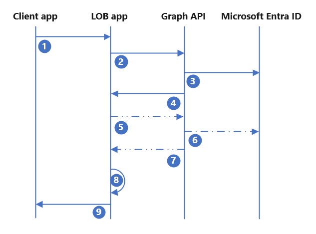

# Onboard external users to line of business applications using Microsoft Entra B2B

Application developers can use Microsoft Entra B2B to onboard and collaborate with external users in line of business (LOB) applications. Similar to the **Share** button in many Office 365 applications, application developers can create a one-click invitation experience in LOB applications integrated with Microsoft Entra ID.

Benefits include:

- User onboarding and access to the LOB applications. Users have access with a few steps
- External users bring their identity and perform single sign-on (SSO)
- External identity provisioning to Microsoft Entra ID
- Microsoft Entra Conditional Access and cross-tenant access policies to enforce authorization policies, such as multifactor authentication

## Integration flow

To integrate LOB applications with Microsoft Entra B2B, follow this pattern:

   

1. The end user triggers the **invitation** within the LOB application and provides the email address of the external user. The application checks if the user already exists, and if they don't, proceeds to [Create and send the invitation](#create-and-send-the-invitation)|
2. The application sends a POST to the Microsoft Graph API on behalf of the user. It provides the redirect URL and external user's email that is defined in [Confirm the external user is in the directory](#confirm-the-external-user-is-in-the-directory).
3. Microsoft Graph API provisions the guest user in Microsoft Entra ID.
4. Microsoft Graph API returns the success ir failure status of the API call. If successful, the response includes the Microsoft Entra user object ID and the invitation link sent to the invited user email. You can suppress the Microsoft email and send your own custom email.
5. (Optional) To write more attributes to the invited user, or add the invited user to a group. The application makes an extra API call to the Microsoft Graph API.
6. (Optional) Microsoft Graph API makes the updates to Microsoft Entra ID.
7. (Optional) Microsoft Graph API returns the success or failure status to the application.
8. The application provisions the user to its database or backend user directory using the user object ID attribute as the immutable ID.
9. The application presents the success or failure status to the end user.

If assignment is required to access the LOB application, the invited guest user is assigned to the application with an application role. Enable this action as another API call adding the invited guest to a group, or automate membership with Microsoft Entra [dynamic membership groups](~/identity/users/groups-create-rule.md). Dynamic membership groups don't require another API call by the application; however, they are updated as quickly as adding a user to a group via user invitation.

## Confirm the external user is in the directory

It's possible the external user was invited and onboarded. The LOB application checks if the user is in the directory. Make an API call to the Microsoft Graph API and present the matches to the inviting user for them to select.

For example:

```
Application Permission: User.read.all

GET https://graph.microsoft.com/v1.0/users?$filter=othermails/any(id:id eq 'userEmail@contoso.com')  
```

If you receive user details in the response, the user is in the directory. Present the users returned to the inviting user. Allow users to select the external user that gets access. To grant user access to the application, make API calls, or trigger other processes.

## Create and send the invitation

If the external user isn't in the directory, use Microsoft Entra B2B to invite the user and onboard them to your Microsoft Entra tenant. Determine what to include in the invitation request to Microsoft Graph API.

Use the following elements:

- Prompt the end user to provide the external user email address
- Determine the invitation URL that redirects invited users, after they authenticate and redeem the B2B invitation
  - The URL can be a generic landing page or dynamically determined by the LOB application based on where the end user triggered the invitation

More flags and attributes for the invitation request:

- Invited user display name
- Default Microsoft invitation email, or suppress the default email to create your own

After the application collects the required information, the application must POST the request to the Microsoft Graph API invitation manager. Ensure the application registration has permissions in Microsoft Entra ID.

For example:

```
Delegated Permission: User.Invite.All

POST https://graph.microsoft.com/v1.0/invitations  
Content-type: application/json

{ 
"invitedUserDisplayName": "John Doe",  
"invitedUserEmailAddress": "john.doe@contoso.com",  
"sendInvitationMessage": true,  
"inviteRedirectUrl": "https://customapp.contoso.com"  
} 
```

   >[!NOTE]
  > To see options for the JSON body of the invitation, see [invitation resource type in Microsoft Graph v1.0](/graph/api/resources/invitation).

Application developers can onboard external users using Microsoft Entra self-service sign-up or entitlement management access packages. Create an **Invitation** button in your LOB application that triggers a custom email with self-service sign-up URL, or an access package URL. The invited user onboards and accesses the application.

<a name='step-3-write-other-attributes-to-azure-ad-optional--'></a>

## (Optional) Write other attributes to Microsoft Entra ID

   >[!IMPORTANT]
   > Granting an application permission to update users in your directory is a highly privileged action. If you grant the application these highly privileged permissions, secure and monitor your LOB app.

Your organization or the LOB application might require information stored for future use, such as claims emittance in tokens or granular authorization policies. When external users are invited or created in Microsoft Entra ID, an application can make another API call to update them. The application must have extra API permissions and an extra call to the Microsoft Graph API.

To update the user, use the object ID of the created guest user from the invitation API call, the ID value in the API response from the existence check or invitation. You can write to any standard attribute or custom extension attributes.

For example:

``` 
Application Permission: User.ReadWrite.All

PATCH https://graph.microsoft.com/v1.0/users/<user's object ID> 
Content-type: application/json

{ 
"businessPhones": [ 
        "+1 234 567 8900" 
    ], 
"givenName": "John" 
"surname": "Doe", 
"extension_cf4ff515cbf947218d468c96f9dc9021_appRole": "external" 
} 
```

For more information, see [Update user in Microsoft Graph v1.0](/graph/api/user-update).

## (Optional) Assign the invited user to a group

   >[!NOTE]
   > If user assignment is not required to access the application, you can skip this step.

If user assignment is required in Microsoft Entra ID for application access or role assignment, the user is assigned to the application. Otherwise, the user can't gain access regardless of authentication. To add the invited external user to a group, make another API call. The group is assigned to the application and mapped to an application role.

A permissions example: Assign the Group Updater role, or a custom role, to the enterprise application. Scope the role assignment to the groups this application updates. Or assign the `group.readwrite.all` permission in Microsoft Graph API.

```
POST https://graph.microsoft.com/v1.0/groups/<insert group id>/members/$ref 
Content-type: application/json

{ 
"@odata.id": "https://graph.microsoft.com/v1.0/directoryObjects/<insert user id>" 
} 
```

For more information, see [Add members in Microsoft Graph v1.0](/graph/api/group-post-members).

Alternatively, you can use Microsoft Entra dynamic membership groups that automatically assign users based on specific attributes, such as userType, email, or a custom attribute. However, if user access is time sensitive, this approach isn't recommended because dynamic membership groups can take up to 24 hours to populate.

If you use dynamic membership groups, don't add the users to a group with another API call. Instead, create a group that adds the user as a group member, based on attributes such as userType, email, or a custom attribute. For more information, see [Create or edit a dynamic group and get status](~/identity/users/groups-create-rule.md).

## Provision the invited user to the application

After the invited external user is provisioned in Microsoft Entra ID, the Microsoft Graph API returns a response with user information such as object ID and email. The LOB application provisions the user to its directory or database. The provisioning varies, depending on the application and internal directory type the application uses.

With the external user provisioned in Microsoft Entra ID and the application, the LOB application notifies the initiating user the process was successful. The invited user gets SSO with their identity without the inviting organization onboarding and issuing extra credentials. Microsoft Entra ID enforces authorization policies with Conditional Access, Microsoft Entra multifactor authentication, and Microsoft Entra ID Protection.

## Other considerations

Ensure error handling is done in the LOB application. The application validates each API call. If unsuccessful, extra attempts or error messages are useful.

For LOB applications to update invited external users, grant a custom role that allows the application to update users and assign scope to a dynamic administrative unit. For example, create a dynamic administrative unit with users where usertype = guest. When external users are onboarded to Microsoft Entra ID, they're added to the administrative unit. The LOB application needs to attempt to update the user and it might take more than one attempt if there are delays. Despite delays, the approach enables the LOB application to update external users without granting it permission to update any user in the directory.
