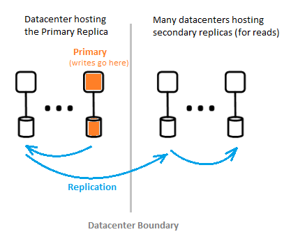

# What is the Microsoft Entra architecture?

Microsoft Entra enables you to securely manage user access to services and resources. Included with Microsoft Entra is a family of identity management and network access capabilities. For information about Microsoft Entra features, see [What is Microsoft Entra?](~/fundamentals/what-is-entra.md)

With Microsoft Entra, you can create and manage users and groups, and enable permissions to allow and deny access to enterprise resources. For information about identity management, see the [fundamentals of identity management](~/fundamentals/identity-fundamental-concepts.md).

## Microsoft Entra architecture

Microsoft Entra ID combines extensive monitoring, automated rerouting, failover, and recovery capabilities within its geographically distributed architecture to provide company-wide availability and performance

The following architecture elements are covered in this article:

*	Service architecture design
*	Scalability
*	Continuous availability
*	Datacenters

### Service architecture design

The most common way to build an accessible and usable, data-rich system is to use independent building blocks or scale units. For the Microsoft Entra data tier, scale units are called *partitions*.

The data tier has several front-end services that provide read-write capability. The following diagram shows how the components of a single-directory partition are delivered throughout geographically distributed datacenters.

  

The components of Microsoft Entra architecture include a primary replica and secondary replicas.

#### Primary replica

The *primary replica* receives all *writes* for the partition it belongs to. Any write operation is immediately replicated to a secondary replica in a different datacenter before returning success to the caller, ensuring geo-redundant durability of writes.

#### Secondary replicas

All directory *reads* are serviced from *secondary replicas*, located at geographically distributed datacenters. Data is replicated asynchronously across many secondary replicas. Directory reads, such as authentication requests, are serviced from datacenters that are close to customers. The secondary replicas are responsible for read scalability.

### Scalability

Scalability is the ability of a service to expand to meet increasing performance demands. Microsoft Entra partitions  data to achieve write scalability. Read scalability is achieved by replicating data from one partition to multiple secondary replicas distributed throughout the world.

Requests from directory applications are routed to the closest datacenter. Writes are transparently redirected to the primary replica to provide read-write consistency. Secondary replicas significantly extend the scale of partitions because the directories are typically serving reads most of the time.

Directory applications connect to the nearest datacenters. This connection improves performance, and therefore scaling out is possible. Since a directory partition can have many secondary replicas, secondary replicas can be placed closer to the directory clients. Only internal directory service components that are write-intensive target the active primary replica directly.

### Continuous availability

Availability (or uptime) defines the ability of a system to perform uninterrupted. The key to Microsoft Entra ID's high availability is that the services can quickly shift traffic across multiple geographically distributed datacenters. Each datacenter is independent, which enables decorrelated failure modes. Through this high availability design, Microsoft Entra ID requires no downtime for maintenance activities.

The partition design of Microsoft Entra ID is simplified compared to the enterprise Active directory design, using a single primary server design that includes a carefully orchestrated and deterministic primary replica failover process.

#### Fault tolerance

A system is more available if it can tolerate hardware, network, and software failures. Each directory partition has a highly available primary replica that handles all write operations. This primary replica is continuously monitored, and if a failure is detected, write operations are immediately shifted to another replica. This replica becomes the new primary. During this failover process, write availability can be temporarily affected for 1-2 minutes, but read availability remains unaffected.

Read operations (which outnumber writes by many orders of magnitude) only go to secondary replicas. Since secondary replicas are idempotent, loss of any one replica in a given partition is easily compensated by directing the reads to another replica, usually in the same datacenter.

#### Data durability

A write is durably committed to at least two datacenters before acknowledgment. The system first commits the write on the primary, and then immediately replicates the write to at least one other datacenter. This write action ensures that a potential catastrophic loss of the datacenter hosting the primary doesn't result in data loss.

Microsoft Entra ID maintains a zero [Recovery Time Objective (RTO)](https://en.wikipedia.org/wiki/Recovery_time_objective) to not lose data on failovers including:

- Token issuance and directory reads
- Allowing only about 5 minutes RTO for directory writes

### Datacenters

Microsoft Entra replicas are stored in datacenters located throughout the world. For more information, see [Azure global infrastructure](https://azure.microsoft.com/global-infrastructure/).

Microsoft Entra ID operates across datacenters with the following characteristics:

- Authentication, Graph, and other Microsoft Entra ID services reside behind the Gateway service. The Gateway manages load balancing. The service automatically fails over any servers found unhealthy by transactional health probes. Based on these health probes, the Gateway dynamically routes traffic to healthy datacenters.
- For *reads*, the directory has secondary replicas and corresponding front-end services in an active-active configuration operating in multiple datacenters. If a datacenter fails, traffic is automatically routed to a different datacenter.
- For *writes*, the directory fails over the primary replica across datacenters via planned (new primary is synchronized to old primary) or emergency failover procedures. Data durability is achieved by replicating any commit to at least two datacenters.

#### Data consistency

The directory model is one of eventual consistencies. One typical problem with distributed asynchronously replicating systems is that the data returned from a "particular" replica might not be up-to-date.

Microsoft Entra ID provides read-write consistency for applications targeting a secondary replica by routing its writes to the primary replica, and synchronously pulling the writes back to the secondary replica.

Application writes using the Microsoft Graph API of Microsoft Entra ID are abstracted from maintaining affinity to a directory replica for read-write consistency. The Microsoft Graph API service maintains a logical session. The session has affinity to a secondary replica used for reads. Affinity is captured in a "replica token" that the service caches using a distributed cache in the secondary replica datacenter. This token is then used for subsequent operations in the same logical session. To continue using the same logical session, subsequent requests must be routed to the same Microsoft Entra datacenter. It isn't possible to continue a logical session if the directory client requests are being routed to multiple Microsoft Entra datacenters. If sessions are split, then the client has multiple logical sessions that have independent read-write consistencies.

> [!NOTE]
 > Writes are immediately replicated to the secondary replica to which the logical session's reads were issued.

For application-only requests, Microsoft Entra ID does not provide session consistency. Session consistency is only supported for delegated requests (application+user token flow). 

#### Service-level backup

Microsoft Entra ID implements daily backup of directory data and can use these backups to restore data if there's any service-wide issue.

The directory also implements soft deletes instead of hard deletes for selected object types. The tenant administrator can undo any accidental deletions of these objects within 30 days. For more information, see the [API to restore deleted objects](/graph/api/directory-deleteditems-restore).

#### Metrics and monitors

Running a high availability service requires world-class metrics and monitoring capabilities. Microsoft Entra ID continually analyzes and reports key service health metrics and success criteria for each of its services. There is also continuous development and tuning of metrics, monitoring, and alerting for each scenario, within each Microsoft Entra service and across all services.

If any Microsoft Entra service isn't working as expected, immediate action is taken to restore functionality as quickly as possible. The most important metric Microsoft Entra ID tracks is the speed of customer issue detection and migration. We invest heavily in monitoring and alerts to minimize time to detect (TTD) (Target: <5 minutes) and operational readiness to minimize time to mitigate (TTM) (Target: <30 minutes).

#### Secure operations

Microsoft Entra ID uses operational controls such as multifactor authentication for any operation and auditing of all operations. In addition, it uses a just-in-time elevation system to grant necessary temporary access for any operational task-on-demand on an ongoing basis. For more information, see The [Trusted Cloud](https://azure.microsoft.com/support/trust-center).

## Next steps

To learn more about developing with Microsoft Entra, see the [Microsoft Entra developer's guide](~/identity-platform/index.yml).
