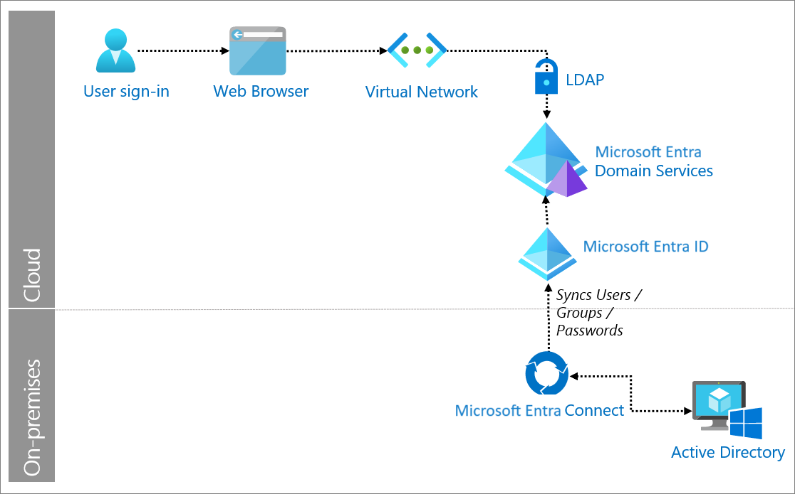

# LDAP authentication with Microsoft Entra ID

Lightweight Directory Access Protocol (LDAP) is an application protocol for working with various directory services. Directory services, such as Active Directory, [store user and account information](https://www.dnsstuff.com/active-directory-service-accounts), and security information like passwords. The service then allows the information to be shared with other devices on the network. Enterprise applications such as email, customer relationship managers (CRMs), and Human Resources (HR) software can use LDAP to authenticate, access, and find information.

Microsoft Entra ID supports this pattern via Microsoft Entra Domain Services (AD DS). It allows organizations that are adopting a cloud-first strategy to modernize their environment by moving off their on-premises LDAP resources to the cloud. The immediate benefits will be:

- Integrated with Microsoft Entra ID. Additions of users and groups, or attribute changes to their objects are automatically synchronized from your Microsoft Entra tenant to AD DS. Changes to objects in on-premises Active Directory are synchronized to Microsoft Entra ID, and then to AD DS.

- Simplify operations. Reduces the need to manually keep and patch on-premises infrastructures.

- Reliable. You get managed, highly available services

## Use when

There is a need to for an application or service to use LDAP authentication.

## Components of system

- **User:** Accesses LDAP-dependent applications via a browser.

- **Web Browser:** The interface that the user interacts with to access the external URL of the application.

- **Virtual Network:** A private network in Azure through which the legacy application can consume LDAP services.

- **Legacy applications:** Applications or server workloads that require LDAP deployed either in a virtual network in Azure, or which have visibility to AD DS instance IPs via networking routes.

- **Microsoft Entra ID:** Synchronizes identity information from organization's on-premises directory via Microsoft Entra Connect.

- **Microsoft Entra Domain Services (AD DS):** Performs a one-way synchronization from Microsoft Entra ID to provide access to a central set of users, groups, and credentials. The AD DS instance is assigned to a virtual network. Applications, services, and VMs in Azure that connect to the virtual network assigned to AD DS can use common AD DS features such as LDAP, domain join, group policy, Kerberos, and NTLM authentication.
   > [!NOTE]
   >  In environments where the organization cannot synchronize password hashes, or users sign-in using smart cards, we recommend that you use a resource forest in AD DS.

- **Microsoft Entra Connect:** A tool for synchronizing on-premises identity information to Microsoft Entra ID. The deployment wizard and guided experiences help you configure prerequisites and components required for the connection, including sync and sign on from Active Directory to Microsoft Entra ID.

- **Active Directory:** Directory service that stores [on-premises identity information such as user and account information](https://www.dnsstuff.com/active-directory-service-accounts), and security information like passwords.

## Implement LDAP authentication with Microsoft Entra ID

- [Create and configure a Microsoft Entra Domain Services instance](/entra/identity/domain-services/tutorial-create-instance)

- [Configure virtual networking for a Microsoft Entra Domain Services instance](/entra/identity/domain-services/tutorial-configure-networking)

- [Configure Secure LDAP for a Microsoft Entra Domain Services managed domain](/entra/identity/domain-services/tutorial-configure-ldaps)

- [Create an outbound forest trust to an on-premises domain in Microsoft Entra Domain Services](/entra/identity/domain-services/tutorial-create-forest-trust)
