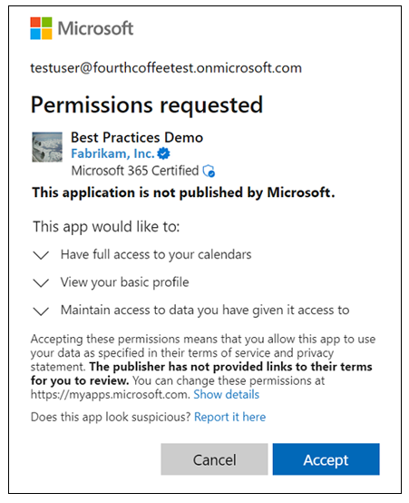
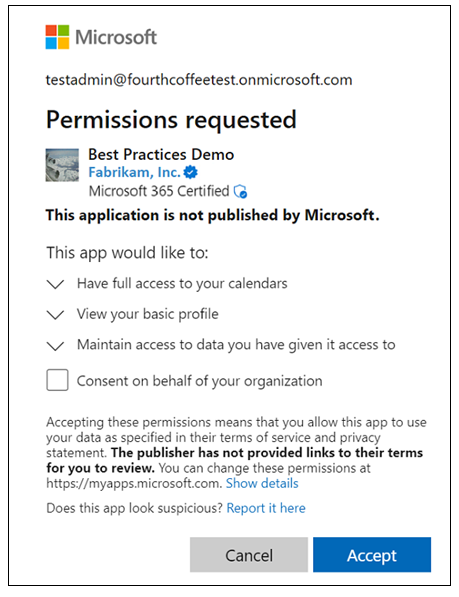

# Authorize applications, resources, and workloads with Microsoft Entra ID

In this article, we discuss authorization when an individual human interacts with and directs an application, when Application Programming Interfaces (API) act for a user. We also cover when applications or services work independently. It's the fourth in a series of articles on how independent software developers (ISVs) can build and optimize their applications for Microsoft Entra ID. In this series, you can learn more about these topics:

- [Microsoft Entra ID for Independent Software Developers](guide-for-independent-software-developers.md) describes how to use this cloud-based identity and access management service to enable employees to access resources with your application.
- [Establish applications in the Microsoft Entra ID ecosystem](establish-applications.md) describes how to use the [Microsoft Entra admin center](https://entra.microsoft.com/) or the Microsoft Graph API to register apps in a Microsoft Entra ID tenant.
- [Authenticate applications and users](authenticate-applications-and-users.md) describes how applications use Microsoft Entra ID to authenticate users and applications.
- [Customize tokens](customize-tokens.md) helps you to build security into applications with ID tokens and access tokens from Microsoft Entra ID. It describes the information that you can receive in Microsoft Entra ID tokens and how you can customize them.

## Authorization in applications

In this section, we cover scenarios in which an individual human interacts with and directs an application. The [Authorization in resources (APIs)](#authorization-in-resources-apis) section describes how APIs perform authorization when the user needs authorization to access a resource, but Microsoft Entra ID doesn't perform the final authorization. The [Authorization in workloads](#authorization-in-workloads) section covers scenarios in which applications or services work independently.

Applications require the following authorizations when they need to access resources for a user.

* The application must have authorization to access specific operations within specific resources for the current user.
* The user must have authorization to access a resource under the current conditions.
* The user must have authorization to access a resource.

The authorization process begins with an application that uses OAuth 2.0 to request an access token from Microsoft Entra ID to access specific operations within a specific resource for the user. In [delegated access](~/identity-platform/delegated-access-primer.md) an app acts as a delegate for the user.

For developers, a resource can be an API such as Microsoft Graph, Azure Storage, or their own API. However, most APIs have various operations such as reading and writing. When an application only reads from an API, an app should only have authorization for reading operations. This approach protects an application from compromise and use for more access than the developer intended. The developer is following the principle of least privilege when their application authorizes only for the operations that it requires.

To designate which specific operations in a specific API that an application requires, developers use the scope parameter of an OAuth 2.0 request. The API designer publishes the scopes an application can request as part of the API's app registration. For example, Microsoft Power BI service scopes include the following.

|Power BI service scope|Operations|
|---|---|
| `https://analysis.windows.net/powerbi/api/Capacity.Read.All` | The app can view all Power BI Premium and Power BI Embedded capacities to which the signed-in user has access. |
| `https://analysis.windows.net/powerbi/api/Capacity.ReadWrite.All` | The app can view and edit all Power BI Premium and Power BI Embedded capacities to which the signed-in user has access. |

If an application only reads capacities, the app requests the `https://analysis.windows.net/powerbi/api/Capacity.Read.All` scope. If an application edits capacity, then the app requests the `https://analysis.windows.net/powerbi/api/Capacity.ReadWrite.All` scope.

The scope contains the API's identity and the operation's identity. In the `https://analysis.windows.net/powerbi/api/Capacity.ReadWrite.All` scope, the API is `https://analysis.windows.net/powerbi/api`. The operation is `Capacity.ReadWrite.All`. Given the broad reach and popularity of the Microsoft Graph API, developers can request scopes for Microsoft Graph without the scope's API component. For example, Microsoft Graph defines a scope of `https://graph.microsoft.com/Files.Read` that applications can request with `Files.Read` instead of using the full scope name.

To complete the first authorization, an application must have authorization to access specific operations within specific resources for the current user, Microsoft Entra ID must first authenticate the current user. Single sign-on (SSO) can satisfy this authentication, or it may require fresh user interaction.

After Microsoft Entra ID determines the user, it checks if the user authorized the application for the requested scope. This process is called [granting consent](~/identity-platform/application-consent-experience.md). If the user granted consent, the authorization process can continue. Admin consent allows admin users to consent for themselves and for the entire organization. Microsoft Entra ID checks if the application has admin consent for a scope. If granted, the authorization process continues.

During scope design, an API designer can designate scopes for which only an admin can consent. Scopes that require admin consent represent operations that the API designer considers more sensitive, powerful, or broadly implicating enough that a nonadmin user shouldn't have the authority to grant to an application.

While API designers have the first say in which of their scopes require admin consent, they don't have the final say. When an API designer designates that a scope requires admin consent, then the scope always requires admin consent. For scopes that the API designer doesn't designate as requiring admin consent, the [tenant admin can require admin consent](~/identity/enterprise-apps/configure-user-consent.md) or [risk-based step-up consent](~/identity/enterprise-apps/configure-risk-based-step-up-consent.md) may determine admin consent requirement. Developers can't predict whether a token request requires admin consent. However, this limitation doesn't impact the code needed. Consent denial is just one of many reasons for token request denial. Applications must always gracefully handle not receiving a token.

If the user or the admin haven't granted consent, the user sees a [consent prompt](~/identity-platform/application-consent-experience.md) as shown in the following example.

   

Admin user consent prompts may allow them to select **Consent on behalf of your organization** to grant consent for all users in the tenant as shown in the following example.

   

Applications control the timing of user consent prompts. Microsoft Entra ID supports static consent: when an application uses the `.default` scope, the app requests all permissions declared in the app's registration. With static consent, your app requests in advance all permissions it might ever need.

Static consent can discourage users and admins from approving your app's access request. The best practice for the consent request process is to request required permissions dynamically for the baseline functionality in your application at application startup and request more scopes, when needed. Incrementally request more scopes as the application performs operations that require those scopes. This approach provides the user with a better understanding of other permissions that correlate with functionality timing. For each API access token, Microsoft Entra ID includes all scopes previously granted to an application and not just the scopes in the request.

For example, an application can request `https://graph.microsoft.com/user.read` to sign in the user and access the user's profile when the application starts. Later, a user selects **Save to OneDrive** and the application requests `https://graph.microsoft.com/files.readwrite` to write a file to the user's OneDrive. Because the user sees why an app is asking to write to their OneDrive, the user grants the permission and the app saves a file to the user's OneDrive. The user then closes the app. The next time the app starts, it requests `https://graph.microsoft.com/user.read`. Microsoft Entra ID returns an access token with `https://graph.microsoft.com/user.read` and `https://graph.microsoft.com/files.readwrite` scopes. A token request for the `https://graph.microsoft.com/files.readwrite` scope doesn't require consent as the user granted it. Token caching in [Microsoft Authentication Libraries (MSAL)](~/identity-platform/msal-overview.md) automatically handles caching tokens based on the granted permissions. In this example, after the app restart, calls to MSAL to acquire a token with the `https://graph.microsoft.com/files.readwrite` scope return the token cached from the app's initial request for the `https://graph.microsoft.com/user.read` scope. Another call to Microsoft Entra ID is unnecessary.

Dynamic and incremental consent require no declared permissions during application registration. However, we strongly recommend that applications declare any permissions an application may require in an app registration to support static consent. Admins can grant admin consent in the [Microsoft Entra admin center](~/identity/enterprise-apps/grant-admin-consent.md), using [Microsoft Graph PowerShell](~/identity/enterprise-apps/grant-admin-consent.md), or with the Microsoft Graph API.

To grant admin consent for an application, the Microsoft Entra admin center uses static consent by requesting consent with the `.default` scope for an app. Admins can't grant admin consent in the Microsoft Entra admin center to apps that require permission if developers don't declare them in app registration.

Microsoft Entra ID customers can use [Conditional Access policies](~/identity/conditional-access/overview.md) to protect resources (APIs) and browser-based applications. By default, admins [can't apply Conditional Access policies](~/identity/conditional-access/concept-conditional-access-cloud-apps.md) to native app authentications. Tenant admins can target [all cloud apps](~/identity/conditional-access/concept-conditional-access-cloud-apps.md) or use [custom security attributes](~/identity/conditional-access/concept-filter-for-applications.md) to target native apps with Conditional Access policies. Even when otherwise targeted, policy enforcement [doesn't include some apps](~/identity/conditional-access/concept-conditional-access-cloud-apps.md) that access Microsoft Graph or Azure AD Graph.

Applications usually don't require special code for Conditional Access unless the following scenarios apply.

- Apps that perform the on-behalf-of flow
- Apps that access multiple services or resources
- Single-page apps that use MSAL.js
- Web apps that call a resource

If your app implements any of these scenarios, review [Developer guidance for Microsoft Entra Conditional Access](~/identity-platform/v2-conditional-access-dev-guide.md).

Free Microsoft Entra ID tenants can't utilize Conditional Access (see [licensing requirements](~/identity/conditional-access/overview.md). Your company's production tenant may have the required licensing. Evaluate [these conditions](~/identity-platform/test-setup-environment.md) before you use your production tenant for testing. There's guidance to [create a test tenant](~/identity-platform/test-setup-environment.md).

By default, Conditional Access policies apply to applications and the resources an app accesses at the app level. IT admins can apply app-level policies to any app without developer participation. Some applications and scenarios require more granularity. For example, a finance app may require multifactor authentication for typical use. However, a transaction over a designated amount can require a managed device. Developers can enable IT admins to assign step-up Conditional Access policies to different areas of an application by implementing [Conditional Access authentication context](~/identity/conditional-access/concept-conditional-access-cloud-apps.md). The [developer guide to Conditional Access authentication context](~/identity-platform/developer-guide-conditional-access-authentication-context.md) is a good reference for these features.

By default, Microsoft Entra ID issues access tokens that are valid for a set time. Applications must never assume lifetime length. They must use the `expires_in` parameter that Microsoft Entra ID returns with the access token. MSAL automatically handles this scenario. For the lifetime of the access token, the user has authorization to access the resource under the conditions at the time of authorization.

The lag between when conditions change and when policy change enforcement occurs may concern admins and users. For example, when a user loses a device, the IT admin can revoke the user's sessions. However, an app on the lost device can continue to access Microsoft Graph for the user until the token expires. Microsoft [continuous access evaluation (CAE)](~/identity/conditional-access/concept-continuous-access-evaluation.md) can prevent access after user sessions revocation for applications that adopt CAE. If your application calls Microsoft Graph at least once an hour, then you can adopt CAE. [How to use Continuous Access Evaluation enabled APIs in your applications](~/identity-platform/app-resilience-continuous-access-evaluation.md) provides implementation details.

If you can't build on MSAL, your app must use OAuth 2.0 to request access tokens from Microsoft Entra ID. [Microsoft identity platform and OAuth 2.0 authorization code flow](~/identity-platform/v2-oauth2-auth-code-flow.md) provides implementation details for the flows that Microsoft Entra ID supports.

If you build mobile device apps, review [Support SSO and app protection policies your in mobile apps](~/identity-platform/mobile-sso-support-overview.md). Learn to support token acquisition, [Intune mobile application management (MAM)](/mem/intune/apps/app-management), and app protection policies.

## Authorization in resources (APIs)

The [Authorization in applications](#authorization-in-applications) section introduced three required authorizations when applications need to access resources for a user but only covered the first two. The user must have authorization to access a resource, but Microsoft Entra ID doesn't perform the final authorization. The resource (API) performs the authorization.

APIs must enforce two authorizations when acting for a user:

- APIs must authorize an app to call the API. Check that the access token's `scp` (scope) claim contains the required scope.
- APIs must authorize the user to access the specific resource. The `oid` (object ID) and `sub` (subject) claims in the token represent the user identity.

We recommend the `oid` and `sub` claims for authorization.

Microsoft Entra ID implements a pairwise `sub` claim, therefore the `sub` claim is a unique user identifier for the requesting app. The same user using a different app has a different `sub` claim. The `oid` claim is constant for the user for all apps.

Applications provide the required access token to APIs that Microsoft Entra ID protects in the `http` request authorization header as a bearer token. APIs must fully validate the received token because the token isn't coming directly from Microsoft Entra ID. Consider the calling app as untrustworthy until token validation. The [access token reference](~/identity-platform/access-tokens.md) and [claims validation reference](~/identity-platform/claims-validation.md) articles provide details on validating Microsoft Entra ID access tokens.

Microsoft Entra ID publishes the public keys that APIs use to validate the token's signature. These keys roll over periodically and whenever the situation requires public key rollover. Your application must never assume a set schedule for public key rollover. [Signing key rollover in the Microsoft identity platform](~/identity-platform/signing-key-rollover.md) explains how to properly handle public key rollover.

We recommend using a well-maintained library to perform token validation. If you're building a web app or API on ASP.NET or ASP.NET Core, use `Microsoft.Identity.Web` to handle token validation. The [Protected web API](~/identity-platform/scenario-protected-web-api-overview.md) how-to article explains how to use `Microsoft.Identity.Web` to protect an API.

APIs sometimes need to call other APIs. When an app works for the user, the API receives a delegated access token that includes the current user's identity. It's important that the API trust only a validated token from Microsoft Entra ID to determine the current user's identity. This approach prevents application compromise such that users impersonate other users and access resources for a different user. For this same protection when one API calls another API, use the [On Behalf Of OAuth flow](~/identity-platform/v2-oauth2-on-behalf-of-flow.md) to acquire an access token to call an API for the user for whom the API was called. [Build a web API that calls web APIs](~/identity-platform/scenario-web-api-call-api-overview.md) provides steps for an API to call other APIs for the current app user.

In addition to delegated access, APIs may need to support applications and act independently without current users. Microsoft Entra ID refers to these applications as workloads. To enforce workload authorization, APIs don't use the `scp` (scope) claim. Instead, APIs use the `roles` claim to validate that the workload has the required consent. APIs are responsible for enforcing that the workload has authorization to access the resource.

## Authorization in workloads

Workloads are applications that work independently and don't have a current user. Like delegated access discussed in the [Authorization in applications](#authorization-in-applications) section, [app-only access](~/identity-platform/app-only-access-primer.md) requires several authorizations:

* The application must have authorization to access specific operations within specific resources.
* The application must have authorization to access the resource under the current conditions.
* The application must have authorization to access the resource.

The process starts with a workload requesting an access token with the `.default` scope (such as `https://graph.microsoft.com/.default`). Unlike delegated access (applications can dynamically and incrementally request scopes), workloads must always use static consent and the `.default` scope.

API designers create app permissions for their API by [adding roles to the API's app registration](~/identity-platform/howto-add-app-roles-in-apps.md). These roles have an allowed member type of *applications*, which allows role assignment to workloads. [Assign roles to workloads](~/identity-platform/howto-add-app-roles-in-apps.md) in the Microsoft Entra admin center or with [Microsoft Graph](/graph/api/user-post-approleassignments?view=graph-rest-1.0&tabs=http&preserve-view=true&preserve-view=true). In the Microsoft Entra admin center, admin consent for the assigned roles is necessary before the workload can run.

By default, an app permission authorizes the workloads to access all instances of a resource. For example,`https://graph.microsoft.com/user.read.all` authorizes a workload to access the full user profile of every user in the tenant. IT admins are often reluctant to grant these broad permissions.

For workloads that access Microsoft Graph, use these methods to limit application permission:

- Microsoft Teams implements [resource specific consent](/microsoftteams/platform/graph-api/rsc/resource-specific-consent).
- Exchange Online implements [application access policies](/graph/auth-limit-mailbox-access).
- SharePoint implements a `Sites.Selected` scope for [resource specific consent](/sharepoint/dev/sp-add-ins-modernize/understanding-rsc-for-msgraph-and-sharepoint-online).

Unlike applications with users, workloads authenticate themselves to Microsoft Entra ID.

For workloads that run in Microsoft Azure, the best method for a workload to authenticate itself is [managed identities for Azure resources](~/identity/managed-identities-azure-resources/overview.md). The managed identities feature removes the need to manage credentials for the workload. There are no accessible credentials. Microsoft Entra ID fully manages credentials. With no credentials to manage, no credentials are at risk of compromise.

With increased security, managed identities also increase resiliency. Managed identities use long-lived access tokens and information from Microsoft Entra ID to get new tokens before tokens expire. Managed identities use regional endpoints that help prevent out-of-region failures by consolidating service dependencies. Regional endpoints help keep traffic in a geographical area. For example, if your Azure resource is in WestUS2, all traffic stays in WestUS2.

If the workload isn't running in Microsoft Azure, the workload must authenticate itself with the [OAuth 2.0 client credentials flow](~/identity-platform/v2-oauth2-client-creds-grant-flow.md).

Microsoft Entra ID supports these client credential types:

- **Certificate**. Workloads prove they have possession of a private key by signing an [assertion](~/identity-platform/certificate-credentials.md) with the private key. The private key isn't transmitted to Microsoft Entra ID. [Only the assertion is sent](~/identity-platform/v2-oauth2-client-creds-grant-flow.md). We recommend certificates instead of client secrets as they're more secure and often better managed.
- **Federated credential**. [Workload identity federation](~/workload-id/workload-identity-federation.md) enables workloads that aren't running on Microsoft Azure to use an identity from another identity provider, GitHub Actions, or Kubernetes cluster. [Workloads request tokens](~/identity-platform/v2-oauth2-client-creds-grant-flow.md) in the same way for federated credentials as for certificate credentials. The difference is that the assertion, a signed JSON Web Token, comes from the federation identity provider.
- **Client secret**. Sometimes called an application password, a client secret is a string value that the workload can use to identify itself. The text value of the secret is sent from the workload to Microsoft Entra ID in a [POST request for a token](~/identity-platform/v2-oauth2-client-creds-grant-flow.md). Client secrets are less secure than certificates or workload identity federation. If your workload uses secrets, follow these [best practices for managing secrets](~/identity-platform/msal-client-applications.md).

In addition to Microsoft Entra ID, the Microsoft Entra product family includes [Microsoft Entra Workload ID](~/workload-id/workload-identities-overview.md). Microsoft Entra Workload ID has the following premium features to enhance workload security.

- [Conditional Access](~/identity/conditional-access/workload-identity.md) supports location- or risk-based policies for workload identities.
- [Microsoft Entra ID Protection](~/id-protection/concept-workload-identity-risk.md) provides reports on compromised credentials, anomalous sign-ins, and suspicious changes to accounts.
- [Access reviews](https://techcommunity.microsoft.com/t5/azure-active-directory-identity/introducing-azure-ad-access-reviews-for-service-principals/ba-p/1942488) enable review delegation to the right people, focused on the most important privileged roles.
- [App health recommendations](~/identity/monitoring-health/howto-use-recommendations.md) suggest ways to address identity hygiene gaps in your application portfolio and improve tenant security and resilience posture.

Workloads can support [Continuous Access Evaluation (CAE)](~/identity/conditional-access/concept-continuous-access-evaluation-workload.md) if they call Microsoft Graph at least once an hour. To support CAE, the workload must be a single tenant application and the app registered in the tenant where it's accessing Microsoft Graph. If your workload meets these requirements, see [this sample](https://github.com/Azure-Samples/ms-identity-dotnetcore-daemon-graph-cae) for implementation steps.

## Next steps

- [Microsoft Entra ID for Independent Software Developers](guide-for-independent-software-developers.md) describes how to use this cloud-based identity and access management service to enable employees to access resources with your application.
- [Establish applications in the Microsoft Entra ID ecosystem](establish-applications.md) describes how to use the [Microsoft Entra admin center](https://entra.microsoft.com/) or the Microsoft Graph API to register apps in a Microsoft Entra ID tenant.
- [Authenticate applications and users](authenticate-applications-and-users.md) describes how applications use Microsoft Entra ID to authenticate users and applications.
- [Customize tokens](customize-tokens.md) helps you to build security into applications with ID tokens and access tokens from Microsoft Entra ID. It describes the information that you can receive in Microsoft Entra ID tokens and how you can customize them.
