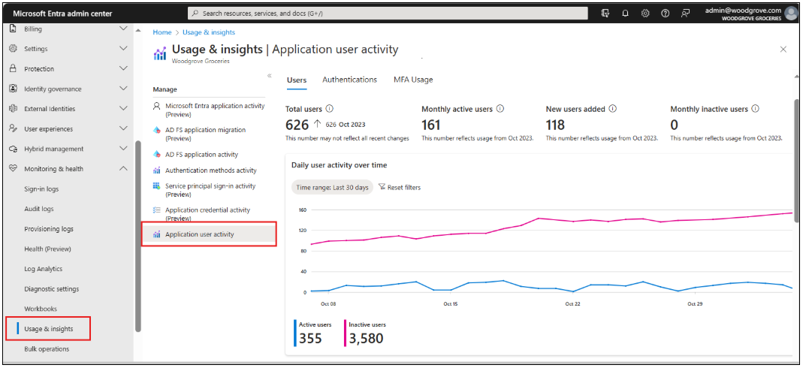

# Microsoft Entra External ID deployment guide for auditing and monitoring

Auditing is actions taken to understand a system, its user activities, and related processes. Monitoring is an ongoing activity that informs you about what's occurring. Monitoring usually involves alerting and automation.

## Auditing and logs

Microsoft Entra External ID stores sign-in and audit logs for 30 days. Export this information to an external storage or tool for retention and analysis. 

[Azure Monitor](/azure/azure-monitor/overview) is configured as a bridge to export logs. See the following diagram of Microsoft Entra External ID log exports with Azure Monitor.  

   

This configuration requires projecting an Azure resource group with the resources from the enterprise tenant to the Microsoft Entra External ID tenant. You can enable log exports using Azure Monitor. 

## Monitor and alert

Monitoring helps ensure the efficient operation of identity and associated systems. These actions include establishing monitoring infrastructure, defining monitoring procedures, setting up dashboards or alerts, and creating a response protocol to handle alerts. See the following list of what to monitor:

**Availability** - Sometimes referred to as a heartbeat or health endpoint. Availability indicates if the service is operational. You can set it up on the monitoring system and it can execute frequently for in-use components without significant overhead. For custom extension APIs, we suggest you implement health endpoint monitoring. If you're developing your API using .NET, use [Health checks in ASP.NET Core](/aspnet/core/host-and-deploy/health-checks?view=aspnetcore-8.0&preserve-view=true) to expose health endpoints. While monitoring availability is essential, it might indicate service failures only.  

**Functionality** - Track functionality with synthetic transactions that mimic end-to-end user or system interactions involving dependencies: UI, API calls, logging. Many monitoring tools have features to automate multistep web experiences, like sign-up, profile edit, and MFA.  

**Performance** - Track performance with synthetic transactions and server-side instrumentation to gather performance-related telemetry. In distributed systems like identity access management (IAM) systems with numerous dependencies, identify, and resolve performance issues. Deploy performance probes across customer locations and establish a baseline for identity experiences. Set up triggers and notifications to detect deviations from a baseline. A system that's available, but performs poorly, isn't beneficial. 

Each experience for request for authentication and identity comes with a unique identifier that's a correlation ID for the session. When the identity system calls external custom extensions, this identifier is in the authentication context. Log the identifier in the custom extension to help you diagnose issues.  

   >[!NOTE]
   >Microsoft has a goal to enable client-side telemetry using analytics tools such as Google Analytics and Adobe Analytics.

   >[!NOTE]
   >Monitor logs for exceptions and errors from the identity service, also monitor the dependent services such as web application firewalls (WAFs), APIs that directory call in custom extensions.

The following diagram illustrates monitoring and alerting setup. 

   

## Service degradation and failure alerting setup

In a large system, certain levels of transaction fail. Incomplete identity experiences, sometimes called incomplete conversions, can be caused by events such as distracted users, telco failures, browser crashes, etc. On a large scale, addressing every failure is impractical. Set up a baseline for typical failure events. Also set up monitoring and alerting to detect deviations, like performance monitoring. Use the following job aid to record failure metrics. 

|Metric|Baseline|
|---|---|
|Authentication failures||
|Sign-in failures||
|Sign-up failures||
|MFA failures by type: email one-time password (OTP), telephony OTP ||
|Failures by browser type: Chrome, Edge, Firefox, Safari ||
|Failures by mobile operating system: Android, iOS ||

### Continuous system validation

Changes in environments are inevitable. An automated continuous validation environment helps catch issues from changes. You can use the same syntactic monitoring infrastructure to set up this validation automation. 

Synthetic transactions should reference applications and APIs used for token acquisition, validation, and integration components such as API managers and service buses. We recommend you maintain versions of supported services, operating systems, and runtime environments in this setup. Each component continuously reports the test success or failure. This action ensures identity services availability and early detection of potential failures. 

## Monitoring usage

Microsoft Entra External ID pricing consists of a core offer and premium add-ons.  

Core offer billing is based on monthly active users ([MAU](../external-id/external-identities-pricing.md)), which is the count of unique external users who authenticate to your tenants in a calendar month. To determine the total MAUs, MAUs from all workforce and external tenants linked to a subscription are combined. 

For more information on the billing model, see [Microsoft Entra External ID pricing](../external-id/external-identities-pricing.md). 

View incurred costs on the cost analysis area of the subscription/resource group linked to the Microsoft Entra External ID tenant. If the MAU count is below the free tier, the bill is $0. Usage data below the free tier appears in the cost analysis.  

In the [Microsoft Entra admin center](https://entra.microsoft.com), for the Microsoft External ID tenant, use the usage and insight dashboard to view utilization details, even when usage is below the free tire.  

Learn how to [list monthly activeUsers in Microsoft Graph](/graph/api/monthlyuserinsightmetricsroot-list-activeusers?view=graph-rest-beta&tabs=http&preserve-view=true). 

See the graph resource types in [dailyUserInsigntMetricsRoot resource type](/graph/api/resources/dailyuserinsightmetricsroot?view=graph-rest-beta&preserve-view=true). 

   >[!NOTE]
   >Data returned by the APIs isn't real-time and might be subjected to scheduled processing.

The following table correlates metric, resource, and description.

|Metric|Graph reference|Description|
|---|---|---|
|activeUsers|[activeUsersMetric](/graph/api/resources/activeusersmetric?view=graph-rest-beta&preserve-view=true) ||
|authentications|[authenticationsMetric](/graph/api/resources/authenticationsmetric?view=graph-rest-beta&preserve-view=true)||
|mfaCompletions|[mfaCompletionMetric](/graph/api/resources/mfacompletionmetric?view=graph-rest-beta&preserve-view=true) ||
|signUps|[userSignUpMetric](/graph/api/resources/usersignupmetric?view=graph-rest-beta&preserve-view=true)||
|summary|[insightSummary](/graph/api/resources/insightsummary?view=graph-rest-beta&preserve-view=true)||
|userCount|[userCountMetric](/graph/api/resources/usercountmetric?view=graph-rest-beta&preserve-view=true)||

The following screenshot shows an example usage and insights dashboard.

   

## Next steps

Use the following articles to help you get started with a Microsoft Entra External ID deployment: 

* [Introduction to Microsoft Entra External ID deployment guide](deployment-external-intro.md)
* [Tenant design](deployment-external-tenant-design.md)
* [Customer authentication experience](deployment-external-customer-authentication.md)
* [Operations](deployment-external-operations.md)
* [Authentication and access control architecture](deployment-external-authentication-access-control.md)
* Auditing and monitoring
