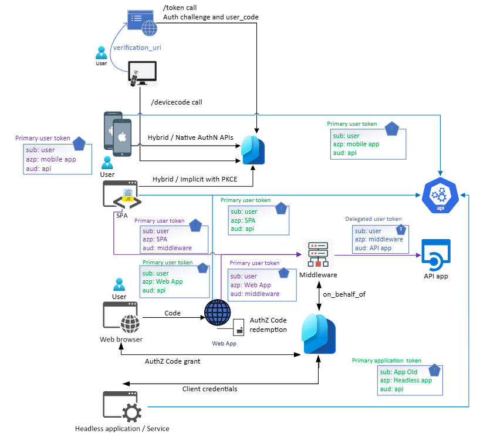
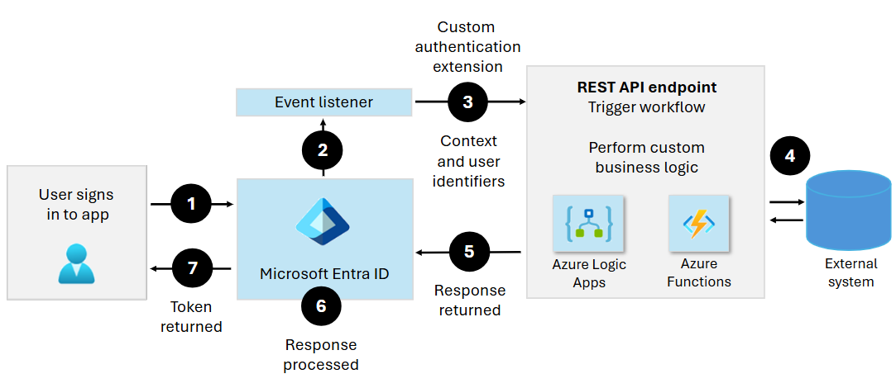

# Microsoft Entra External ID deployment guide for authentication and access control architecture

Authentication helps verify identity, and access control is a process of authorizing users and groups to access resources.

## Authentication protocol and endpoints: customer apps and authentication

Customer-facing applications can authenticate with Microsoft Entra External ID using Open Authorization 2.0 ([OAuth 2](../identity-platform/v2-protocols.md)) or Security Assertion Markup Language 2.0 ([SAML 2](https://en.wikipedia.org/wiki/SAML_2.0)). 

The following table summarizes the application integration options for OAuth 2 and OpendID Connect (OIDC).  

|Application type|Authentication initiator|Authentication options|
|---|---|---|
|Native client: mobile and platform apps|User interacting with the app| - [Native authentication](../external-id/customers/concept-native-authentication.md) with Microsoft Authentication Libraries (MSAL)   - [Authorization code](../identity-platform/v2-oauth2-auth-code-flow.md)   - [Hybrid](../identity-platform/v2-oauth2-auth-code-flow.md)  |
|Web applications running on a server |A user interacting with the application  |Authorization code|
|Web application running on the browser, a single-page application (SPA) |A user interacting with the application  |- [Native authentication](../external-id/customers/concept-native-authentication.md) with MSAL   - Authorization code   - [Hybrid or implicit](../identity-platform/v2-oauth2-auth-code-flow.md), with proof key for code exchange (PKCE)|
|Web application running on a server: middleware |An application on behalf of a user |[On behalf of](../identity-platform/v2-oauth2-on-behalf-of-flow.md)|
|Web application running on a server |Headless service or application  |[Client credentials](../identity-platform/v2-oauth2-client-creds-grant-flow.md)|
|Limited input device|User interacting with the device|[Device code flow](../identity-platform/v2-oauth2-on-behalf-of-flow.md)|

   >[!NOTE]
   >Regarding **on behalf of**, the sub (subject) claim presented to the middleware and the back end differ. See payloads in [access token claims reference](../identity-platform/access-token-claims-reference.md). The subject is a pairwise identifier unique to an application ID. If a user signs in to two applications using different client IDs, the applications receive two subject claim values. Use if the two values depend on architecture and privacy requirements. Note the object identifier (OID) claim, which remains the same across applications in a tenant.

The following diagram of OAuth 2 and OIDC flows shows OAuth application integration options. 

   

Application integration options for SAML are based on the service-provider (SP) initiated flow. The SAML flow is detailed in authentication with Microsoft Entra ID. 

### Custom authentication extension design

Use custom authentication extensions to customize the Microsoft Entra authentication experience by integrating with external systems. In the following diagram, note the progress from sign-up to the returned token. 

See the [custom authentication extensions overview](../identity-platform/custom-extension-overview.md). 

The following diagram shows a custom authentication flow. 

   

### API and event handler considerations

Implement the API as a dedicated API, or by using an [API Facade](https://en.wikipedia.org/wiki/Facade_pattern) using a middleware solution like an API manager. Each custom extension has a strictly typed API contract. Give attention to definitions.

Learn more about the [authenticationEventListener resource type](/graph/api/resources/authenticationeventlistener?view=graph-rest-beta&preserve-view=true). 

   >[!NOTE]
   >The list in the previous article grows as we add more resource types. 

Microsoft provides a [NuGet package for .NET developers]() building [Azure Functions](/azure/azure-functions/) apps. This solution handles the back-end processing for incoming HTTP requests for Microsoft Entra authentication events. Find token validation to secure the API call, object model, type with IDE IntelliSense. Also find inbound and outbound validation of the API request and response schemas. 

Authentication extensions are executed in-line with sign-in and sign-up flows. Ensure the scenario is highly performant, robust, and secure. Azure Functions offers secure infrastructure, including libraries, [Azure Key Vault](/azure/key-vault/general/basic-concepts) for secret storage, caching, autoscaling, and monitoring. There are more recommendations in [Security operations](deployment-external-operations.md).  

## Next steps

Use the following articles to help you get started with a Microsoft Entra External ID deployment: 

* [Introduction to Microsoft Entra External ID deployment guide](deployment-external-intro.md)
* [Tenant design](deployment-external-tenant-design.md)
* [Customer authentication experience](deployment-external-customer-authentication.md)
* [Security operations](deployment-external-operations.md)
* Authentication and access control architecture
