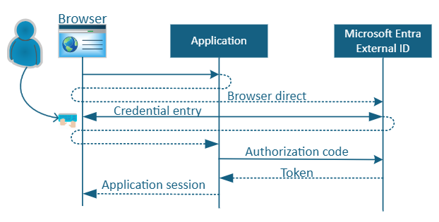
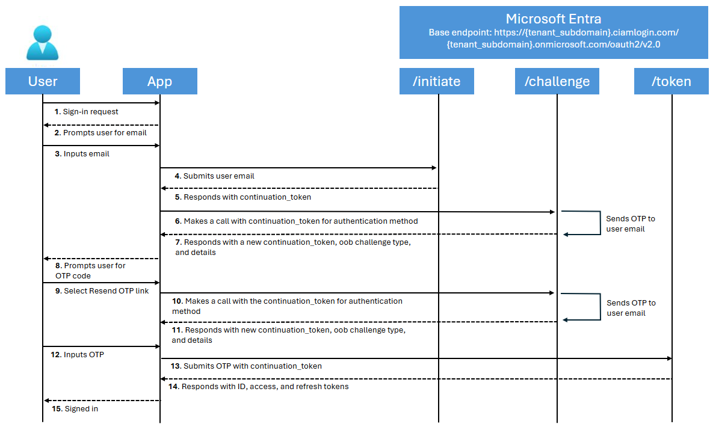
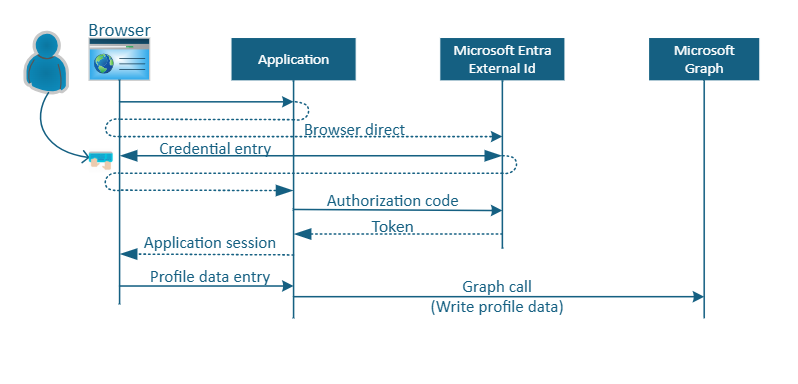
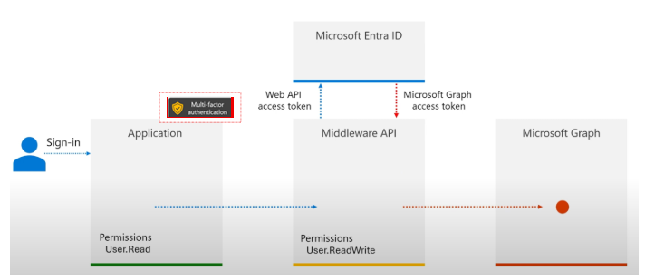

# Customer authentication experience

Customer interface and seamless application integration are a highly visible aspect of a customer identity management solution. Applications integrate the identity experiences with a browser redirect, or you can integrate the user experience by calling the identity APIs. 

There are three **self-service user flows**: 

* [Web browser redirect-based authentication](#web-browser-redirect)
* [Embedded or native authentication](#native-user-experience)
* [Microsoft Graph API experience](#microsoft-graph-api-experience)

## Web browser redirect

A web redirect user experience occurs in a browser window. A defined user flow in Microsoft Entra External ID is processed in a browser so users can authenticate. 

When users attempt to authenticate at an application, they're redirected to a Microsoft Entra External ID user flow for authentication, or identity related functions, such as password reset.  

After users complete the flow, a token, an authorization code, or an error goes to the application via a browser redirect. The flow appears in the following diagram. 

   

## Native user experience

A native experience enables the user flow user in application UI. Developers can use Microsoft Entra native authentication to host app user interface in the client application, instead of delegating authentication to browsers. This scenario can result in a natively integrated authentication experience. Experience the control over the look and feel of the sign-in and sign-up interfaces. 

Use the [native authentication](../external-id/customers/concept-native-authentication.md) SDK to build native user experiences for iOS and Android mobile applications. 

Microsoft implementation of these authentication APIs is based on the draft standard [OAuth 2.0 Direct Interaction Grants](https://drafts.aaronpk.com/oauth-direct-interaction-grant/draft-parecki-oauth-direct-interaction-grant.html). See a flow in the following diagram.

The client direct interactions pattern enables the client to manage and render the user interface, offering a native application experience. This approach uses native authentication APIs for authentication tasks.  

Native authentication APIs are available for platform native iOS and Android clients and has user interface customization capabilities. Use APIs for sign-up, sign in, password reset, and profile edits. Profile edits are done with user tokens against Microsoft Graph API. 
   >[!NOTE]
   >Microsoft has a goal to add support for single-page applications (SPAs).

## Microsoft Graph API experience

Enable Microsoft Graph API to create, read, update, and delete objects in the Microsoft Entra External ID user directory. For user-facing portals, an application token,  or a delegated token (application + user) processes data using the Microsoft Graph API.  

Learn more about [delegated access](../identity-platform/delegated-access-primer.md).

See the following example profile edit in the diagram. 

   

Learn more about [setting up a Node.js web application for profile editing](). 

Learn how to [edit a user profile](../external-id/customers/how-to-web-app-node-edit-profile-prepare-app.md). Discover how profile edit applications work with middleware API for additional security. The following diagram illustrates middleware API and MFA.  

   

## Next steps

Use the following articles to help you get started with a Microsoft Entra External ID deployment: 

* [Introduction to Microsoft Entra External ID deployment guide](deployment-external-intro.md)
* [Tenant design](deployment-external-tenant-design.md)
* Customer authentication experience
* [Security operations](deployment-external-operations.md)
* [Authentication and access control architecture](deployment-external-authentication-access-control.md)
