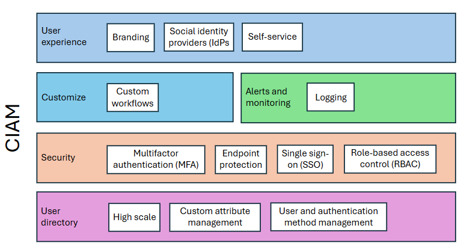

# Introduction to Microsoft Entra External ID deployment guide

This document is intended for identity architects and engineering leadership in security and identity teams. It assumes readers understand customer identity and access management (CIAM) capabilities and relevant business use cases. Use this guide to help plan, design, implement, and operate [Microsoft Entra External ID](../external-id/external-identities-overview.md) tenants. 

[CIAM](../external-id/customers/overview-customers-ciam.md) is a set of technologies and processes that incorporates security methods like multifactor authentication to ensure only authorized individuals access an organization's sensitive information. 

## CIAM design 

When you design a CIAM solution, there are facets to consider. For instance, your customers rely on mechanisms to help them authenticate to services. A frictionless self-service experience is part of a CIAM solution. It can consistently portray brand through customer-facing touchpoints, including the CIAM solution.  

Increasingly, digital identities are used on omnichannel and hybrid scenarios, such as in-store checkouts with phone tap and go. 

The key facets are illustrated in the following diagram: 

   

Also consider your operational details:

* Monitoring
* Logging
* Configuration management
* Support
* Incident response

## Microsoft Entra External ID for customers: user experience

In Microsoft Entra External ID, you can customize the user experience of the authentication flow in multiple ways. To reduce abandonment rates of your authentication journey, improve completion and conversion rates. Create an authentication flow: 

* Portray your brand consistently with other digital touchpoints 
* Enable easy to navigate self-service experiences for sign-up, sign-in, and password reset
* Integrate with social identity providers (IdPs) or other IdPs
* Enable single sign-on (SSO) applications offered to customers
* Localize content to reach users around the world 

In Microsoft Entra External ID, you can create [user flows](../external-id/customers/how-to-user-flow-sign-up-sign-in-customers.md) to define the structure, experience, and branding of authentication flows. The user flow defines the series of sign-up and sign-in steps customers follow. Sign-in methods include email and password, one-time passcodes (OTP), or social accounts from Google or Facebook. Enable user flows to collect information from customers during sign-up: select from built-in user attributes or add custom attributes. Configure user flows to execute custom workflows or federate with Security Assertion Markup Language (SAML) and OpenID Connect (OIDC) IdPs. 

Use your branding requirements to configure the look and feel of the screens that users see when authenticating through a user flow. The branding appears universally in all user flows in the Microsoft Entra External ID tenant. There's a near-future goal to add per-application branding. 

We recommend you use a custom domain to authenticate users. Use a domain name that matches your brand, such as **login.contoso.com**. By using a domain name that you own, you can improve protection of publicly accessible authentication endpoints. 

A Microsoft Entra ID user flow is a container that holds user experience customizations for the authentication flow. Assign it to all, or a subset of, your applications. Create more specialized user flows per application, if needed. We recommend you enable a consistent experience across your application suite because users become familiar with the flow. 

### Customize

When designing your user flow, you might require more workflows. For example, a trigger might occur when validating a customer loyalty number, or it might send a welcome email. Achieve these scenarios with the [custom authentication extensions](../identity-platform/custom-extension-overview.md) capability. Run your own custom logic via REST API endpoints that you create. 

Take more control of the authentication journey and integrate with your business processes. 

### Security

A CIAM exposes anonymously accessible endpoints to the internet, which authenticate users to your services. These endpoints include: 

* Authentication endpoints
* Metadata endpoints 

These endpoints are the front door when authenticating to applications. Therefore, implement multiple layers of security controls to protect the endpoints.

* **Edge protection** - Use [Azure Web Application Firewall](/azure/web-application-firewall/overview) (WAF) to protect endpoints from bot abuse
* **Sign up fraud prevention** - Integrate fraud prevention techniques such as email verification, short message service (SMS) verification, captcha controls, and fraud analysis techniques to help ensure bots can't sign up
* **Account takeover protection** - Integrate risk-based authentication solutions to detect sign-in risk, and prompt a stronger authentication factor, if necessary. Microsoft has a goal to add an integrated third-party account takeover protection solution.
* **Authorization** - Use Microsoft Entra groups and roles to determine which users have access to applications, and what they can access in the applications

### User directory

A CIAM solution requires a directory store to persist user profiles and attributes. This configuration ensures users are represented in one way across services, with a unique identifier referenced by other systems. For example, hold this data securely and redundantly when building customer relationships and generating insights for your business. 

Microsoft Entra External ID uses Microsoft Entra ID directory technology for scale, resiliency, and redundancy. Create a Microsoft Entra External ID tenant for automatic access to the associated user directory. 

### Alerting and monitoring

The authentication journey is the front door to your services. Monitor it to determine its overall health: authentication journey success rates, multifactor authentication (MFA) rates, throttling, and logging. Use this data to evolve your authentication journeys for a balance between frictionless and security. To determine the balance between your deployment, present the collected data to the business. 

Microsoft Entra External ID has a user insights dashboard to generate analytics on users interacting with your authentication journeys. See more detailed authentication logs to analyze using the Microsoft Entra ID sign in and audit logs. Export them with [Microsoft Azure Monitor](/azure/azure-monitor/), or [Microsoft Graph](/graph/overview) API. With Azure Monitor, logs are retained in a log analytics workspace for up to two years. Log archival for longer periods is achieved with a storage account. Learn more in [Security operations](deployment-external-operations.md).

## Next steps

Use the following articles to help you get started with a Microsoft Entra External ID deployment: 

* Introduction to Microsoft Entra External ID deployment guide
* [Tenant design](deployment-external-tenant-design.md)
* [Customer authentication experience](deployment-external-customer-authentication.md)
* [Security operations](deployment-external-operations.md)
* [Authentication and access control architecture](deployment-external-authentication-access-control.md)
