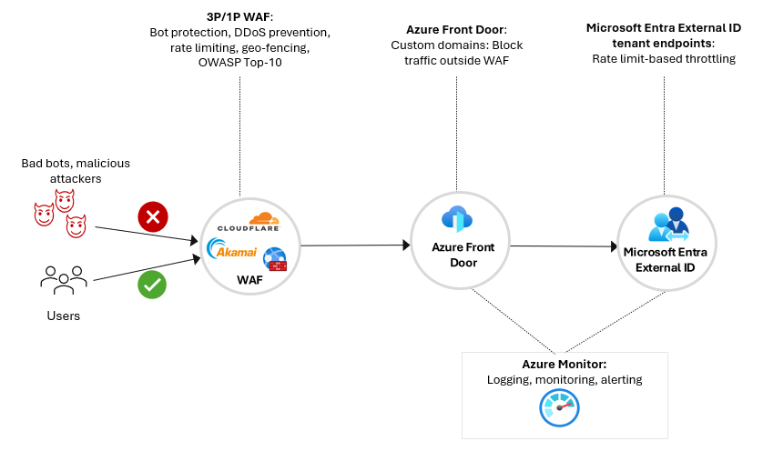
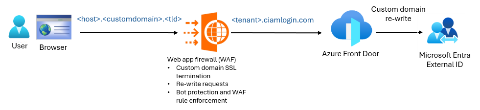
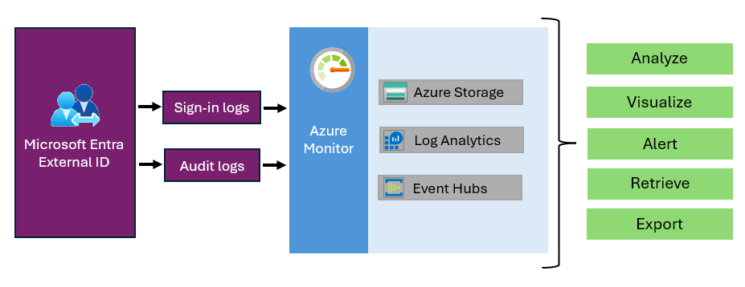
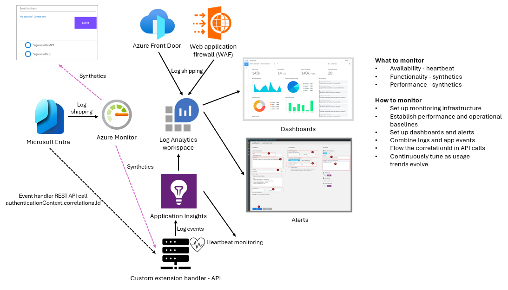

# Microsoft Entra External ID deployment guide for security operations

This document outlines security operations considerations to deploy [Microsoft Entra External ID](/entra/external-id/external-identities-overview), an extensible solution to add customer identity and access management (CIAM) solutions to your apps. This document emphasizes edge-based attacks, particularly bots targeting sign-up, and sign-in endpoints. These vectors are commonly exploited in external identity systems and demand layered, proactive, defense strategies. 

Key topics covered include:  

* [Tenant protection](#tenant-security-with-edge-protection-from-ddos-and-bot-attacks)
* [Web application firewall (WAF) integration](#waf-configuration-considerations)
* [Bot mitigation](#user-security-sign-up-protection)
* [Credential](#application-security-credential-and-secret-management) and [token](#risk-reduction-with-token-lifetime-management) hygiene
* [Geography-based access control](#waf-configuration-considerations)

Special attention goes to processes to safeguard the sign-up and sign-in journeys from automated fraud, such as credential stuffing and International Revenue Share Fraud (IRSF). Find information on the importance of monitoring and alerting, continuous validation, usage tracking, and anomaly detection. These are actions essential for early threat detection and response. See the following diagram of a security operations flow.

   

## Tenant security with edge protection from DDoS and bot attacks

[Microsoft Entra tenants](/azure/cloud-adoption-framework/ready/landing-zone/design-area/azure-ad-define) expose publicly accessible endpoints over the internet to enable user authentication and service access. These areas include authentication and metadata endpoints. The endpoints are accessible anonymously; therefore potential targets for distributed denial-of-service (DDoS) attacks and malicious automated activity, such as fraudulent account creation. An edge-based protection strategy helps ensure service availability and user security. 

To prevent service disruptions and ensure secure, reliable access, use a layered defense strategy. Microsoft strengthens identity protection by integrating with leading third-party WAF and bot mitigation providers. The integrations enable real-time analysis and filtering high-risk or malicious traffic, before it reaches your identity endpoints. 

This defense-in-depth model helps safeguard against credential stuffing, account takeovers, and large-scale DDoS attacks, while you maintain a seamless experience for legitimate users. 

To enhance protection, we recommend implementing a  WAF. Use this configuration to place security controls in front of your CIAM endpoints. Improve  resiliency and reduce the risk of service disruption from automated threats. 

When you use a web-based redirect for user flows, consumers see the domain name of the authentication endpoint. By default, this endpoint uses the format **\<tenantprefix>.ciamlogin.com**, where **\<tenantprefix>** is the tenant-name prefix. For example, for **contoso.onmicrosoft.com**, the tenant prefix is **contoso**. 

### Domain details

In Microsoft Entra External ID, you can change the domain name to one that you own, and one that your customer can relate to your service. For example, you might use **login.contoso.com**. 

With branding capabilities, use a custom domain name to enable integration of a WAF solution, which has more protection from bots and malicious actors. 

Learn more about [custom URL domains in external tenants](../external-id/customers/concept-custom-url-domain.md). 

In the following diagram, see the custom domain example. 

   

## WAF configuration considerations

Use the following table to learn about security controls and their descriptions.

|Security control|Description|
|---|---|
|Rate limiting and adoptive throttling|Rate limiting is an effective and configurable defense against volumetric and low-and-slow attacks. Leading WAFs support fine-grained policies that limit requests per second, or per minute at various levels: per IP, endpoint, or session. Adaptive throttling automatically tightens restrictions in response to sudden traffic spikes, known attack patterns, or anomalies in behavior.  For example, configure a login endpoint for a set number of authentication attempts within a short timeframe. This effort reduces the risk of credential stuffing, and brute force attacks. Also, dynamically adjust rate limits based on contextual signals such as geolocation, request headers, or device fingerprinting. |
|DDoS protection|This control ensures built-in defense against Network-layer (Layer 3) and Application-layer (Layer 7) DDoS attacks. Help absorb or filter malicious traffic at the edge, and ensure authentication endpoints remain available to legitimate users, even during high-volume attack attempts. |
|Bot protection|We recommend integrated bot protection powered by machine learning. These capabilities help detect and prevent automated attacks using a range of enforcement options, from silent blocking to interactive challenges such as CAPTCHA or reCAPTCHA. |
|Geography (Geo)-fencing|Assess whether traffic is accepted from all geographic regions. If not, geo-blocking or throttling reduces exposure to high-risk or irrelevant regions. For global access, analyze the approximate percentage distribution of legitimate customer traffic by region to guide policy design. Traffic from unserved geographies can be blocked or rate-limited based on business needs and threat intelligence. |
|IP and ASN throttling|Similar to geo-fencing, you can restrict or rate-limit traffic based on IP address or Autonomous System Number (ASN). While customer identities typically originate from diverse but low-volume IPs, review exceptions such as kiosks or high-throughput systems for instance, insurance agents. Unusually, high request volumes from a single IP or ASN trigger scrutiny. |
|Block traffic to default domain|When using WAF protection, block access to the default **ciamlogin.com** domain name. Otherwise, attackers use the domain name and bypass WAF protections. |

## Application security: Credential and secret management

CIAM applications authenticate with Microsoft Entra External ID using protocols like OAuth 2.0 or security assertion markup language (SAML) 2.0. which makes secure application credential management essential. In the following table find key security considerations for application credentials and secrets. 

|Security considerations|Details|
|---|---|
|Prefer certificates over secrets|When possible, use X.509 certificate credentials instead of password secrets. While secrets are easier to set up, certificates offer stronger security and can be the default method to acquire tokens.  Currently, managed identities and workload identities are not available in Microsoft Entra External ID.|
|Enforce credential usage policies|Configure application authentication method policies to restrict or block the use of secrets. If you use secrets, set expirations to minimize exposure. |
|Avoid credentials on public client apps|For applications that are public client apps, ensure no credentials are configured on the app registration. An example is apps with user sign-in via public endpoints. These apps shouldn't require client secrets or certificates. |
|Audit credentials regularly|To ensure credentials are used, and haven't expired, periodically review credentials assigned to applications. Remove stale or unused credentials, avoid credential sharing between applications, and limit credentials per app. |
|Scan application code for sensitive data|To detect application credentials, use static analysis tools like a credential scanner. Use the tool for other sensitive information in source code. Build artifacts before they're committed or deployed. |

## Risk reduction with token lifetime management

Configure token lifetime to help minimize exposure from compromised tokens. 

|Security control|Details|
|---|---|
|Configure token lifetime|Reduce the access token lifetime to help mitigate risk. Malicious actors use a compromised access or ID token. The tokens can't be revoked.  Tokens need frequent refreshes, so the trade-off is a potential effect on performance. |

## Custom authentication extensions

An important component of deployment planning is securing custom authentication extensions. The REST API that backs these extensions are hosted based on business and operational requirements, therefore design for security, availability, and resiliency. Any degradation in performance or availability of these APIs from malicious activity, or other failures, can affect related sign-up and sign-in flows. Such disruptions degrade the user experience, but can hinder the overall reliability of your Microsoft Entra External ID implementation. Use the following table to review considerations such as scale and security.

|Consideration|Details|
|---|---|
|Scale|- Match RPS coming from Microsoft Entra External ID   - Respond within the timeout window with HTTP codes as per custom extensions guidance |
|Security|-  Ensure requests come from Microsoft Entra External ID. Microsoft datacenter ranges are documented. To lock the incoming requests, use ranges.  - To protect API from attacks such as DDoS, use a WAF in front of REST API. This effort ensures attacks are mitigated if REST API endpoint is targeted.  - To raise alerts for REST API or API experiencing security related challenges such as DDoS, use audits and logging with monitoring. |
|Resiliency|- Scale up and down seamlessly   - To ensure a low or no effect on quality of service, recover REST API service and fault tolerance|

## User security: Sign-up protection

In this section, learn how to protect users from sign-up fraud. The user flow design helps determine the likelihood of sign-up fraud. Sign-up journeys that perform minimal user verification are susceptible to fraudulent activity. Controls, such as advanced fraud protection, distinguish human users from bots. Also, you can deter automated abuse. Microsoft Entra External ID supports various controls that introduces degrees of user friction. The following table has a list of security controls for user security

|Security control|Details|
|---|---|
|WAF: Bot protection|This protection is the frontline of defense against International Revenue Share Fraud (IRSF) attacks, typically driven by bots that generate high-volume traffic to trigger OTP messages during the sign-up process. |
|Reputation email filtering|To mitigate the risk of fraudulent email accounts, implement domain validation. Restrict sign-up from email addresses with poor reputations, or known associations with malicious activity. Microsoft Entra External ID supports custom extensions during sign-up. To evaluate the reputation of the email domain, invoke a REST API during the sign-up flow. Based on the reputation score, the system allows or blocks the sign-up request.|
|IP email filtering|To reduce the risk of fraudulent account creation, we advise you to restrict sign-ups from anonymous proxies or IP addresses tied to Autonomous System Numbers (ASNs) outside your organization's business regions. This strategy helps reduce exposure to high-risk or untrusted traffic sources.  Microsoft Entra External ID supports custom authentication extensions to invoke during the sign-up process. Use these extensions to call a REST API to assess the reputation or geolocation of the IP address initiating the sign-up request. Use this process during email one-time password (OTP) verification.|
|Excessive OTPs from one IP address or ASN|Implement monitoring and alerting when a high volume of email OTP requests originates from the same IP address, ASN, or location. For example, trigger an alert if email OTPs come from a single IP or similar geo-coordinates in a short time. |

To strengthen defenses, Microsoft Entra External ID has a premium fraud prevention feature, currently in Private Preview. There are plans to expand availability in the future. This capability integrates with Human Security, a trusted third-party provider, for advanced bot and fake account detection. The capability has a user-friendly press-and-hold challenge. Organizations can enhance protection without significant user friction.  

### International Revenue Share Fraud

An International Revenue Share Fraud (IRSF) is a financially driven attack possible when you expose short message service (SMS) verification on a publicly accessible endpoint. When you enable [Microsoft Entra multifactor authentication (MFA)](/entra/identity/authentication/concept-mfa-howitworks) on Microsoft Entra External ID, IRSF attacks are possible. With SMS verification enabled, Microsoft Entra has two built-in protections: 

* **Telephony throttling** helps mitigate the risk of service outages and performance degradation
* **CAPTCHA for SMS-based MFA** helps defend against automated attacks by distinguishing human users from bots. If a user is deemed high-risk, access is blocked, or a CAPTCHA challenge appears before an SMS verification code is sent. 

As another layer of defense, we recommend you review the following table to consider some security controls.

|Security control|Description|
|---|---|
|WAF: Bot protection| To trigger OTP messages during sign-up, enable the frontline of defense against IRSF attacks, typically driven by bots that generate high-volume traffic. |
|Regions that require MFA telephony verification opt-in |Help prevent telephony-based fraud: Microsoft doesn't automatically enable phone-based MFA verification for some country or region codes. To support sign-in from these regions, an administrator submits a support request to opt in and enable telephony verification for those codes. To allow traffic from deactivated regions, activate them with the [Microsoft Graph API](/graph/use-the-api). |
|Excessive SMS OTPs from one IP address or ASN. |Implement monitoring and alerting for a high volume of SMS one-time password (OTP) requests originating from the same IP address, ASN, or geographic location. For example, trigger an alert for excessive SMS OTPs from a single IP or geo-coordinates in a short time. This scenario can indicate an IRSF attack.   To improve accuracy and reduce noise, refine the alert criteria. Focus on unsuccessful OTP requests by users. In IRSF scenarios, attackers typically don't complete authentication. Then want to generate SMS traffic to phone numbers for financial gain. Use this approach to see potentially malicious activity while minimizing false positives. |

## Sign-in protection: Account takeover

Account takeover means a user account is compromised. The attacker changes account credentials, such as email, password, or phone number. These actions prevent the account owner from regaining control. These attacks are accomplished with a password spray. 

Use multiple layers of defense to reduce the account compromise rate. Employ a combination of the following security controls. 

|Security control|Details|
|---|---|
|Microsoft Entra Conditional Access policy: Adoptive MFA from authentication context|Applications can enforce [Microsoft Entra multifactor authentication (MFA)](../identity/authentication/concept-mfa-howitworks.md) dynamically using authentication context in [Conditional Access](../identity/conditional-access/overview.md) policies. Apply step-up authentication when it's needed, such as high-value activities like financial transactions, access to sensitive data, or privileged operations. Meanwhile, maintain a frictionless experience for lower-risk interactions.    For example, a user browses to an ecommerce site, adds items to their cart. They see no prompt for MFA. However, at checkout or before payment, the policy reevaluates the authentication context and requires MFA. This scenario occurs if the user completed MFA during initial sign-in. This targeted approach strikes a balance between security and usability. |
|Conditional Access policy: Access control by location|You can restrict user sign-ins based on geographic location. Configure Conditional Access policies using country or region filters, or IP address ranges. You can block access from regions in which your organization doesn't anticipate legitimate user activity. We recommend you use this control with WAF geo-fencing. WAF blocks traffic at the edge before user sign-in. Conditional Access is an enforcement layer at the identity level. |
|Monitoring: Excessive authentication failures|Monitor and generate alerts for excessive failed authentication attempts from a user account.    For example, trigger an alert if the user authentication failure rate exceeds a threshold, like 10% an hour. This measure increases visibility into, and awareness of, potential account compromise or automated attack activity. |

## Audit and monitor

An audit is actions taken to understand a system, its user activities, and related processes. Monitoring is an ongoing activity that informs you about what's occurring. Monitoring usually involves alerting and automation. 

### Auditing and logs

Microsoft Entra External ID stores sign-in and audit logs for 30 days. For retention and analysis, export this information to an external storage or tool. 

Configure [Azure Monitor](/azure/azure-monitor/fundamentals/overview) as a bridge to export logs. See the following diagram of Microsoft Entra External ID log exports with Azure Monitor. 

   

This configuration requires projecting a [Microsoft Azure resource group](/azure/azure-resource-manager/management/manage-resource-groups-portal) with the resources from the enterprise tenant to the Microsoft Entra tenant.  

### Monitor and alert

Monitoring helps ensure the efficient operation of identity and associated systems. These actions include establishing monitoring infrastructure, defining monitoring procedures, setting up dashboards or alerts, and creating a response protocol to handle alerts. See the following note, and a list of what to monitor. 

   > [!NOTE] 
   > Monitor logs for exceptions and errors from the identity service. Also monitor dependent services such as WAFs and APIs that call in custom extensions.

* **Availability** - Discover if the service is operational. Sometimes referred to as a heartbeat or health endpoint. Set it up on the monitoring system for it to execute frequently on in-use components. For custom extension APIs, we recommend you implement health endpoint monitoring. If you develop API using .NET, use health checks in ASP.NET Core to expose health endpoints. Monitoring availability is essential, but it might solely indicate service failures.
* **Functionality** - Track functionality with synthetic transactions that mimic end-to-end user or system interactions involving dependencies: UI, API calls, logging. Many monitoring tools have features to automate multistep web experiences, like sign-up, profile edit, and MFA. 
* **Performance** - Track performance with synthetic transactions and server-side instrumentation to gather performance-related telemetry. In distributed systems like identity access management (IAM) with dependencies, identify, and resolve performance issues. Deploy performance probes across customer locations and establish a baseline for identity experiences. Set up triggers and notifications to detect deviations from a baseline. A system isn't beneficial if it's available but performs poorly. 

Requests for authentication and identity come with a session correlation ID. When the identity system calls external custom extensions, this identifier is in the authentication context. To diagnose issues, log the identifier in the custom extension. 

   > [!NOTE] 
   > Microsoft has a goal to enable client-side telemetry using analytics tools such as Google Analytics and Adobe Analytics.  

The following diagram illustrates monitoring and alerting setup.

   

### Service degradation and failure alerting setup

In large systems, some transactions will fail. Incomplete identity experiences, sometimes called incomplete conversions, can occur due to distracted users, telco failures, and browser crashes. On a large scale, addressing every failure is impractical. Set up a baseline for typical failure events. Also set up monitoring and alerting to detect deviations, like performance monitoring. Use the following job aid to record failure metrics.

|Failure|Baseline|
|---|---|
|Authentication||
|Sign-in||
|Sign-up||
|MFA by type: Email OTP, telephony OTP||
|Browser type: Google Chrome, [Microsoft Edge](https://www.microsoft.com/edge/?url=https://aka.ms/MicrosoftSupport1&cs=3896570988&form=MA13FJ),  Mozilla Firefox, Apple Safari|
|Mobile operating system: Android, iOS ||

### Continuous system validation

Changes in environments are inevitable. An automated continuous validation environment helps catch issues caused by changes. You can use the same syntactic monitoring infrastructure to set up this validation automation. 

Synthetic transactions can reference applications and APIs used for token acquisition, validation, and integration components such as API managers and service buses. We recommend you maintain versions of supported services, operating systems, and runtime environments. Each component continuously reports test success or failure. This action ensures identity services availability and early detection of potential failures. 

### Dashboards: Operational telemetry and security insights

Microsoft Entra External ID has built-in dashboards with useful telemetry from key areas such as authentication trends, MFA usage, and protections related to SMS verification. Use insights to maintain visibility into your identity system health and threat posture. For your deployment and operational strategy, we recommended you incorporate regular metrics monitoring. Detect anomalies, assess risk exposure, and ensure the effectiveness of security controls. Use the following table to see metrics and details.

|Metric|Details|
|---|---|
|Authentications|The Authentications dashboard summary has daily and monthly authentications in the tenant.    - Daily authentications for 30 days   - Daily authentications by operating system   - Monthly authentications for 12 months, by location |
|MFA usage|The MFA Usage dashboard summary has monthly MFA authentication performance for applications. View the following trends:   - Users registered for MFA   - MFA types used, with success and failure count for 12 months   - CAPTCHA triggers and activity for 30 days |
|Telecom|To understand telecom MFA performance, use the dashboard metrics for actionable insights into SMS MFA usage. Note the following states.  **Allowed** - Users who received an SMS during sign-in or sign-up.  **Blocked** - Users who didn't receive an SMS. If telecom MFA is blocked, users are notified to try alternate authentication.  **Challenged** - This feature is for unusual behavior. See it when a CAPTCHA challenge appears before the SMS goes. The following metrics also appear:   - **Users unable to complete CAPTCHA** - Track users that didn't pass the CAPTCHA challenge. If warranted, you can assess if the CAPTCHA is too difficult for legitimate users. Make needed adjustments to balance security and accessibility.   - **Users that completed CAPTCHA** - Review users that completed the CAPTCHA challenge. Get insight into how CAPTCHA protects users from automated attacks while it enables legitimate users to authenticate. |

## Microsoft Entra External ID core offer and add-ons

Microsoft Entra External ID pricing consists of a core offer and premium add-ons. Core offer billing is based on monthly active users ([MAUs](../external-id/external-identities-pricing.md)), the count of unique external users who authenticate to your tenants in a calendar month. A total comes from a combination of MAUs from workforce and external tenants linked to a subscription. 

See more information on the [pricing structure and billing model for Microsoft Entra External ID](../external-id/external-identities-pricing.md). 

### Costs and analysis
View incurred costs on the cost analysis area of the subscription/resource group linked to the Microsoft Entra External ID tenant. If the MAU count is below the free tier, the bill is $0. Usage data, below the free tier, appears in the cost analysis. 

In the [Microsoft Entra admin center](https://entra.microsoft.com), for the Microsoft External ID tenant, use the usage and insight dashboard to view utilization details, even when usage is below the free tier. 

* Learn how to [list monthly activeUsers in Microsoft Graph](/graph/api/monthlyuserinsightmetricsroot-list-activeusers?view=graph-rest-beta&tabs=http&preserve-view=true).
* See the graph resource types in [dailyUserInsigntMetricsRoot resource type](/graph/api/resources/dailyuserinsightmetricsroot?view=graph-rest-beta&preserve-view=true). 

   >[!NOTE] 
   > Data returned by the APIs isn't real-time and might be subject to scheduled processing. 

The following table correlates metric and a Microsoft Graph reference.

|Metric|Graph reference|Description|
|---|---|---|
|activeUsers|[activeUsersMetric](/graph/api/resources/activeusersmetric?view=graph-rest-beta&preserve-view=true) ||
|authentications|[authenticationsMetric](/graph/api/resources/authenticationsmetric?view=graph-rest-beta&preserve-view=true)||
|mfaCompletions|[mfaCompletionMetric](/graph/api/resources/mfacompletionmetric?view=graph-rest-beta&preserve-view=true) ||
|signUps|[userSignUpMetric](/graph/api/resources/usersignupmetric?view=graph-rest-beta&preserve-view=true)||
|summary|[insightSummary](/graph/api/resources/insightsummary?view=graph-rest-beta&preserve-view=true)||
|userCount|[userCountMetric](/graph/api/resources/usercountmetric?view=graph-rest-beta&preserve-view=true)||

### Usage & insights dashboard

In the [Microsoft Entra admin center](https://entra.microsoft.com), under Monitoring and health, select **Usage & insights**. View user data, over time, and other areas such as authentication, and MFA usage.

   

## Next steps

* [Introduction to Microsoft Entra External ID deployment guide](deployment-external-intro.md)
* [Tenant design](deployment-external-tenant-design.md)
* [Customer authentication experience](deployment-external-customer-authentication.md)
* Security operations
* [Authentication and access control architecture](deployment-external-authentication-access-control.md)

