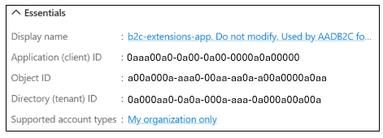

# Microsoft Entra External ID deployment guide for tenant design

This section outlines considerations when you store user profile data in the user directory. Find design considerations for attributes to store in Microsoft Entra ID. Learn how to manage data residency, and compliance requirements. 

## User directory

A user model is a logical schema for a user record. The model contains attributes the directory admins and app owners agree to store in the directory. It's the authoritative source for each: collected from users, not queried from an external system. 

Claims needed for authentication can include confidential and sensitive data stored in an external source, such as a customer relationship management (CRM), or an electronic health record (EHR) system. Storing this data in the directory for authentication is not required. Instead, it's retrieved using a RESTful API call with Microsoft Entra ID custom authentication extensions. In the token, it's emitted as claims. 

### Attribute selection

The following table has attributes to define your user model, and in which scenarios to use them. 

|Type|Scenarios|
|---|---|
|Directory built-in attributes|- Values persisted and stored in the directory</br> - Meaningful name and type</br> - Available in the default list of attributes</br> - If not available, attribute values are set administratively |
|Customer user attributes|- Values persisted and stored in the directory</br> - No built-in attributes available</br> - Data type requirements are sufficient|
|Custom extensions|- Values persisted and stored in a CRM or external store</br> - Values are fetched from an external source during authentication, using an event handler</br> - Fetched value is emitted to the token |

The following diagram illustrates how the options in the previous table integrate into a user flow.  

   [  ](media/deployment-external/user-flow-integration-expanded.png#lightbox)

### Attributes in the user directory

Microsoft Entra External ID has default attributes for user objects. When the user model required, you can create extension attributes.

To use Microsoft Entra External ID extension attributes, a schema extension is applied to your directory. The extensions are associated with an application object and then can be used as an attribute for all directory user objects, and for all applications. The default application object to extend the schema is the **b2c-extensions-app**, which is provisioned with your directory, by default.

When you define the extension attribute, the name stored in the directory follows the format: **extension_GUID_Name**. The GUID is the Application ID of the application object, which the schema extension is registered against. This value is directory specific. The following screenshot shows the **b2c-extensions-app**, its Application ID, and the attribute name returned by Microsoft Graph API. 

   [ ](media/deployment-external/b2c-extensions-app-expanded.png#lightbox)

**GET**: [Extension properties](https://graph.microsoft.com/v1.0/applications/d29c324a-ede6-48d4-bc6a-e11d7748f1be/extensionProperties)

```Kusto
  "value": [</br> 
        {</br>
            "id": "b7271a2b-a03e-48f7-abf0-54d21427987a",</br> 
            "deletedDateTime": null,</br> 
            "appDisplayName": "",</br> 
            "dataType": "String",</br> 
            "isMultiValued": false,</br> 
            "isSyncedFromOnPremises": false,</br> 
            "name": "extension_8beb06b77e314e2393cc5453a6a56756_lastName",</br> 
            "targetObjects": [</br> 
                "User"</br> 
            ]</br>
        } 
```

The supported data formats include:

* String (56 characters maximum) 
* Boolean 
* Integer (32-bit value) 

Manage directory extensions through the [Microsoft Entra admin center](https://entra.microsoft.com), or with the Microsoft Graph API. 

## User data migration

When migrating to Microsoft Entra External ID, consider the primary keys, foreign keys (or join keys), or attributes used by identity systems and applications for compatibility. An example is object IDs from legacy identity systems, issued as persistent subject or name identifiers in tokens. Also, an example is other directory attributes used as unique identifiers by integrated systems: email addresses, short logon names, CRM IDs, and order management system IDs. To serve two purposes, maintain these values: 

* **Audit history** - When investigating activities, refer to archived logs from the legacy system. A join key across systems facilitates this scenario. Help meet compliance requirements such as:
  * Payment Card Industry - Data Security Standard ([PCI-DSS](https://www.pcisecuritystandards.org/))
  * Health Insurance Portability and Accountability Act of 1996 ([HIPAA](https://www.hhs.gov/hipaa/for-professionals/privacy/laws-regulations/index.html))
  * System and Organization Controls 2 ([SOC 2](/compliance/regulatory/offering-soc-2))  
* **Continued function of integrated systems** - Migration might involve consolidation of identity systems that use different primary identifiers. Preserve the identifiers to enable the configuration of application-specific token shapes with the correct subject or name identifiers. Applications function as expected. **Example**: An order management system shows past purchases for the user, post-migration.

Document information to prevent potential issues later. Establish an attribute dictionary for current and future application developers. In the following table is a sample.  

|Attribute name|Type|Data type|Data source or owner|Use|
|---|---|---|---|---|
||Built-in or custom|String, int, etc.|From user or admin set|Apps or audit|

Include information about the source of authority, also who, what, when and how the attributes are updated.  

   >[!IMPORTANT]
   >Not every piece of application data belongs in the directory. For a larger scale, continuous updates and data synchronization present challenges and might cause unpredictable outcomes. 

## Design

In this section, learn about aspects of design: naming and conventions, reference architecture, integration patterns, and more.

### Naming convention

Use of directory standards and conventions make the directory structure easily understood. This approach applies to naming applications, users, attributes, etc. 

### Reference architecture and integration patterns

Document decisions and integration patterns so application teams can be independent and consistent. Include organizational details such as design principles, integration architectures, sequence and dataflow diagrams, data sources, retention policies, security standards, etc.

When possible, refer to the product documentation rather than duplicate the content in reference documentation. Sample applications are proven to be accelerators for developers and integrators.

### Administration

In Microsoft Entra ID, if another administrator or nonadministrator needs to manage Microsoft Entra resources, assign them a Microsoft Entra role with the permissions they need.  

Learn more about [Microsoft Entra built-in roles](../identity/role-based-access-control/permissions-reference.md).

While there are no restrictions to user role assignments in the external identities directory, we recommend you invite administrative accounts from the enterprise workforce directory.  

   >[!NOTE]
   >There's a future goal to include a privileged identity management feature in Microsoft Entra External ID. 

### Directory data operations

Directory data includes the objects stored in the directory such as users, applications, and service principals.  

   >[!NOTE]
   >Microsoft backs up directory data regularly, and it’s available for Microsoft restoration. 

The directory creates some values during object creation, such as object and application IDs. They can't be duplicated or re-created with the same values. 

You can [restore or permanently remove recently deleted users](../fundamentals/users-restore.md). 

For objects relevant to external identities, such as users, groups and service principals, see [recover from deletions in Microsoft Entra ID](recover-from-deletions.md). 

We recommend all batch jobs that process directory data, for maintenance or sync tasks, generate activity logs in addition to the system generated audit logs. Inspect them after the batch operation. 

## Compliance

Gather the compliance requirements the directory is subjected. Base this information on the markets of operations. In some industries, or country-region of operations, these details can change.  

To learn more, see the [Azure compliance documentation](/azure/compliance/). 

Although the platform adheres to certain standards, the operator is responsible for directory data upkeep and ensuring compliance for customers. For instance, Microsoft Entra products are General Data Protection Regulation (GDPR) compliant and have APIs for directory operations. Thus, Microsoft is the data processor. The directory owner in the Controller role provides user with a forget-me option. The owner executes API to remove the user from the directory. 

Collect compliance requirements and involve legal teams. The following table is a job aid to collect requirements.  

|Parameter|Compliance and requirements|
|---|---|
|Country or region of operation 1||
|Country or region of operation 2||
|Industry||
|Regulatory authority||

Use this information to verify the data stored in the directory and its configuration. The information might pertain to attributes in the directory. Recognize that certain attribute combinations, such as first name, family name, and city might fall within compliance limits. Also, this scenario can apply to log retention and encryption requirements specified in the configuration. Document specific configuration requirements to help maintain the configuration. The compliance requirements evolve more quickly in response to cyber threats, political, and social change. Use the following job aid.  

|Tenant configuration|Compliance reference|
|---|---|
|Log retention||
|Crypto configuration||
|Attributes storage||
|Separation of duties||
|Password complexity||
|...||

   >[!NOTE]
   >When interpreting compliance and configuration requirements, consult with legal and compliance teams for guidance and consensus.

## Service limits

Microsoft Entra External ID tenant endpoints are subject to **throttling limits**, which curtail concurrent calls and prevent overuse of resources. This helps protect Microsoft products and service delivered to all customers. 

The following table lists key scenarios and service components for designing solutions with Microsoft Entra External ID. 

|Scenario|Component|Throttling guidance|
|---|---|---|
|Administrative tasks performing create, read, update, and delete (CRUD) on Microsoft Entra External ID tenants, such as user flows or objects |Microsoft Graph API |- [Graph throttling guidance](/graph/throttling) </br> - [Graph service throttling limits](/graph/throttling-limits)|
|Sign up, sign in, and password reset with user flows |Microsoft Entra External ID|[Microsoft Entra External ID service limits](../external-id/customers/reference-service-limits.md)|

Microsoft Graph API has various limit types and associated quotas. The enforcement precedence is highest priority **application + tenant**, and lowest priority **tenant**. Because Microsoft Entra External ID doesn't support multitenant applications, the per application limit doesn't apply.

As an example, an application + tenant hits its quota limit before the tenant quota is reached. This action enables other applications to communicate with the tenant.

With one-time large volume directory operations such as user migration, increase the throughput by using [batch operations](/graph/throttling) and up to six application registrations to perform Microsoft Graph operations.

This approach can exceed tenant throttling limits. When applications reach limits, they can't interact with the directory, which can cause other workloads to fail. Use care when multiple applications increase the throughput of one workload.

   >[!NOTE]
   >Some Microsoft Graph API resource types might have different, stricter throttling limits for security. Open a support ticket with Microsoft Support to plan mitigations on a case-by-case basis. 

## Next steps

Use the following articles to help you get started with a Microsoft Entra External ID deployment: 

* [Introduction to Microsoft Entra External ID deployment guide](deployment-external-intro.md)
* Tenant design
* [Customer authentication experience](deployment-external-customer-authentication.md)
* [Security operations](deployment-external-operations.md)
* [Authentication and access control architecture](deployment-external-authentication-access-control.md)
