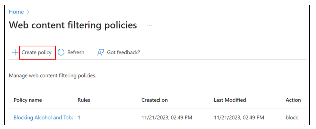
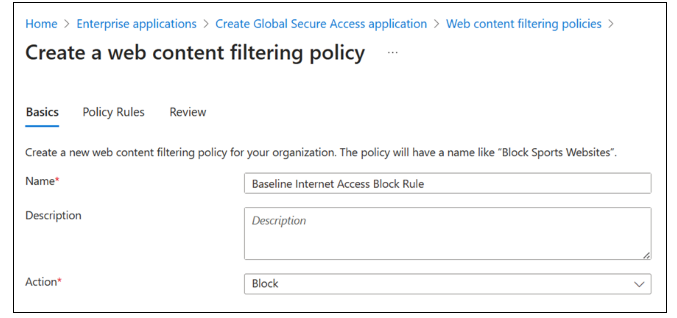
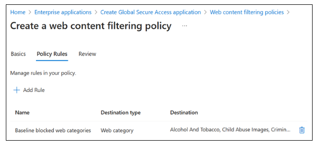
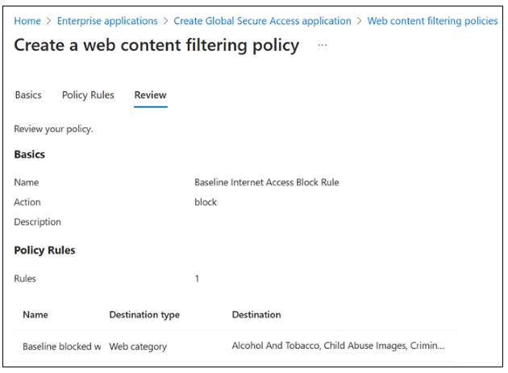
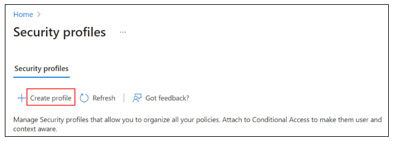

# Microsoft Entra deployment scenario - Secure internet access based on business needs

The Microsoft Entra deployment scenarios provide you with detailed guidance on how to combine and test these Microsoft Entra Suite products:

- [Microsoft Entra ID Protection](../id-protection/overview-identity-protection.md)
- [Microsoft Entra ID Governance](../id-governance/identity-governance-overview.md)
- [Microsoft Entra Verified ID (premium capabilities)](../verified-id/decentralized-identifier-overview.md)
- [Microsoft Entra Internet Access](../global-secure-access/concept-internet-access.md)
- [Microsoft Entra Private Access](../global-secure-access/concept-private-access.md)

In these guides, we describe scenarios that show the value of the Microsoft Entra Suite and how its capabilities work together.

- [Microsoft Entra deployment scenarios introduction](deployment-scenario-intro.md)
- [Microsoft Entra deployment scenario - Workforce and guest onboarding, identity, and access lifecycle governance across all your apps](deployment-scenario-workforce-guest.md)
- [Microsoft Entra deployment scenario - Modernize remote access to on-premises apps with MFA per app](deployment-scenario-remote-access.md)

## Scenario overview

In this guide, we describe how to configure Microsoft Entra Suite products for a scenario in which the fictional organization, Contoso, has strict default internet access policies and wants to control internet access according to business requirements.

In an example scenario for which we describe how to configure its solution, a Marketing department user requires access to social networking sites that Contoso prohibits for all users. Users can request access in [My Access](../id-governance/my-access-portal-overview.md). Upon approval, they become a member of a group that grants them access to social networking sites.

In another example scenario and corresponding solution, a SOC analyst needs to access a group of high-risk internet destinations for a specific time to investigate an incident. The SOC analyst can make that request in My Access. Upon approval, they become a member of a group that grants them access to high-risk internet destinations.

You can replicate these high-level steps for the Contoso solution as described in this scenario.

1. Sign up for Microsoft Entra Suite. Enable and configure [Microsoft Entra Internet Access](../global-secure-access/concept-internet-access.md) for desired network and security settings.
1. Deploy [Microsoft Global Secure Access clients](../global-secure-access/concept-clients.md) on users' devices. Enable Microsoft Entra Internet Access.
1. Create a security profile and web content filtering policies with a restrictive baseline policy that blocks specific web categories and web destinations for all users.
1. Create a security profile and web content filtering policies that allow access to social networking sites.
1. Create a security profile that enables the Hacking web category.
1. Use [Microsoft Entra ID Governance](../id-governance/identity-governance-overview.md) to allow users requesting access to access packages such as:
   - Marketing department users can request access to social networking sites with a quarterly access review.
   - SOC team members can request access to high-risk internet destinations with a time limit of eight hours.
1. Create and link two [Conditional Access policies](../identity/conditional-access/plan-conditional-access.md) using the Global Secure Access security profile session control. Scope the policy to groups of users for enforcement.
1. Confirm that traffic is appropriately granted with traffic logs in Global Secure Access. Ensure that Marketing department users can access the access package in the My Access portal.

These are the benefits of using these solutions together:

- **Least privilege access to internet destinations**. Reduce internet resource access to only what the user requires for their job role through the joiner/mover/leaver cycle. This approach reduces end user and device compromise risk.
- **Simplified and unified management**. Manage network and security functions from a single cloud-based console, reducing complexity and cost of maintaining multiple solutions and appliances.
- **Enhanced security and visibility**. Enforce granular and adaptive access policies based on user and device identity and context, as well as app and data sensitivity and location. Enriched logs and analytics provide gain insights into network and security posture to more quickly detect and respond to threats.
- **Improved user experience and productivity**. Provide fast and seamless access to necessary apps and resources without compromising security or performance.

## Requirements

This section defines the requirements for the scenario solution.

### Permissions

Administrators who interact with Global Secure Access features require the Global Secure Access Administrator and Application Administrator roles.

Conditional Access (CA) policy configuration requires the Conditional Access Administrator or Security Administrator role. Some features might require more roles.

Identity Governance configuration requires at least the Identity Governance Administrator role.

### Licenses

To implement all the steps in this scenario, you need Global Secure Access and Microsoft Entra ID Governance licenses. You can [purchase licenses or obtain trial licenses](https://www.microsoft.com/security/business/microsoft-entra-pricing). To learn more about Global Secure Access licensing, see the licensing section of [What is Global Secure Access](../global-secure-access/overview-what-is-global-secure-access.md).

### Users and devices prerequisites

To successfully deploy and test this scenario, configure for these prerequisites:

1. Microsoft Entra tenant with Microsoft Entra ID P1 license. [Purchase licenses or obtain trial licenses](https://www.microsoft.com/security/business/microsoft-entra-pricing).
   - One user with at least Global Secure Access Administrator and Application Administrator roles to configure Microsoft's Security Service Edge
   - At least one user as client test user in your tenant
1. One Windows client device with this configuration:
   - Windows 10/11 64-bit version
   - Microsoft Entra joined or hybrid joined
   - Internet connected
1. Download and install Global Secure Access Client on client device. The [Global Secure Access Client for Windows](../global-secure-access/how-to-install-windows-client.md) article describes prerequisites and installation.

## Configure Global Secure Access

In this section, we activate Global Secure Access through the Microsoft Entra admin center. We then set up the required initial configurations for the scenario.

1. Sign in to the [Microsoft Entra admin center](https://entra.microsoft.com) as a [Global Administrator](/entra/identity/role-based-access-control/permissions-reference#global-administrator).
1. Browse to **Global Secure Access** > **Get started** > **Activate Global Secure Access in your tenant**. Select **Activate** to enable SSE features.
1. Browse to **Global Secure Access** > **Connect** > **Traffic forwarding**. Toggle on **Private access profile**. Traffic forwarding enables you to configure the type of network traffic to tunnel through Microsoft's Security Service Edge Solution services. Set up [traffic forwarding profiles](../global-secure-access/concept-traffic-forwarding.md) to manage traffic types.
   - The **Microsoft 365 access profile** is for Microsoft Entra Internet Access for Microsoft 365.
   - The **Private access profile** is for Microsoft Entra Private Access.
   - The **Internet access profile** is for Microsoft Entra Internet Access. Microsoft's Security Service Edge solution only captures traffic on client devices with Global Secure Access Client installation.

     :::image type="content" source="media/deployment-scenario-internet-access/private-access-traffic-profile.png" alt-text="Screenshot of traffic forwarding showing enabled Private Access profile control." lightbox="media/deployment-scenario-internet-access/private-access-traffic-profile-expanded.png":::

### Install Global Secure Access client

Microsoft Entra Internet Access for Microsoft 365 and Microsoft Entra Private Access use the Global Secure Access client on Windows devices. This client acquires and forwards network traffic to Microsoft's Security Service Edge solution. Perform these installation and configuration steps:

1. Ensure that the Windows device is Microsoft Entra joined or hybrid joined.
1. Sign in to the Windows device with a Microsoft Entra user with local admin privileges.
1. Sign in to the [Microsoft Entra admin center](https://entra.microsoft.com) as at least a [Global Secure Access Administrator](/entra/identity/role-based-access-control/permissions-reference#global-secure-access-administrator)
1. Browse to **Global Secure Access** > **Connect** > **Client Download**. Select **Download client**. Complete the installation.

   :::image type="content" source="media/deployment-scenario-internet-access/client-download-inline.png" alt-text="Screenshot of Client download showing the Windows Download Client control." lightbox="media/deployment-scenario-internet-access/client-download-expanded.png":::

1. In the Window taskbar, the Global Secure Access Client first appears as disconnected. After a few seconds, when prompted for credentials, enter test user's credentials.
1. In the Window taskbar, hover over the Global Secure Access Client icon and verify **Connected** status.

### Create security groups

In this scenario, we use two security groups to assign security profiles using Conditional Access (CA) policies. In the Microsoft Entra admin center, create security groups with these names:

- Internet Access -- Allow Social Networking sites
= Internet Access -- Allow Hacking sites

Don't add any members to these groups. Later in this article, we configure Identity Governance to add members on request.

## Block access with baseline profile

In this section, we block access to inappropriate sites for all users in the organization with a baseline profile.

### Create baseline web filtering policy

1. Sign in to the [Microsoft Entra admin center](https://entra.microsoft.com) as at least a [Global Secure Access Administrator](/entra/identity/role-based-access-control/permissions-reference#global-secure-access-administrator)
1. Browse to **Global Secure Access** > **Secure** > **Web content filtering policies** > **Create policy** > [**Configure Global Secure Access content filtering**](../global-secure-access/how-to-configure-web-content-filtering.md).

   

1. On **Create a web content filtering policy** > **Basics**, complete these fields:
   - **Name**: Baseline Internet Access Block Rule
   - **Description**: Add a description
   - **Action**: Block

     

1. Select **Next**.
1. On **Create a web content filtering policy** > **Policy Rules**, select **Add Rule**.

   :::image type="content" source="media/deployment-scenario-internet-access/create-web-content-filtering-policy-rules-baseline.png" alt-text="Screenshot of Web content filtering policies, Create a web content filtering policy, Policy Rules with a red box highlighting the Add Rule control.":::

1. In **Add Rule**, complete these fields:
   - **Name**: Baseline blocked web categories
   - **Destination type:** webCategory
1. **Search**: Select the following categories. Confirm that they are in **Selected items**.
   - **Alcohol and Tobacco**
   - **Criminal Activity**
   - **Gambling**
   - **Hacking**
   - **Illegal Software**
   - **Social Networking**

     :::image type="content" source="media/deployment-scenario-internet-access/create-web-content-filtering-policy-add-rule-baseline.png" alt-text="Screenshot of Update rule, Add a rule to your policy, with Baseline blocked web categories in Name text box.":::

1. Select **Add**.
1. On **Create a web content filtering policy** > **Policy Rules**, confirm your selections.

   

1. Select **Next**.
1. On **Create a web content filtering policy** > **Review**, confirm your policy configuration.
1. Select **Create policy**.

   

1. To confirm policy creation, view it in **Manage web content filtering policies**.

### Configure baseline security profile

1. Sign in to the [Microsoft Entra admin center](https://entra.microsoft.com) as at least a [Global Secure Access Administrator](/entra/identity/role-based-access-control/permissions-reference#global-secure-access-administrator)
1. Browse to **Global Secure Access** > **Secure** > **Security profiles**.
1. Select **Baseline Profile**.
1. On **Basics**, set **State** to enabled.
1. Select **Save**.
1. On **Edit Baseline Profile**, select **Link policies**. Select **Link a policy**. Select **Existing policy**. Complete these fields:
   - **Link a policy:** Select **Policy name** and **Baseline Internet Access Block Rule**
   - **Priority**: 100
   - **State**: Enabled
1. Select **Add**.
1. On **Create a profile** > **Link policies**, confirm **Baseline Internet Access Block Rule** is listed.
1. Close the baseline security profile.

## Allow access to social networking sites

In this section, we create a security profile that allows access to social networking sites for users that request it.

### Create social networking web filtering policy

1. Sign in to the [Microsoft Entra admin center](https://entra.microsoft.com) as at least a [Global Secure Access Administrator](/entra/identity/role-based-access-control/permissions-reference#global-secure-access-administrator)
1. Browse to **Global Secure Access** > **Secure** > **Web content filtering policies** > **Create policy** > [**Configure Global Secure Access content filtering**](../global-secure-access/how-to-configure-web-content-filtering.md).

   

1. On **Create a web content filtering policy** > **Basics**, complete these fields:
   - **Name**: Allow Social Networking sites
   - **Description:** Add a description
   - **Action**: Allow
1. Select **Next**.
1. On **Create a web content filtering policy** > **Policy Rules**, select **Add Rule**.
1. In **Add Rule**, complete these fields:
   - **Name**: Social networking
   - **Destination type**: webCategory
   - **Search**: Social
1. Select **Social Networking**
1. Select **Add**.
1. On **Create a web content filtering policy** > **Policy Rules**, select **Next**.
1. On **Create a web content filtering policy** > **Review**, confirm your policy configuration.

   :::image type="content" source="media/deployment-scenario-internet-access/social-networking-policy-review.png" alt-text="Screenshot of Security profiles, Edit Block on risk, Basics, Security profiles, Edit Baseline profile, Create a web content filtering policy.":::

1. Select **Create policy**.
1. To confirm policy creation, view it in **Manage web content filtering policies**.

### Create social networking security policy profile

1. Sign in to the [Microsoft Entra admin center](https://entra.microsoft.com) as at least a [Global Secure Access Administrator](/entra/identity/role-based-access-control/permissions-reference#global-secure-access-administrator)
1. Browse to **Global Secure Access** > **Secure** > **Security profiles**. Select **Create profile**.

   

1. On **Create a profile** > **Basics**, complete these fields:
   - **Profile name**: Allow Social Networking sites
   - **Description:** Add a description
   - **State**: Enabled
   - **Priority:** 1000
1. Select **Next**.
1. On **Create a profile** > **Link policies**, select **Link a policy**.
1. Select **Existing policy**.
1. In **Link a policy**, complete these fields:
   - **Policy name**: Allow Social Networking
   - **Priority:** 1000
   - **State**: Enabled
1. Select **Add**.
1. On **Create a profile** > **Link policies**, confirm **Allow Social Networking** is listed.
1. Select **Next**.
1. On **Create a profile** > **Review**, confirm your profile configuration.

   :::image type="content" source="media/deployment-scenario-internet-access/security-profile-review.png" alt-text="Screenshot of Security profiles, Edit Block on risk, Basics, Security profiles, Edit Baseline profile, Create a profile.":::

1. Select **Create a profile**.

### Create social networking Conditional Access policy

In this section, we create a Conditional Access (CA) policy that enforces the **Allow Social Networking** security profile for users that request access.

1. Sign in to the [Microsoft Entra admin center](https://entra.microsoft.com) as at least a [Conditional Access Administrator](/entra/identity/role-based-access-control/permissions-reference#conditional-access-administrator).
1. Browse to **Protection** > **Conditional Access** > **Policies**.
1. Select **New policy**.
1. In **New Conditional Access Policy**, complete these fields:
   - **Name**: Internet Access -- Allow Social Networking sites
   - **Users or workload identities:** Specific users included
   - **What does this policy apply to?** Users and groups
   - **Include** > **Select users and groups** > Users and groups
1. Select your test group (such as *Internet Access -- Allow Social Networking sites*). Select **Select**.
1. **Target resources**
   - **Select what this policy applies to** > Global Secure Access
   - **Select the traffic profiles this policy applies to** > Internet traffic
1. Leave **Grant** at its default settings to grant access so that your defined security profile defines block functionality.
1. In **Session**, select **Use Global Secure Access security profile**.
1. Select **Allow Social Networking sites**.
1. In **Conditional Access Overview** > **Enable policy**, select **On**.
1. Select **Create**.

## Allow access to hacking sites

In this section, we create a new security profile that allows access to hacking sites for users that request it. Users receive access for eight hours after which access is automatically removed.

### Create hacking web filtering policy

1. Sign in to the [Microsoft Entra admin center](https://entra.microsoft.com) as at least a [Global Secure Access Administrator](/entra/identity/role-based-access-control/permissions-reference#global-secure-access-administrator)
1. Browse to **Global Secure Access** > **Secure** > **Web content filtering policies** > **Create policy** > [**Configure Global Secure Access content filtering**](../global-secure-access/how-to-configure-web-content-filtering.md).

   

1. On **Create a web content filtering policy** > **Basics**, complete these fields:
   - **Name**: Allow Hacking sites
   - **Description:** Add a description
   - **Action**: Allow
1. Select **Next**.
1. On **Create a web content filtering policy** > **Policy Rules**, select **Add Rule**.
1. In **Add Rule**, complete these fields:
   - **Name**: Hacking
   - **Destination type**: webCategory
   - **Search**: Hacking, select **Hacking**
1. Select **Add**.
1. On **Create a web content filtering policy** > **Policy Rules**, select **Next**.
1. On **Create a web content filtering policy** > **Review**, confirm your policy configuration.

   :::image type="content" source="media/deployment-scenario-internet-access/hacking-policy-rule-add.png" alt-text="Screenshot of Add Rule with Hacking in Selected items.":::

1. Select **Create policy**.
1. To confirm policy creation, view it in **Manage web content filtering policies**.

   :::image type="content" source="media/deployment-scenario-internet-access/hacking-policy-rule-confirm.png" alt-text="Screenshot of Security profiles, Web content filtering policies.":::

### Create hacking security policy profile

1. Sign in to the [Microsoft Entra admin center](https://entra.microsoft.com) as at least a [Global Secure Access Administrator](/entra/identity/role-based-access-control/permissions-reference#global-secure-access-administrator).
1. Browse to **Global Secure Access** > **Secure** > **Security profiles**. Select **Create profile**.

   

1. On **Create a profile** > **Basics**, complete these fields:
   - **Profile name**: Allow Hacking sites
   - **Description:** Add a description
   - **State**: Enabled
   - **Priority:** 2000
1. Select **Next**.
1. On **Create a profile** > **Link policies**, select **Link a policy**.
1. Select **Existing policy**.
1. In the **Link a policy** dialog box, complete these fields:
   - **Policy name**: Allow Hacking
   - **Priority:** 2000
   - **State**: Enabled
1. Select **Add**.
1. On **Create a profile** > **Link policies**, confirm **Allow Hacking** is listed.
1. Select **Next**.
1. On **Create a profile** > **Review**, confirm your profile configuration.

   :::image type="content" source="media/deployment-scenario-internet-access/security-profile-review.png" alt-text="Screenshot of Security profiles, Edit Block on risk, Basics, Security profiles, Edit Baseline profile, Create a profile.":::

1. Select **Create a profile**.

### Create hacking Conditional Access policy

In this section, we create a Conditional Access policy that enforces the **Allow Hacking sites** security profile for the users that request access.

1. Sign in to the [Microsoft Entra admin center](https://entra.microsoft.com) as at least a [Conditional Access Administrator](/entra/identity/role-based-access-control/permissions-reference#conditional-access-administrator).
1. Browse to **Protection** > **Conditional Access** > **Policies**.
1. Select **New policy**.
1. In the **New Conditional Access Policy** dialog box, complete these fields:
   - **Name**: Internet Access -- Allow Hacking sites
   - **Users or workload identities:** Specific users included
   - **What does this policy apply to?** Users and groups
1. **Include** > **Select users and groups** > Users and groups
1. Select your test group (such as *Internet Access -- Allow Hacking sites*) > select **Select**.
1. **Target resources**
   - **Select what this policy applies to** > Global Secure Access
   - **Select the traffic profiles this policy applies to** > Internet traffic
1. Leave **Grant** at its default settings to grant access so that your defined security profile defines block functionality.
1. In the **Session** dialog box, select **Use Global Secure Access security profile**.
1. Select **Allow Hacking sites**.
1. In **Conditional Access Overview** > **Enable policy**, select **On**.
1. Select **Create**.

## Configure access governance

Follow these steps to create an entitlement management catalog:

1. Sign in to the [Microsoft Entra admin center](https://entra.microsoft.com) as at least an [Identity Governance Administrator](/entra/identity/role-based-access-control/permissions-reference#identity-governance-administrator).
1. Browse to **Identity governance > Entitlement management > Catalogs**.
1. Select **New catalog**

   :::image type="content" source="media/deployment-scenario-internet-access/identity-governance-catalogs-inline.png" alt-text="Screenshot of New access review, Enterprise applications, All applications, Identity Governance, New catalog." lightbox="media/deployment-scenario-internet-access/identity-governance-catalogs-expanded.png":::

1. Enter a unique name for the catalog and provide a description. Requestors see this information in an access package's details (for example, *Internet Access*).
1. For this scenario, we create access packages in the catalog for internal users. Set **Enabled for external users** to **No**.

   :::image type="content" source="media/deployment-scenario-internet-access/identity-governance-new-catalog.png" alt-text="Screenshot of New catalog with No selected for the Enabled for external users control.":::

1. To add the resources, go to **Catalogs** and open the catalog to which you want to add resources. Select **Resources**. Select **Add resources**.
1. Add the two security groups that you previously created earlier (such as *Internet Access -- Allow Social Networking sites* and *Internet Access -- Allow Hacking sites*).

   :::image type="content" source="media/deployment-scenario-internet-access/internet-access-resources.png" alt-text="Screenshot of Identity Governance, Internet Access, Resources.":::

## Create access packages

In this section, we create access packages that allow users to request access to the internet site categories that each security profile defines. Follow these steps to create an access package in Entitlement management:

1. Sign in to the [Microsoft Entra admin center](https://entra.microsoft.com) as at least an [Identity Governance Administrator](/entra/identity/role-based-access-control/permissions-reference#identity-governance-administrator).
1. Browse to **Identity governance** > **Entitlement management** > **Access package**.
1. Select **New access package**.
1. For **Basics**, give the access package a name (such as *Internet Access -- Allow Social Networking sites*). Specify the catalog that you previously created.
1. For **Resource roles**, select the security that you previously added (such as *Internet Access -- Allow Social Networking sites*).
1. In **Role**, select **Member**.
1. For **Requests**, select **For users in your directory**.
1. To scope the users that can request access to social networking sites, select **Specific users and groups** and add an appropriate group of users. Otherwise, select **All members**.
1. On **Requests**, select **Yes** for **Enable new requests**.
1. **Optional:** In **Approval**, specify whether approval is required when users request this access package.
1. For **Lifecycle**, specify when a user's assignment to the access package expires. Specify whether users can extend their assignments. For **Expiration,** set **Access package assignments** expiration to **On date**, **Number of days**, **Number of hours**, or **Never**.

   :::image type="content" source="media/deployment-scenario-internet-access/new-access-package-requests.png" alt-text="Screenshot of New access package, Requests.":::

1. Repeat the steps to create a new access package that allows access to hacking sites. Configure these settings:
   - **Resource**: Internet Access -- Allow Hacking sites
   - **Who can request:** SOC team members
   - **Lifecycle:** Set **Number of hours** to 8 hours

## Test user access

In this section, we validate that the user can't access sites that the baseline profile blocks.

1. Sign in to the device where you installed the Global Secure Access client.
1. In a browser, go to sites that the baseline profile blocks and verify blocked access. For example:
   1. `hackthissite.org` is a free, safe, and legal training ground for security professionals to test and expand ethical hacking skills. This site is classified as Hacking.
   1. `YouTube.com` is a free video sharing platform. This site is classified as Social Networking.

      :::image type="content" source="media/deployment-scenario-internet-access/test-baseline-access.png" alt-text="Screenshot of two browser windows showing blocked access to test sites.":::

### Request social networking access

In this section, we validate that a Marketing department user can request access to social networking sites.

1. Sign in to the device where you installed the Global Secure Access client with a user that is a member of the Marketing team (or a user that has authorization to request access to the example *Internet Access -- Allow Social Networking sites* access package).
1. In a browser, validate blocked access to a site in the Social Networking category that the baseline security profile blocks. For example, try accessing `youtube.com`.

   :::image type="content" source="media/deployment-scenario-internet-access/validate-blocked-access.png" alt-text="Screenshot of browser showing blocked access to a test site.":::

1. Browse to `myaccess.microsoft.com`. Select **Access packages**. Select **Request** for the *Internet Access -- Allow Social Networking sites* access package.

   :::image type="content" source="media/deployment-scenario-internet-access/access-packages.png" alt-text="Screenshot of My Access, Access packages, Available.":::

1. Select **Continue**. Select **Request**.
1. If you configured approval for the access package, sign in as an approver. Browse to `myaccess.microsoft.com`. Approve the request.
1. Sign in as a Marketing department user. Browse to `myaccess.microsoft.com`. Select **Request history**. Validate your request status to *Internet Access -- Allow Social Networking sites* is **Delivered**.
1. New settings might take a few minutes to apply. To speed up the process, right-click the Global Secure Access icon in the system tray. Select **Log in as a different user**. Sign in again.
1. Try accessing sites in the social networking category that the baseline security profile blocks. Validate that you can successfully browse them. For example, try browsing `youtube.com`.

   :::image type="content" source="media/deployment-scenario-internet-access/validate-social-networking-access.png" alt-text="Screenshot of a browser showing access to a test site.":::

### Request hacking site access

In this section, we validate that a SOC team user can request access to hacking sites.

1. Sign in to the device where you installed the Global Secure Access client with a user that is a member of the SOC team (or a user that has authorization to request access to the example *Internet Access -- Allow Hacking sites* access package).
1. In a browser, validate blocked access to a site in the hacking category that the baseline security profile blocks. For example, `hackthissite.org`.

   :::image type="content" source="media/deployment-scenario-internet-access/validate-blocked-access.png" alt-text="Screenshot of browser showing blocked access to a test site.":::

1. Browse to `myaccess.microsoft.com`. Select **Access packages**. Select **Request** for the *Internet Access -- Allow Hacking sites* access package.
1. Select **Continue**. Select **Request**.
1. If you configured approval for the access package, sign in as an approver. Browse to `myaccess.microsoft.com`. Approve the request.
1. Sign in as a SOC team user. Browse to `myaccess.microsoft.com`. Select **Request history**. Validate your request status to *Internet Access -- Allow Hacking sites* is **Delivered**.
1. New settings might take a few minutes to apply. To speed up the process, right-click the Global Secure Access icon in the system tray. Select **Log in as a different user**. Sign in again.
1. Try accessing sites in the hacking category that the baseline security profile blocks. Validate that you can successfully browse them. For example, try browsing `hackthissite.org`.

   :::image type="content" source="media/deployment-scenario-internet-access/test-hacking-access.png" alt-text="Screenshot of browser window showing access to test site.":::

1. If you configured hacking site access with **Lifecycle** > **Number of hours** set to 8 in previous steps, after eight hours elapses, verify blocked access to hacking sites.

## Related content

- [Learn about Microsoft Entra ID Governance](../id-governance/identity-governance-overview.md)
- [Plan a Microsoft Entra Conditional Access deployment](../identity/conditional-access/plan-conditional-access.md)
- [Learn about Microsoft Entra Internet Access](../global-secure-access/concept-internet-access.md)
- [Learn about the Global Secure Access clients for Microsoft Entra Private Access and Microsoft Entra Internet Access](../global-secure-access/concept-clients.md)
