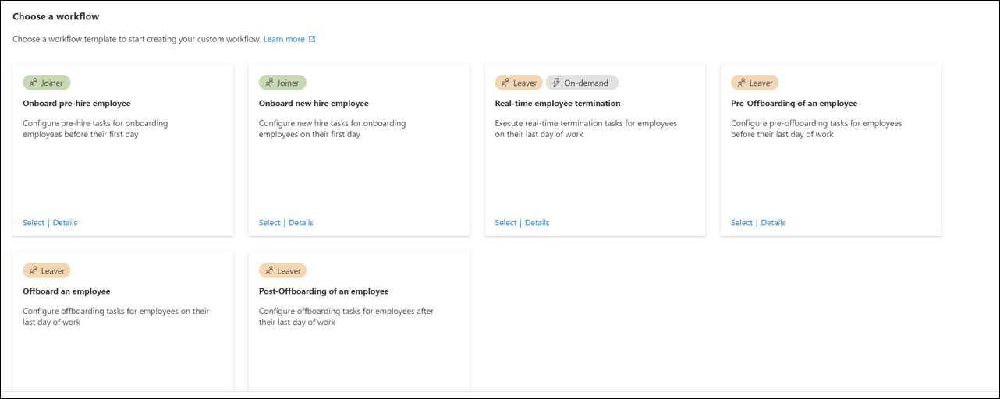

# Microsoft Entra Suite deployment scenario - Modernize remote access to on-premises apps with MFA per app

The Microsoft Entra Suite deployment scenarios provide you with detailed guidance on how to combine and test these Microsoft Entra Suite products:

- [Microsoft Entra ID Protection](../id-protection/overview-identity-protection.md)
- [Microsoft Entra ID Governance](../id-governance/identity-governance-overview.md)
- [Microsoft Entra Verified ID (premium capabilities)](../verified-id/decentralized-identifier-overview.md)
- [Microsoft Entra Internet Access](../global-secure-access/concept-internet-access.md)
- [Microsoft Entra Private Access](../global-secure-access/concept-private-access.md)

In these guides, we describe scenarios that show the value of the Microsoft Entra Suite and how its capabilities work together.

- [Microsoft Entra deployment scenarios introduction](deployment-scenario-intro.md)
- [Microsoft Entra deployment scenario - Workforce and guest onboarding, identity, and access lifecycle governance across all your apps](deployment-scenario-workforce-guest.md)
- [Microsoft Entra deployment scenario - Secure internet access based on business needs](deployment-scenario-internet-access.md)

## Scenario: Modernize remote access with quick access

In this section, we describe how to configure Microsoft Entra Suite products for a scenario in which the fictional organization, Contoso, is upgrading their existing VPN solution. The new, scalable cloud-based solution helps them to move towards Secure Access Service Edge (SASE). To accomplish this objective, they deploy [Microsoft Entra Internet Access](../global-secure-access/concept-internet-access.md), [Microsoft Entra Private Access](../global-secure-access/concept-private-access.md), and [Microsoft Entra ID Protection](../id-protection/overview-identity-protection.md).

Microsoft Entra Private Access provides users (whether in an office or working remotely) secure access to private corporate resources. Microsoft Entra Private Access builds on the Microsoft Entra application proxy to extend access to any private resource, independent of TCP/IP port and protocol.

Remote users can connect to private apps across hybrid and multicloud environments, private networks, and data centers from any device and network without requiring a VPN solution. The service offers per-app adaptive access based on Conditional Access policies for more granular security than a traditional VPN solution.

Microsoft Entra ID Protection cloud-based identity and access management (IAM) helps protect user identities and credentials from compromise.

You can replicate these high-level steps for the Contoso solution as described in this scenario.

1. Sign up for Microsoft Entra Suite. Enable and configure Microsoft Entra Internet and Private Access to desired network and security settings.
1. Deploy [Microsoft Global Secure Access client](../global-secure-access/how-to-install-windows-client.md) on user devices and [Microsoft Entra Private Access connectors](gsa-deployment-guide-private-access.md) on private networks. Include multicloud Internet-as-a-Service (IaaS)-based virtual networks to access apps and resources on Contoso networks.
1. Set up private apps as [Global Secure Access apps](../global-secure-access/how-to-configure-per-app-access.md). Assign appropriate users and groups. Set up [Conditional Access policies](../identity/conditional-access/plan-conditional-access.md) for those apps and users. With this setup, you can achieve minimum access by allowing access only to users and groups that require access.
1. Enable [Microsoft Entra ID Protection](../id-protection/overview-identity-protection.md) to allow administrators to investigate and remediate risks to keep organizations safe and secure. Risks can be fed into tools like Conditional Access to make access decisions and fed back to a security information and event management (SIEM) tool for investigation.
1. Use enhanced logs and analytics from Microsoft Entra Internet Access, Microsoft Entra Private Access, and Microsoft Entra ID Protection to track and evaluate network and security status. This configuration helps your Security Operations Center (SOC) team to promptly detect and examine threats to prevent escalation.

Microsoft Entra Suite solutions offer these advantages over VPN:

- Easier and consolidated management
- Lower VPN costs
- Better security and visibility
- Smoother user experience and efficiency
- Preparedness for SASE

## Requirements for remote access with quick access

This section defines the requirements for the scenario's solution.

### Permissions for remote access with quick access

Administrators who interact with Global Secure Access features require the Global Secure Access Administrator and Application Administrator roles.

Conditional Access policy configuration requires the Conditional Access Administrator or Security Administrator role. Some features might require more roles.

### Prerequisites for remote access with quick access

To successfully deploy and test this scenario, configure these prerequisites:

1. Microsoft Entra tenant with Microsoft Entra ID P1 license. Configure Microsoft Entra ID to test Microsoft Entra ID Protection. [Purchase licenses or obtain trial licenses](https://www.microsoft.com/security/business/microsoft-entra-pricing).
   - One user with at least Global Secure Access Administrator and Application Administrator roles to configure Microsoft's Security Service Edge
   - At least one client test user in your tenant
1. One Windows client device with this configuration:
   - Windows 10/11 64-bit version
   - Microsoft Entra joined or hybrid joined
   - Internet connected and no corporate network access or VPN
1. Download and install Global Secure Access Client on client device. The [Global Secure Access Client for Windows](../global-secure-access/how-to-install-windows-client.md) article describes prerequisites and installation.
1. To test Microsoft Entra Private Access, configure a Windows server to function as the resource server:
   - Windows Server 2012 R2 or later
   - A file share
1. To test Microsoft Entra Private Access, configure a Windows server to function as the connector server:
   - Windows Server 2012 R2 or later
   - Network connectivity to Microsoft Entra service
   - Ports 80 and 443 [open to outbound traffic](../global-secure-access/how-to-configure-connectors.md#open-ports)
   - Allow access to [required URLs](../global-secure-access/how-to-configure-connectors.md#allow-access-to-urls)
1. Establish connectivity between connector server and application server. Confirm access to test application on the application server (for example, successful file share access).

This diagram illustrates the minimum architecture requirements to deploy and test Microsoft Entra Private Access:

:::image type="content" source="media/deployment-scenario-remote-access/private-access-requirements.png" alt-text="Diagram shows requirements that include Microsoft Entra ID Tenant with P1 license.":::

### Configure Global Secure Access for remote access with quick access

In this section, we activate Global Secure Access through the Microsoft Entra admin center. We then set up initial configurations that this scenario requires.

1. Sign in to the [Microsoft Entra admin center](https://entra.microsoft.com) as a [Global Administrator](/entra/identity/role-based-access-control/permissions-reference#global-administrator).
1. Browse to **Global Secure Access** > **Get started** > **Activate Global Secure Access in your tenant**. Select **Activate** to enable SSE features.
1. Browse to **Global Secure Access** > **Connect** > **Traffic forwarding**. Toggle on **Private access profile**. Traffic forwarding enables you to configure the type of network traffic to tunnel through Microsoft's Security Service Edge Solution services. Set up [traffic forwarding profiles](../global-secure-access/concept-traffic-forwarding.md) to manage traffic types.
   - The **Microsoft 365 access profile** is for Microsoft Entra Internet Access for Microsoft 365.
   - The **Private access profile** is for Microsoft Entra Private Access.
   - The **Internet access profile** is for Microsoft Entra Internet Access. Microsoft's Security Service Edge solution only captures traffic on client devices with Global Secure Access Client installation.

     :::image type="content" source="media/deployment-scenario-remote-access/private-access-traffic-profile.png" alt-text="Screenshot of traffic forwarding showing enabled Private Access profile control." lightbox="media/deployment-scenario-remote-access/private-access-traffic-profile-expanded.png":::

### Install Global Secure Access client for remote access with quick access

Microsoft Entra Internet Access for Microsoft 365 and Microsoft Entra Private Access use the Global Secure Access client on Windows devices. This client acquires and forwards network traffic to Microsoft's Security Service Edge Solution. Complete these installation and configuration steps:

1. Ensure that the Windows device is Microsoft Entra joined or hybrid joined.
1. Sign in to the Windows device with a Microsoft Entra user role with local admin privileges.
1. Sign in to the [Microsoft Entra admin center](https://entra.microsoft.com) as at least a [Global Secure Access Administrator](/entra/identity/role-based-access-control/permissions-reference#global-secure-access-administrator)
1. Browse to **Global Secure Access** > **Connect** > **Client Download**. Select **Download client**. Complete the installation.

   :::image type="content" source="media/deployment-scenario-remote-access/client-download-inline.png" alt-text="Screenshot of Client download showing the Windows Download Client control." lightbox="media/deployment-scenario-remote-access/client-download-expanded.png":::

1. In the Window taskbar, the Global Secure Access Client first appears as disconnected. After a few seconds, when prompted for credentials, enter test user's credentials.
1. In the Window taskbar, hover over the Global Secure Access Client icon and verify **Connected** status.

### Set up connector server for remote access with quick access

The connector server communicates with Microsoft's Security Service Edge Solution as the gateway to the corporate network. It uses outbound connections through 80 and 443 and doesn't require inbound ports. Learn [How to configure connectors for Microsoft Entra Private Access](../global-secure-access/how-to-configure-connectors.md#open-ports). Complete these configuration steps:

1. On the connector server, sign in to the [Microsoft Entra admin center](https://entra.microsoft.com) as at least a [Global Secure Access Administrator](/entra/identity/role-based-access-control/permissions-reference#global-secure-access-administrator).
1. Browse to **Global Secure Access** > **Connect** > **Connectors**. Select **Enable Private Network connectors**.

   :::image type="content" source="media/deployment-scenario-remote-access/private-network-connectors.png" alt-text="Screenshot of Private Network connectors with a red box highlighting the Enable Private Network connectors control.":::

1. Select **Download connector service**.
1. Follow the installation wizard to install the connector service on the connector server. When prompted, enter tenant credentials to complete installation.
1. The connector server is installed when it appears in **Connectors**.

In this scenario, we use the default connector group with one connector server. In a production environment, create connector groups with multiple connector servers. See detailed guidance for [publishing apps on separate networks by using connector groups](../identity/app-proxy/application-proxy-connector-groups.md).

### Create security group for remote access with quick access

In this scenario, we use a security group to assign permissions to the Private Access application and to target Conditional Access policies.

1. In the Microsoft Entra admin center, create a new cloud-only security group.
1. Add test user as a member.

### Determine private resource for remote access with quick access

In this scenario, we use file share services as a sample resource. You can use any private application or resource. You need to know which ports and protocols the application uses to publish it with Microsoft Entra Private Access.

Identify a server with a file share to publish and note its IP address. File share services use port 445/TCP.

### Publish application for remote access with quick access

Microsoft Entra Private Access supports transmission control protocol (TCP) applications using any port. To connect to the file server (TCP port 445) over the internet, complete these steps:

1. From the connector server, verify that you can access a file share on the file server.
1. Sign in to the [Microsoft Entra admin center](https://entra.microsoft.com) as at least a [Global Secure Access Administrator](/entra/identity/role-based-access-control/permissions-reference#global-secure-access-administrator)
1. Browse to **Global Secure Access** > **Applications** > **Enterprise applications** > **+ New Application**.

   :::image type="content" source="media/deployment-scenario-remote-access/new-enterprise-app.png" alt-text="Screenshot of Enterprise applications showing New application control.":::

1. Enter a **Name** (such as *FileServer1*). Select the default connector group. Select **+Add application segment**. Enter the **IP address** of the application server and port 441.

   :::image type="content" source="media/deployment-scenario-remote-access/application-segment.png" alt-text="Screenshot of Create Global Secure Access application, Create application segment.":::

1. Select **Apply** > **Save**. Verify that the application is in **Enterprise applications**.
1. Go to **Entra ID** > **Enterprise apps**. Select the new application.
1. Select **Users and groups**. Add the security group that you created earlier with test users that access this file share from the internet.

### Secure published application for remote access with quick access

In this section, we create a Conditional Access policy that blocks access to the new application when a user's risk is elevated.

1. Sign in to the [Microsoft Entra admin center](https://entra.microsoft.com) as at least a [Conditional Access Administrator](/entra/identity/role-based-access-control/permissions-reference#conditional-access-administrator).
1. Browse to **Entra ID** > **Conditional Access** > **Policies**.
1. Select **New policy**.
1. Enter a name and select users. Select users and groups. Select the security group that you created earlier.
1. Select **Target resources** > **Apps** and the **application** that you created earlier (such as *FileServer1*).
1. Select **Conditions** > **User risk** > **Configure** > **Yes**. Select **High** and **Medium** risk levels. Select **Done**.
1. Select **Grant** > **Block** **access** > **Select**.
1. Toggle on **Enable Policy**.
1. Review your settings.
1. Select **Create**.

### Validate access for remote access with quick access

In this section, we validate that the user can access the file server while there's no risk. Confirm that access is blocked when risk is detected.

1. Sign in to the device where you previously installed the Global Secure Access client.
1. Try to access the file server by running \\`\\IP_address` and validate that you can browse the file share.

   :::image type="content" source="media/deployment-scenario-remote-access/remote-access-verification.png" alt-text="Screenshot of Windows Explorer showing connection to file share.":::

1. If desired, simulate user risk by following instructions in [Simulating risk detections in Microsoft Entra ID Protection](../id-protection/howto-identity-protection-simulate-risk.md). You might need to try multiple times to raise user risk to medium or high.
1. Try accessing the file server to confirm that access is blocked. You might need to wait up to one hour for block enforcement.
1. Validate that the Conditional Access policy (that you created earlier using sign in logs) blocks access. Open non-interactive sign in logs from *ZTNA Network Access Client -- Private* application. View logs from the Private Access application name that you previously created as the **Resource name**.

## Scenario: Modernize remote access per app

In this section, we describe how to configure Microsoft Entra Suite products for a scenario in which the fictional organization, Contoso, is transforming their cybersecurity practice. They adopt zero trust principles that verify explicitly, use least privilege, and assume breach across all applications and resources. In their discovery process, they identified multiple business applications that don't use modern authentication and rely on connectivity to the corporate network (either from their branch offices or remotely with VPN).

You can replicate these high-level steps for the Contoso solution as described in this scenario.

1. To verify explicitly, configure [Microsoft Entra ID Private Access](../global-secure-access/concept-private-access.md) to access the corporate network on a per-application basis. Use the unified set of access controls provided by Conditional Access and [Microsoft Entra ID Protection](../id-protection/overview-identity-protection.md) to grant access to the corporate network based on identity, endpoint, and risk signal that they use with Microsoft 365 and other cloud applications.
1. To enforce least privilege, use [Microsoft Entra ID Governance](../id-governance/identity-governance-overview.md) to create access packages to include per-app network access alongside the applications that require it. This approach grants corporate network access to employees aligned with their job functions across their joiner/mover/leaver lifecycle.

As part of this transformation, SecOps teams achieve richer and more cohesive security analytics to better identify security threats. These are the benefits of using the solutions together:

- **Enhanced security and visibility.** Enforce granular and adaptive access policies based on identity and context of users and devices as well as application and data sensitivity and location. Use enriched logs and analytics to gain insights into network and security posture to detect and more quickly respond to threats.
- **Least privilege access to on premises applications.** Reduce access to corporate network only to what the applications require. Assign and govern access aligned with job function evolves through joiners/movers/leavers cycle. This approach reduces the risk of lateral movement attack vectors.
- **Increase productivity.** Cohesively enable access to applications and networks when users join the organization so they're ready to go on day one. Users have the correct access to information, group memberships, and applications that they need. Self-service capabilities for movers within the organization ensure access revocation when users leave the organization.

### Requirements for remote access per app

This section defines the requirements for the scenario's solution.

#### Permissions for remote access per app

Administrators who interact with Global Secure Access features require the Global Secure Access Administrator and Application Administrator roles.

Identity Governance configuration requires at least the Identity Governance Administrator role.

#### Licenses for remote access per app

To implement all the steps in this scenario, you need Global Secure Access and Microsoft Entra ID Governance licenses. You can [purchase licenses or obtain trial licenses](https://www.microsoft.com/security/business/microsoft-entra-pricing). To learn more about Global Secure Access licensing, see the licensing section of [What is Global Secure Access?](../global-secure-access/overview-what-is-global-secure-access.md).

#### Users for remote access per app

To configure and test the steps in this scenario, you need these users:

- Microsoft Entra administrator with the roles defined in Permissions
- On-premises Active Directory administrator to configure Cloud Sync and access to the sample resource (file server)
- A synchronized regular user to perform testing on a client device

#### Private Access prerequisites

To successfully deploy and test this scenario, configure these prerequisites.

1. One Windows client device with this configuration:
   - Windows 10/11 64-bit version
   - Microsoft Entra joined or hybrid joined
   - Internet connected and no corporate network access or VPN
1. Download and install the Global Secure Access Client on the client device. The [Global Secure Access Client for Windows](../global-secure-access/how-to-install-windows-client.md) article describes prerequisites and installation.
1. To test Microsoft Entra Private Access, configure a Windows server to function as the resource server:
   - Windows Server 2012 R2 or later
   - A file share
1. To test Microsoft Entra Private Access, configure a Windows server to function as the connector server:
   - Windows Server 2012 R2 or later
   - Network connectivity to Microsoft Entra service
   - Ports 80 and 443 [open to outbound traffic](../global-secure-access/how-to-configure-connectors.md#open-ports)
   - Allow access to [required URLs](../global-secure-access/how-to-configure-connectors.md#allow-access-to-urls)
1. Establish connectivity between the connector server and the application server. Confirm that you can access your test application on the application server (for example, successful file share access).

This diagram illustrates the minimum architecture requirements to deploy and test Microsoft Entra Private Access:

:::image type="content" source="media/deployment-scenario-remote-access/private-access-requirements.png" alt-text="Diagram shows requirements that include Microsoft Entra ID Tenant with P1 license.":::

### Determine private resource for remote access per app

In this scenario, we use file sharing services as a sample resource. You can use any private application or resource. You need to know which ports and protocols the application uses to publish it with Microsoft Entra Private Access.

Identify a server with a file share that you wish to publish and note its IP address. File share services use port 445/TCP.

### Configure Global Secure Access for remote access per app

Activate Global Secure Access through the Microsoft Entra admin center and make required initial configurations for this scenario.

1. Sign in to the [Microsoft Entra admin center](https://entra.microsoft.com) as a [Global Administrator](/entra/identity/role-based-access-control/permissions-reference#global-administrator).
1. Browse to **Global Secure Access** > **Get started** > **Activate Global Secure Access in your tenant**. Select **Activate** to enable SSE features in your tenant.
1. Go to **Global Secure Access** > **Connect** > **Traffic forwarding**. Toggle on **Private access profile**. Traffic forwarding enables you to configure the type of network traffic to tunnel through Microsoft's Security Service Edge Solution services. Set up [traffic forwarding profiles](../global-secure-access/concept-traffic-forwarding.md) to manage traffic types.
   - The **Microsoft 365 access profile** is for Microsoft Entra Internet Access for Microsoft 365.
   - The **Private access profile** is for Microsoft Entra Private Access.
   - The **Internet access profile** is for Microsoft Entra Internet Access. Microsoft's Security Service Edge solution only captures traffic on client devices with Global Secure Access Client installation.

     :::image type="content" source="media/deployment-scenario-remote-access/private-access-traffic-profile.png" alt-text="Screenshot of traffic forwarding showing enabled Private Access profile control." lightbox="media/deployment-scenario-remote-access/private-access-traffic-profile-expanded.png":::

#### Install Global Secure Access client for remote access per app

Microsoft Entra Internet Access for Microsoft 365 and Microsoft Entra Private Access use the Global Secure Access client on Windows devices. This client acquires and forwards network traffic to Microsoft's Security Service Edge solution. Complete these installation and configuration steps:

1. Ensure that the Windows device is Microsoft Entra ID joined or hybrid joined.
1. Sign in to the Windows device with a Microsoft Entra ID user role with local admin privileges.
1. Sign in to the [Microsoft Entra admin center](https://entra.microsoft.com) as at least a [Global Secure Access Administrator](/entra/identity/role-based-access-control/permissions-reference#global-secure-access-administrator)
1. Browse to **Global Secure Access** > **Connect** > **Client Download**. Select **Download client**. Complete the installation.

   :::image type="content" source="media/deployment-scenario-remote-access/client-download-inline.png" alt-text="Screenshot of Client download showing the Windows Download Client control." lightbox="media/deployment-scenario-remote-access/client-download-expanded.png":::

1. In the Window taskbar, the Global Secure Access Client first appears as disconnected. After a few seconds, when prompted for credentials, enter test user's credentials.
1. In the Window taskbar, hover over the Global Secure Access Client icon and verify **Connected** status.

### Set up connector server for remote access per app

The connector server communicates with Microsoft's Security Service Edge solution as the gateway to the corporate network. It uses outbound connections through 80 and 443 and doesn't require inbound ports. Learn [how to configure connectors for Microsoft Entra Private Access](../global-secure-access/how-to-configure-connectors.md#open-ports). Complete these configuration steps:

1. On the connector server, sign in to the [Microsoft Entra admin center](https://entra.microsoft.com) as at least a [Global Secure Access Administrator](/entra/identity/role-based-access-control/permissions-reference#global-secure-access-administrator).
1. Browse to **Global Secure Access** > **Connect** > **Connectors**. Select **Enable Private Network connectors**.

   :::image type="content" source="media/deployment-scenario-remote-access/private-network-connectors.png" alt-text="Screenshot of Private Network connectors with a red box highlighting the Enable Private Network connectors control.":::

1. Select **Download connector service**.
1. Follow the installation wizard to install the connector service on the connector server. When prompted, enter tenant credentials to complete installation.
1. The connector server is installed when it appears in **Connectors**.

In this scenario, we use the default connector group with one connector server. In a production environment, create connector groups with multiple connector servers. See detailed guidance for [publishing apps on separate networks by using connector groups](../identity/app-proxy/application-proxy-connector-groups.md).

### Create Private Access application security group

In this scenario, we use a security group to assign permissions to the Private Access application and to target Conditional Access policies.

1. In the Microsoft Entra admin center, create a new cloud-only security group.
1. Add test user as a member.

### Publish application for remote access per app

Microsoft Entra Private Access supports transmission control protocol (TCP) applications using any port. To connect to the file server (TCP port 445) over the internet, complete these steps:

1. From the connector server, verify that you can access a file share on the file server.
1. Sign in to the [Microsoft Entra admin center](https://entra.microsoft.com) as at least a [Global Secure Access Administrator](/entra/identity/role-based-access-control/permissions-reference#global-secure-access-administrator).
1. Browse to **Global Secure Access** > **Applications** > **Enterprise applications** > **+ New Application**.

   :::image type="content" source="media/deployment-scenario-remote-access/new-enterprise-app.png" alt-text="Screenshot of Enterprise applications showing New application control.":::

1. Enter a **Name** (such as *FileServer1*). Select the default connector group. Select **+Add application segment**. Enter the **IP address** of the application server and port 441.

   :::image type="content" source="media/deployment-scenario-remote-access/application-segment.png" alt-text="Screenshot of Create Global Secure Access application, Create application segment.":::

1. Select **Apply** > **Save**. Verify that the application is in **Enterprise applications**.
1. Go to **Entra ID** > **Enterprise apps**. Select the new application.
1. Select **Users and groups**. Add the security group that you created earlier with test users that access this file share from the internet.

### Configure access governance for remote access per app

In this section, we describe the configuration steps for this solution.

#### Create Entitlement management catalog

Follow these steps to create an Entitlement management catalog:

1. Sign in to the [Microsoft Entra admin center](https://entra.microsoft.com) as at least an [Identity Governance Administrator](/entra/identity/role-based-access-control/permissions-reference#identity-governance-administrator).
1. Browse to **ID Governance** > **Entitlement management** > **Catalogs**.
1. Select **+New catalog**.

   :::image type="content" source="media/deployment-scenario-remote-access/identity-governance-catalogs-inline.png" alt-text="Screenshot of New access review, Enterprise applications, All applications, Identity Governance, New catalog." lightbox="media/deployment-scenario-remote-access/identity-governance-catalogs-expanded.png":::

1. Enter a unique name for the catalog and provide a description. Requestors see this information in the access package's details.
1. To create access packages in this catalog for internal users, select **Enabled for external users** > **No**.

   :::image type="content" source="media/deployment-scenario-remote-access/identity-governance-new-catalog.png" alt-text="Screenshot of New catalog with No selected for the Enabled for external users control.":::

1. On **Catalog**, open the catalog to which you want to add resources. Select **Resources** > **+Add resources**.

   :::image type="content" source="media/deployment-scenario-remote-access/catalog-resources-inline.png" alt-text="Screenshot of App catalog, Resources list showing Add resources control." lightbox="media/deployment-scenario-remote-access/catalog-resources-expanded.png":::

1. Select **Type**, then **Groups and Teams**, **Applications**, or **SharePoint sites**.
1. Select and add the application (such as *FileServer1*) and security group (such as *Finance Team File Share*) that you previously created. Select **Add**.

#### Provision groups to Active Directory

We recommend group provisioning to Active Directory with [Microsoft Entra Cloud Sync](../identity/hybrid/cloud-sync/how-to-configure-entra-to-active-directory.md). If you use Connect Sync, switch your configuration to Cloud Sync. The [Prerequisites for Microsoft Entra Cloud Sync in Microsoft Entra ID](../identity/hybrid/cloud-sync/how-to-prerequisites.md?tabs=public-cloud) and [How to install the Microsoft Entra provisioning agent](../identity/hybrid/cloud-sync/how-to-install.md) articles provide detailed instructions. Group Writeback v2 in Microsoft Entra Connect Sync will no longer be available after June 30, 2024.

Follow these steps to configure Microsoft Entra Cloud sync:

1. Sign in to the [Microsoft Entra admin center](https://entra.microsoft.com) as at least a [Hybrid Identity Administrator](/entra/identity/role-based-access-control/permissions-reference#hybrid-identity-administrator).
1. Browse to **Entra ID** > **Entra Connect** > **Cloud sync**.
1. Select **New configuration**.
1. Select **Microsoft Entra ID to AD sync**.

   :::image type="content" source="media/deployment-scenario-remote-access/cloud-sync-new-configuration-inline.png" alt-text="Screenshot of New configuration, Microsoft Entra ID to AD Sync." lightbox="media/deployment-scenario-remote-access/cloud-sync-new-configuration-expanded.png":::

1. On **Configurations**, select your domain. Optionally, select **Enable password hash sync**.
1. Select **Create**.

   :::image type="content" source="media/deployment-scenario-remote-access/new-cloud-sync-configuration-inline.png" alt-text="Screenshot of Microsoft Entra Connect, Cloud Sync, Configurations, New cloud sync configuration." lightbox="media/deployment-scenario-remote-access/new-cloud-sync-configuration-expanded.png":::

1. For **Getting started** configuration, select **Add scoping filters** (next to the **Add scoping filters** icon) or **Scoping filters** (under **Manage**).
1. Select **Selected security groups** in the **Select group(s)** option. Select **Edit Objects**. Add the Microsoft Entra ID security group that you previously created (such as *Finance Team File Share*). We use this group to manage access to on-premises applications using lifecycle workflows and access packages in later steps.

   :::image type="content" source="media/deployment-scenario-remote-access/groups-scope.png" alt-text="Screenshot of Groups scope with finance in the Search text box, one result found, and group in Selected.":::

#### Assign access to on-premises file server

1. Create a file share on the selected file server.
1. Assign read permissions to the Microsoft Entra ID security group (such as *Finance Team File Share*) that you provisioned to Active Directory.

#### Create access package for remote access per app

Follow these steps to create an access package in Entitlement management:

1. Sign in to the [Microsoft Entra admin center](https://entra.microsoft.com) as at least an [Identity Governance Administrator](/entra/identity/role-based-access-control/permissions-reference#identity-governance-administrator).
1. Browse to **ID Governance** > **Entitlement management** > **Access package**.
1. Select **New access package**.
1. For **Basics**, give the access package a name (such as *Finance Apps Access Package*). Specify the catalog that you previously created.
1. For **Resource roles**, select the resources that you previously added (such as *FileServer1 app* and *Finance Team File Share* security group).
1. In **Role**, select **Member** for *Finance Team File Share* and **User** for *FileServer1* app.

   :::image type="content" source="media/deployment-scenario-remote-access/resource-roles-inline.png" alt-text="Screenshot of Resource list. A red box emphasizes the Role column." lightbox="media/deployment-scenario-remote-access/resource-roles-expanded.png":::

1. For **Requests**, select **For users in your directory**. Alternatively, enable the access package for **Guest Users** (to be discussed on a separate scenario).
1. If you selected **Specific users and groups**, select **Add users and groups**.
1. Don't select a user on **Select users and groups**. We test a user requesting access later.
1. **Optional:** In **Approval**, specify whether approval is required when users request this access package.
1. **Optional:** In **Requestor information**, select **Questions**. Enter a question that you want to ask the requestor. This question is known as the display string. To add localization options, select **Add localization**.
1. For **Lifecycle**, specify when a user's assignment to the access package expires. Specify whether users can extend their assignments. For **Expiration,** set **Access package assignments** expiration to **On date**, **Number of days**, **Number of hours**, or **Never**.
1. Select **Create**.

   :::image type="content" source="media/deployment-scenario-remote-access/new-access-package-review.png" alt-text="Screenshot of New access package, Review create, with a red box highlighting the Create control.":::

### Create lifecycle workflows

In this section, we describe how to create joiner and leaver workflows and run workflows on demand.

#### Create joiner workflow

To create a joiner workflow, follow these steps.

1. Sign in to the [Microsoft Entra admin center](https://entra.microsoft.com) as at least a [Lifecycle Workflows Administrator](/entra/identity/role-based-access-control/permissions-reference#lifecycle-workflows-administrator).
1. Browse to **ID Governance** > **Lifecycle workflows** > **Create a workflow**.
1. For **Choose a workflow**, select **Onboard new hire employee**.

   

1. For **Basics**, enter *Onboard New hire employee -- Finance* for the workflow display name and description. Select **Next**.
1. For **Configure scope** > **Rule**, enter values for **Property**, **Operator**, and **Value**. Change the expression of the scope to only users where **Property** > **department** has a **Value** of **Finance**. Ensure that your test user populates **Property** with the *Finance* string so that it's in the workflow scope.

   :::image type="content" source="media/deployment-scenario-remote-access/scope-rule.png" alt-text="Screenshot of Rule view with a red box highlighting the Value control.":::

1. On **Review tasks**, select **Add task** to add a task to the template. For this scenario, we add **Request user access package assignment**.
1. For **Basics**, select **Request user access package assignment**. Assign a name to this task (such as *Assign Finance Access Package*). Select a policy.
1. In **Configure**, select the access package that you previously created.
1. **Optional:** Add other joiner tasks as follows. For some of these tasks, ensure that important attributes such as **Manager** and **Email** are properly mapped to users as described in [automate employee onboarding tasks before their first day of work using Lifecycle Workflows APIs](/graph/tutorial-lifecycle-workflows-onboard-custom-workflow?tabs=http#prerequisites).
   - Enable User Account
   - Add user to groups or teams
   - Send Welcome Email
   - Generate TAP and Send Email
1. Select **Enable Schedule**.

   :::image type="content" source="media/deployment-scenario-remote-access/workflow-joiner-schedule.png" alt-text="Screenshot of Review create for the new item in the Joiner category with a red box highlighting the Review tasks section.":::

1. Select **Review + create**.

#### Create leaver workflow

To create a leaver workflow, follow these steps.

1. Sign in to the [Microsoft Entra admin center](https://entra.microsoft.com) as at least a [Lifecycle Workflows Administrator](/entra/identity/role-based-access-control/permissions-reference#lifecycle-workflows-administrator).
1. Browse to **ID Governance** > **Lifecycle workflows** > **Create a workflow**.
1. On **Choose a workflow**, select **Offboard an employee**.

   :::image type="content" source="media/deployment-scenario-remote-access/workflow-leaver.png" alt-text="Screenshot of Choose a workflow with a red box highlighting the Leaver card.":::

1. On **Basics**, enter *Offboard an employee -- Finance* as display name and description for the workflow. Select **Next**.
1. On **Configure scope** > **Rule**, enter values for **Property**, **Operator**, and **Value**. Change the expression of the scope to only users where **Property** > **department** has a **Value** of **Finance**. Ensure that your test user populates **Property** with the *Finance* string so that it's in the workflow scope.

   :::image type="content" source="media/deployment-scenario-remote-access/scope-rule.png" alt-text="Screenshot of Rule view with a red box highlighting the Value control.":::

1. On **Review tasks**, select **Add task** to add a task to the template. For this scenario, we add **Request user access package assignment**.
1. **Optional:** Add other leaver tasks such as:
   - Disable User Account
   - Remove user from all groups
   - Remove user from all Teams
1. Toggle on **Enable schedule**.

   :::image type="content" source="media/deployment-scenario-remote-access/workflow-leaver-schedule.png" alt-text="Screenshot of Review create for the new item in the Leaver category with a red box highlighting the Review tasks section.":::

1. Select **Review + Create**.

> [!NOTE]
> Lifecycle workflows run automatically based on defined triggers that combine time-based attributes and an offset value. For example, if the attribute is `employeeHireDate` and `offsetInDays` is -1, then the workflow should trigger one day before the employee hire date. The value can range between -180 and 180 days. The values `employeeHireDate` and `employeeLeaveDateTime` must be set within Microsoft Entra ID for users. [How to synchronize attributes for Lifecycle workflows](../id-governance/how-to-lifecycle-workflow-sync-attributes.md) provides more information on attributes and processes.

### Run joiner workflow on demand

To test this scenario without waiting for the automated schedule, run on-demand lifecycle workflows.

1. Initiate the previously created joiner workflow.
1. Sign in to the [Microsoft Entra admin center](https://entra.microsoft.com) as at least a [Lifecycle Workflows Administrator](/entra/identity/role-based-access-control/permissions-reference#lifecycle-workflows-administrator).
1. Browse to **ID Governance** > **Lifecycle workflows** > **Workflows**.
1. On **Workflow**, select *Onboard New hire employee -- Finance* that you previously created.
1. Select **Run on-demand**.
1. On **Select users**, select **Add users**.
1. On **Add users**, select the users for which you want to run the on-demand workflow.
1. Select **Add**.
1. Confirm your choices. Select **Run workflow**.
1. Select **Workflow history** to verify task status.

   :::image type="content" source="media/deployment-scenario-remote-access/workflow-history-leaver-inline.png" alt-text="Screenshot of Workflow history, Users summary showing task status." lightbox="media/deployment-scenario-remote-access/workflow-history-leaver-expanded.png":::

1. After all tasks are completed, verify that the user has access to the applications that you selected in the access package. This step completes the joiner scenario for the user to access necessary apps on day one.

### Validate access for remote access per app

In this section, we simulate a new member of the Finance team joining the organization. We automatically assign the user access to the Finance Team file share and remote access to the file server with Microsoft Entra Private Access.

This section describes the options to verify access to assigned resources.

#### Verify access package assignment

To verify access package assignment status, follow these steps:

1. As the user, sign in to `myaccess.microsoft.com`.
1. Select **Access packages**, **Active** to see the access package (such as *Finance Access Package*) that you previously requested.

   :::image type="content" source="media/deployment-scenario-remote-access/access-packages.png" alt-text="Screenshot of My Access, Access packages, Active.":::

#### Verify app access

To verify app access, follow these steps:

1. As the user, sign in to `myaccess.microsoft.com`.
1. In the list of apps, find and access the app that you previously created (such as *Finance App*).

   :::image type="content" source="media/deployment-scenario-remote-access/my-apps.png" alt-text="Screenshot of My Apps, Finance Apps.":::

#### Verify group membership

To verify group membership, follow these steps:

1. As the user, sign in to `myaccess.microsoft.com`.
1. Select **Groups I am in**. Verify membership in the group that you previously created (such as *Finance Accounting*).

   :::image type="content" source="media/deployment-scenario-remote-access/groups-i-am-in.png" alt-text="Screenshot of My Groups, Groups I am in, with finance entered in the Filters text box, Showing 2 of 131.":::

#### Verify Teams membership

To verify Teams membership, follow these steps:

1. As the user, sign in to **Teams**.
1. Verify membership in the Team that you previously created (such as *Finance Accounting*).

   :::image type="content" source="media/deployment-scenario-remote-access/membership-verification.png" alt-text="Screenshot of Teams showing Finance Accounting in Your teams.":::

#### Verify remote access

To verify user access to the file server, follow these steps:

1. Sign in to the device where you installed the Global Secure Access client.
1. Run \\`\\IP_address` and validate access to the file share.

   :::image type="content" source="media/deployment-scenario-remote-access/remote-access-verification.png" alt-text="Screenshot of Windows Explorer showing connection to file share.":::

### Run leaver workflow on demand

1. Sign in to the [Microsoft Entra admin center](https://entra.microsoft.com) as at least a [Lifecycle Workflows Administrator](/entra/identity/role-based-access-control/permissions-reference#lifecycle-workflows-administrator).
1. Browse to **ID Governance** > **Lifecycle workflows** > **Workflows**.
1. On Workflows, select the *Offboard an employee - Finance* workflow that you created in the leaver steps.
1. Select **Run on-demand**.
1. On **Select users**, select **Add users**.
1. On **Add users**, select the users for which you want to run the on-demand workflow.
1. Select **Add**.
1. Confirm your choices and select **Run workflow**.
1. Select **Workflow history** to verify task status.

   :::image type="content" source="media/deployment-scenario-remote-access/task-status-verification.png" alt-text="Screenshot of Offboard an employee, Activity, with a red box highlighting the Workflow history control that displays the Users summary.":::

1. After all tasks are complete, validate that the user is removed from all access to the applications selected in the access package.

### Validate access removal

After executing the leaver workflow, confirm the removal of user access to finance applications, the finance team, SharePoint sites, and file shares by repeating the steps in the *Verify app access* and *Verify remote access* sections. This step ensures thorough verification of the user being prevented from accessing these resources.

## Related content

- [Learn about Microsoft Entra ID Governance](../id-governance/identity-governance-overview.md)
- [What is Microsoft Entra ID Protection?](../id-protection/overview-identity-protection.md)
- [Plan a Microsoft Entra ID Protection deployment](../id-protection/how-to-deploy-identity-protection.md)
- [Get started with Global Secure Access](../global-secure-access/how-to-get-started-with-global-secure-access.md)
- [Learn about the Global Secure Access clients for Microsoft Entra Private Access and Microsoft Entra Internet Access](../global-secure-access/concept-clients.md)
- [Learn about Microsoft Entra Private Access](../global-secure-access/concept-private-access.md)
- [Learn about Microsoft Entra Internet Access](../global-secure-access/concept-internet-access.md)
