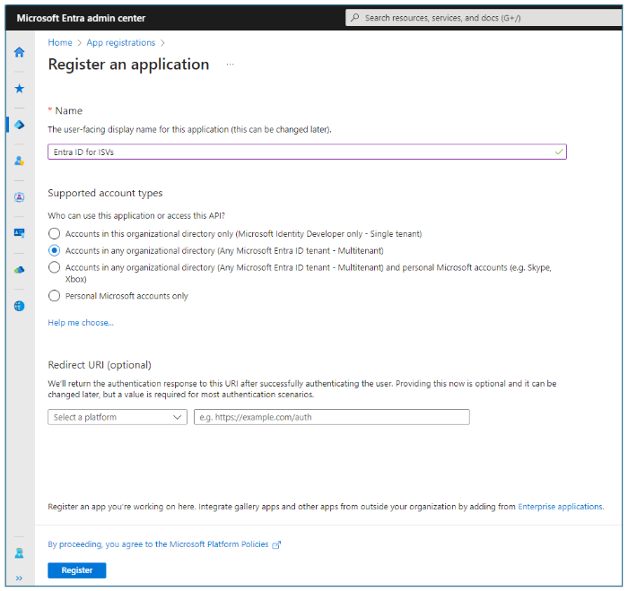

# Establish applications in the Microsoft Entra ID ecosystem 

When building applications on Microsoft Entra ID, you first establish an identity for an application. An app needs an identity in Microsoft Entra ID to request tokens. An Application Programming Interface (API) needs an identity in Microsoft Entra ID to have tokens issued for apps to access resources.

In this article, learn how to register apps in a Microsoft Entra ID tenant in the [Microsoft Entra admin center](https://entra.microsoft.com/), or with the Microsoft Graph API. It's the second in a series of articles on how independent software developers (ISVs) can build and optimize their applications for Microsoft Entra ID. In this series, you can learn more about these topics:

- [Microsoft Entra ID for Independent Software Developers](guide-for-independent-software-developers.md) describes how to use this cloud-based identity and access management service to enable employees to access resources with your application.
- [Authenticate applications and users](authenticate-applications-and-users.md) describes how applications use Microsoft Entra ID to authenticate users and applications.
- [Authorize applications, resources, and workloads](authorize-applications-resources-workloads.md) illustrates when individual humans interact with and direct an application, when APIs act for a user, and when applications or services work independently.
- [Customize tokens](customize-tokens.md) helps you to build security into applications with ID tokens and access tokens from Microsoft Entra ID. It describes the information that you can receive in Microsoft Entra ID tokens and how you can customize them.

## Register applications

Developers can register applications as multitenant apps and single-tenant apps. For ISVs, we recommend multitenant apps. A multitenant app has a single app registration that an ISV completely controls and registers in their tenant. Learn how you can [create a Microsoft Entra ID tenant](~/identity-platform/quickstart-create-new-tenant.md) to register your app.

To provide solutions to any customer running Microsoft Entra ID and have a seamless experience for onboarding into the customer's Microsoft Entra ID tenant, go to **Microsoft Entra admin center**, **App registrations**, **Register an application**. On this new app registration, select **Supported account types**, **Accounts in any organizational directory (Any Microsoft Entra ID tenant--Multitenant)** or **Accounts in any organizational directory (Any Microsoft Entra ID tenant--Multitenant) and personal Microsoft accounts (for example, Skype, Xbox)**.

   

Onboarding a multitenant app to a external tenant can be as simple as running an app and having a user sign into the app. When the tenant allows user consent (users can sign in to apps without an admin previously approving an app), onboarding an app only requires that a user signs into the app. This [Identity workshop for Developers](https://youtu.be/aNyBO5W4uUQ?si=-q5C6LMULMmDT6qg&t=3916) (time code 1:05:20 to 1:08:00) shows an app being onboarded to a tenant as a user signs into an app.

When you register an app in a Microsoft Entra ID tenant, it receives an Application ID (App ID) that is also known as the client ID for an app. It is like a `userid` for a user in that it uniquely identifies an app. The App ID is globally unique across the Microsoft Entra ID cloud and immutable. All interactions between an app and Microsoft Entra ID include the App ID.

In addition to the App ID, an app registration contains information about the app that the app developers know or need to know. For example, an app developer needs to know the App ID to interact with Microsoft Entra ID. The developer knows the application type that they're building (web app, native app, single page app, mobile app, or desktop app). Application types have required attributes.

For example, a required application attribute is a [Redirect Uniform Resource Identifier (URI)](~/identity-platform/quickstart-register-app.md). The attribute tells Microsoft Entra ID the web address, or native app address, to send to a user after authentication or authorization. The developer knows the Redirect URIs for an application, based on the app type and where the app runs.

An app's manifest (that you access from the Microsoft Entra admin center or with a Microsoft Graph API) stores the many application attributes. Reference [Understanding the Microsoft Entra app manifest](~/identity-platform/reference-app-manifest.md) to learn about app attributes and their allowed values.

Reference [Code samples for Microsoft identity platform authentication and authorization](~/identity-platform/sample-v2-code.md) to discover recommended settings for apps that you're developing. Find an application sample that is like the app you're building and read its documentation. Samples detail required app registration settings by app type. For example, if you’re building an API in Node.js, you can find samples that lead you to these [registration instructions](https://github.com/Azure-Samples/ms-identity-javascript-tutorial/tree/main/3-Authorization-II/1-call-api#registration).

An app registration communicates what a developer knows. In each tenant from which users can authenticate to your multitenant app, tenant admins configure how applications run in their tenant. For example, a tenant admin can set a Conditional Access policy that limits an app to specific network locations. Also, there can be a Conditional Access policy to require multifactor authentication (MFA) for a user to access an app, or app settings that allow specific users, or groups, to use an app.

To enable such limitations, tenant admins need control points for apps in their tenant. Microsoft Entra ID automatically creates an Enterprise Application in each tenant in which a user authenticates an app. In the Microsoft Entra admin center, they're called *Enterprise Applications*, but the objects are service principals. Learn more about [Apps and service principals in Microsoft Entra ID](~/identity-platform/app-objects-and-service-principals.md).

After a user authenticates an app, Microsoft Entra ID creates a service principal in the tenant from which the user authenticated. Tenant admins can use the service principal object in Microsoft Graph (or in **Microsoft Entra admin center**, **Enterprise Applications**) to configure how an app can work in the tenant.

Service principals aren't copies of an app registration even though they have many of the same attributes. Instead, a service principal links to its app registration. You can view updates to app registrations in linked Enterprise Applications. For multitenant apps, the customer doesn't have access to app registrations that stay in the ISV's tenant. However, an application can access its service principal using Microsoft Graph even when that service principal is in a different tenant. Thus, an app can access attributes about the Enterprise Application (for example, whether it requires user assignment to an app, or the users assigned to a role in the app).

While we recommend multitenant apps for app registration for ISVs, a single tenant app is another option for registering apps. Instead of a single app registration in the ISV's tenant where the ISV completely controls the registration, you can ask your customers to register your app in their tenant for your app. After the customer completes registration, they configure your app instance with the details of their app registration. We recommend this single tenant app approach primarily for Line of Business applications developed for specific enterprises.

Because of the overhead to have customers register and configure your application, we don't recommend single tenant apps for ISVs. However, there are scenarios for which a multitenant app isn't possible for your app.

If your app uses Security Assertion Markup Language 2.0 (SAML), instead of OpenID Connect (OIDC) or OAuth 2.0, it follows a single tenant app registration model. For SAML apps, the order of creation of service principals and app registration is the opposite of an OIDC or OAuth 2.0 app, at least for the admin who adds the SAML app to the tenant. Instead of registering an app and having Microsoft Entra ID automatically create the service principal, admins start by creating an Enterprise app. Microsoft Entra ID automatically creates the app registration. The Microsoft Entra ID app gallery, described in the [Publishing applications](#publish-applications) section, eases the SAML app creation process for admins.

Limitations on [Redirect Uniform Resource Identifiers (URIs)](~/identity-platform/reply-url.md) can prevent an ISV from creating a multitenant app. An app can have at most 256 Redirect URIs, without wildcards. If your application requires a unique Redirect URI for each customer, and there are more than 256 customers requiring a unique instance, you might not be able to create a multitenant app. You can't use wildcards (*) in Microsoft Entra ID Redirect URIs for security reasons. One option is to have a single Redirect URI for your central service (if a central service is possible). The central Redirect URI would validate the token and then redirect the user to their customer specific endpoint.

## Publish applications

When users initially authenticate your app, or authorize an app to access a resource for the user, they decide if they trust your app. Admins can make similar decisions for all users in their tenant. Admins can decide if a user signs in to an app and if an app accesses specific resources.

The following app publication methods can help ISVs to present their apps as deserving users' and admins' trust.

* **Publish your app from a [verified domain](~/identity-platform/howto-configure-publisher-domain.md).** The publisher domain informs users and admins which locations receive their information. Publishing from a verified publisher domain shows that an app's registered tenant has control of the domain listed as an app's publisher.
* **Publish your app with publisher verification.** Having a verified publisher domain is prerequisite to publisher verification, which goes beyond simply showing that an app publisher has control over a domain. Publisher verification shows that Microsoft verified the entity behind the domain and tenant as authentic. Users who aren't admins often don't trust multitenant apps from unverified publishers. Admins can configure tenants so that apps that aren't from verified publishers always require admin consent. Publisher verification is primarily for ISVs who build multitenant apps on OAuth 2.0 and OIDC. Verified publishers are members of the [Microsoft Cloud Partner Program](https://partner.microsoft.com/partnership/how-it-works%C2%A0). Publisher verification doesn't impact single tenant apps such as those using SAML or Line of Business apps.
* **Publish your app in the [Microsoft Entra ID app gallery](~/identity/enterprise-apps/overview-application-gallery.md).** You can request Microsoft to list your apps using SAML 2.0 and those using OAuth 2.0 and OIDC in the Microsoft Entra ID app gallery. Admins find preintegrated apps in the Microsoft Entra ID app gallery from the **Microsoft Entra admin center**, **Enterprise Applications**, **New Applications**. Publishing your app in the Microsoft Entra ID app gallery simplifies and minimizes configuration for your app. Microsoft tests the applications and provides compatibility verification, especially valuable for apps using SAML 2.0 that require configuration before use. You can use your app's [System for Cross-Domain Identity Management (SCIM)](sync-scim.md) 2.0 implementation to configure your app gallery app for provisioning See the [Automatic provisioning](#automatic-provisioning) section. To get started, [submit a request to publish your application](~/identity/enterprise-apps/v2-howto-app-gallery-listing.md). You can achieve single sign-on and user provisioning using SCIM with a single application in the app gallery.
* **Participate in the [Microsoft 365 App Compliance Program](/microsoft-365-app-certification/overview).** Using a verified domain shows that you have control over your domain. Publisher verification shows that Microsoft verified your organization as authentic. Listing your app in the Microsoft Entra ID app gallery shows that your app works with Microsoft Entra ID for easy onboarding. The Microsoft 365 Compliance Program lets you inform your customers about your app's security and compliance by [Publisher Attestation](/microsoft-365-app-certification/docs/attestation), [Microsoft 365 Certification](/microsoft-365-app-certification/docs/certification), or with the [App Compliance Automation Tool (ACAT)](/microsoft-365-app-certification/docs/acat-overview) in Azure. It shows how your application protects resources that the customer authorizes your app to access.

## Automatic provisioning

App provisioning in Microsoft Entra ID can automatically provision user identities, group objects, and roles to cloud applications that users need to access. In addition to creating user and group objects, automatic provisioning includes user identity maintenance and removal as status or roles change. The [Microsoft Entra provisioning service](~/identity/app-provisioning/how-provisioning-works.md) automatically provisions users and groups to applications by calling a [SCIM](~/identity/app-provisioning/user-provisioning.md) object management API endpoint that an application provides.

For ISVs, advantages of app provisioning in Microsoft Entra ID include the following.

- Provisioning to your application with Microsoft Graph is possible, building a SCIM endpoint enables provisioning to work with identity providers (IdPs) that supports SCIM. Most IdPs support the SCIM provisioning protocol.
- Provisioning is a [synchronization](sync-scim.md) operation where data synchronizes between Microsoft Entra ID and an application. To implement a Microsoft Graph based synchronization solution, an app requires access to all the attributes of all the users and groups in the tenant. Some Microsoft Entra ID customers are reluctant to allow such broad access. With SCIM, an admin can select which attributes Microsoft Entra ID syncs to an application. Many administrators prefer to be able to have this fine-grained control that is only available with a SCIM implementation.
- Building your own Microsoft Graph synchronization service for provisioning means you must manage that service, and implement a pull model to monitor Microsoft Entra ID for changes. When you implement a SCIM endpoint, Microsoft Entra ID manages the provisioning service management and pushes changes to your app.

[Use SCIM, Microsoft Graph, and Microsoft Entra ID to provision users and enrich apps with data](~/identity/app-provisioning/scim-graph-scenarios.md) provides guidance on when to use SCIM and when to use Microsoft Graph. User Microsoft documentation to [plan](~/identity/app-provisioning/use-scim-to-provision-users-and-groups.md), [build](~/identity/app-provisioning/use-scim-to-build-users-and-groups-endpoints.md), and [validate](~/identity/app-provisioning/scim-validator-tutorial.md) your SCIM endpoint with Microsoft Entra ID, and address [known issues with SCIM compliance](~/identity/app-provisioning/application-provisioning-config-problem-scim-compatibility.md).

In addition to syncing data to applications, Microsoft Entra ID offers [provisioning with cloud-based human resources (HR) applications](~/identity/app-provisioning/what-is-hr-driven-provisioning.md). HR-driven provisioning is the process of creating digital identities based on a human resources solution. The HR systems become the start-of-authority for these newly created digital identities and are often the starting point for numerous provisioning processes. On-premises HR solutions can use [Microsoft Identity Manager](/microsoft-identity-manager/microsoft-identity-manager-2016) to provision users to an on-premises Active Directory. They can then synchronize to Microsoft Entra ID with Microsoft Entra Connect or directly to Microsoft Entra ID.

With API-driven inbound provisioning, cloud-based HR ISVs can ship native synchronization experiences so that changes in the HR system automatically flow into Microsoft Entra ID and connected on-premises Active Directory domains. For example, an HR app or student information systems app can send data to Microsoft Entra ID as soon as a transaction is complete or as end-of-day bulk update. To get started [learn the API-driven inbound provisioning concepts](~/identity/app-provisioning/inbound-provisioning-api-concepts.md), investigate the [*bulkUpload* functionality in Microsoft Graph](/graph/api/synchronization-synchronizationjob-post-bulkupload?view=graph-rest-beta&tabs=http&preserve-view=true) and [get more familiar with the API-driven provisioning concepts, scenarios, and limitations](~/identity/app-provisioning/inbound-provisioning-api-concepts.md).

## Next steps

- Confirming your application works with Microsoft Entra ID, [submit a request to publish your application](~/identity/enterprise-apps/v2-howto-app-gallery-listing.md).
- [Microsoft Entra ID for Independent Software Developers](guide-for-independent-software-developers.md) describes how to use this cloud-based identity and access management service to enable employees to access resources with your application.
- [Authenticate applications and users](authenticate-applications-and-users.md) describes how applications use Microsoft Entra ID to authenticate users and applications.
- [Authorize applications, resources, and workloads](authorize-applications-resources-workloads.md) discusses authorization when an individual human interacts with and directs an application, when APIs act on behalf of a user, and when applications or services work independently.
- [Customize tokens](customize-tokens.md) helps you to build security into applications with ID tokens and access tokens from Microsoft Entra ID. It describes the information that you can receive in Microsoft Entra ID tokens and how you can customize them.
