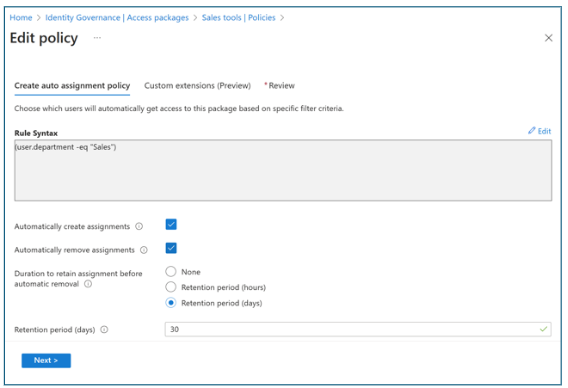
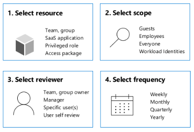
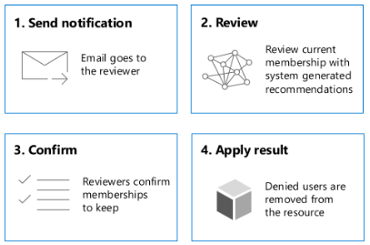
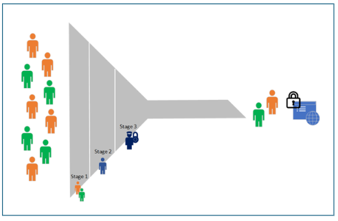
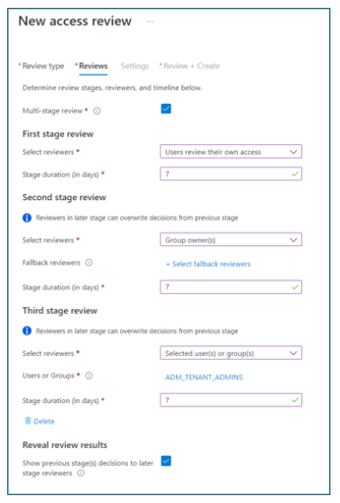
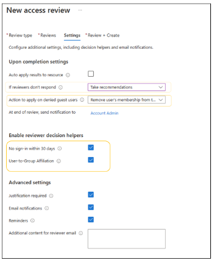
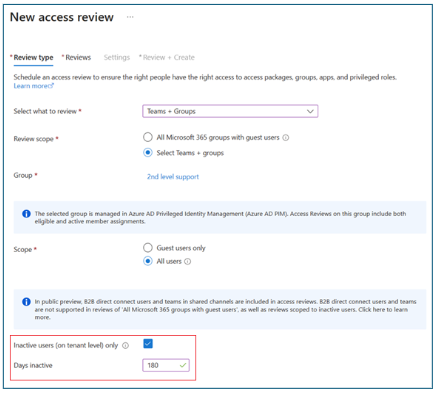
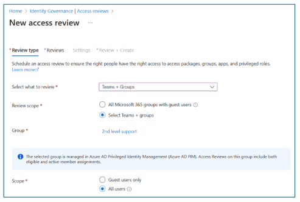

# Microsoft Entra ID Governance deployment guide to assign employee access

Deployment scenarios are guidance on how to combine and test Microsoft Security products and services. Learn how capabilities work together to improve productivity, strengthen security, and more easily meet compliance and regulatory requirements. 

The following products and services appear in this guide:

* [Microsoft Entra ID Governance](../id-governance/identity-governance-overview.md)
* [Microsoft Entra](../fundamentals/what-is-entra.md)
* [Azure Logic Apps](/azure/logic-apps/logic-apps-overview)
* [Access reviews](../id-governance/access-reviews-overview.md)
* Privileged Identity Manager [(PIM) for Groups](../id-governance/access-reviews-overview.md)

Use this scenario to help determine the need for Microsoft Entra ID Governance to create and grant access for your organization. Learn how you can simplify the employee experience with automated workflows, access assignments, access reviews, and expiration. 

## Timelines

Timelines show approximate delivery stage duration and are based on scenario complexity. Times are estimations and vary depending on the environment. 

1. Entitlement management - 1 hour 
2. Auto assignment policy - 1 hour
3. Custom extensions - 2 hours
4. Access reviews - 2 hours  

### Access requests: workflows and approvals

[Entitlement management](../id-governance/entitlement-management-overview.md) is an identity governance feature to manage employee access to resources. Automate access request workflows, access assignments, access reviews, and expiration. Provide users with self-service resource access requests. To do so, define self-service policy and workflow: 

* Enable multistage approval workflows, separation of duties enforcement, and recurring access recertification 
* Use custom workflows for access lifecycles with Azure Logic Apps
* Configure time-limited access  

## Deploy entitlement management

1. Go to [Create an access package in entitlement management](../id-governance/entitlement-management-access-package-create.md).
2. Use the instructions to create an access package.
3. Create an automatic assignment policy.

### Separation of duties

In entitlement management, you can configure policy for user groups and access packages. Conversely, with separation of duties, you can disable requests if a user is assigned to other access packages, or the user is a member of an incompatible group. Generate reports of users with incompatible access rights. Create alerts when users are granted access to applications. 

You can learn to [configure separation of duties checks for an access package](../id-governance/entitlement-management-access-package-incompatible.md). 

### Create an autoassignment policy

In this area of access policy, **birthright assignment** refers to automatically granting resource access based on user properties. Creating assignments works similarly. User properties match, or don’t match, a policy's membership rules. Use rules to determine access package assignment based on user properties, similar to [dynamic groups](../identity/users/groups-create-rule.md). Add or remove assignments, based on rule criteria. 

In the following screenshot see the **Edit policy dialog**, with the **Create auto assignment policy** tab.  

   

For more information, you can learn about [groups and access rights in Microsoft Entra ID](../fundamentals/how-to-manage-groups.yml)

See the following video to learn more about policy assignment.  

> [!VIDEO 6ae11d17-51c8-4346-a9a3-098a9df0148f]

### Custom workflows with Azure Logic Apps

Create and run automated workflows with [Azure Logic Apps](/azure/logic-apps/), using the visual designer and prebuilt operations. 

To extend governance workflows, integrate Logic Apps with entitlement management: 

* An access package request is created or approved
* An access package assignment is granted or removed
* Fourteen days before an access package assignment autoexpires
* One day before an access package assignment autoexpires

 >[!NOTE]
 >Have [Azure subscription resources](/cli/azure/manage-azure-subscriptions-azure-cli?tabs=bash&preserve-view=true) available for planning.

### Custom use case examples

* Send custom email notifications
* Send Microsoft Teams notification
* Get user information from applications
* Write back user information to external systems
* Call an external web API to trigger actions on external systems
* Create task sets in [Microsoft Planner](/office365/servicedescriptions/project-online-service-description/microsoft-planner-service-description)
* Generate a temporary access pass (TAP)

## Deploy access package custom extensions

 >[!NOTE]
 >To consider custom extensions, ensure you understand Azure Logic Apps functionality. For more information, see the previous section.

1. Go to [Trigger Azure Logic Apps with custom extensions in entitlement management](/azure/active-directory/governance/entitlement-management-logic-apps-integration). 
2. Use the instructions to create and add a custom extension to a catalog.
3. Edit the custom extension.
3. Add custom extensions to an access package.

See the following video to learn about custom extenstions and access packages in Microsoft Entra ID Governance.

> [!VIDEO 4fdc4503-b3c9-42b7-b36b-375aea3024a9]

## Access recertification: Access reviews

For access recertification, you can review access rights with recurring [access reviews](../id-governance/access-reviews-overview.md). Manage group membership, resource access, and role assignments, also meet compliance requirements.  

Administrators determine review scope, then create reviews in access reviews, Microsoft Entra enterprise apps, [Privileged Identity Management](../id-governance/privileged-identity-management/pim-configure.md) (PIM), or entitlement management. 

   

The **New access review** dialog appears with the **Review type** tab. Find options for review type, scope, and other configuration details. 

### Reviewers

Administrators assign primary and fallback reviewers during access review creation. An email notifies reviewers of pending reviews. You can assign users to self-review or assign resource owners to review their resources. For self-reviews, you can remove privileges if the user denies or doesn't respond.

   

The My Access dashboard shows a reviewer's pending approvals and recommendations.

   

### Multistage reviews

[Multistage reviews](../id-governance/using-multi-stage-reviews.md) reduce the burden on individual reviewers and help achieve consensus across reviewers. Fallback reviewers help decide unreviewed decisions. Review stage configuration includes indicating the number of stages.  

   

Use the **New access review** dialog, and **Reviews** tab to configure review stages, reviewers, duration, and more.  

   

### Automated decision criteria

During access review configuration, you can indicate various decision criteria, including reviewer decision helpers. Other options include: 

* Response triggers
* Account inactivity
* Justification requirements
* Alerts and notifications 

The **New access review** dialog, and **Settings** tab, with decision helper options highlighted.

   

### Inactive user reviews

If users haven't signed in to the tenant within a designated duration, they're considered inactive. This behavior is adjusted for application assignment reviews, or a user's last activity in an app. To get started, define what inactive means for your organization. 

Learn how to [detect and investigate inactive user accounts](../identity/monitoring-health/howto-manage-inactive-user-accounts.md). 

The **New access review** dialog, and **Review type** tab, with inactivity options highlighted. 

   

### Review recommendations

Reviewers can use machine-learning derived [recommendations](../id-governance/review-recommendations-access-reviews.md) to help make access decisions. Recommendations detect User-to-Group Affiliation, based on reporting-structure proximity. Users distant from group members have **low affiliation**. 

   > [!NOTE]
   >User-to-Group Affiliation is available for users in your directory. However, groups of more than 600 users aren't supported. Ensure users have a manager attribute.

## Access review for PIM for Groups

You can grant users just-in-time (JIT) membership and group ownership with [Privileged Identity Management (PIM) for Groups](../id-governance/privileged-identity-management/concept-pim-for-groups.md). Reviews include active group members and eligible members. 

Learn to [create access reviews for PIM for Groups](../id-governance/create-access-review-pim-for-groups.md). 

   > [!NOTE]
   >Access reviews can determine inactivity for up to two years.  

The **New access review** dialog, and **Review type** dialog with options for scope and more. 

   

## Access review history report

With access reviews, authorized users can create downloadable review-history reports for more insight on reviewer decisions, time frames, and more. Use filters to include review types and results. 

The **Identity Governance** dialog, in the **Review History** area, with the **Review History** option highlighted. 

## Deploy access reviews

1. [Plan a Microsoft Entra access review deployment](/azure/active-directory/governance/deploy-access-reviews).
2. [Create an access review of PIM for Groups](/azure/active-directory/governance/create-access-review-pim-for-groups).
3. [Complete an access review of Azure resource and Microsoft Entra ID roles in PIM](/azure/active-directory/privileged-identity-management/pim-complete-roles-and-resource-roles-review).
4. [Create an access review of an access package in entitlement management](/azure/active-directory/governance/entitlement-management-access-reviews-create).

### Create custom reports with Azure Data Explorer

You can generate custom reports. Export data from Microsoft Entra ID to Azure Data Explorer and use Kusto Query Language (KQL) to create tailored views. You can analyze entitlement data, customize insights, and optimize identity governance reporting. In the following video, you can learn to create custom reports with Azure Data Explorer:  

> [!VIDEO 1f2d0263-5163-45cb-a760-fde339ced6c1]

### Request access packages

Administrators use the [My Access portal](../id-governance/my-access-portal-overview.md) to configure access and for users to review or request access (Requestors) to resources. In My Access portal, Approvers can modify answers submitted by Requestors.

Learn how to [request an access package](../id-governance/entitlement-management-request-access.md).

## Next steps

  * [Introduction to Microsoft Entra ID Governance deployment guide](governance-deployment-intro.md)
  * [Scenario 1: Employee lifecycle automation](governance-deployment-employee-lifecycle.md)
  * Scenario 2: Assign employee access to resources
  * [Scenario 3: Govern guest and partner access](governance-deployment-guest-access.md)
  * [Scenario 4: Govern privileged identities and their access](governance-deployment-privileged-identities.md)
