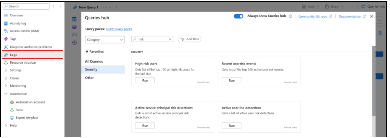
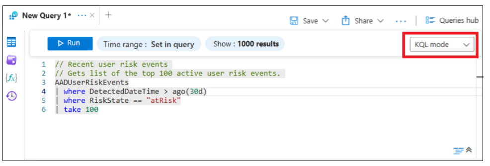
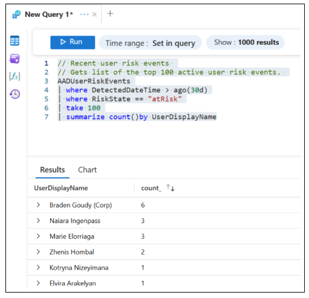
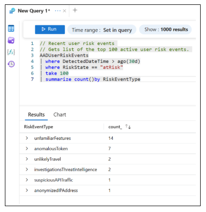
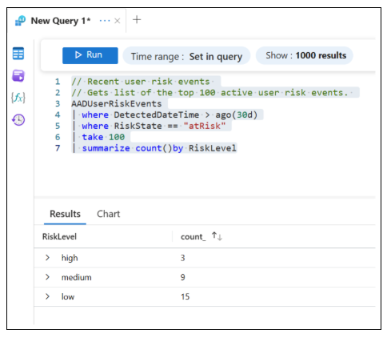

# Microsoft Entra ID Protection to analyze risk

When you configure access to your organization's resources, a proactive approach to risk mitigates the accelerating pace of cyber attack complexity. Create automated conditions for access and save on operationional and support costs. Gain visibility into risk assessment and resulting actions with [Azure Monitor Logs](/azure/azure-monitor/logs/data-platform-logs) reference tables. Learn how to manage common risk event types, repeatedly flagged users, and risk level patterns. 

* Track risk events across users and sign-ins 
* Correlate anomalies with [Microsoft Entra Conditional Access](../identity/conditional-access/overview.md) policies and sign-in logs 
* Identify potential threat patterns
  * Enrich investigations and stream telemetry to [Microsoft Defender XDR](/defender-xdr/microsoft-365-defender) and [Microsoft Sentinel](/azure/sentinel/overview), a security information and event management (SIEM) tool with threat intelligence and a data-lake architecture

You can [search the audit log for events in Microsoft Defender XDR](/defender-xdr/microsoft-xdr-auditing).

## Risk analysis with the AADUserRiskEvents table 

Identity risks grow in speed and complexity every year. You can use risk insights to grasp the volume and details of potential identity attacks and compromises. Enable Azure Monitor Logs reference tables to analyze risk insights with [Microsoft Entra ID Protection](../id-protection/overview-identity-protection.md) that detects, investigates, and remediates identity risks. Risk data goes to access decisions tools, or tools for investigation and correlation. Microsoft Entra ID Protection is continuously updated to help organizations stay ahead of emerging threats. Identity risk management becomes more proactive, scalable, and effective. 

With insights, reference tables, and more, you can investigate and remediate identity risks with Conditional Access and construct targeted policies to address your orgnanization's risks.  

Learn more in the [Azure Monitor Logs overview](/azure/azure-monitor/logs/data-platform-logs).

In Microsoft Entra ID Protection, there are four risk tables to query risk events, risky users, and risky [Service Principals](/azure/databricks/admin/users-groups/service-principals). 

* AADUserRiskEvents 
* AADRiskyUsers 
* AADServicePrincipalRiskEvents 
* AADRiskyServicePrincipals 

In this article, the focus is the **AADUserRiskEvents** table. To understand more about discerning risks to your organization, see the following video, </br>**Mastering risk analysis with Microsoft Entra ID Protection**. 

   > [!VIDEO abb7d7fe-4155-4ee1-bcce-afa027d22f8d]

## Prerequisites 

To use Azure Monitor, ensure the following prerequisites are met. 

* A Microsoft Entra ID P2 Premium license
  * See [Microsoft Entra plans and pricing](https://www.microsoft.com/security/business/microsoft-entra-pricing?msockid=3c61c9beef5963ba2f03dc9cee156239)
* An Azure account with an active subscription
  * Learn about [Azure accounts](https://azure.microsoft.com/pricing/purchase-options/azure-account/)
* Microsoft.OperationalInsights/workspaces/write permissions to the resource group for the Log Analytics workspace
  * Learn about the **Log Analytics Contributor** role in [manage access to Log Analytics workspaces](/azure/azure-monitor/logs/manage-access)

## Create a Log Analytics workspace

A Log Analytics workspace is a data store to collect log data types from Azure and non-Azure resources and applications. We recommend you send all log data to one Log Analytics workspace. 

1. [Create a Log Analytics workspace](/azure/azure-monitor/logs/quick-create-workspace).
2. To incorporate the data you want to analyze, add diagnostics settings. See the following list.
3. To view the Queries hub, in the Log Analytics workspace, select **Logs**.
4. Search for **Risk**.
5. Locate the **Recent user risk events** query.
6. Select **Run**.

**Diagnostics settings**
  * AuditLogs
  * SignInLogs
  * NonInteractiveUserSignInLogs
  * ServicePrincipalSignInLogs
  * ManagedIdentitySignInLogs
  * RiskyUsers
  * UserRiskEvents
  * RiskyServicePrincipals
  * ServicePrincipalRiskEvents

See the following screenshot of the **Logs** option and the Queries hub page.

  

7. From the dropdown, change **Simple mode** to **KQL mode**.

   

## Three steps to analyze risk

The following sections illustrate how to analyze risk with Azure Monitor. 

* **Identify risky users** - Users with one or more risky sign-ins, or other risky actions
* **Discern risk event types** - Unfamiliar sign-in, unusual tokens, and unlikely travel are examples
* **Examine risk levels** - Risk-level totals enable effective decision making

### Step 1: Identify risky users

1. Run the query to summarize the count by **UserDisplayName**.
2. Add a time range in **DetectedDateTime < ago()**.  

In the following example query, **30d** is the date range. 

```KQL
// Recent user risk events 
// Gets list of the top 100 active user risk events. 
AADUserRiskEvents 
| where DetectedDateTime > ago(30d) 
| where RiskState == "atRisk" 
| take 100 
| summarize count()by UserDisplayName 
```

Use the previous query to identify common user patterns, such as service accounts, or small user subsets generating large amounts of risk. In the following screenshot, there are risky users. One generates more risk events than the others. For this scenario, you can block the user, or require a secure password change. 

   

## Step 2: Discern risk event types

After you determine user patterns, review detections and summarize them by the risk event type.  

1. Use the **AADUserRiskEvents** table.
2. Summarize with **RiskEventType**. 

**Example query**
```KQL
// Recent user risk events 
// Gets list of the top 100 active user risk events. 
AADUserRiskEvents 
| where DetectedDateTime > ago(30d) 
| where RiskState == "atRisk" 
| take 100  
| summarize count()by RiskEventType 
```

While reviewing risk types, pay attention to large volumes. In the following screenshot, there are flagged risk events, most are related to:

* **UnfamiliarFeatures** - Detect unfamiliar sign-in properties for a user
  * Enforce session controls such as sign-in frequency, application restrictions, and persistent browser controls
* **AnomalousToken** - Set up Conditional Access policies to require password reset and perform multifactor authentication (MFA)
  * Block access for high-risk sign-ins
* **UnlikelyTravel** - Add named locations as trusted IPs
  * Enable trusted locations for users that travel frequently

See the following screenshot of results from the active-user risk events query.

   

## Step 3: Examine risk levels

Examine the **AADUserRiskEvents** table to review low-, medium-, and high-risk levels. Summarize risk events by level and analyze risk level totals. 

**Example query**
```KQL
// Recent user risk events 
// Gets list of the top 100 active user risk events. 
AADUserRiskEvents 
| where DetectedDateTime > ago(30d) 
| where RiskState == "atRisk" 
| take 100 
| summarize count()by RiskLevel  
```

In the following screenshot, three detections are high-risk, which you can prioritize. We recommend a minimum baseline Conditional Access policy that requires secure password change, or that blocks the high-risk users. 

   

Learn more about access control decisions: [What is Conditional Access?](/azure/data-explorer/security-conditional-access)

### Azure Monitor Logs reference tables

To help you get started, use Azure Monitor Log reference tables for Microsoft Entra ID Protection: 

* [AADUserRiskEvents](/azure/azure-monitor/reference/tables/aaduserriskevents)
* [AADRiskyUsers](/azure/azure-monitor/reference/tables/aadriskyusers)
* [AADServicePrincipalRiskEvents](/azure/azure-monitor/reference/tables/aadserviceprincipalriskevents)
* [AADRiskyServicePrincipals](/azure/azure-monitor/reference/tables/aadriskyserviceprincipals)

## Next steps

Microsoft Entra ID Protection helps organizations build a proactive approach to identity risk management. You can learn more.  

* See [Introduction to Microsoft Entra ID Protection proof-of-concept guidance](/entra/architecture/id-protection-guide-introduction)
* Watch instructional videos in the [ID Protect YouTube playlist](https://www.youtube.com/playlist?list=PL3ZTgFEc7Lyvgqywy5KvqYcFYpDSBj-qm)
* Visit the [Tech Community](https://techcommunity.microsoft.com/) for updates and technical information
* Learn to configure diagnostics at [idpdiagnosticssettings](https://aka.ms/idpdiagnosticssettings)

### Learn about Microsoft Entra

Microsoft Entra is a family of identity and network access products to implement a [Zero Trust](/security/zero-trust/zero-trust-overview) security strategy and create a [trust fabric](https://www.microsoft.com/security/blog/2024/05/08/how-implementing-a-trust-fabric-strengthens-identity-and-network/) to: 

* Verify identity
* Validate access conditions
* Check permissions
* Encrypt connection channels
* Monitor for compromise

With Microsoft Entra, organizations enable real-time access and identity decisions across hybrid and multicloud environments. Discover its features and capabilities for secure access. 

* [Microsoft Entra documentation](/entra/)
* [Microsoft Entra News and Insights, Microsoft Security Blog](https://www.microsoft.com/security/blog/product/microsoft-entra/)
* [Microsoft Entra blog, Tech Community](https://techcommunity.microsoft.com/)
* [Microsoft Entra discussions, Microsoft Community](https://techcommunity.microsoft.com/)


