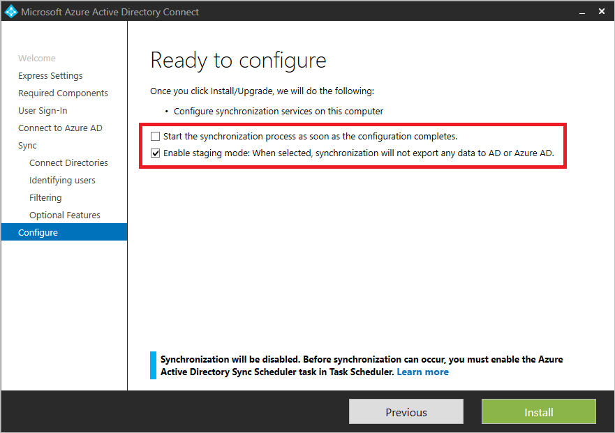
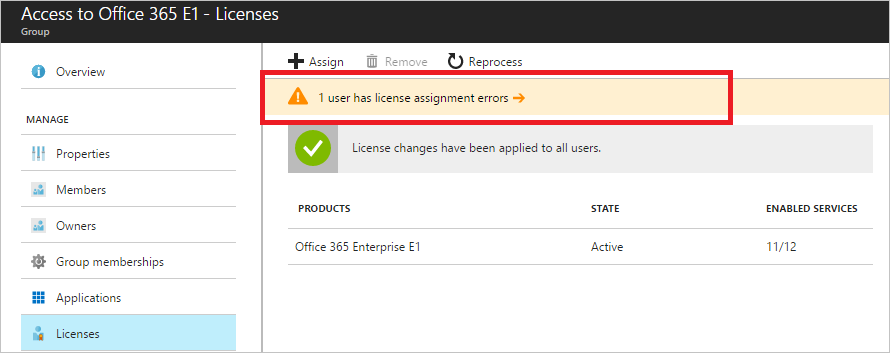
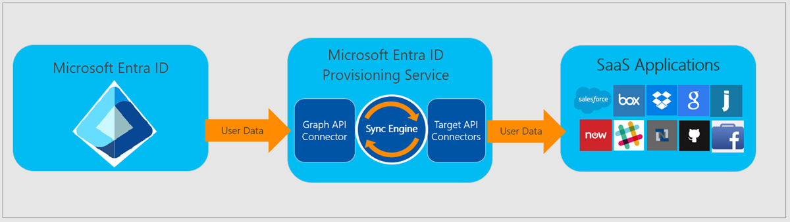

# Microsoft Entra identity and access management operations reference guide

This section of the [Microsoft Entra operations reference guide](ops-guide-intro.md) describes the checks and actions you should consider to secure and manage the lifecycle of identities and their assignments.

> [!NOTE]
> These recommendations are current as of the date of publishing but can change over time. Organizations should continuously evaluate their identity practices as Microsoft products and services evolve over time.

## Key operational processes

### Assign owners to key tasks

Managing Microsoft Entra ID requires the continuous execution of key operational tasks and processes that might not be part of a rollout project. It's still important you set up these tasks to maintain your environment. The key tasks and their recommended owners include:

| Task | Owner |
| :- | :- |
| Define the process how to create Azure subscriptions | Varies by organization |
| Decide who gets Enterprise Mobility + Security licenses | IAM Operations Team |
| Decide who gets Microsoft 365 licenses | Productivity Team |
| Decide who gets other licenses, for example, Dynamics, Visual Studio Codespaces | Application Owner |
| Assign licenses | IAM Operations Team |
| Troubleshoot and remediate license assignment errors | IAM Operations Team |
| Provision identities to applications in Microsoft Entra ID | IAM Operations Team |

As you review your list, you might find you need to either assign an owner for tasks that are missing an owner or adjust ownership for tasks with owners that aren't aligned with the recommendations provided.

#### Assigning owners recommended reading

- [Assigning administrator roles in Microsoft Entra ID](~/identity/role-based-access-control/permissions-reference.md)

## On-premises identity synchronization

### Identify and resolve synchronization issues

Microsoft recommends you have a good baseline and understanding of the issues in your on-premises environment that can result in synchronization issues to the cloud. Since automated tools, such as [IdFix](/microsoft-365/enterprise/set-up-directory-synchronization) and [Microsoft Entra Connect Health](~/identity/hybrid/connect/whatis-azure-ad-connect.md#why-use-azure-ad-connect-health), can generate a high volume of false positives, we recommend you identify synchronization errors that have yet to be addressed for more than 100 days by cleaning up those objects in error. Long term unresolved synchronization errors can generate support incidents. [Troubleshooting errors during synchronization](~/identity/hybrid/connect/tshoot-connect-sync-errors.md) provides an overview of different types of sync errors, some of the possible scenarios that cause those errors and potential ways to fix the errors.

### Microsoft Entra Connect Sync configuration

To enable all hybrid experiences, device-based security posture, and integration with Microsoft Entra ID, we require that you synchronize user accounts that your employees use to sign in to their desktops.

If you don't synchronize the forest users log into, then you should change the synchronization to come from the proper forest.

#### Synchronization scope and object filtering

Removing known buckets of objects that aren't required to be synchronized has the following operational benefits:

- Fewer sources of sync errors
- Faster sync cycles
- Less "garbage" to carry forward from on-premises, for example, pollution of the global address list for on-premises service accounts that aren't relevant in the cloud

> [!NOTE]
> If you find you are importing many objects that aren't being exported to the cloud, you should filter by OU or specific attributes.

Examples of objects to exclude are:

- Service Accounts that aren't used for cloud applications
- Groups that aren't meant to be used in cloud scenarios such as those used to grant access to resources
- Users or contacts that are external identities that are meant to be represented with Microsoft Entra B2B Collaboration
- Computer Accounts where employees aren't meant to access cloud applications from, for example, servers

> [!NOTE]
> If a single human identity has multiple accounts provisioned from something such as a legacy domain migration, merger, or acquisition, you should only synchronize the account used by the user on a day-to-day basis, for example, what they use to log in to their computer.

Ideally, aim to reach a balance between reducing the number of objects to synchronize and the complexity in the rules. Generally, a combination between OU/container [filtering](~/identity/hybrid/connect/how-to-connect-sync-configure-filtering.md) plus a simple attribute mapping to the cloudFiltered attribute is an effective filtering combination.

> [!IMPORTANT]
> If you use group filtering in production, you should transition to another filtering approach.

#### Sync failover or disaster recovery

Microsoft Entra Connect plays a key role in the provisioning process. If the Sync Server goes offline for any reason, changes to on-premises can't be updated in the cloud and can result in access issues for users. Therefore, it's important to define a failover strategy that allows administrators to quickly resume synchronization after the sync server goes offline. Such strategies might fall into the following categories:

- **Deploy Microsoft Entra Connect Server(s) in Staging Mode** - allows an administrator to "promote" the staging server to production by a simple configuration switch.
- **Use Virtualization** - If the Microsoft Entra Connect is deployed in a virtual machine (VM), admins can apply their virtualization stack to live, migrate, or quickly redeploy the VM and therefore resume synchronization.

If your organization is lacking a disaster recovery and failover strategy for Sync, you shouldn't hesitate to deploy Microsoft Entra Connect in Staging Mode. Likewise, if there's a mismatch between your production and staging configuration, you should rebaseline Microsoft Entra Connect staging mode to match the production configuration, including software versions and configurations.

#### Stay current

Microsoft updates Microsoft Entra Connect regularly. Stay current to take advantage of the performance improvements, bug fixes, and new capabilities that each new version provides.

If your Microsoft Entra Connect version is more than six months behind, you should upgrade to the most recent version.

#### Source anchor

Using **ms-DS-consistencyguid** as the [source anchor](~/identity/hybrid/connect/plan-connect-design-concepts.md) allows an easier migration of objects across forests and domains, which is common in AD Domain consolidation/cleanup, mergers, acquisitions, and divestitures.

If you're currently using **ObjectGuid** as the source anchor, we recommend you switch to using **ms-DS-ConsistencyGuid**.

#### Custom rules

Microsoft Entra Connect custom rules give you the ability to control the flow of attributes between on-premises objects and cloud objects. However, overusing or misusing custom rules can introduce the following risks:

- Troubleshooting complexity
- Degradation of performance when performing complex operations across objects
- Higher probability of divergence of configuration between the production server and staging server
- Additional overhead when upgrading Microsoft Entra Connect if custom rules are created within the precedence greater than 100 (used by built-in rules)

If you're using overly complex rules, you should investigate the reasons for the complexity and find opportunities for simplification. Likewise, if you've created custom rules with precedence value over 100, you should fix the rules so they aren't at risk or conflict with the default set.

Examples of misusing custom rules include:

- **Compensate for dirty data in the directory** - In this case, we recommend you work with the owners of the AD team and clean up the data in the directory as a remediation task, and adjust processes to avoid reintroduction of bad data.
- **One-off remediation of individual users** - It's common to find rules that special case outliers, usually because of an issue with a specific user.
- **Overcomplicated "CloudFiltering"** - While reducing the number of objects is a good practice, there's a risk of creating an overcomplicated sync scope using too many sync rules. If you're using complex logic to include/exclude objects beyond the OU filtering process, we recommend you handle this logic outside of sync. You can do this by labeling the objects with a simple "cloudFiltered" attribute that can flow with a simple Sync Rule.

#### Microsoft Entra Connect Configuration Documenter

The [Microsoft Entra Connect Configuration Documenter](https://github.com/Microsoft/AADConnectConfigDocumenter) is a tool you can use to generate documentation of a Microsoft Entra Connect installation. This tool gives you a better understanding of the sync configuration and helps you build confidence in getting things right. The tool also tells you what changes have occurred, when you applied a new build or configuration of Microsoft Entra Connect, and which custom sync rules have been added or updated. 

The current capabilities of the tool include:

- Documentation of the complete configuration of Microsoft Entra Connects Sync.
- Documentation of any changes in the configuration of two Microsoft Entra Connect Sync servers or changes from a given configuration baseline.
- Generation of a PowerShell deployment script to migrate the sync rule differences or customizations from one server to another.

## Assignment to apps and resources

### Group-based licensing for Microsoft cloud services

Microsoft Entra ID streamlines the management of licenses through [group-based licensing](~/fundamentals/concept-group-based-licensing.md) for Microsoft cloud services. This way, IAM provides the group infrastructure and delegated management of those groups to the proper teams in the organizations. There are multiple ways to set up the membership of groups in Microsoft Entra ID, including:

- **Synchronized from on-premises** - Groups can come from on-premises directories, which could be a good fit for organizations who've established group management processes that can be extended to assign licenses in Microsoft 365.

- **Dynamic membership groups** - Attribute-based groups can be created in the cloud based on an expression based on user attributes, for example, Department equals "sales". Microsoft Entra ID maintains the members of the group, keeping it consistent with the expression defined. Using dynamic membership groups for license assignment enables an attribute-based license assignment, which is a good fit for organizations that have high data quality in their directory.

- **Delegated ownership** - Groups can be created in the cloud and can be designated owners. This way, you can empower business owners, for example, Collaboration team or BI team, to define who should have access.

If you're currently using a manual process to assign licenses and components to users, we recommend you implement group-based licensing. If your current process doesn't monitor licensing errors or determine which licenses are Assigned versus Available, you should define improvements to the process. Make sure your process addresses licensing errors and monitors licensing assignments.

Another aspect of license management is the definition of service plans (components of the license) that should be enabled based on job functions in the organization. Granting access to service plans that aren't necessary can result in users seeing tools in the Microsoft 365 portal that they have yet to be trained on or shouldn't be using. These scenarios can drive additional help desk volume, unnecessary provisioning, and put your compliance and governance at risk; for example, when provisioning OneDrive to individuals that might not be allowed to share content.

Use the following guidelines to define service plans to users:

- Administrators should define "bundles" of service plans to be offered to users based on their role; for instance, white-collar worker versus floor worker.
- Create groups by cluster and assign the license with service plan.
- Optionally, an attribute can be defined to hold the packages for users.

> [!IMPORTANT]
> Group-based licensing in Microsoft Entra ID introduces the concept of users in a licensing error state. If you notice any licensing errors, then you should immediately [identify and resolve](~/identity/users/licensing-groups-resolve-problems.md) any license assignment problems.

#### Lifecycle management

If you're currently using a tool, such as [Microsoft Identity Manager](/microsoft-identity-manager/) or third-party system that relies on an on-premises infrastructure, we recommend you offload assignment from the existing tool. Instead, you should implement group-based licensing and define a group lifecycle management based on [dynamic membership groups](~/identity/users/licensing-group-advanced.md).

If your existing process doesn't account for new employees or employees that leave the organization, you should deploy group-based licensing based on dynamic membership groups and define their lifecycle. Finally, if group-based licensing is deployed against on-premises groups that lack lifecycle management, consider using cloud groups to enable capabilities such as delegated ownership or attribute-based dynamic membership groups.

### Assignment of apps with "All users" group

Resource owners might believe that the **All users** group contains only **Enterprise Employees** when they might actually contain both **Enterprise Employees** and **Guests**. As a result, you should take special care when using the **All users** group for application assignment and granting access to resources such as SharePoint content or applications.

> [!IMPORTANT]
> If the **All users** group is enabled and used for Conditional Access policies, app or resource assignment, make sure to [secure the group](~/external-id/use-dynamic-groups.md) if you don't want it to include guest users. Furthermore, you should fix your licensing assignments by creating and assigning to groups that contain **Enterprise Employees** only. On the other hand, if you find that the **All users** group is enabled but not being used to grant access to resources, make sure your organization's operational guidance is to intentionally use that group (which includes both **Enterprise Employees** and **Guests**).

### Automated user provisioning to apps

[Automated user provisioning](~/identity/app-provisioning/user-provisioning.md) to applications is the best way to create a consistent provisioning, deprovisioning, and lifecycle of identities across multiple systems.

If you're currently provisioning apps in an ad-hoc manner or using CSV files, JIT, or an on-premises solution that doesn't address lifecycle management, we recommend you [implement application provisioning](~/identity/app-provisioning/user-provisioning.md#how-do-i-set-up-automatic-provisioning-to-an-application) with Microsoft Entra ID. This solution provides supported applications and defines a consistent pattern for applications that are yet to be supported by Microsoft Entra ID.

### Microsoft Entra Connect delta sync cycle baseline

It's important to understand the volume of changes in your organization and make sure that it isn't taking too long to have a predictable synchronization time.

The [default delta sync](~/identity/hybrid/connect/how-to-connect-sync-feature-scheduler.md) frequency is 30 minutes. If the delta sync is taking longer than 30 minutes consistently or there are significant discrepancies between the delta sync performance of staging and production, you should investigate and review the [factors influencing the performance of Microsoft Entra Connect](~/identity/hybrid/connect/plan-connect-performance-factors.md).

#### Microsoft Entra Connect troubleshooting recommended reading

- [Prepare directory attributes for synchronization with Microsoft 365 by using the IdFix tool](/microsoft-365/enterprise/set-up-directory-synchronization)
- [Microsoft Entra Connect: Troubleshooting Errors during synchronization](~/identity/hybrid/connect/tshoot-connect-sync-errors.md)

## Summary

There are five aspects to a secure Identity infrastructure. This list helps you quickly find and take the necessary actions to secure and manage the lifecycle of identities and their entitlements in your organization.

- Assign owners to key tasks.
- Find and resolve synchronization issues.
- Define a failover strategy for disaster recovery.
- Streamline the management of licenses and assignment of apps.
- Automate user provisioning to apps.

## Next steps

Get started with the [Authentication management checks and actions](ops-guide-auth.md).
