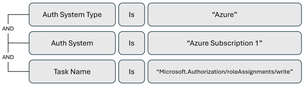

# Microsoft Entra Permissions Management alerts guide

Alerting is essential to help solve permissions problems. Alerts enable your organization to take a proactive approach to managing identities and their access to resources.

Use Microsoft Entra Permissions Management to configure alerts to continuously monitor your environment for scenarios such as overprivileged accounts and inactive identities. It can also notify you of potential threats, service disruptions, and anomalous permissions usage.

Permissions Management alerts go to subscribed users by email and have summary views: the triggered alert, the authorization system in question, and the number of identities, tasks, and resources involved in the alert. View alerts in Permissions Management for more detailed information about triggers.

>[!NOTE]
>Permissions Management alerts are not real-time; they’re based on the product’s activity log refreshes, so there might be a delay between activity and alert.

There are four types of alerts to configure in Microsoft Entra Permissions Management:

* [Statistical anomaly](#statistical-anomaly-alerts)
* [Rule-based anomaly](#rule-based-anomaly-alerts)
* [Permission analytics](#permissions-analytics-alerts)
* [Activity](#activity-alerts)

## Statistical anomaly alerts

Statistical anomaly alerts use Microsoft Entra Permissions Management artificial intelligence (AI) and machine learning (ML) capabilities. Based on prior activity log information, Permissions Management classifies and determines typical behavior for each identity. You select from pre-configured alerts for atypical or suspicious activity in your environment. For example, you can be notified when an identity performs a high number of tasks, or when an identity performs tasks at an unusual time of day.

Statistical anomaly alerts are useful for threat detection, because unusual activity in your environment can be a sign of a compromised account. Use these alerts to detect potential service disruptions. The six pre-configured statistical anomaly alerts are:

* **Identity Performed High Number of Tasks**: Use this alert for threat detection. Identities performing an atypically high number of tasks might be an indication of compromise.
* **Identity Performed Low Number of Tasks**: This alert is useful to detect potential service disruptions, especially from machine accounts. Identities performing an unusually low number of tasks might be an indication of sudden outages or permissions issues.
* **Identity Performed Tasks with Multiple Unusual Patterns**: Use this alert for threat detection. Identities with several unusual task patterns might be an indication of a compromised account.
* **Identity Performed Tasks with Unusual Results**: This alert is useful to detect potential service disruptions. Identities performing tasks with unusual results, such as tasks that fail, might indicate sudden outages, or permissions issues.
* **Identity Performed Tasks with Unusual Timing**: This alert is for threat detection. Identities performing tasks outside their typical hours might indicate a compromised account, or a user accessing resources from an atypical location.
* **Identity Performed Tasks with Unusual Types**: This alert is for threat detection. Identities suddenly performing tasks they don't usually perform might indicate a compromised account.

For more on these pre-configured alerts, see [create and view statistical anomaly alerts and alert triggers](~/permissions-management/product-statistical-anomalies.md).

### Respond to statistical anomaly alerts

A statistical anomaly alert might indicate a potential security incident or service disruption. It doesn’t necessarily mean an incident occurred. There are valid use cases that trigger these alerts. For example, an employee on an out-of-country business trip, in a new time zone, can trigger an **Identity Performed Tasks with Unusual Timing** alert.

In general, we recommended you investigate the identity to determine if action is needed. Use the **Audit** tab in Permissions Management or analyze recent logging information.

## Rule-based anomaly alerts

Rule-based anomaly alerts are pre-configured. Use them for notification of initial activity in your environment. For example, create alerts for initial resource access, or when users perform tasks for the first time.

Use rule-based anomaly alerts for highly sensitive production authorization systems or identities you want to monitor closely.

There are three pre-configured rule-based anomaly alerts:

* **Any Resource Accessed for the First Time**: Use this trigger to get notified of new active resources in an authorization system. For example, a user creates a new Microsoft Azure Blob Storage instance in a subscription without your knowledge. The trigger alerts you when the new Blob Storage is accessed for the first time.
* **Identity Performs a Particular Task for the First Time**: Use this trigger to detect scope creep, or increased permissions from your users. For example, if a user performs different tasks for the first time, the account might be compromised, or maybe the user recently had a change in permissions that allows them to perform new tasks.
* **Identity Performs a Task for the First Time**: Use this alert trigger for new active users in a subscription, or to detect compromised inactive accounts. For example, a new user is provisioned in an Azure subscription. This trigger alerts you when the new user performs their first task.

>[!NOTE]
> **Identity Performs a Particular Task for the First Time** sends a notification when a user performs a unique task for the first time. **Identity Performs a Task for the First Time** sends a notification when an identity performs their first task within a specified time frame.

To learn more, see [create and view rule-based anomaly alerts and alert triggers](~/permissions-management/product-rule-based-anomalies.md).

### Respond to rule-based anomaly alerts

Rule-based anomaly alerts can generate many alerts. Therefore, we recommend you use them for highly sensitive authorization systems. 

When you receive a rule-based anomaly alert, investigate the identity or resource to determine if action is needed. Use the **Audit** tab in Permissions Management or analyze recent logging information.

## Permissions analytics alerts

Permissions analytics alerts are pre-configured; use them for key findings in your environment. Each alert is tied to a category in the Permissions Analytics Report. For example, you can be notified of user inactivity, or when a user becomes overpermissioned.

Use permissions analytics alerts to learn about key findings, proactively. For example, create an alert for new, overpermissioned users in your environment.

Permissions analytics alerts play a key role in the recommended Discover-Remediate-Monitor flow. The following example uses the flow to clean up inactive users in your environment:

1. **Discover**: Use the Permissions Analytics Report to discover inactive users in your environment.
2. **Remediate**: Clean up the inactive users manually, or with remediation tools in Microsoft Entra Permissions Management.
3. **Monitor**: Create a permissions analytics alert for new inactive users detected in your environment, thus enabling a proactive approach to cleaning up stale accounts.

Learn more in the article, [create and view a permission analytics trigger](~/permissions-management/product-permission-analytics.md).

The following list of recommended permissions analytics alerts is for supported cloud environments. Add more permissions analytics alerts as needed. The recommendations for Microsoft Azure, Amazon Web Services (AWS), and Google Cloud Platform (GCP) don’t reflect a particular environment.

**Azure: Permissions analytics alerts recommendations**

* Overprovisioned Active Users
* Overprovisioned Active System Identities
* Overprovisioned Active Serverless Functions
* Super Users
* Super System Identities
* Super Serverless Functions
* Inactive Users
* Inactive Groups
* Inactive Serverless Functions
* Inactive System Identities

**AWS: Permissions analytics alerts recommendations**

* Overprovisioned Active Users
* Overprovisioned Active Roles
* Overprovisioned Active Resources
* Overprovisioned Active Serverless Functions
* Users with Privilege Escalation
* Roles with Privilege Escalation
* Accounts with Privilege Escalation
* Super Users
* Super Roles
* Super Resources
* Super Serverless Functions
* Inactive Users
* Inactive Roles
* Inactive Groups
* Inactive Resources
* Inactive Serverless Functions
* Users with No MFA (optional depending on use of IDP for MFA)

**GCP: Permissions analytics alerts recommendations**

* Overprovisioned Active Users
* Overprovisioned Active Service Accounts
* Overprovisioned Active Serverless Functions
* Users with Privilege Escalation
* Service Accounts with Privilege Escalation
* Super Users
* Super Service Accounts
* Super Serverless Functions
* Inactive Users
* Inactive Groups
* Inactive Serverless Functions
* Inactive Serverless Accounts

### Respond to permissions analytics alerts

Remediation varies for each alert. There are valid use cases that trigger permissions analytics alerts. For example, your admin accounts or emergency access accounts might trigger alerts for overprovisioned active users. If no remediation is needed, you can apply the **ck_exclude_from_pci** and **ck_exclude_from_reports** tags to the identity. 

* **ck_exclude_from_pci** removes the identity from the authorization system PCI score 
* **ck_exclude_from_reports** removes the identity from Permissions Analytics Report findings

## Activity alerts

Activity alerts continuously monitor critical identities and resources to help you stay aware of high-risk activities in your environment. For example, these alerts can notify you of accessed resources in your environment, or performed tasks. Activity alerts are customizable. You can create alert criteria with the easy-to-use, no code interface. Learn how to [create and view activity alerts and alert triggers](~/permissions-management/how-to-create-alert-trigger.md).

The following sections have example activity alerts that you can create. They’re organized by general ideas, then scenarios for Azure, AWS, and GCP.

### General activity alert ideas

Apply the following activity alerts across supported cloud environments: Azure, AWS, and GCP.

**Alert trigger to monitor emergency-access account activity**

Emergency access accounts are for scenarios when regular administrative accounts can’t be used. Create an alert to monitor the activity of these accounts to detect compromise and potential misuse.

   

**Alert trigger to monitor activity performed on critical resources**

For critical resources in your environment that you want to monitor, create an alert to notify you of activity on a specific resource, particularly for threat detection.

   

### Azure activity alert ideas

**Alert trigger to monitor direct role assignment**

If your organization uses a just-in-time (JIT) access model, create an alert trigger to notify you of direct role assignment in an Azure subscription.

   

**Alert trigger to monitor virtual machine turn-off and restart**

Use activity alerts to monitor resource types and to detect potential service disruptions. The following example is an activity alert for virtual machine (VM) turn-off and restart in an Azure subscription.

   

**Alert trigger to monitor managed identities**

To monitor certain identity or resource types, create an alert for activity performed by a specific identity or resource type. The following example is an alert to monitor the activity of managed identities in an Azure subscription.

   

### AWS activity alert ideas

**Alert trigger to monitor activity by root user**

If there are highly privileged accounts that you want to monitor, create alerts for activities those accounts perform. The following example is an activity alert to monitor root user activity.

   

**Alert trigger to monitor users created by someone not in the ITAdmins role**

For tasks that certain people or roles perform in your environment, create alerts for tasks performed by others, potentially signaling a bad actor. The following example is an activity alert for users created by someone not in the ITAdmins role.

   

**Alert trigger to monitor attempted unauthorized object downloads from an S3 bucket**

It’s useful to create alerts for failed activity, for threat detection, and service disruption detection. The following example activity alert is for an Amazon Simple Storage Service (S3) bucket object download failure, which might indicate a compromised account trying to access unauthorized resources.

   

**Alert trigger to monitor authorization failure activity for an access key**

To monitor specific access keys, create activity alerts for authorization failures.

   

### GCP activity alert ideas

**Alert trigger to monitor creation of Cloud SQL Databases**

To monitor new resources created in your environment, establish alerts for specific resource type creation. The following example is an alert for Cloud SQL Database creation.

   

**Alert trigger to monitor authorization failures for service account keys**

To monitor your service keys for potential disruptions, create an activity alert for authorization failures, for a service account key, in a GCP project.

   

### Respond to activity alerts

In general, when you receive an activity alert, we recommend you investigate the activity to determine if action is needed. Use the **Audit** tab in Permissions Management or analyze recent logging information.

>[!NOTE]
> Because activity alerts are customizable, responses vary based on implemented activity alert types.

## Next steps
Configuring alerts is an important operational component of Microsoft Entra Permissions Management. These alerts enable you to continuously monitor your environment for scenarios such as overprivileged accounts and inactive identities as well as notify you of potential threats, service disruptions, and anomalous permissions usage. For additional guidance about Microsoft Entra Permissions Management operations, see the following resources:

* [Phase 1: Implement the framework to manage at scale](permissions-manage-ops-guide-one.md)
* [Phase 2: Right-size permissions and automate the principle of least privilege](permissions-manage-ops-guide-two.md)
* [Phase 3: Configure Microsoft Entra Permissions Management monitoring and alerting](permissions-manage-ops-guide-three.md)
