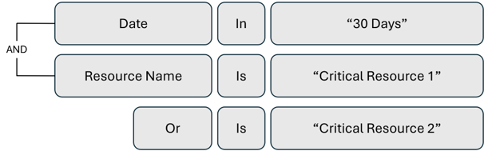
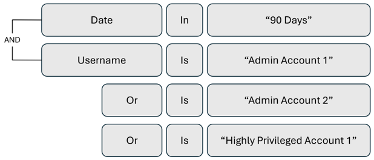
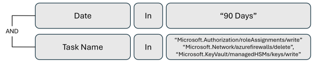
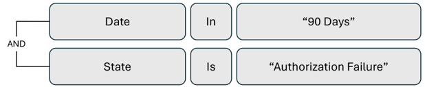
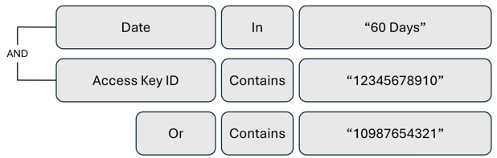
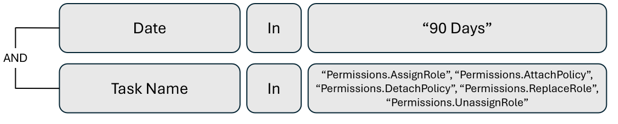

# Phase 3: Configure Microsoft Entra Permissions Management monitoring and alerting

This section of the Microsoft Entra Permissions Management operations reference guide describes the checks and actions you should take to implement an effective alerting and reporting strategy.

## Implement a reporting system for key stakeholders

**Recommended owner: Information Security Architecture**

### Identify key stakeholders who consume reports

Microsoft Entra Permissions Management generates system reports for visibility and insights into cloud environments. To help define who consumes reports in your organization, note the following recommended audiences:

|Report|Recommended audience|
|---|---|
|Access Key Entitlements and Usage|Information Security Operations, target authorization system technical owners|
|User Entitlements and Usage|IAM, Security Assurance and Audit, target authorization system technical owners|
|Group Entitlements and Usage|IAM, Security Assurance and Audit, target authorization system technical owners|
|Identity Permissions|IAM, Security Assurance and Audit, target authorization system technical owners|
|Permissions Analytics|IAM, Security Assurance and Audit, target authorization system technical owners|
|Role/Policy Details|IAM, Security Assurance and Audit, target authorization system technical owners|
|PCI History|Information Security Operations, Cloud Infrastructure, Security Assurance and Audit|
|All Permissions for Identity|IAM, Security Assurance and Audit, Incident Response, target authorization system technical owners|

For detailed descriptions, see [system reports in the Reports Dashboard](~/permissions-management/product-reports.md)

### Schedule reports for key stakeholders

For the key stakeholders who consume reports, set up a regular delivery cadence: hourly, daily, weekly, biweekly, or monthly. [Learn to create, view, and share a custom report](~/permissions-management/report-create-custom-report.md).

### Define custom audit queries to meet organizational requirements

Use custom audit queries to obtain activity log information the product ingests, review access, and conduct compliance reviews. In addition, use them for forensics. For example, during a security incident, use audit queries to find an attacker’s entry point and trace their path. 

Use Permissions Management to create and save custom audit queries that others view in your organization. We recommend you build audit queries that align with the information your organization regularly reviews. Use the following diagrams to get started. 

>[!NOTE]
> The following diagrams are query examples. The exact structure depends on your query. When creating custom audit queries, select the authorization system type and the authorization system(s) and folder(s) you want to query.

**Review access to critical resources**

   

**Review administrator and privileged account activity**

   

**Review high-risk permissions usage**

   

**Review authorization failures**

   

**Review access key usage**

  

**Review Permissions Management remediation activity**

>[!NOTE]
> To query Microsoft Entra Permissions Management logs, for the authorization system type, select **Platform**.

   

For more information on how to create, view, save, and use custom queries:

* [Create a custom query](~/permissions-management/how-to-create-custom-queries.md)
* [Filter and query user activity](~/permissions-management/product-audit-trail.md)
* [Use queries to see how users access information](~/permissions-management/ui-audit-trail.md)

### Configure alerts for Security Operations investigations

You can configure alerts to continuously monitor your environment. Get notifications for overprivileged accounts, anomalous permissions usage, potential threats, and service disruptions.

Determine the alerts that serve your environment and who receives them. This action provides better visibility into your environment, and enables a more proactive approach to managing identities and their access to resources.

To learn about alert types and usage scenarios, see the [Microsoft Entra Permissions Management alerts guide]().

### Develop alert response strategies and playbooks

Develop manual or automated response strategies and playbooks for your configured alerts.

1. Determine who acts on the alert, likely the alert recipient
2. Create and provide clear remediation steps

For example, review the following response strategy and playbook for an Inactive User alert.

**Example manual response strategy**

**Remediation**: When an Inactive User alert triggers, the alert recipient assigns the user read-only status, and applies the **ck_exclude_from_reports** tags to the user.

In the manual response, use Microsoft Entra Permissions Management remediation tools and clarify that recipients of the Inactive User alerts perform remediation. The recipients use Permissions Management to [assign read-only status](~/permissions-management/how-to-revoke-task-readonly-status.md) to the user. This action revokes the user’s permissions and assigns them read only status with the click of a button.

A recipient applies the **ck_exclude_from_reports** tags to the user. This tag removes the user from the Permissions Analytics Report, so it’s not called out as an inactive user.

**Example automated response strategy**

**Remediation**: When an Inactive User alert triggers, the user is deleted by [Microsoft Power Automate](https://powerautomate.microsoft.com), a tool to create flows for cloud, desktop, and business processes.

Use Power Automate for automated responses to Inactive User alerts. For instance, create a flow that deletes inactive users after an email from Permissions Management indicates inactivity.

## Next steps

* [Introduction](permissions-manage-ops-guide-intro.md)
* [Phase 1: Implement the framework to manage at scale](permissions-manage-ops-guide-one.md)
* [Phase 2: Right-size permissions and automate the principle of least privilege](permissions-manage-ops-guide-two.md)
* [Microsoft Entra Permissions Management alerts guide](permissions-manage-ops-guide-alerts.md)
