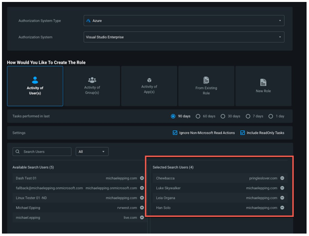
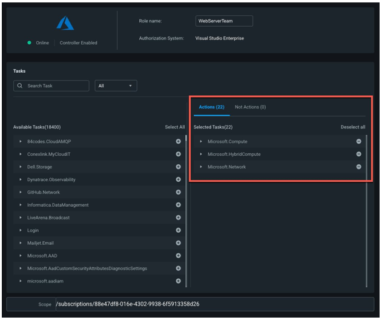

# Phase 2: Right-size permissions and automate the principle of least privilege

This section of the Microsoft Entra Permissions Management operations reference guide describes the checks and actions you should take to remediate key findings in your environment and implement just-in-time (JIT) access with Permissions On-Demand.

## Continuously remediate and right-size permissions

**Recommended owner: Information Security Operations**

### Determine remediation and monitoring responsibilities

To operate the product optimally, Microsoft Entra Permissions Management requires continuous execution of key operational tasks and processes. Set up key tasks and owners to maintain your environment.

|Task|Owner|
|---|---|
|Monitor and maintain PCI based on goals|Information Security Operations|
|Triage and investigate report findings|Information Security Operations|
|Triage and investigate alerts|Information Security Operations|
|Review audit queries|Security Assurance and Audit|
|Track and report on progress|Information Security Operations|

### Reduce PCI to target levels

It’s important to lower PCI scores across authorization systems based on the PCI thresholds and policies your organization defined. Acting on findings helps make your environment more secure. The three findings with the largest impact on lowering your PCI scores are super identities, inactive identities, and overprovisioned identities.

**Super identities**

Super identities have the highest privilege permissions in an authorization system. These include human and non-human identities such as users, Service Principals, and serverless functions. Too many super identities can create excessive risks and increase the blast radius during a breach.

**Best practice**: We recommend five or fewer user and/or group super identities per authorization system. Use a small number of super apps, Service Principals, serverless functions, and service accounts. Provide clear reasoning and justification to use them.

**Remediation guidance**

* For expected super identities, such as infrastructure admins, use the **ck_exclude_from_pci** and **ck_exclude_from_reports** tags.
  * **ck_exclude_from_pci** tag removes the identity from the authorization system’s PCI score calculation
  * **ck_exclude_from_reports** tag removes the identity from the Permissions Analytics Report, so it isn't called out as a super identity
* Right-size other super identities' permissions and use a JIT access model
  * Use Permissions Management remediation tools to right-size
  * Configure Permission On-Demand to achieve the JIT access model

**Inactive identities**

These identities haven't performed actions for 90 days.

**Best practice**: Regularly right-size the permissions of inactive identities, which can be potential attack vectors for bad actors.

**Remediation guidance**

Review inactive identities to determine remediation:

* If the inactive identity is needed, apply the **ck_exclude_from_reports** tag to remove the identity from the Permissions Analytics Report, so it’s not called out as an inactive identity.
* If the inactive identity isn't needed in your environment, we recommend you revoke the identity’s unused permissions or assign it read-only status. Learn to [revoke access to high-risk and unused tasks or assign read-only status](~/permissions-management/how-to-revoke-task-readonly-status.md).

**Overprovisioned identities**

Overprovisioned identities, or overpermissioned identities, haven't used many of their permissions for 90 days.

**Best practice**: Regularly right-size permissions of these identities to reduce the risk of permissions misuse, either accidental or malicious. This action decreases the potential blast radius during a security incident.

**Remediation guidance**

Remediate overprovisioned identities with least privileged built-in roles or with right-sized custom roles.

>[!NOTE]
> Be aware of custom role limits. We recommend the least privileged built-in role approach if your organization is close to reaching these limits.

For least privileged built-in roles, we recommend you use Microsoft Entra Permissions Management to determine what permissions the identity uses and then assign the built-in role that aligns with this usage.

For right-sized custom roles, we recommend you remediate overprovisioned identities by teams or groups:

1. Identify a team or group that needs right-sized permissions. For example, the administrators or developers of a web service.
2. Create a new right-sized role based on what the team currently uses.
3. Go to **Remediation** > **Roles/Policies** > **Create Role/Policy**.
4. Select the users from a team or group.

   

5. Click **Next** and under **Selected Tasks**, validate the permissions in the new role. These will auto-populate based on the historical activity of the users/groups you selected.

   

6. Add additional team permissions, as needed.
7. Create the new role/policy.
8. Revoke current team permissions.
9. Assign team members the right-sized role/policy.

>[!NOTE]
> We recommend you start by right-sizing non-human identities, like Service Principals and machine accounts. The activity of non-human identities is less likely to vary on a day-to-day basis, making the risk low for potential service disruptions caused by right-sizing.

For more on the remediation tools available within Microsoft Entra Permissions Management:

* [Create a role/policy](~/permissions-management/how-to-create-role-policy.md)
* [Clone a role/policy](~/permissions-management/how-to-clone-role-policy.md)
* [Modify a role/policy](~/permissions-management/how-to-modify-role-policy.md)
* [Delete a role/policy](~/permissions-management/how-to-delete-role-policy.md)
* [Attach and detach policies for AWS identities](~/permissions-management/how-to-attach-detach-permissions.md)
* [Add and remove roles and tasks for Microsoft Azure and GCP identities](~/permissions-management/how-to-add-remove-role-task.md)
* [Revoke access to high-risk and unused tasks or assign read-only status for Azure and GCP identities](~/permissions-management/how-to-revoke-task-readonly-status.md)

### Track progress and measure success

To meet organizational goals, enable processes to track and report on progress. Some built-in Microsoft Entra Permissions Management tools are:

* **PCI History Report**: Receive a regular, detailed overview of how PCI scores in authorization systems and folders change over time. Measure how well your organization is meeting and maintaining PCI goals. We recommend you schedule a recurring PCI History Report for key stakeholders. Ensure the cadence matches internal progress reviews.
* **Permissions Analytics Report**: Measure remediation progress and schedule the report to be sent to key stakeholders and/or export a PDF version of the report for your authorization systems on a regular basis. This practice enables your organization to measure remediation progress over time. For example, with this approach you can see how many inactive identities are cleaned up each week and what impact that had on your PCI scores.
* **Permissions Management Dashboard**: Get an overview of your authorization systems and their PCI scores. Use the **Highest PCI Change List** section to sort authorization systems by PCI score to prioritize remediation activity. See also **PCI Change** for the past seven days to see which authorization systems had the most progress and which might need more review. Select authorization systems in the **PCI Heat Map** section to access the **PCI Trend Chart** for that authorization system. Note how PCI changes over a 90-day period.

## Operationalize Permissions On-Demand

**Recommended owner: Information Security Architecture**

Permissions On-Demand completes the JIT and just-enough-access picture by enabling organizations to grant users time-bound permissions, when needed.

To operationalize Permissions On-Demand, create and maintain a well-defined process to implement Permissions On-Demand in your environment. The following table outlines tasks and recommended owners.

|Task|Recommended owner|
|---|---|
|Determine which authorization systems to use with Permissions On-Demand|Information Security Architecture|
|Define administration processes to onboard new authorization systems to the Permissions On-Demand model. Select and train Approvers and Requestors and then delegate permissions. See the following section for more details.|Information Security Architecture|
|Update standard operational model procedures for initial user permissions assignments, and a request process for ad hoc permissions|Information Security Architecture|

## Determine Approvers

**Approvers** review Permissions On-Demand requests and have authority to approve or deny requests. Select **Approvers** for the authorization systems you want to use with Permissions On-Demand. We recommend at least two **Approvers** for each authorization system.

## Create Microsoft Entra security groups for Approvers

To delegate permissions, your IAM team creates Microsoft Entra security groups that map to your **Approvers**. Ensure **Approvers** with shared ownership and responsibilities are in the same security group.

We recommend you use [PIM for Groups](~/id-governance/privileged-identity-management/concept-pim-for-groups.md). This provides JIT access to Approver permissions to approve or deny Permissions On-Demand requests.

To create Microsoft Entra ID security groups, see [manage groups and group membership](/entra/fundamentals/how-to-manage-groups).

### Assign permissions to Approvers

After Microsoft Entra security groups are created, a Permissions Management Administrator grants security groups their Approver permissions in Permissions Management. Ensure security groups are granted Approver permissions for the authorization systems they are responsible for. [Learn more about Microsoft Entra Permissions Management roles and permission levels](~/permissions-management/product-roles-permissions.md).

### Determine and create a Requestor Administrator security group

Designate at least two Requestor Administrators who create Permissions On-Demand requests on behalf of identities in your environment. For example, for machine identities. Create a Microsoft Entra security group for these Requestor Administrators.

We recommend you use [PIM for Groups](~/id-governance/privileged-identity-management/concept-pim-for-groups.md). This provides JIT access to the Requestor permissions needed to make Permissions On-Demand requests on behalf of other users.

To create Microsoft Entra ID security groups, see [manage groups and group membership](/entra/fundamentals/how-to-manage-groups).

### Allow users to make Permissions On-Demand requests

A Permissions Management Administrator adds Requestor identities to the Requester Administrator security group, for each authorization system. Adding a Requestor identity enables it to make Permissions On-Demand requests for any authorization system, for which it has permissions. Requestor Administrator security group members can request permissions on behalf of the identities for the specified authorization system. [Learn more about Microsoft Entra Permissions Management roles and permission levels](~/permissions-management/product-roles-permissions.md).

### Determine organizational policies for Permissions On-Demand

You can configure Permissions On-Demand settings to align with organizational needs. We recommend you establish policies for:

* **Available roles and policies for users to request**: Use role and policy filters to specify what users can request. Prevent unqualified users from requesting high-risk, highly privileged roles such as Subscription Owner.
* **Request duration limits**: Specify the maximum allowable duration for permissions acquired via Permissions On-Demand. Agree on a duration limit that aligns with how users request and get access to permissions.
* **One-Time Passcode (OTP) policy**: You can require email OTPs for Requestors to create requests. In addition, you can require email OTPs for **Approvers** to approve or reject requests. Use these configurations for one or both scenarios.
* **Auto-approvals for AWS**: As an option for Permissions On-Demand for AWS, you can configure specific policy requests to be auto-approved. For example, you can add common, low-risk policies to your auto-approval list and help save time for Requestors and **Approvers**. 

Learn to [make setting selections for requests and auto-approvals](~/permissions-management/ui-remediation.md).

### Create custom role/policy templates for the organization

In Microsoft Entra Permissions Management, role/policy templates are permissions sets you can create for Permissions On-Demand. Create templates that map to common actions performed in your environment. Users then have templates to request permissions sets, rather than continually selecting individual permissions.

For example, if virtual machine (VM) creation is a common task, make a **Create a VM** template with required permissions. Users don’t have to know, or manually select, all the required permissions for the task.

To learn to create role/policy templates, see [view roles/policies and requests for permission in the Remediation dashboard](~/permissions-management/ui-remediation.md).

## Next steps
* [Introduction](permissions-manage-ops-guide-intro.md)
* [Phase 1: Implement the framework to manage at scale](permissions-manage-ops-guide-one.md)
* [Phase 3: Configure Microsoft Entra Permissions Management monitoring and alerting](permissions-manage-ops-guide-three.md)
* [Microsoft Entra Permissions Management alerts guide](permissions-manage-ops-guide-alerts.md)
