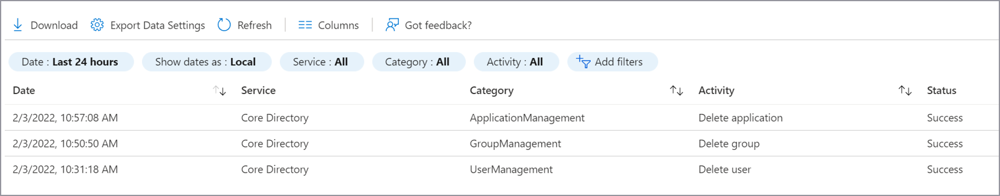
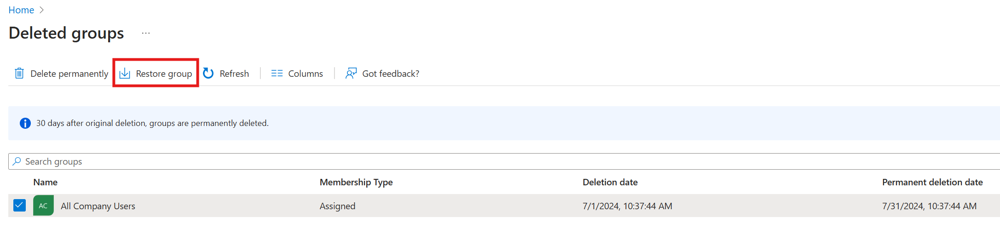

# Recover from deletions

Managing deletions in Microsoft Entra ID is a critical aspect of maintaining the integrity and availability of your organization's identity infrastructure. This article provides a comprehensive guide to understand the differences between soft and hard deletions, monitor for deletions, and recover or recreate objects in your Microsoft Entra tenant. Whether you're dealing with accidental deletions or preparing recovery strategies, this guide equips you with the knowledge and tools to minimize disruption and ensure continuity. For foundational insights, start with [Recoverability best practices](recoverability-overview.md).

## Monitor for deletions

The [Microsoft Entra audit log](~/identity/monitoring-health/concept-audit-logs.md) contains information on all delete operations performed in your tenant. Export these logs to a security information and event management tool, such as [Microsoft Sentinel](/azure/sentinel/overview).

Use Microsoft Graph to audit changes, and build a custom solution to monitor differences over time. For more information on how to find deleted items by using Microsoft Graph, see [List deleted items - Microsoft Graph v1.0](/graph/api/directory-deleteditems-list?tabs=http).

### Audit log

The Audit log always records a "Delete \<object\>" event when an object in the tenant is removed from an active state by either a soft or hard deletion.

A delete event for applications, users, Microsoft 365 Groups, and cloud security groups is a soft delete. For any other object type, it's a hard delete. Track the occurrence of hard-delete events by comparing "Delete \<object\>" events with the type of object that was deleted. Note the events that don't support soft delete. Also note "Hard Delete \<object\>" events.

| Object type | Activity in log| Result |
| - | - | - |
| Application| Delete application| Soft deleted |
| Application| Hard delete application| Hard deleted |
| User| Delete user| Soft deleted |
| User| Hard delete user| Hard deleted |
| Microsoft 365 Group| Delete group| Soft deleted |
| Microsoft 365 Group| Hard delete group| Hard deleted |
| Cloud security group| Delete group| Soft deleted |
| Cloud security group| Hard delete group| Hard deleted |
| All other objects| Delete "objectType"| Hard deleted |

> [!NOTE]
> The audit log doesn't distinguish the group type of a deleted group. Microsoft 365 Groups and cloud security groups are soft deleted. If you see a Delete group entry, it might be the soft delete of a Microsoft 365 Group or cloud security group, or the hard delete of another type of group.
>
>*It's important that your documentation of your known good state includes the group type for each group in your organization*. To learn more about documenting your known good state, see [Recoverability best practices](recoverability-overview.md).

### Monitor support tickets

A sudden increase in support tickets about access to a specific object might indicate that a deletion happened. Because some objects have dependencies, deleting a group used to access an application, an application itself, or a Conditional Access policy that targets an application can cause broad, sudden impact. If you see a trend like this, check to ensure that none of the objects required for access were deleted.

## Soft deletions

When objects such as users, Microsoft 365 Groups, cloud security groups, or application registrations are soft deleted, they enter a suspended state in which they aren't available for use by other services. In this state, items keep their properties and can be restored for 30 days. After 30 days, objects in the soft-deleted state are permanently deleted or hard deleted.

> [!NOTE]
> Objects can't be restored from a hard-deleted state. Re-create and reconfigure them.

### When soft deletes happen

Understanding why object deletions happen in your environment helps you prepare for them. This section outlines frequent scenarios for soft deletion by object class. You might see scenarios that are unique to your organization, so a discovery process is key to preparation.

### Users

Users enter a soft-deleted state when the user object is deleted using the Microsoft Entra admin center, Microsoft Graph, or PowerShell.

Common scenarios for deleting users include:

* An administrator deletes a user in the Microsoft Entra admin center in response to a request or as part of routine user maintenance.
* An automation script in Microsoft Graph or PowerShell triggers the deletion. For example, you might have a script that removes users who don't sign in for a specified time.
* A user moves out of scope for synchronization with Microsoft Entra Connect.
* A user retires, is removed from an HR system, and is deprovisioned via an automated workflow.

### Groups

The most frequent scenarios for deleting groups are:

* An administrator intentionally deletes the group, for example, in response to a support request.
* An automation script in Microsoft Graph or PowerShell triggers the deletion. For example, you might have a script that deletes groups that aren't accessed or attested to by the group owner for a specified time.
* Unintentional deletion of a group owned by non-admins.

### Application objects and service principals

The most frequent scenarios for deleting applications are:

* An administrator intentionally deletes the application, for example, in response to a support request.
* An automation script in Microsoft Graph or PowerShell triggers the deletion. For example, you might want a process for deleting abandoned applications that are no longer used or managed. In general, create an offboarding process for applications rather than scripting to avoid unintentional deletions.

When you delete an application, the application registration by default enters the soft-deleted state. To understand the relationship between application registrations and service principals, see [Apps and service principals in Microsoft Entra ID - Microsoft identity platform](~/identity-platform/app-objects-and-service-principals.md).

### Administrative units

The most common scenario for deletions is when administrative units are accidentally deleted but still needed. 

## Recover from soft deletion

Not all object classes manage soft-delete capabilities in the Microsoft Entra admin center. Some are only listed, viewed, hard deleted, or restored using the deletedItems Microsoft Graph API.

### Properties maintained with soft delete

|Object type|Important properties maintained|
|---|---|
|Users (including external users)|All properties maintained, including ObjectID, group memberships, roles, licenses, and application assignments|
|Microsoft 365 Groups|All properties maintained, including ObjectID, group memberships, licenses, and application assignments|
|Cloud security groups|All properties maintained, including ObjectID, group memberships, and application assignments|
|Application registration | All properties maintained. See more information after this table.|
|Service principal|All properties maintained|
|Administrative unit|All properties maintained|
|Conditional Access policies|All properties maintained|
|Named locations|All properties maintained|

### Users

You can see soft-deleted users in the Azure portal on the **Users | Deleted users** page.

For more information on how to restore users, see the following documentation:

* To restore from the Azure portal, see [Restore or permanently remove recently deleted user](~/fundamentals/users-restore.md).
* To restore by using Microsoft Graph, see [Restore deleted item – Microsoft Graph v1.0](/graph/api/directory-deleteditems-restore?tabs=http).

### Groups

You can see soft-deleted Microsoft 365 Groups and cloud security groups in the Azure portal on the **Groups | Deleted groups** page.

> [!IMPORTANT]
> Soft delete for security groups isn't supported in the following scenarios:
> - EDU tenants using OneDrive for Business (OBD) storage
> - Audience targeting with classic web parts (all tenancies)

For more information on how to restore soft-deleted Microsoft 365 Groups and cloud security groups, see the following documentation:

* To restore from the Azure portal, see [Restore a deleted Microsoft 365 Group](~/identity/users/groups-restore-deleted.md).
* To restore by using Microsoft Graph, see [Restore deleted item – Microsoft Graph v1.0](/graph/api/directory-deleteditems-restore?tabs=http).

### Applications and service principals

Applications include two objects: the application registration and the service principal. For more information on the differences between the registration and the service principal, see [Apps and service principals in Microsoft Entra ID](~/identity-platform/app-objects-and-service-principals.md).

To restore an application from the Microsoft Entra admin center, browse to **Entra ID** > **App registrations** > **Deleted applications**. Select the application registration to restore, and then select **Restore app registration**.

Service principals can be listed, viewed, hard deleted, or restored using the deletedItems Microsoft Graph API. To restore applications using Microsoft Graph, see [Restore deleted item - Microsoft Graph v1.0.](/graph/api/directory-deleteditems-restore?tabs=http).

### Administrative units

Administrative units can be listed, viewed, or restored via the deletedItems Microsoft Graph API. To restore administrative units using Microsoft Graph, see [Restore deleted item - Microsoft Graph v1.0.](/graph/api/directory-deleteditems-restore?tabs=http). When an administrative unit is deleted, it remains in a soft-deleted state and can be restored for 30 days but can't be hard deleted during that time. Soft deleted administrative units are hard deleted automatically after 30 days.

### Conditional Access policies

You should review and validate the Conditional Access policy configuration after restoring to ensure it behaves as expected.

To restore a Conditional access policy:

1. Sign in to the [Microsoft Entra admin center](https://entra.microsoft.com) as at least a [Conditional Access Administrator](~/identity/role-based-access-control/permissions-reference.md#conditional-access-administrator).
1. Browse to **Entra ID** > **Conditional Access** > **Deleted Policies (Preview**).
1. Select the ellipsis (...) on the far right of the policy to restore.
1. Select **Restore**.
1. In the **Restore Conditional Access policy?** dialog box, you can choose to restore the policy in [Report-only mode](../identity/conditional-access/concept-conditional-access-report-only.md) or leave it in the state it was when deleted, which might be **On**. Make your selection and select **Restore**.

> [!WARNING]
> Restoring a policy to its previous state might have unintended consequences. Microsoft recommends administrators restore their policies in Report-only mode first, then take time to review and enable.

### Named locations

Named locations can't be deleted when marked as trusted, and when recovered from soft-delete, they aren't marked as trusted. Any recovered named locations should be reviewed after restoring before marking as trusted again.

To restore a named location:

1. Sign in to the [Microsoft Entra admin center](https://entra.microsoft.com) as at least a [Conditional Access Administrator](~/identity/role-based-access-control/permissions-reference.md#conditional-access-administrator).
1. Browse to **Entra ID** > **Conditional Access** > **Named locations** > **Deleted Named Locations (Preview)**.
1. Select the ellipsis (...) on the far right of the location you want to restore.
1. Select **Restore**.
1. In the **Restore selected Named location?** dialog box, select **Restore**.

## Hard deletions

A hard deletion permanently removes an object from your Microsoft Entra tenant. Objects that don't support soft delete are removed in this way. Soft-deleted objects are also hard deleted after 30 days. Only these object types support soft delete:

* Users
* Microsoft 365 Groups
* Cloud security groups
* Application registration
* Service principal
* Administrative unit
* Conditional Access policies
* Named locations

> [!IMPORTANT]
> All other item types are hard deleted and can't be restored. They must be re-created. **Your administrators and Microsoft can't restore hard-deleted items**. Prepare by creating processes and documentation to minimize disruption.
>
> For information on how to prepare for and document current states, see [Recoverability best practices](recoverability-overview.md).

### When hard deletes usually occur

Hard deletes can occur in these circumstances:

Moving from soft to hard delete:

* A soft-deleted object isn't restored within 30 days.
* An administrator intentionally deletes an object in the soft delete state.

>[!Note]
> Application objects are not hard deleted automatically even after 30 days when ‘signInAudience’ value of the apps are set to one of ("AzureADMultipleOrgs", "AzureADandPersonalMicrosoftAccount", or "PersonalMicrosoftAccount"). In this case, application objects should be manually hard deleted.

Directly hard deleted:

* The object type that was deleted doesn't support soft delete.
* An administrator chooses to permanently delete an item by using the portal, which typically occurs in response to a request.
* An automation script triggers the deletion of the object using Microsoft Graph or PowerShell. Automation scripts are commonly used to clean up stale objects. A robust off-boarding process helps avoid mistakes that can result in mass deletion of critical objects.

## Recover from hard deletion

Hard-deleted items need to be recreated and reconfigured. Avoiding unwanted hard deletions is best.

### Review soft-deleted objects

Make sure you have a process to regularly review items in the soft-delete state and restore them if needed. To prepare:

* Regularly [list deleted items](/graph/api/directory-deleteditems-list?tabs=http).
* Define specific criteria for what to restore.
* Assign specific roles or users to evaluate and restore items as needed.
* Create and test a continuity management plan. Learn more in [Considerations for your Enterprise Business Continuity Management Plan](/compliance/assurance/assurance-developing-your-ebcm-plan).

## Next steps

Learn how to avoid unwanted deletions in, [Recoverability best practices](recoverability-overview.md).
