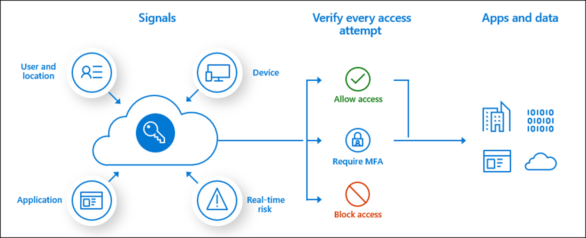
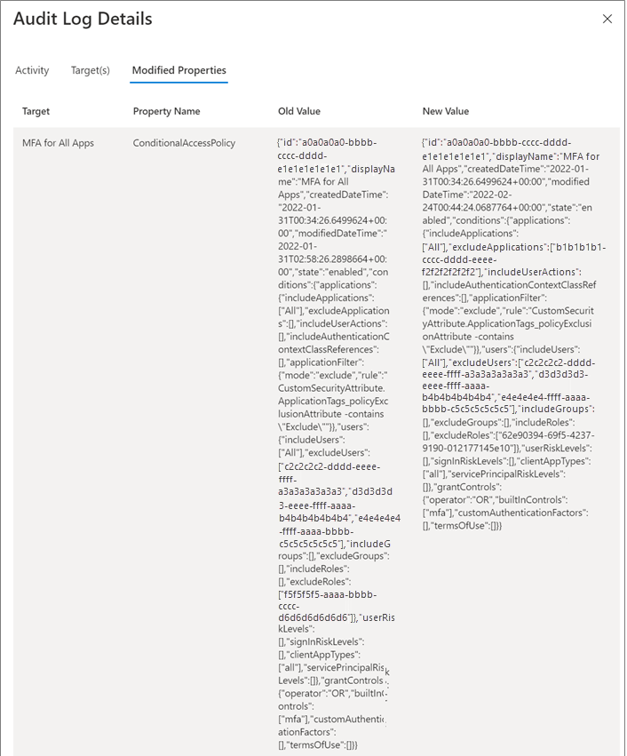

# Recover from misconfiguration

Configuration settings in Microsoft Entra ID can affect any resource in the Microsoft Entra tenant through targeted or tenant-wide management actions.

## What is configuration?

Configurations are any changes in Microsoft Entra ID that alter the behavior or capabilities of a Microsoft Entra service or feature. For example, when you configure a Conditional Access policy, you alter who can access the targeted applications and under what circumstances.

You need to understand the configuration items that are important to your organization. The following configurations have a high impact on your security posture.

### Tenant-wide configurations

* **External identities**: Administrators for the tenant identify and control the external identities that can be provisioned in the tenant. They determine:

  * Whether to allow external identities in the tenant.
  * From which domains external identities can be added.
  * Whether users can invite users from other tenants.

* **Named locations**: Administrators can create named locations, which can then be used to:

  * Block sign-ins from specific locations.
  * Trigger Conditional Access policies like multifactor authentication.

* **Allowed authentication methods**: Administrators set the authentication methods allowed for the tenant.
* **Self-service options**: Administrators set self-service options like self-service password reset and create Office 365 groups at the tenant level.

The implementation of some tenant-wide configurations can be scoped, provided they aren't overridden by global policies. For example:

* If the tenant is configured to allow external identities, a resource administrator can still exclude those identities from accessing a resource.
* If the tenant is configured to allow personal device registration, a resource administrator can exclude those devices from accessing specific resources.
* If named locations are configured, a resource administrator can configure policies that either allow or exclude access from those locations.

### Conditional Access configurations

Conditional Access policies are access control configurations that bring together signals to make decisions and enforce organizational policies.

To learn more about Conditional Access policies, see [What is Conditional Access in Microsoft Entra ID?](~/identity/conditional-access/overview.md).

> [!NOTE]
> While configuration alters the behavior or capabilities of an object or policy, not all changes to an object are configuration. You can change the data or attributes associated with an item, like changing a user's address, without affecting the capabilities of that user object.

## What is misconfiguration?

Misconfiguration is a configuration of a resource or policy that diverges from your organizational policies or plans and causes unintended or unwanted consequences.

A misconfiguration of tenant-wide settings or Conditional Access policies can seriously affect your security and the public image of your organization by:

* Changing how administrators, tenant users, and external users interact with resources in your tenant:

  * Unnecessarily limiting access to resources.
  * Loosening access controls on sensitive resources.

* Changing the ability of your users to interact with other tenants and external users to interact with your tenant.
* Causing denial of service, for example, by not allowing customers to access their accounts.
* Breaking dependencies among data, systems, and applications resulting in business process failures.

### When does misconfiguration occur?

Misconfiguration is most likely to occur when:

* A mistake is made during ad-hoc changes.
* A mistake is made as a result of troubleshooting exercises.
* An action was carried out with malicious intent by a bad actor.

## Prevent misconfiguration

It's critical that alterations to the intended configuration of a Microsoft Entra tenant are subject to robust change management processes, including:

* Documenting the change, including prior state and intended post-change state.
* Using Privileged Identity Management (PIM) to ensure that administrators with intent to change must deliberately escalate their privileges to do so. To learn more about PIM, see [What is Privileged Identity Management?](~/id-governance/privileged-identity-management/pim-configure.md).
* Using a strong approval workflow for changes, for example, requiring [approval of PIM escalation of privileges](~/id-governance/privileged-identity-management/pim-approval-workflow.md).

## Monitor for configuration changes

While you want to prevent misconfiguration, you can't set the bar for changes so high that it affects the ability of administrators to perform their work efficiently.

Closely monitor for configuration changes by watching for the following operations in your [Microsoft Entra audit log](~/identity/monitoring-health/concept-audit-logs.md):

* Add
* Create
* Update
* Set
* Delete

The following table includes informative entries in the Audit log you can look for.

### Conditional Access and authentication method configuration changes

Conditional Access policies are created on the **Conditional Access** page in the Azure portal. Changes to policies are made on the **Conditional Access policy details** page for the policy.

| Service filter| Activities| Potential impacts |
| - | - | - |
| Conditional Access| Add, update, or delete Conditional Access policy| User access is granted or blocked when it shouldn’t be. |
| Conditional Access| Add, update, or delete named location| Network locations consumed by the Conditional Access policy aren't configured as intended, which creates gaps in Conditional Access policy conditions. |
| Authentication method| Update authentication methods policy| Users can use weaker authentication methods or are blocked from a method they should use. |

### User and password reset configuration changes

User settings changes are made on the Azure portal **User settings** page. Password reset changes are made on the **Password reset** page. Changes made on these pages are captured in the Audit log as detailed in the following table.

| Service filter| Activities| Potential impacts |
| - | - | - |
| Core directory| Update company settings| Users might or might not be able to register applications, contrary to intent. |
| Core directory| Set company information| Users might or might not be able to access the Microsoft Entra administration portal, contrary to intent.  Sign-in pages don't represent the company brand, with potential damage to reputation. |
| Core directory| **Activity**: Updated service principal **Target**: 0365 LinkedIn connection| Users might or might not be able to connect their Microsoft Entra account with LinkedIn, contrary to intent. |
| Self-service group management| Update MyApps feature value| Users might or might not be able to use user features, contrary to intent. |
| Self-service group management| Update ConvergedUXV2 feature value| Users might or might not be able to use user features, contrary to intent. |
| Self-service group management| Update MyStaff feature value| Users might or might not be able to use user features, contrary to intent. |
| Core directory| **Activity**: Update service principal **Target**: Microsoft password reset service| Users are able or unable to reset their password, contrary to intent.  Users are required or not required to register for self-service password reset, contrary to intent.   Users can reset their password by using methods that are unapproved, for example, by using security questions. |

### External identities configuration changes

You can make changes to these settings on the **External identities** or **External collaboration** settings pages in the Azure portal.

| Service filter| Activities| Potential impacts |
| - | - | - |
| Core directory| Add, update, or delete a partner to cross-tenant access setting| Users have outbound access to tenants that should be blocked. Users from external tenants who should be blocked have inbound access. |
| B2C| Create or delete identity provider| Identity providers for users who should be able to collaborate are missing, blocking access for those users. |
| Core directory| Set directory feature on tenant| External users have greater or less visibility of directory objects than intended. External users might or might not invite other external users to your tenant, contrary to intent. |
| Core directory| Set federation settings on domain| External user invitations might or might not be sent to users in other tenants, contrary to intent. |
| AuthorizationPolicy| Update authorization policy| External user invitations might or might not be sent to users in other tenants, contrary to intent. |
| Core directory| Update policy| External user invitations might or might not be sent to users in other tenants, contrary to intent. |

### Custom role and mobility definition configuration changes

| Service filter| Activities/portal| Potential impacts |
| - |- | -|
| Core directory| Add role definition| Custom role scope is narrower or broader than intended. |
| PIM| Update role setting| Custom role scope is narrower or broader than intended. |
| Core directory| Update role definition| Custom role scope is narrower or broader than intended. |
| Core directory| Delete role definition| Custom roles are missing. |
| Core directory| Add delegated permission grant| Mobile device management or mobile application management configuration is missing or misconfigured, which leads to the failure of device or application management. |

### Audit log detail view

Selecting some audit entries in the Audit log will provide you with details on the old and new configuration values. For example, for Conditional Access policy configuration changes, you can see the information in the following screenshot.

## Use workbooks to track changes

Azure Monitor workbooks can help you monitor configuration changes.

The [Sensitive operations report workbook](~/identity/monitoring-health/workbook-sensitive-operations-report.md) can help identify suspicious application and service principal activity that might indicate a compromise, including:

* Modified application or service principal credentials or authentication methods.
* New permissions granted to service principals.
* Directory role and group membership updates for service principals.
* Modified federation settings.

The [Cross-tenant access activity workbook](~/identity/monitoring-health/workbook-cross-tenant-access-activity.md) can help you monitor which applications in external tenants your users are accessing and which applications your tenant external users are accessing. Use this workbook to look for anomalous changes in either inbound or outbound application access across tenants.

## Next steps

- For foundational information on recoverability, see [Recoverability best practices](recoverability-overview.md).
- For information on recovering from deletions, see [Recover from deletions](recover-from-deletions.md).
