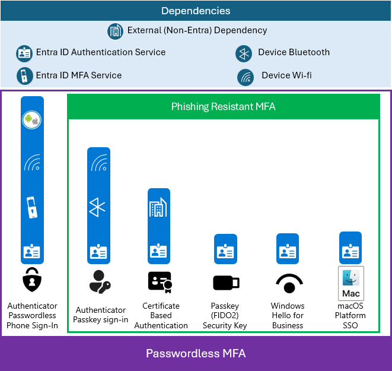
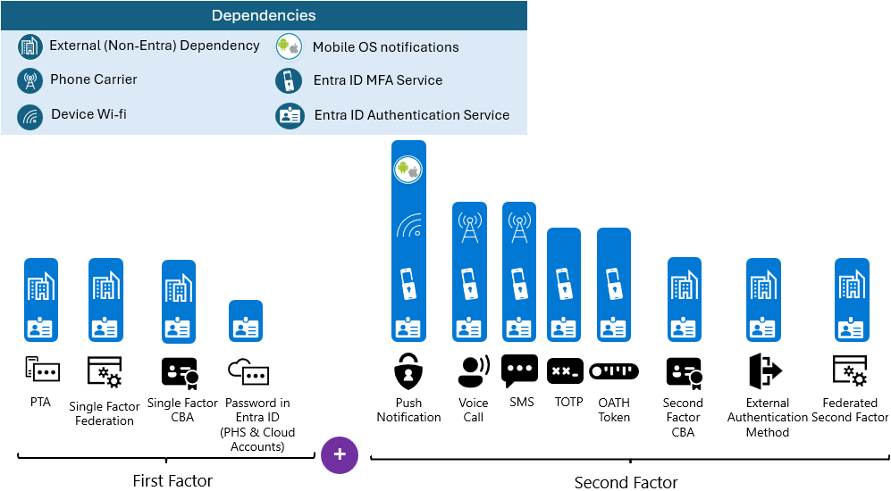

# Build resilience with credential management

When a credential is presented to Microsoft Entra ID in a token request, there are multiple dependencies that must be available for validation. The first authentication factor relies on Microsoft Entra authentication and, in some cases, on external (non-Entra ID) dependency, such as on-premises infrastructure. For more information on hybrid authentication architectures, see [Build resilience in your hybrid infrastructure](resilience-in-hybrid.md). 

The most resilient credential strategy is to use passwordless authentication. [Windows Hello for Business](~/identity/authentication/concept-authentication-passwordless#windows-hello-for-business.md) and [Passkey (FIDO 2.0)](~/https://learn.microsoft.com/en-us/entra/identity/authentication/concept-authentication-passwordless#passkeys-fido2.md) security keys have fewer dependencies than other MFA methods. For macOS users customers can enable [Platform Credential for macOS](~/identity/authentication/concept-authentication-passwordless#platform-credential-for-macos.md) When you implement these methods users are able to perform strong passwordless and **phishing-resistant** Multi-Factor authentication (MFA). For a video series deep dive on deploying these authentication methods, see [Phishing-resistant authentication in Microsoft Entra ID](~/identity/authentication/phishing-resistant-authentication-videos.md)

If you implement a second factor, the dependencies for the second factor are added to the dependencies for the first. For example, if your first factor is via [Pass Through Authentication (PTA)](~/identity/hybrid/connect/how-to-connect-pta.md) and your second factor is [SMS](~/identity/authentication/howto-authentication-sms-signin.md), your dependencies are as follows.

* Microsoft Entra authentication services
* Microsoft Entra multifactor authentication service
* On-premises infrastructure
* Phone carrier
* The user's device (not pictured)

 
Your credential strategy should consider the dependencies of each authentication type and provision methods that avoid a single point of failure. 

Because authentication methods have different dependencies, it's a good idea to enable users to register for as many second factor options as possible. Be sure to include second factors with different dependencies, if possible. For example, Voice call and SMS as second factors share the same dependencies, so having them as the only options doesn't mitigate risk.

For second factors, the Microsoft Authenticator app or other authenticator apps using time-based one time passcode (TOTP) or OAuth hardware tokens have the fewest dependencies and are, therefore, more resilient.

## Additional Detail on External (Non-Entra) Dependencies
|Authentication Method|External (Non-Entra) Dependency|More Information|
|---------------------|-------------------------------|---|
|Certificate Based Authentication (CBA)|In most cases (depending on configuration) CBA will require a revocation check. This adds an external dependency on the CRL distribution point (CDP) |[Understanding the certificate revocation process](~/identity/authentication/concept-certificate-based-authentication-technical-deep-dive#understanding-the-certificate-revocation-process.md)
|Pass Through Authentication (PTA)|PTA uses on-premise agents to process the password authentication.|[How does Microsoft Entra pass-through authentication work?](~/entra/identity/hybrid/connect/how-to-connect-pta-how-it-works#how-does-microsoft-entra-pass-through-authentication-work.md)
|Federation| Federation server(s) must be online and available to process the authentication attempt|[High availability cross-geographic AD FS deployment in Azure with Azure Traffic Manager](..\..\windows-server/identity/ad-fs/deployment/active-directory-adfs-in-azure-with-azure-traffic-manager.md)
|External Authentication Methods (EAM)| EAM provides a path for customers to use external MFA providers.|[Manage an external authentication method in Microsoft Entra ID (Preview)](~/identity/authentication/how-to-authentication-external-method-manage.md)

## How do multiple credentials help resilience?

Provisioning multiple credential types gives users options that accommodate their preferences and environmental constraints. As a result, interactive authentication where users are prompted for multifactor authentication will be more resilient to specific dependencies being unavailable at the time of the request. You can [optimize reauthentication prompts for multifactor authentication](~/identity/authentication/concepts-azure-multi-factor-authentication-prompts-session-lifetime.md).

In addition to individual user resiliency described above, enterprises should plan contingencies for large-scale disruptions such as operational errors that introduce a misconfiguration, a natural disaster, or an enterprise-wide resource outage to an on-premises federation service (especially when used for multifactor authentication). 

## How do I implement resilient credentials?

* Deploy [Passwordless credentials](~/identity/authentication/howto-authentication-passwordless-deployment.md). Prefer phishing-resistant methods such as Windows Hello for Business, Passkeys (both Authenticator Passkey Sign-in and FIDO2 security keys) and certificate based authentication (CBA) to increase security while reducing dependencies.
* Deploy the [Microsoft Authenticator App](https://support.microsoft.com/account-billing/how-to-use-the-microsoft-authenticator-app-9783c865-0308-42fb-a519-8cf666fe0acc) as a second factor.
* [Migrate from federation to cloud authentication](~/identity/hybrid/connect/migrate-from-federation-to-cloud-authentication.md) to remove reliance on federated identity provider.
* Turn on [password hash synchronization](~/identity/hybrid/connect/whatis-phs.md) for hybrid accounts that are synchronized from Windows Server Active Directory. This option can be enabled alongside federation services such as Active Directory Federation Services (AD FS) and provides a fallback in case the federation service fails.
* [Analyze usage of multifactor authentication methods](~/identity/authentication/howto-authentication-methods-activity.md) to improve user experience.
* [Implement a resilient access control strategy](~/identity/authentication/concept-resilient-controls.md)

## Next steps
### Resilience resources for administrators and architects
 
* [Build resilience with device states](resilience-with-device-states.md)
* [Build resilience by using Continuous Access Evaluation (CAE)](resilience-with-continuous-access-evaluation.md)
* [Build resilience in external user authentication](resilience-b2b-authentication.md)
* [Build resilience in your hybrid authentication](resilience-in-hybrid.md)
* [Build resilience in application access with Application Proxy](resilience-on-premises-access.md)

### Resilience resources for developers

* [Build IAM resilience in your applications](resilience-app-development-overview.md)
* [Build resilience in your CIAM systems](resilience-b2c.md)
