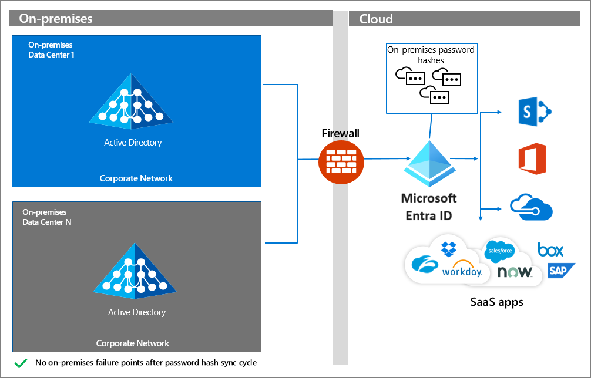
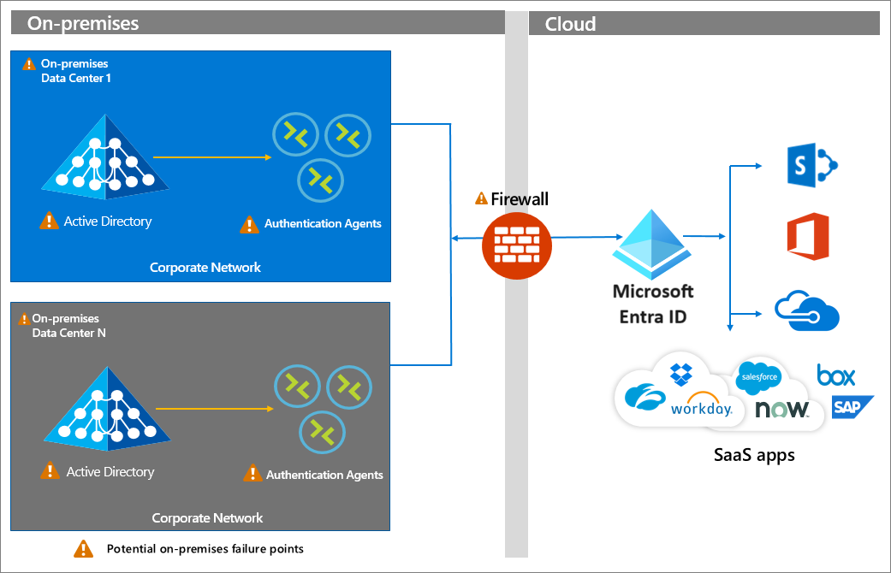
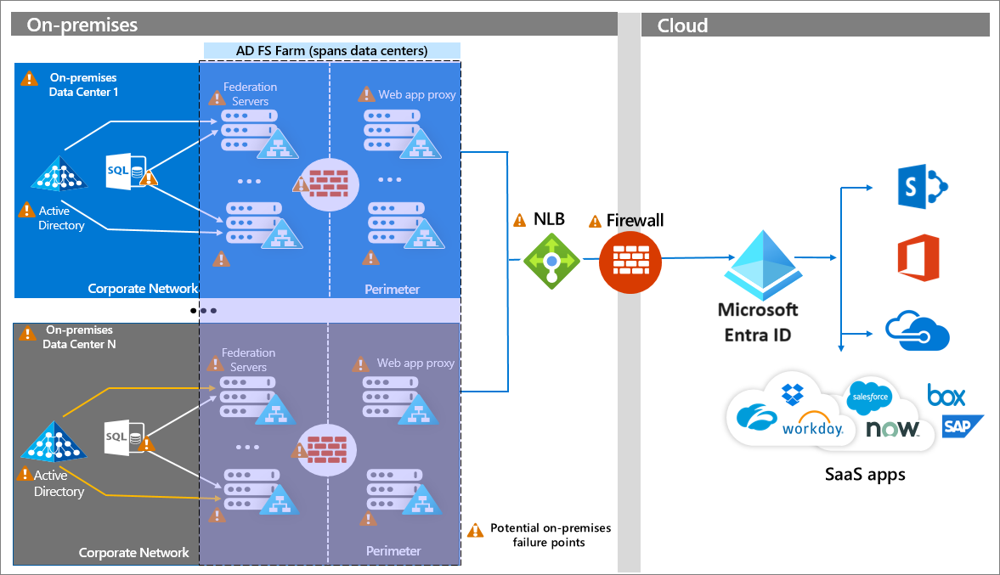

# Build resilience in your hybrid architecture

A hybrid infrastructure includes both cloud and on premises components. Hybrid authentication allows users to access cloud-based resources with their identities originating on premises, or to access on-premises resources with cloud-based identities.

* Cloud components include Microsoft Entra ID, Azure resources and services, your organization's cloud-based apps, and SaaS applications.
* on premises components include on premises applications, resources like SQL databases, and an identity provider like Windows Server Active Directory. 

> [!IMPORTANT]
> As you plan for resilience in your hybrid infrastructure, it's key to minimize dependencies and single points of failure. On premises and cloud connectivity disruption can occur for many reasons, including hardware failure, power outages, natural disasters, and malware attacks.

Microsoft offers multiple mechanisms for hybrid authentication for applications connected to Microsoft Entra. If your organization has been relying upon Active Directory passwords and pass-through authentication or federation to authenticate users, we recommend that you implement password hash synchronization, if possible.

* [Password hash synchronization (PHS)](~/identity/hybrid/connect/whatis-phs.md) uses Microsoft Entra Connect to sync the identity and a hash-of-the-hash of the password from Windows Server AD to Microsoft Entra ID. It enables users to sign in to Microsoft Entra to access cloud-based resources with the same password as it set in Active Directory. PHS has dependencies on AD only during synchronization, not during authentication.
* [Pass-through Authentication (PTA)](~/identity/hybrid/connect/how-to-connect-pta.md) redirects users to Microsoft Entra ID for sign-in. Then, the username and password are validated against Active Directory on premises through an agent that is deployed in the corporate network. PTA has a footprint of its Microsoft Entra PTA agents that reside on servers on premises. Those servers must be reachable during authentication and must be able to reach a domain controller.
* [Federation](~/identity/hybrid/connect/whatis-fed.md) customers deploy a federation service such as Active Directory Federation Services (AD FS) as an identity provider. Microsoft Entra ID redirects users to authenticate to the identity provider federation service, then validates the SAML assertion produced by the federation service. The user must be able to connect to the identity provider, and the identity provider may also rely upon Active Directory.
* [Microsoft Entra certificate-based authentication(CBA)](~/identity/authentication/concept-certificate-based-authentication.md) enables Microsoft Entra to authenticate users using X.509 certificates issued by an Enterprise Public Key Infrastructure (PKI) stored in Active Directory, Microsoft Entra ID, or both. Using Microsoft Entra CBA, customers can simplify and reduce dependencies on on-premises components by eliminating the need for Active Directory Federation Services (AD FS). 

You may be using one or more of these methods in your organization. For more information, see [Choose the right authentication method for your Microsoft Entra hybrid identity solution](~/identity/hybrid/connect/choose-ad-authn.md). This article contains a decision tree that can help you decide on your methodology.

## Password hash synchronization

The simplest and most resilient hybrid authentication option for Microsoft Entra ID is [Password Hash Synchronization](~/identity/hybrid/connect/whatis-phs.md). It doesn't have any on premises identity infrastructure dependency when processing authentication requests. After identities with password hashes are synchronized to Microsoft Entra ID, users can authenticate to Microsoft Entra and cloud resources with no dependency on the on-premises identity components. 

If you choose this authentication option, you won't experience disruption for access to Microsoft Entra and other cloud resources when on premises identity components become unavailable. 

### How do I implement PHS?

To implement PHS, see the following resources:

* [Implement password hash synchronization with Microsoft Entra Connect](~/identity/hybrid/connect/how-to-connect-password-hash-synchronization.md)
* [Enable password hash synchronization](~/identity/hybrid/connect/how-to-connect-password-hash-synchronization.md)

If your requirements are such that you can't use PHS, use Pass-through Authentication.

## Pass-through Authentication

Pass-through Authentication has a dependency on authentication agents that reside on premises on servers. A persistent connection, or service bus, is present between Microsoft Entra ID and the on-premises PTA agents. The firewall, servers hosting the authentication agents, and the on-premises Windows Server Active Directory (or other identity provider) are all potential failure points. 

### How do I implement PTA?

To implement Pass-through Authentication, see the following resources.

* [How Pass-through Authentication works](~/identity/hybrid/connect/how-to-connect-pta-how-it-works.md)
* [Pass-through Authentication security deep dive](~/identity/hybrid/connect/how-to-connect-pta-security-deep-dive.md)
* [Install Microsoft Entra pass-through authentication](~/identity/hybrid/connect/how-to-connect-pta-quick-start.md)

* If you're using PTA, define a [highly available topology](~/identity/hybrid/connect/how-to-connect-pta-quick-start.md).

 ## Federation

Federation involves the creation of a trust relationship between Microsoft Entra ID and the federation service, which includes the exchange of endpoints, token signing certificates, and other metadata. When a request comes to Microsoft Entra ID, it reads the configuration and redirects the user to the endpoints configured. At that point, the user interacts with the federation service, which issues a SAML assertion that is validated by Microsoft Entra ID. 

The following diagram shows a topology of an enterprise AD FS deployment that includes redundant federation and web application proxy servers across multiple on premises data centers. This configuration relies on enterprise networking infrastructure components like DNS, Network Load Balancing with geo-affinity capabilities, and firewalls. All on premises components and connections are susceptible to failure. Visit the [AD FS Capacity Planning Documentation](/windows-server/identity/ad-fs/design/planning-for-ad-fs-server-capacity) for more information.

> [!NOTE]
>  Federation has a high number of on premises dependencies. While this diagram shows AD FS, other on premises identity providers are subject to similar design considerations to achieve high availability, scalability, and fail over.

 ### How do I implement federation?

If you're implementing a federated authentication strategy or want to make it more resilient, see the following resources.

* [What is federated authentication](~/identity/hybrid/connect/whatis-fed.md)
* [How federation works](~/identity/hybrid/connect/how-to-connect-fed-whatis.md)
* [Microsoft Entra federation compatibility list](~/identity/hybrid/connect/how-to-connect-fed-compatibility.md)
* Follow the [AD FS capacity planning documentation](/windows-server/identity/ad-fs/design/planning-for-ad-fs-server-capacity)
* [Deploying AD FS in Azure IaaS](/windows-server/identity/ad-fs/deployment/how-to-connect-fed-azure-adfs)
* [Enable PHS](~/identity/hybrid/connect/tutorial-phs-backup.md) along with your federation

## Next steps

### Resilience resources for administrators and architects
 
* [Build resilience with credential management](resilience-in-credentials.md)
* [Build resilience with device states](resilience-with-device-states.md)
* [Build resilience by using Continuous Access Evaluation (CAE)](resilience-with-continuous-access-evaluation.md)
* [Build resilience in external user authentication](resilience-b2b-authentication.md)
* [Build resilience for your federated applications with colocated users](resilience-for-federated-applications-with-colocated-users.md)
* [Build resilience in application access with Application Proxy](./resilience-on-premises-access.md)

### Resilience resources for developers

* [Build IAM resilience in your applications](resilience-app-development-overview.md)
* [Build resilience in your CIAM systems](resilience-b2c.md)
