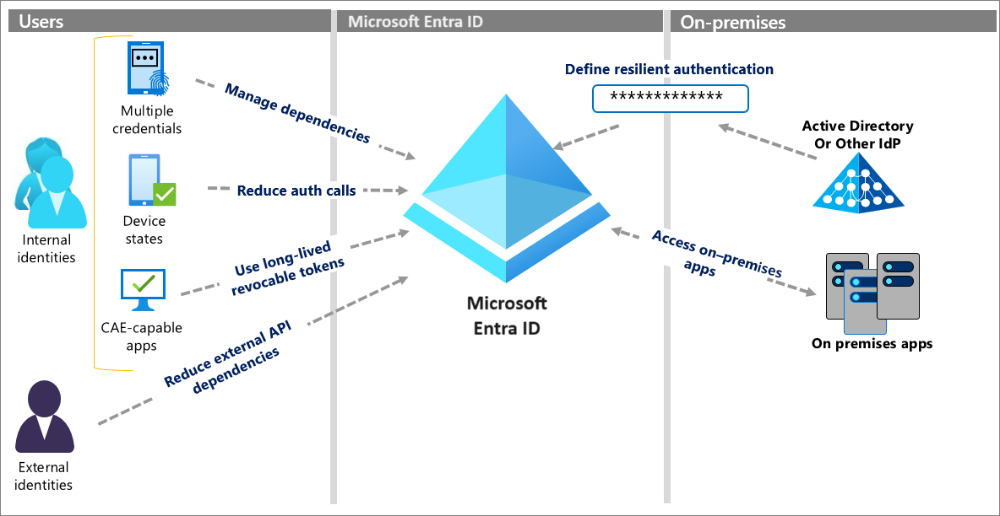

# Build resilience in your identity and access management infrastructure

Microsoft Entra ID is a global cloud identity and access management system that provides critical services such as authentication and authorization to your organization's resources. This article provides you with guidance to understand, contain, and mitigate the risk of disruption of authentication or authorization services for resources that rely on Microsoft Entra ID. 

The document set is designed for

* Identity Architects
* Identity Service Owners
* Identity Operations teams

Also see the documentation for [application developers](./resilience-app-development-overview.md) and for [Azure AD B2C systems](resilience-b2c.md).

## What is resilience?

In the context of your identity infrastructure, resilience is the ability to endure disruption to services like authentication and authorization, or failure of other components, with minimal or no effect on your business, users, and operations. The effect of disruption can be severe and resilience requires diligent planning.

## Why worry about disruption?

Every call to the authentication system is subject to disruption if any component of the call fails. When authentication is disrupted, because of the underlying component failures, your users won't access their applications. Therefore, reducing the number of authentication calls and number of dependencies in those calls is important to your resilience. Application developers can assert some control over how often tokens are requested. For example, work with your developers to ensure they're using managed identities for Azure resources for their applications wherever possible. 

In a token-based authentication system like Microsoft Entra ID, a user's application (client) must acquire a security token from the identity system before it can access an application or other resource. During the validity period, a client can present the same token multiple times to access the application.

When the token presented to the application expires, the application rejects the token, and the client must acquire a new token from Microsoft Entra ID. Acquiring a new token potentially requires user interaction, such as credential prompts or meeting other requirements of the authentication system. Reducing the frequency of authentication calls with longer-lived tokens decreases unnecessary interactions. However, you must balance token life with the risk created by fewer policy evaluations. For more information on managing token lifetimes, see this article on [optimizing reauthentication prompts](~/identity/authentication/concepts-azure-multi-factor-authentication-prompts-session-lifetime.md).

## Ways to increase resilience
The following diagram shows six concrete ways you can increase resilience. Each method is explained in detail in the articles linked in the following Next steps portion of this article.
  

## Next steps

## Resilience resources for administrators and architects
 
* [Build resilience with credential management](resilience-in-credentials.md)
* [Build resilience with device states](resilience-with-device-states.md)
* [Build resilience by using Continuous Access Evaluation (CAE)](resilience-with-continuous-access-evaluation.md)
* [Build resilience in external user authentication](resilience-b2b-authentication.md)
* [Build resilience in your hybrid authentication](resilience-in-hybrid.md)
* [Build resilience for your federated applications with colocated users](resilience-for-federated-applications-with-colocated-users.md)
* [Build resilience in application access with Application Proxy](resilience-on-premises-access.md)

## Resilience resources for developers

* [Build IAM resilience in your applications](resilience-app-development-overview.md)
* [Build resilience in your CIAM systems](resilience-b2c.md)
