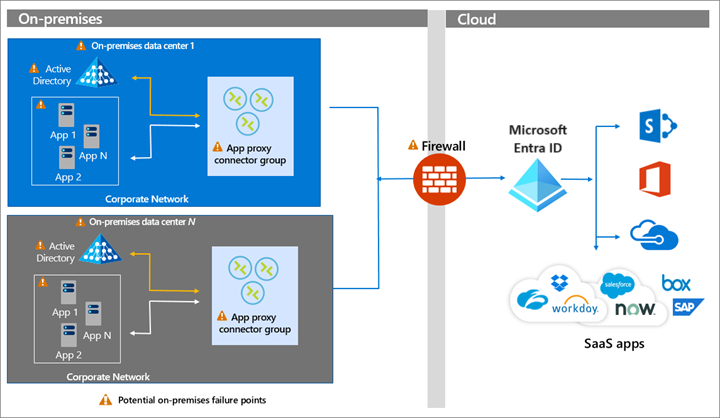

# Build resilience in application access with Application Proxy

Application Proxy is a feature of Microsoft Entra ID that enables users to access on premises web applications from a remote client. Application Proxy includes the Application Proxy service in the cloud and the private network connectors that run on an on-premises server. 

Users access on premises resources through a URL published via Application Proxy. They're redirected to the Microsoft Entra sign-in page. The Application Proxy service in Microsoft Entra ID then sends a token to the private network connector in the corporate network that passes the token to the on-premises Active Directory. The authenticated user can then access the on-premises resource. In the diagram below, [connectors](~/identity/app-proxy/application-proxy-connectors.md) are shown in a [connector group](~/identity/app-proxy/application-proxy-connector-groups.md).

> [!IMPORTANT]
> When you publish your applications via Application Proxy, you must implement [capacity planning and appropriate redundancy for the private network connectors](~/identity/app-proxy/application-proxy-connectors.md#capacity-planning).

)

## How do I implement Application Proxy?

To implement remote access with Microsoft Entra application proxy, see the following resources.

* [Planning an Application Proxy deployment](~/identity/app-proxy/conceptual-deployment-plan.md)
* [High availability and load balancing best practices](~/identity/app-proxy/application-proxy-high-availability-load-balancing.md)
* [Configure proxy servers](~/identity/app-proxy/application-proxy-configure-connectors-with-proxy-servers.md)
* [Design a resilient access control strategy](~/identity/authentication/concept-resilient-controls.md)

## Next steps

### Resilience resources for administrators and architects
 
* [Build resilience with credential management](resilience-in-credentials.md)
* [Build resilience with device states](resilience-with-device-states.md)
* [Build resilience by using Continuous Access Evaluation (CAE)](resilience-with-continuous-access-evaluation.md)
* [Build resilience in external user authentication](resilience-b2b-authentication.md)
* [Build resilience in your hybrid authentication](resilience-in-hybrid.md)

### Resilience resources for developers

* [Build IAM resilience in your applications](resilience-app-development-overview.md)
* [Build resilience in your CIAM systems](resilience-b2c.md)
