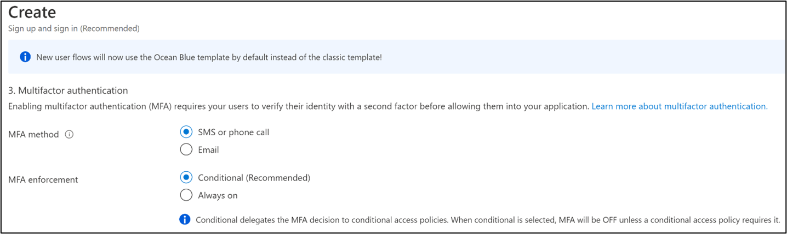

# Resilient end-user experience using Azure AD B2C

The sign-up and sign-in end-user experience is made up of the following elements:

- Interfaces the user interacts with, such as CSS, HTML, and JavaScript
- User flows and custom policies you create, for example sign-up, sign-in, and profile edit
- Identity providers (IDPs) for your application, such as local account username or password, Microsoft Outlook, Facebook, and Google

## User flow and custom policy  

To help you set up the most common identity tasks, Azure AD B2C provides built-in configurable [user flows](/azure/active-directory-b2c/user-flow-overview). You can also build your own [custom policies](/azure/active-directory-b2c/custom-policy-overview) that offer you maximum flexibility. However, we recommended use of custom policies to address complex scenarios.

### Select user flow or custom policy

Choose built-in user flows that meet your business requirements. Microsoft tests built-in flows, therefore you can minimize testing for validating policy-level functional, performance, or scale. However, test applications for functionality, performance, and scale.

With [custom policies](/azure/active-directory-b2c/user-flow-overview) ensure policy-level testing for functional, performance, or scale. Conduct application-level testing.

To learn more, you can [compare user flows and custom polices](/azure/active-directory-b2c/user-flow-overview#comparing-user-flows-and-custom-policies).

## Choose multiple IdPs

When using an [external IdP](/azure/active-directory-b2c/add-identity-provider) such as Facebook, create a fallback plan if the external IdP is unavailable.

### Set up multiple IdPs

In the external IdP registration process, include a verified identity claim, such as user mobile number or email address. Commit the verified claims to the underlying Azure AD B2C directory instance. If an external IdP is unavailable, revert to the verified identity claim, and fall back to the phone number as an authentication method. Another option is to send the user a one-time passcode (OTP) for sign-in.

You can [build alternate authentication paths](https://github.com/azure-ad-b2c/samples/tree/master/policies/idps-filter):

 1. Configure sign-up policy to allow sign-up by local account and external IDPs.
 2. Configure a profile policy to allow users to [link the other identity to their account](https://github.com/Azure-Samples/active-directory-b2c-advanced-policies/tree/master/account-linking) after they sign in.
 3. Notify and allow users to [switch to an alternate IDP](/azure/active-directory-b2c/customize-ui-with-html#configure-dynamic-custom-page-content-uri) during an outage.

## Availability of multifactor authentication

If you use a [phone service for multifactor authentication](/azure/active-directory-b2c/phone-authentication-user-flows), consider an alternative service provider. The local phone service provider might experience service disruptions.

### Select alternate multifactor authentication 

The Azure AD B2C service has a phone-based MFA provider to deliver time-based, one-time passcodes (OTPs). It's a voice call and text message to user preregistered phone numbers.

With user flows, there are two methods to build resilience:

- **Change user flow configuration**: During disruption in phone-based OTP delivery, change the OTP delivery method to email. Redeploy the user flow.

   

- **Change applications**: For identity tasks, such as sign-up and sign-in, define two sets of user flows. Configure the first set to use phone-based OTP, and the second to email OTP. During a disruption in phone-based OTP delivery, switch from the first set of user flows to the second, leaving the user flows unchanged.  

If you use custom policies, there are four methods to build resilience. The list is on order of complexity. Redeploy updated policies.

- **Enable user selection of phone OTP or email OTP**: Expose both options to enable users to self-select. Don't changes policies or applications.
- **Dynamically switch between phone OTP and email OTP**:  Collect phone and email information at sign-up. Define custom policy to switch conditionally, during phone disruption, to email OTP. Don't change policies or applications.
- **Use an authentication app**: Update custom policy to use an authentication app. If your MFA is phone or email OTP, redeploy custom policies and use an authentication app.

   >[!Note]
   >Users configure Authenticator integration during sign-up.

- **Security questions**: If none of the previous methods are applicable, use security questions. These questions are for users during onboarding, or profile edit. Answers are stored in a separate database. This method doesn't meet the MFA requirement of *something you have*, for example, a phone, but is *something that you know*.

## Content delivery network

Content delivery networks (CDNs) perform better and are less expensive than blob stores for storing custom user flow UI. The web page content goes from a geographically distributed network of highly available servers.  

Periodically, test CDN availability and the performance of content distribution through end-to-end scenario and load testing. For surges due to promotions or holiday traffic, revise estimates for load testing.
  
## Next steps

- [Resilience resources for Azure AD B2C developers](resilience-b2c.md)
  - [Resilient interfaces with external processes](resilient-external-processes.md)
  - [Resilience through developer best practices](resilience-b2c-developer-best-practices.md)
  - [Resilience through monitoring and analytics](resilience-with-monitoring-alerting.md)
- [Build resilience in authentication infrastructure](resilience-in-infrastructure.md)
- [Increase resilience of authentication and authorization in applications](resilience-app-development-overview.md)
