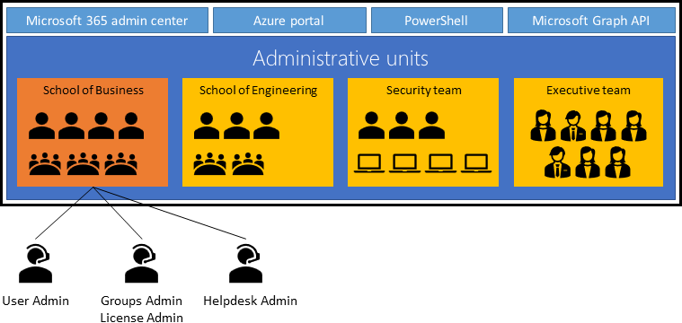

# Introduction to delegated administration and isolated environments

A Microsoft Entra single-tenant architecture with delegated administration often is adequate for separating environments. Your organization might require a degree of isolation not possible in a single tenant.

For this article, it's important to understand:

* Single tenant operation and function
* Administrative units (AUs) in Microsoft Entra ID
* Relationships between Azure resources and Microsoft Entra tenants
* Requirements that drive isolation

## Microsoft Entra tenant as a security boundary

A Microsoft Entra tenant provides identity and access management (IAM) capabilities to applications and resources for an organization.

An identity is a directory object authenticated and authorized for access to a resource. There are identity objects for human and nonhuman identities. To differentiate, human identities are referred to as identities and nonhuman identities are workload identities. Nonhuman entities include application objects, Service Principals, managed identities, and devices. Generally, a workload identity is for a software entity to authenticate with a system.

* **Identity** - Objects that represent humans
* **Workload identity** - Workload identities are applications, service principals, and managed identities.
  * The workload identity authenticates and accesses other services and resources

For more information, [learn about workload identities](~/workload-id/workload-identities-overview.md).

The Microsoft Entra tenant is an identity security boundary controlled be administrators. In this security boundary, administration of subscriptions, management groups, and resource groups can be delegated to segmented administrative control of Azure resources. These groups depend on tenant-wide configurations of policies and settings, under Microsoft Entra Global Administrators control.

Microsoft Entra ID grants objects access to applications and Azure resources. Azure resources and applications that trust Microsoft Entra ID can be managed with Microsoft Entra ID. Following best practices, set up the environment with a test environment.

### Access to apps that use Microsoft Entra ID

Grant identities access to applications:

* Microsoft productivity services such as Exchange Online, Microsoft Teams, and SharePoint Online
* Microsoft IT services such as Azure Sentinel, Microsoft Intune, and Microsoft Defender Advanced Threat Protection (ATP)
* Microsoft developer tools such as Azure DevOps and Microsoft Graph API
* SaaS solutions such as Salesforce and ServiceNow
* On-premises applications integrated with hybrid access capabilities such as Microsoft Entra application proxy
* Custom developed applications

Applications that use Microsoft Entra ID require directory objects configuration and management in the trusted Microsoft Entra tenant. Examples of directory objects include application registrations, service principals, groups, and [schema attribute extensions](/graph/extensibility-overview).

### Access to Azure resources

Grant roles to users, groups, and Service Principal objects (workload identities) in the Microsoft Entra tenant. To learn more, see [Azure role-based access control (RBAC)](/azure/role-based-access-control/overview) and [Azure attribute-based access control (ABAC)](/azure/role-based-access-control/conditions-overview).

Use Azure RBAC to provide access, based on role as determined by security principal, role definition, and scope. Azure ABAC adds role assignment conditions, based on attributes for actions. For more fine-grained access control, add role assignment condition. Access Azure resources, resource groups, subscriptions, and management groups with assigned RBAC roles. 

Azure resources that [support managed identities](~/identity/managed-identities-azure-resources/overview.md) allow resources to authenticate, obtain access to, and get assigned roles to other resources in the Microsoft Entra tenant boundary.

Applications using Microsoft Entra ID for sign-in can use Azure resources, such as compute or storage. For example, a custom application that runs in Azure and trusts Microsoft Entra ID for authentication has directory objects and Azure resources. Azure resources in the Microsoft Entra tenant affect tenant-wide [Azure quotas and limits](/azure/azure-resource-manager/management/azure-subscription-service-limits).

### Access to directory objects

Identities, resources, and their relationships are represented as directory objects in a Microsoft Entra tenant. Examples include users, groups, Service Principals, and app registrations. Have a set of directory objects in the Microsoft Entra tenant boundary for the following capabilities:

* **Visibility**: Identities can discover or enumerate resources, users, groups, access usage reporting, and audit logs based on permissions. For example, a directory member can discover users in the directory with Microsoft Entra ID [default user permissions](~/fundamentals/users-default-permissions.md).
* **Effects on applications**: As part of their business logic, applications can manipulate directory objects through Microsoft Graph. Typical examples include reading or setting user attributes, updating user calendar, sending emails on behalf of users, and so on. Consent is needed to allow applications to affect the tenant. Administrators can consent for all users. For more information, see [permissions and consent in the Microsoft identity platform](~/identity-platform/v2-admin-consent.md).
* **Throttling and service limits**: Runtime behavior of a resource might trigger [throttling](/graph/throttling) to prevent overuse or service degradation. Throttling can occur at the application, tenant, or entire service level. Generally, it occurs when an application has a large number of requests in or across tenants. Similarly, there are [Microsoft Entra service limits and restrictions](~/identity/users/directory-service-limits-restrictions.md) that might affect application runtime behavior.

   >[!NOTE]
   >Use caution with application permissions. For example, with Exchange Online, [scope application permissions to mailboxes and permissions](/graph/auth-limit-mailbox-access).

## Administrative units for role management

Administrative units restrict permissions in a role to a portion of your organization. You can use administrative units to delegate the [Helpdesk Administrator](~/identity/role-based-access-control/permissions-reference.md) role to regional support specialists, so they can manage users in the region they support. An administrative unit is a Microsoft Entra resource that can be a container for other Microsoft Entra resources. An administrative unit can contain:

* Users
* Groups
* Devices

In the following diagram, AUs segment the Microsoft Entra tenant based on organizational structure. This approach is useful when business units or groups allocate dedicated IT support staff. Use AUs to provide privileged permissions limited to an administrative unit.

   

For more information, see [administrative units in Microsoft Entra ID](~/identity/role-based-access-control/administrative-units.md).

### Common reasons for resource isolation

Sometimes you isolate a group of resources from other resources for security reasons, such as resources with unique access requirements. This action is a good use case for AUs. Determine the users and security principal resource access, and in what roles. Reasons to isolate resources:

* Developer teams need to iterate safely. But development and testing of apps that write to Microsoft Entra ID can affect the Microsoft Entra tenant through write operations:
  * New applications that can change Office 365 content such as SharePoint sites, OneDrive, Microsoft Teams, and so on
  * Custom applications that can change user data with MS Graph or similar APIs at scale. For example, applications granted Directory.ReadWrite.All.
  * DevOps scripts that update large sets of objects
  * Developers of Microsoft Entra integrated apps need to create user objects for testing. The user objects don't have access to production resources.
* Nonproduction Azure resources and applications that can affect other resources. For example, a new SaaS app needs isolation from the production instance and user objects
* Secret resources to be shielded from discovery, enumeration, or takeover by administrators

## Configuration in a tenant

Configuration settings in Microsoft Entra ID can affect resources in the Microsoft Entra tenant through targeted, or tenant-wide management actions:

* **External identities**: Administrators identify and control external identities to be provisioned in the tenant
  * Whether to allow external identities in the tenant
  * From which domains external identities are added
  * Whether users can invite users from other tenants
* **Named locations**: Administrators create named locations to:
  * Block sign-in from locations
  * Trigger Conditional Access policies such as multifactor authentication
  * Bypass security requirements
* **Self-service options**: Administrators set self-service-password reset and create Microsoft 365 groups at the tenant level

If not overridden by global policies, you can scope some tenant-wide configurations:

* Tenant configuration allows external identities. A resource administrator can exclude those identities from access.
* Tenant configuration allows personal device registration. A resource administrator can exclude devices from access.
* Named locations are configured. A resource administrator can configure policies to allow or exclude access.

### Common reasons for configuration isolation

Configurations controlled by administrators affect resources. While some tenant-wide configuration can be scoped with policies that don't apply or partially apply to a resource, others can't. If a resource has unique configuration, isolate it in a separate tenant. Examples include:

* Resources with requirements that conflict with tenant-wide security or collaboration postures
  * For example allowed authentication types, device management policies, self-service, identity proofing for external identities, etc.
* Compliance requirements that scope certification to the entire environment
  * This action includes all resources and the Microsoft Entra tenant, especially when requirements conflict with, or exclude, other organizational resources
* External user access requirements that conflict with production or sensitive resource policies
* Organizations that span multiple countries or regions, and companies hosted in a Microsoft Entra tenant.
  * For example, settings and licenses used in countries, regions, or business subsidiaries

## Tenant administration

Identities with privileged roles in a Microsoft Entra tenant have the visibility and permissions to execute the configuration tasks described in the previous sections. Administration includes ownership of identity objects such as users, groups, and devices. It also includes the scoped implementation of tenant-wide configurations for authentication, authorization, and so on.

### Directory objects administration

Administrators manage how identity objects access resources, and under what circumstances. They also disable, delete, or modify directory objects, based on their privileges. Identity objects include:

* **Organizational identities** such as the following, are represented by user objects:
  * Administrators
  * Organizational users
  * Organizational developers
  * Service Accounts
  * Test users
* **External identities** represent users from outside the organization:
  * Partners, suppliers, or vendors provisioned with accounts in the organization environment
  * Partners, suppliers, or vendors provisioned with Azure B2B collaboration
* **Groups** are represented by objects:
  * Security groups
  * [Microsoft 365 groups](/microsoft-365/community/all-about-groups)
  * Dynamic groups
  * Administrative units
* **Devices** are represented by objects:
  * Microsoft Entra hybrid joined devices. On-premises computers synchronized from on-premises.
  * Microsoft Entra joined devices
  * Microsoft Entra registered mobile devices used by employees to access workplace application
  * Microsoft Entra registered down-level devices (legacy). For example, Windows 2012 R2.
* **Workload Identities**
  * Managed identities
  * Service Principals
  * Applications

In a hybrid environment, identities are synchronized typically from the on-premises environment using [Microsoft Entra Connect](~/identity/hybrid/connect/whatis-azure-ad-connect.md).

### Identity services administration

Administrators with certain permissions manage how tenant-wide policies are implemented for resource groups, security groups, or applications. When considering resource administration, keep in mind the following reasons to group resources, or to isolate them.

* **Global Administrators** control Azure subscriptions linked to the tenant
* **Identities assigned an Authentication Administrator role** require nonadministrators to reregister for multifactor authentication or Fast IDentity Online (FIDO) authentication.
* **Conditional Access Administrators** create Conditional Access policies for user sign-in to apps, from organization-owned devices. These administrators scope configurations. For example, if external identities are allowed in the tenant, they can exclude access to resources.
* **Cloud Application Administrators** consent to application permissions on behalf of users

### Common reasons for administrative isolation

Who should administer the environment and its resources? Sometimes, administrators of one environment don't have access to another environment:

* Separation of tenant-wide administrative responsibilities to mitigate risk of security and operational errors affecting critical resources
* Regulations that constrain who can administer the environment, based on conditions such as citizenship, residency, clearance level, and so on 

## Security and operational considerations

Given the interdependence between a Microsoft Entra tenant and its resources, it's important to understand the security and operational risks of compromise or error. If you operate in a federated environment with synchronized accounts, an on-premises compromise can lead to a Microsoft Entra ID compromise.

* **Identity compromise**: In the tenant boundary, identities are assigned any role, if the administrator providing access has sufficient privileges. While the effect of compromised nonprivileged identities is largely contained, compromised administrators can cause broad problems. For example, if a Microsoft Entra Global Administrator account is compromised, Azure resources can become compromised. To mitigate risk of identity compromise, or bad actors, implement [tiered administration](/security/privileged-access-workstations/privileged-access-access-model) and follow principles of least privilege for [Microsoft Entra administrator roles](../identity/role-based-access-control/delegate-by-task.md). Create Conditional Access policies that exclude test accounts and test Service Principals from accessing resources outside the test applications. For more information on privileged access strategy, see [privileged access: strategy](/security/privileged-access-workstations/privileged-access-strategy).
* **Federated environment compromise**
* **Trusting resource compromise**: Any compromised component of a Microsoft Entra tenant affects trusting resources, based on permissions at the tenant and resource level. A resource's privileges determine the effect of a compromised component. Resources integrated to perform write operations can affect the entire tenant. Following [Zero Trust guidance](/azure/architecture/guide/security/conditional-access-zero-trust) can help limit the effects of compromise.
* **Application development**: There's risk in the early stages of application development lifecycle with writing privileges to Microsoft Entra ID. Bugs can write changes unintentionally to Microsoft Entra objects. To learn more, see [Microsoft identity platform best practices](~/identity-platform/identity-platform-integration-checklist.md).
* **Operational error**: Bad actors, and operational errors by tenant administrators or resource owners help cause security incidents. These risks occur in any architecture. Use separation of duties, tiered administration, principles of least privilege, and following best practices. Avoid using a separate tenant.

### Zero Trust principles

Incorporate Zero Trust principles into your Microsoft Entra ID design strategy to guide secure design. You can [embrace proactive security with Zero Trust](https://www.microsoft.com/security/business/zero-trust).

## Next steps

* [Microsoft Entra fundamentals](./secure-fundamentals.md)
* [Azure resource management fundamentals](secure-resource-management.md)
* [Resource isolation in a single tenant](secure-single-tenant.md)
* [Resource isolation with multiple tenants](secure-multiple-tenants.md)
* [Best practices](secure-best-practices.md)
