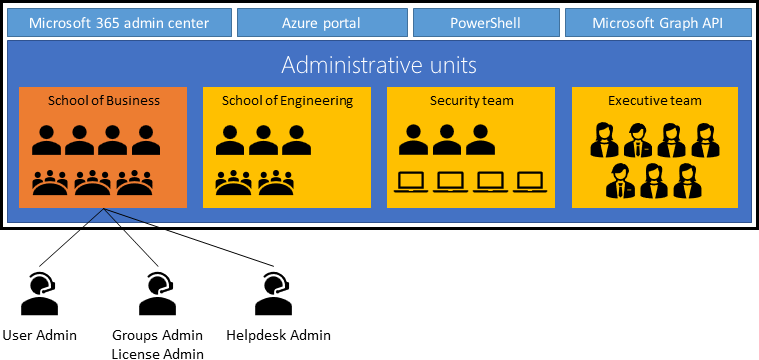
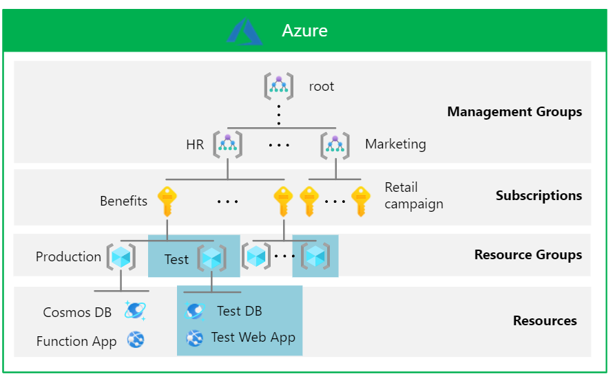

# Secure resource isolation in a single tenant in Microsoft Entra ID

Many separation scenarios can be achieved in a single tenant. If possible, we recommend you delegate administration to separate environments in a single tenant for the best productivity and collaboration experience.

## Outcomes

**Resource separation** - To restrict resource access to users, groups, and Service Principals, use Microsoft Entra directory roles, security groups, Conditional Access policies, Azure resource groups, Azure management groups, administrative units (AUs), and other controls. Enable separate administrators to manage resources. Use separate users, permissions, and access requirements.

Use isolation in multiple tenants if there's: 

* Resource sets that require tenant-wide settings
* Minimal risk tolerance for unauthorized access by tenant members
* Configuration changes cause unwanted effects

**Configuration separation** - In some cases, resources such as applications have dependencies on tenant-wide configurations like authentication methods or named locations. Consider dependencies when isolating resources. Global Administrators can configure the resource settings and tenant-wide settings that affect resources.

If a set of resources require unique tenant-wide settings, or a different entity administers tenant settings, use isolation with multiple tenants.

**Administrative separation** - With Microsoft Entra ID delegated administration, segregate resource administration such as applications and APIs, users and groups, resource groups, and Conditional Access policies.

Global Administrators can discover and obtain access to trusting resources. Set up auditing and alerts for authenticated administrator changes to a resource.

Use administrative units (AUs) in Microsoft Entra ID for administrative separation. AUs restrict permissions in a role to a portion of your organization you define. Use AUs to delegate the [Helpdesk Administrator](~/identity/role-based-access-control/permissions-reference.md) role to regional support specialists. Then they can manage users in the region they support.

   

Use AUs to separate [users, groups, and device objects](~/identity/role-based-access-control/administrative-units.md). Assign units with [rules for dynamic membership groups](~/identity/role-based-access-control/admin-units-members-dynamic.md).

With Privileged Identity Management (PIM), select a person to approve requests for highly privileged roles. For example, choose admins that require Authentication Administrator access to make user authentication method changes.

   >[!NOTE]
   >Use of PIM requires and Microsoft Entra ID P2 license per human.

To confirm Authentication Administrators can't manage a resource, isolate the resource in a separate tenant with separate Authentication Administrators. Use this method for backups. See [multi-user authorization guidance](/azure/backup/multi-user-authorization) for examples.

## Common usage

A common use for multiple environments in a single tenant is segregation of production from nonproduction resources. In a tenant, development teams and application owners create and manage a separate environment with test apps, test users and groups, and test policies for those objects. Similarly, teams create nonproduction instances of Azure resources and trusted apps.

Use nonproduction Azure resources and nonproduction instances of Microsoft Entra integrated applications with equivalent nonproduction directory objects. The nonproduction resources in the directory are for testing.

   >[!NOTE]
   >Avoid more than one Microsoft 365 environment in a Microsoft Entra tenant. However, you can have multiple Dynamics 365 environments in a Microsoft Entra tenant.

Another scenario for isolation in a single tenant is a separation between locations, subsidiary, or tiered administration. See the [enterprise access model](/security/privileged-access-workstations/privileged-access-access-model).

Use Azure role-based access control (Azure RBAC) assignments for scoped administration of Azure resources. Similarly, enable Microsoft Entra ID management of Microsoft Entra ID trusting applications through multiple capabilities. Examples include Conditional Access, user and group filtering, administrative unit assignments, and application assignments.

To ensure isolation of Microsoft 365 services, including organization-level configuration staging, select a [multiple tenant isolation](/azure/backup/multi-user-authorization).

### Scoped management for Azure resources

Use Azure RBAC to design an administration model with granular scopes and surface area. Consider the management hierarchy in the following example:

   >[!NOTE]
   >You can define the management hierarchy, based on organizational requirements, constraints, and goals. For more information, see the Cloud Adoption Framework guidance, [organize Azure resources](/azure/cloud-adoption-framework/ready/azure-setup-guide/organize-resources).

   

* **Management group** - Assign roles to management groups so they don't affect other management groups. In the previous scenario, the HR team defines an Azure policy to audit regions where resources are deployed across HR subscriptions.
* **Subscription** - Assign roles to a subscription to prevent it from affecting other resource groups. In the previous scenario, the HR team assigns the Reader role for the Benefits subscription, without reading other HR subscriptions, or a subscription from another team.
* **Resource group** - Assign roles to resource groups so that they don't affect other resource groups. A Benefits engineering team assigns the Contributor role to someone to manage the test database and the test web app, or to add more resources.
* **Individual resources** - Assign roles to resources so they don't affect other resources. The Benefits engineering team assigns a data analyst the Cosmos DB Account Reader role for the test instance of the Azure Cosmos DB database. This work doesn't interfere with the test web app or production resource.

For more information, see [Azure built-in roles](/azure/role-based-access-control/built-in-roles) and [What is Azure RBAC?](/azure/role-based-access-control/overview).

The structure is hierarchical. Therefore, the higher up in the hierarchy, the wider the scope, visibility, and effect on lower levels. Top-level scopes affect Azure resources in the Microsoft Entra tenant boundary. You can apply permissions at multiple levels. This action introduces risk. Assigning roles higher up the hierarchy can provide more access lower down the scope than you intend. [Microsoft Entra](https://www.microsoft.com/security/business/identity-access/microsoft-entra-permissions-management) provides visibility and remediation to help reduce the risk. 

* The root management group defines Azure policies and RBAC role assignments applied to subscriptions and resources
* Global Administrators can [elevate access](https://aka.ms/AzureADSecuredAzure/12a) to subscriptions and management groups

Monitor your top-level scopes. It's important to plan for other dimensions of resource isolation, such as networking. For guidance on Azure networking, see [Azure best practices for network security](/azure/security/fundamentals/network-best-practices). Infrastructure as a service (IaaS) workloads have scenarios whereby identity and resource isolation need to be part of design and strategy.

Consider isolating sensitive or test resources according to [Azure landing zone conceptual architecture](/azure/cloud-adoption-framework/ready/landing-zone/). For example, assign identity subscriptions to separated management groups. Separate subscriptions for development in sandbox management groups. Find details in the [enterprise-scale documentation](/azure/cloud-adoption-framework/ready/enterprise-scale/faq). Separation for testing in a tenant is considered in the [management group hierarchy of the reference architecture](/azure/cloud-adoption-framework/ready/enterprise-scale/testing-approach).

### Scoped management for Microsoft Entra ID trusting applications

The following section illustrates the pattern to scope management of Microsoft Entra ID trusting applications. 

Microsoft Entra ID supports configuring multiple instances of custom and SaaS apps, but not most Microsoft services, against the same directory with [independent user assignments](~/identity/enterprise-apps/assign-user-or-group-access-portal.md). The previous example has a production and test version of the travel app. To achieve app-specific configuration and policy separation, deploy preproduction versions against the corporate tenant. This action enables workload owners to perform testing with their corporate credentials. Nonproduction directory objects, such as test users and test groups, are associated with the nonproduction application with separate [ownership](https://aka.ms/AzureADSecuredAzure/14a) of those objects.

There are tenant-wide aspects that affect trusting applications in the Microsoft Entra tenant boundary:

* Global Administrators manage all tenant-wide settings
* Other [directory roles](https://aka.ms/AzureADSecuredAzure/14b) such as User Administrator, Application Administrator, and Conditional Access Administrators manage tenant-wide configuration in the scope of the role.

Configuration settings such authentication methods, hybrid configurations, B2B collaboration allow-listing of domains, and named locations are tenant wide.

   >[!NOTE]
   >Microsoft Graph API permissions and consent permissions can't be scoped to a group or AU members. Those permissions are assigned at the directory-level. Only resource-specific consent allows scope on resource-level, currently limited to [Microsoft Teams Chat permissions](/microsoftteams/platform/graph-api/rsc/resource-specific-consent).

   >[!IMPORTANT]
   >The lifecycle of Microsoft SaaS services such as Office 365, Microsoft Dynamics, and Microsoft Exchange are bound to the Microsoft Entra tenant. As a result, multiple instances of these services require multiple Microsoft Entra tenants. 

## Related content

* [Introduction to delegated administration and isolated environments](secure-introduction.md)
* [Microsoft Entra fundamentals](./secure-fundamentals.md)
* [Azure resource management fundamentals](secure-resource-management.md)
* [Resource isolation with multiple tenants](secure-multiple-tenants.md)
* [Best practices](secure-best-practices.md)
