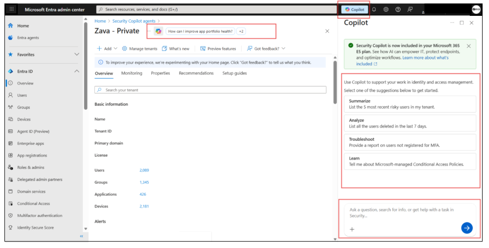
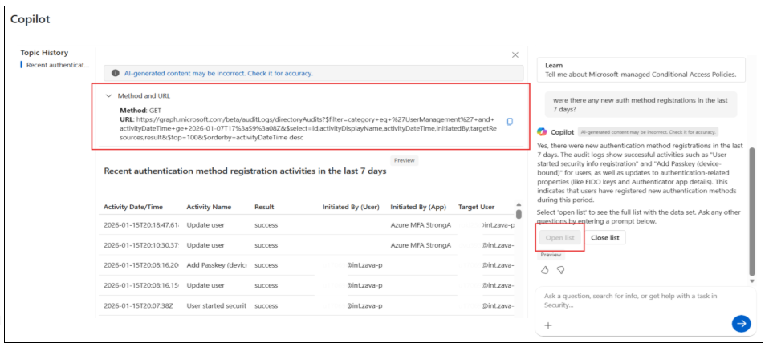
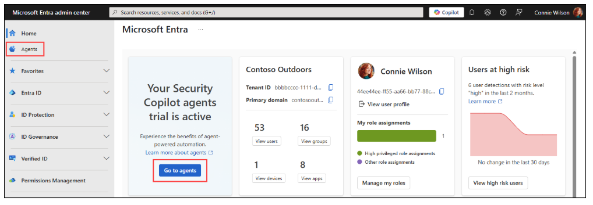
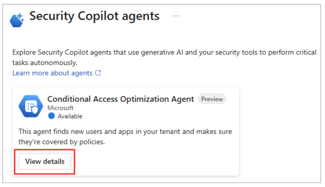
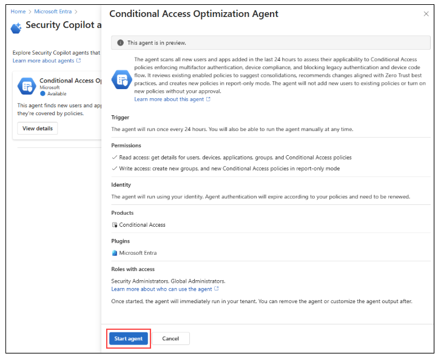
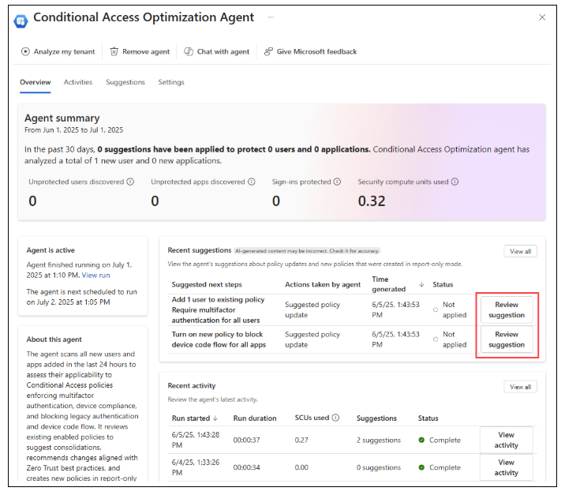

# Microsoft Security Copilot in Microsoft Entra proof-of-concept guide

Use the Microsoft Security Copilot in Microsoft Entra (Security Copilot in Entra) proof-of-concept (PoC) guide to harness artificial intelligence (AI)-powered insights and automation and demonstrate the value of Security Copilot in Entra in your environment through pre-defined scenarios. The guide illustrates a structured approach to accelerate testing and value realization.  

   > [!IMPORTANT]
   > This guide assumes your organization runs the PoC in an environment with the needed user data.

## Understand the product

Understanding the core concepts of Security Copilot in Entra is the first step toward running a successful PoC. Start with the learning path for the product features in this section: 

* [Get started with Security Copilot](/copilot/security/get-started-security-copilot)
* [Prepare your environment for Security Copilot](/security/zero-trust/copilots/zero-trust-microsoft-copilot-for-security)
* [Security Copilot pricing](https://aka.ms/CopilotforSecurity_Pricing)
* [Security Copilot frequently asked questions](/copilot/security/faq-security-copilot)

## PoC prerequisites

To conduct this Security Copilot in Entra PoC, ensurethe following prerequisites are met. 

* An enabled Microsoft Entra tenant with Microsoft Entra ID P1, P2, or a trial license  
  * [Create an account for free](https://signup.azure.com/)  
* Additional licenses are needed for Microsoft Entra Suite scenarios
* To enable the PoC, a assign a cloud user one of the following roles:  
  * Global Administrator 
  * Security Administrator 
  * Billing Administrator 

   > [!NOTE]
   > For agent-specific prerequisites, refer to [Microsoft Entra Conditional Access Optimization Agent documentation](/entra/security-copilot/conditional-access-agent-optimization).  

## Overview of scenarios

Security Copilot in Entra empowers security teams to address a wide range of identity and access management challenges in Microsoft Entra. See the following list for common scenarios:  

* Detect and analyze risky users and sign-in behaviors 
* Investigate audit and sign-in logs for suspicious activity 
* Monitor access reviews and license usage 
* Review security recommendations and compliance posture 
* Streamline lifecycle workflows and group management 
* Assess user information and app risk across the environment 

The following table has key scenarios, and the capabilities Security Copilot in Entra brings to each scenario, enabling faster investigations, and improved visibility. 

|Scenario|Capabilities|
|---|---|
|Microsoft Entra ID|[Tenants](/entra/security-copilot/entra-id-scenarios) [Users](/entra/security-copilot/entra-id-scenarios) [Groups](/entra/security-copilot/entra-id-scenarios)) [Domains](/entra/security-copilot/entra-id-scenarios) [Licenses](/entra/security-copilot/entra-id-scenarios) [Sign-in logs](/entra/security-copilot/entra-id-scenarios) [Audit logs](/entra/security-copilot/entra-id-scenarios) [Provisioning logs](/entra/security-copilot/entra-id-scenarios) [Recommendations](/entra/security-copilot/entra-id-scenarios) [Health monitoring alerts](/entra/security-copilot/entra-id-scenarios) [Service-level agreements](/entra/security-copilot/entra-id-scenarios) [Roles and administrators](/entra/security-copilot/entra-id-scenarios) [Devices](/entra/security-copilot/entra-id-scenarios) [Conditional Access](/entra/security-copilot/entra-id-scenarios) [Authentication](/entra/security-copilot/entra-id-scenarios)|
|Microsoft Entra ID Protection|[Risky users](/entra/security-copilot/entra-id-protection-scenarios) [Application risk](/entra/security-copilot/entra-id-protection-scenarios)|
|Microsoft Entra ID Governance|[Access reviews](/entra/security-copilot/entra-id-governance-scenarios) [Entitlement management](/entra/security-copilot/entra-id-governance-scenarios) [Privileged Identity Management (PIM)](/entra/security-copilot/entra-id-governance-scenarios) [PIM write access](/entra/security-copilot/entra-id-governance-scenarios) [Lifecycle workflows](/entra/security-copilot/entra-id-governance-scenarios)|
|Microsoft Entra Internet Access Microsoft Entra Private Access|[Global secure access](/entra/security-copilot/entra-internet-access-private-access-scenarios)|

   > [!NOTE]
   > Security Copilot in Entra uses on-behalf-of (OBO) authentication, provided by OAuth 2.0. This is an authentication flow from delegation in OAuth. When a Security Operations user issues a prompt, Security Copilot in Entra passes the user identity and permissions through the request chain. This prevents the user from gaining permissions to resources for which they shouldn’t have access. For more information about OBO authentication, see [Microsoft identity platform and OAuth2.0 on-behalf-of flow](/entra/identity-platform/v2-oauth2-on-behalf-of-flow). 
   

## Set up Security Copilot in Entra

Security Copilot in Entra is included in the Microsoft 365 E5 subscription. E5 customers receive zero-click activation, meaning Security Copilot in Entra is provisioned and ready to use, when enabled. No further action is needed. 

If your subscription doesn’t include Security Copilot in Entra, proceed to the instructions to [onboard Security Copilot](/copilot/security/get-started-security-copilot). If you aren’t an E5 customer, a minimum of 1 Security Compute Unit (SCU) is needed. We recommend 15-20 SCUs. 

### Identify use cases

A Security Copilot in Entra PoC begins with your organization’s unique security challenges and objectives. In the [Microsoft Entra admin center](https://entra.microsoft.com/), select **Copilot**. Prompts appear to get you started. You can explore these prompts or enter your prompt in the chat box. You can view the graph query used to derive results. 

   

   

### Persona functions

The following table has suggested prompts, based on persona function.

|Persona|Scenario|Suggested prompt|
|---|---|---|
|Helpdesk Administrator|Investigate users blocked from sign-in, due to a risk event. Help Desk is on the call, with the user, to resolve the issue. |I'm investigating a user email **julie-b@contoso** blocked due to high risk. Help me understand why this user is blocked. Also, let me know if other users are blocked, due to the same situation, within the last 24 hours. |
|Security operations center (SOC) team member|Investigate a spike of password resets from a country/region, or department to determine trends or patterns. |I'm seeing a trend from an IP address that's high risk for multiple users. Review all user applications in the United States to determine if there’s a pattern of applications, services, or groups. |
|Identity administrator|Investigate the potential effects of a new Conditional Access policy|Show me the signins and the Conditional Access policies that apply. List users without registered multifactor authentication (MFA). Show me sign-in logs from unmanaged devices for the past 14 days|
|Tenant administrator|Guest management|Show me the guest users in the tenant|

## PoC scenarios: Microsoft Entra ID

The following scenarios relate to user authentication, mulitfactor authentication (MFA), and audit log investigations.

### User authentication and multifactor authentication 

**Goal**: To accelerate troubleshooting and reduce manual log analysis. Investigate user sign‑in failures and MFA coverage using the Security Copilot chat experience in Microsoft Entra. 

**Execution**: Use Security Copilot in Entra to investigate authentication behavior, identify common sign‑in failure reasons, and discover users without MFA registration.

1. To access Security Copilot in Entra, sign in to the [Microsoft Entra admin center](https://entra.microsoft.com). 
2. Navigate to **Sign-in logs**, then open the **Copilot prompt bar**. 
3. Identify sign-in failure patterns.
4. To understand failures in the tenant, run the following prompt.
* *What are the top-five reasons for sign-in failures, in the last 24 hours?*
5. Security Copilot in Entra returns failure reasons, affected users, and associated conditions, such as Conditional Access. 
6. Investigate an event using RequestID. 
7. Select an event from the results. 
* *Tell me more about request ID \<RequestID>*
8. Use the response to understand failure cause, authentication method, device state, and applied policies. 
9. Assess the effect of device compliance(optional branch) If device posture is relevant, use the following prompt.
* *Which users signed in on non-compliant devices in the last 24 hours?*
10. Review returned RequestIDs to validate a specific sign‑in.
11. Use the RequestID to retrieve event context, without manual log filtering. 
* *Show sign-in details for request ID \<RequestID>*
12. Identify MFA gaps in the tenant.  
13. Identify users without MFA protection. 
* *Which users in the tenant aren’t registered for MFA?*
14. Inspect authentication methods for a specific user for targeted investigation. 

**Success criteria**

|Dimension|Success criteria|
|---|---|
|Efficiency|Reduce time to investigate sign-in failures by ≥50%, compared to manual portal navigation and filtering. |
|Coverage|Identify top sign-in failure reasons, affected users, and associated Conditional Access policies in a Security Copilot in Entra interaction. |
|Actionability|Analysts can go from summary results to request level details, Request ID, without exporting logs or writing Kusto Query Language (KQL). |
|Insight quality|Security Copilot in Entra delivers reasons for failure in natural language and exposes the underlying Microsoft Graph query for validation. |
|Security posture|Identify users without MFA registration to help with remediation or policy enforcement.|

### Audit log investigations

**Goal**: Investigate the audit logs using the Security Copilot chat experience in Microsoft Entra to accelerate troubleshooting, detect changes, and reduce manual log analysis. 

**Execution**: In this scenario, use Security Copilot in Entra to investigate changes with audit investigations. 

1. To access Security Copilot in Entra, sign in to the [Microsoft Entra admin center](https://entra.microsoft.com). 
2. Navigate to **Audit logs**. 
3. Open the **Copilot prompt bar**. 
4. To the Conditional Access policies in the tenant, run the following prompt.
* *Were any new Conditional Access policies created in the last 24 hours?*
5. Investigate modifications to Conditional Access policies.
* *Show recently modified Conditional Access policies in the tenant.*
6. Security Copilot in Entra returns a list of changed Conditional Access policies. 
7. Observe the modified properties for changes and by whom. 
8. See audit logs to know who exported them.
* *Show me the audit logs for export activity in the last 24 hours.*
9. Security Copilot in Entra returns a list of log exports for the listed period. 
10. Determine administrator visibility into Service Principals.
*  *List all Service Principals in the tenant.*

**Success criteria**

|Dimension|Success criteria|
|---|---|
|Efficiency|Reduce time to investigate audit changes by ≥50%, compared to manual portal navigation, log exports, or filtering events individually. |
|Coverage|Identify relevant audit activities, including new Conditional Access policies, modifications, exports, and changes to service principals, in a Security Copilot in Entra interaction. |
|Actionability|Analysts can go from high‑level summaries, for instancepolicy changes or exports,to event‑level details without writing KQL or switching screens. |
|Insight quality|Security Copilot in Entra delivers natural‑language explanations of changes , who initiated them, when, in addition to context.|
|Security posture|Detect potentially risky or unexpected administrative changes, such as unapproved exports, or unowned Service Principals to help with remediation or escalation. |

Learn more about [Microsoft Entra ID scenarios](/entra/security-copilot/entra-id-scenarios).

## PoC scenarios: Microsoft Entra ID Protection

In the following section learn about the risk profile of a user, such as risky behavior, sign-in attempts, and more.

### Risky user summary

**Goal**: Investigate risky users with Security Copilot summarization capabilities in Microsoft Entra. Enable efficient triage and remediation paths without manually navigating the user interface. 

**Execution**: In this scenario, use Security Copilot in Entra to summarize the risk profile of a user, understand why they are flagged as risky, and identify actions to mitigate the potential threat. 

1. To access Security Copilot in Entra, sign in to the [Microsoft Entra admin center](https://entra.microsoft.com). 
2. Navigate to **Protection**.
3. Select **Risky users**. 
4. Select a user from the list. 
5. Use the Copilot Summary experience to generate a risk overview. 
6. To generate a risk summary, run the following prompt in the **Copilot Summary**. 
* *Summarize risky user activity for the account, including detection types, risk level, and contributing events.* 
7. If needed, use more specific prompts.
* *Explain the detections contributing to this \<User Name or UPN> risk state.*
8. Determine the user's recent risky sign-in attempts. 
* *What are the recent risky sign-in attempts associated with this \<User Name or UPN>?*
9. Investigate user authentication methods.
* *What authentication methods are configured for this user?*
10. Review sign-in activity.
* Show me sign-in activity for this user, for the last 14 days. Include locations and IP addresses for failed attempts. 
11. Examine the user's recent activity.
* *Show audit logs for this user for the last 14 days.*

**Success criteria**

|Dimension|Success criteria|
|---|---|
|Efficiency|Reduce time to interpret risky user context by ≥50% compared to manual navigation.|
|Coverage|Security Copilot in Entra summarizes detections, sign-in patterns, and authentication posture for one interaction.|
|Actionability|Analysts understand why a user is risky and identify recommended next steps.|
|Insight quality|Security Copilot in Entra delivers explanations in natural language, underlying signals, and detection types.|
|Security posture|Analysts decide to remediate, confirm safe, or dismiss the risk.  |

Learn more about [Microsoft Entra ID Protection scenarios](/entra/security-copilot/entra-id-protection-scenarios).

## PoC scenarios: Microsoft Entra agents

Microsoft Entra agents analyze your identity environment, apply best practices, and take actions that improve identity and access security posture, also operational efficiency. They integrate with Microsoft Entra services, using your organization's identity data and configuration to provide contextual, actionable insights. 

### Conditional Access Optimization Agent

The Conditional Access Optimization Agent evaluates policies such as:  

* Require multifactor authentication (MFA) 
* Enforce device-based controls:
  * Device compliance
  * App protection policies
  * Domain-joined devices 
* Block legacy authentication and device code flow 

**Goal**: The agent evaluates enabled policies to propose potential consolidation of similar policies. When the agent identifies a suggestion, it updates the associated policy with one click.  

Find out more about [Conditional Access Optimization Agent prerequisites](/entra/security-copilot/conditional-access-agent-optimization). 

**Execution**: Use the Conditional Access Optimization Agent to analyze your access posture, discover optimization opportunities, and take remediation actions.

1. Sign in to the [Microsoft Entra admin center](https://entra.microsoft.com) as a Security Administrator. 
2. On the home page, from the agent notification card, select **Go to agents**, or select **Agents** from the left navigation menu.

   

3. Under Conditional Access Optimization agents, select **View details**.

   

4. Select **Start agent**.

   > [!NOTE]
   > Avoid using an account with a role activated by Privileged Identity Management (PIM).

   

5. Next to the agent activity summary is the **Agent activity map**. See agent outcomes in a workflow chart.  
6. Review the suggestions and note how scenarios align to agent logic. 
7. Apply or dismiss the recommendation.

   

8. To update or consolidate policies, apply one-click remediation, or mark the suggestion as **Reviewed**.
9. Select **Remediation** to update or consolidate policies. 

**Success criteria**

|Dimension|Success criteria|
|---|---|
|Efficiency|Reduce time to assess Conditional Access posture by ≥50%, compared to manual evaluation and policy-by-policy review.|
|Coverage|Identify policy gaps, redundant rules, missing MFA or device controls, and risky authentication flows in an agent run.|
|Actionability|Administrators can apply one-click recommendations to strengthen policies or consolidate them.|
|Insight quality|The agent provides contextual explanations for recommendations, including the logic, signals, and evaluated policies.|
|Security posture|Enforce consistent MFA, reduce legacy authentication, consolidate redundant policies, and strengthen device access requirements.|

## Showcase Security Copilot in Entra

Use this section to translate your PoC findings into measurable outcomes that resonate with executives, security leaders, and cross functional teams. Summarize identity risks from the PoC: 

* MFA gaps or authentication risks 
* Risky users and associated detection patterns 
* High-risk of stale applications
* Conditional Access policy gaps, redundant policies, or legacy auth patterns 
* Misconfigured or unowned resources 

### Improvements

|Category|Baseline|With Copilot|Improvement|
|---|---|---|---|
|Time to investigate sign-in failures ||||
|Time to investigate audit changes ||||
|Time to triage risky users ||||
|Conditional Access policy review effort ||||
|Identified or remediated risks||||

## Next steps

Short-term actions (0–30 days) 

1. Establish owners and enable Privileged Identity Management (PIM) for agent role owners 
2. Create end-user communication for changes that affects theuser experience. 
3. Set up and/or confirm data retention for agent log and metrics.  
4. Apply Conditional Access optimization agent recommendations: 

  * Obtain and document a prioritized list of suggestions by chatting with the agent.  
  * Use the chat experience to finalize investigation and understand suggestions. 
  * Review suggestions and remediate identified gaps. 
  * For new baseline policy suggestions, use the agent phased rollout capability.  
  * Identify groups for each phase and agree on success criteria.  
  * Follow best practices for phased rollout.  
  * Align this action with current change management processes. 
  * Begin a pilot group and establish roll-back procedures. 
  * Monitor policy rollout.  

   > [!NOTE]
   > If the sign-in success drops below 90%, the agent rolls back the policy.  

5. Apply the Risk Management agent recommendations.
6. Use the Copilot chat experience to investigate agent recommendations.
7. Configure and run the [agent trigger](/entra/id-protection/identity-risk-management-agent-settings) to run.
8. Select one of the following options: 
  * Automatic runs for detected new risky users 
  * Continuous monitoring 
  * Manual runs 
9. Configure agent scope: 
  * Users and groups in scope 
  * Risk levels in scope: low, medium, high 
  * Time periods in scope: 7 days, 14 days, 30 days 
10. Use the agent chat to configure agent memory rules. Sample prompts include: 
  * Recommend I dismiss risk, if a user signs in from the United States between 8 AM and 9 AM PST. 
  * Recommend I reset a password, if a user has invalid password attempts. 
11. Remediate higher risk users and applications identified by agent. 
12. If Microsoft Entra ID Protection isn’t deployed, follow [how-to-guides](/entra/id-protection/how-to-deploy-identity-protection) to maximize value. 

Long-term actions (30–90 days) 

1. Expand Security Copilot in Entra access to teams in the security operations center (SOC), identity and access management (IAM), and Helpdesk.
2. Integrate agents into the team workflows, such as Conditional Access or risk management. 
3. Integrate Security Copilot in Entra into incident response workflows.
4. Develop standard operating procedures (SOPs). 
5. Automate repetitive identity processes. 
6. Enable Security Copilot in Entra usage across other security domains. 

### Share your feedback
Share your feedback on the PoC in the [Security Copilot in Entra PoC feedback form](https://forms.office.com/r/d53HwkFz8s).
