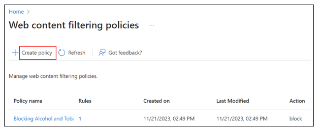
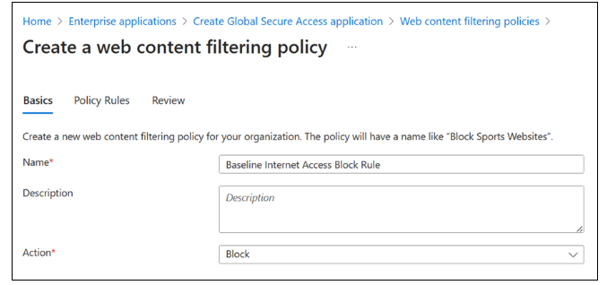
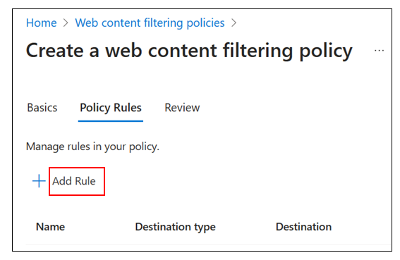
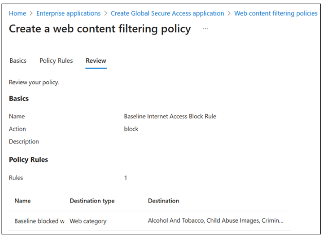
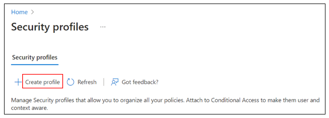
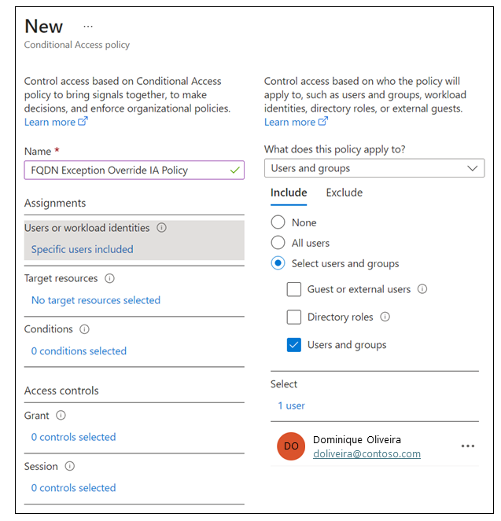

# Microsoft's Security Service Edge Solution Deployment Guide for Microsoft Entra Internet Access Proof of Concept

The [Microsoft identity-centric Security Service Edge solution](../global-secure-access/overview-what-is-global-secure-access.md) converges network and identity access controls so you can secure access to any app or resource from any location, device, or identity. It enables and orchestrates access policy management for employees, business partners, and digital workloads. You can monitor and adjust user access continuously in real time if permissions or risk levels change for private apps, SaaS apps, and Microsoft endpoints.

Protecting enterprise users and managed devices from malicious internet traffic and malware infection concerns all companies. Use [Microsoft Entra Internet Access](../global-secure-access/concept-internet-access.md) Secure Web Gateway functionality to block traffic based on web categories, and a fully qualified domain name (FQDN), by integrating with Microsoft Entra Conditional Access.

The guidance in this article helps you to deploy [Microsoft Entra Internet Access](../global-secure-access/concept-internet-access.md) as a proof-of-concept in your production or test environment. It includes setup and configuring web content filtering. You can review prerequisites in the [Microsoft's Security Service Edge Solution Deployment Guide Introduction](sse-deployment-guide-intro.md), which includes how to scope your configuration and testing for specific test users and groups.

## Deploy and test Microsoft Entra Internet Access

Complete the [Configure initial product](sse-deployment-guide-intro.md#configure-initial-product) steps. Learn to enable the Microsoft Entra Internet Access traffic forwarding profile and install the Global Secure Access Client on a test device. For these sample PoC scenarios, you need one test group with one test user as a member.

- [Create a baseline policy applying to all internet access traffic routed through the service](#sample-poc-scenario-create-a-baseline-policy-applying-to-all-internet-access-traffic-routed-through-the-service)
- [Block a group from accessing websites based on category](#sample-poc-scenario-block-a-group-from-accessing-websites-based-on-category)
- [Block a group from accessing websites based on FQDN](#sample-poc-scenario-block-a-group-from-accessing-websites-based-on-fqdn)
- [Allow a user to access a blocked website](#sample-poc-scenario-allow-a-user-to-access-a-blocked-website)

## Sample PoC scenario: Create a baseline policy applying to all internet access traffic routed through the service

Microsoft Internet Access has features to configure a security profile with a priority of 65,000 that applies to all traffic without linking to a Conditional Access policy. Complete the following tasks to create this baseline policy to block an FQDN:

- Configure a block rule for a risky web category by [creating a web filtering policy](#create-a-web-filtering-policy).
- Group and prioritize your web filtering policies by [creating a security profile](#create-a-security-policy-profile) with priority 65,000.
- Use your test user to [attempt to access the blocked site](#attempt-to-access-blocked-sites) to confirm application of your rule.
- [Stop the agent and confirm that your test user can access](#stop-the-agent-and-confirm-restored-access) the previously blocked site.
- [View activity in the traffic log](#view-activity-in-the-traffic-log).

### Create a web filtering policy

1. In the **Microsoft Entra admin center**, go to **Global Secure Access** \> **Secure** \> **Web content filtering policies** \> **Create policy** \> **[Configure Global Secure Access content filtering](../global-secure-access/how-to-configure-web-content-filtering.md)**.

    

1. On **Create a web content filtering policy** \> **Basics**, provide the following details.
   * **Name**: Baseline Internet Access block rule.
   * **Description**: Add a description.
   * **Action**: Block.

   
      
1. Select **Next**.
1. On **Create a web content filtering policy** \> **Policy Rules**, select **Add Rule**.

   
   
1. In the **Add Rule** dialog box, provide the following details.
   * **Name**: Baseline blocked web categories.
   * **Destination type:** webCategory.
   * **Search**: Select a few risky categories, confirm they are in the Selected items list.

   

1. Select **Add**.
1. On **Create a web content filtering policy** \> **Policy Rules**, confirm your selections.

   
   
1. Select **Next**.
1. On **Create a web content filtering policy** \> **Review**, confirm your policy configuration.
1. Select **Create policy**.

   
   
1. To confirm policy creation, view it in the **Manage web content filtering policies** list.

### Create a security policy profile

1. In the **Microsoft Entra admin center**, go to **Global Secure Access** \> **Secure** \> **Security profiles**. Select **Create profile**.

   
   
1. On **Create a profile** \> **Basics**, provide the following details.
   * **Profile name**: Baseline Internet Access Block Profile.
   * **Description:** Add a description.
   * **State**: enabled.
   * **Priority:** 65000.

   
      
1. Select **Next**.
1. On **Create a profile** \> **Link policies**, select **Link a policy**. Select **Existing policy**.
   * In the **Link a policy** dialog box, select **Policy name** and select **Baseline Internet Access block rule**.
   * **Priority**: 100.
   * **State**: Enabled.
1. Select **Add**.
1. On **Create a profile** \> **Link policies**, confirm **Baseline Internet Access Block Rule** is in the list.
1. Select **Next**.
1. On **Create a profile** \> **Review**, confirm your profile configuration.

   
   
1. Select **Create a profile**.

### Attempt to access blocked sites

1. Sign in to the test device where you installed the global secure access (GSA) agent.
1. In the system tray, right-click **Global Secure Access Client**. Select **Advanced Diagnostics**.

   
   
1. In the **Global Secure Access Client - Advanced Diagnostics** dialog box, select **Traffic**.
1. On **Network traffic**, select **Start collecting**.

   
   
1. To confirm blocked access, attempt to open the FQDN you blocked. It can take up to 20 minutes for the policy to apply to your client device.

### Stop the agent and confirm restored access

1. On **Network traffic**, select **Stop collecting**.
1. Scroll to observe the traffic related to opening the FQDN, and associated data.

   

1. On your test device \> System Tray \>, expand options \> right-click **Global Secure Access client**. Select **Pause**.

   
   
1. After the confirmation notification appears, open the previously blocked site to confirm restored access.

### View activity in the traffic log

1. In the **Microsoft Entra admin center** \> **Global Secure Access** \> **Monitor**, select [**Traffic logs**](../global-secure-access/how-to-view-traffic-logs.md). If needed, select **Add filter**. Filter when **User principal name** contains *testuser* and **Action** set to **Block**.
1. Observe the entries for your target FQDN that show traffic as blocked and then allowed. There may be a delay of up to 20 minutes for entries to appear in the log.

   

## Sample PoC scenario: Block a group from accessing websites based on category

Use Microsoft Entra Internet Access to block or allow access to internet sites based on category. These areas include gambling, alcohol, and tobacco sites. Manually managing blocklists isn't required. Complete the following tasks to configure Microsoft Entra Internet Access to block alcohol and tobacco sites for your test user.

- Configure a block rule for category sites. [Create a web filtering policy](#create-a-web-filtering-policy-1).
- Group and prioritize your web filtering policies. [Create a security profile](#create-a-security-policy-profile-1).
- Configure your test group, with the test user, to use the security profile. [Create and assign a Conditional Access policy](#create-a-conditional-access-policy).
- Confirm rule application by using your test user to [attempt to access a blocked site](#attempt-to-access-blocked-sites-1).
- [Stop the agent and confirm test user access](#stop-the-agent-and-confirm-restored-access-1) to the previously blocked site.
- [View activity in the traffic log](#view-activity-in-the-traffic-log-1).

### Create a web filtering policy

1. In the **Microsoft Entra admin center**, go to **Global Secure Access** \> **Secure** \> **Web content filtering policies** \> **Create policy** \> **[Configure Global Secure Access content filtering](../global-secure-access/how-to-configure-web-content-filtering.md)**.

   
   
1. On **Create a web content filtering policy** \> **Basics**, provide the following details.
   * **Name**: Blocking Alcohol and Tobacco.
   * **Description:** Add a description.
   * **Action**: Block.
1. Select **Next**.
1. On **Create a web content filtering policy** \> **Policy Rules**, select **Add Rule**.
1. In the **Add Rule** dialog box, provide the following details.
   * **Name**: Alcohol and Tobacco.
   * **Destination type**: webCategory.
   * **Search**: Alcohol.
   * Select **Alcohol and Tobacco**.
1. Select **Add**.
1. On **Create a web content filtering policy** \> **Policy Rules**, select **Next**.
1. On **Create a web content filtering policy** \> **Review**, confirm your policy configuration.

   
   
1. Select **Create policy**.
1. To confirm policy creation, view it in the **Manage web content filtering policies** list.

   

### Create a security policy profile

1. In the **Microsoft Entra admin center**, go to **Global Secure Access** \> **Secure** \> **Security profiles**. Select **Create profile**.

   
   
1. On **Create a profile** \> **Basics**, provide the following details.
   * **Profile name**: Internet Access Profile.
   * **Description:** Add a description.
   * **State**: enabled.
   * **Priority:** 1000.
1. Select **Next**.
1. On **Create a profile** \> **Link policies**, select **Link a policy**.
1. Select **Existing policy**.
1. In the **Link a policy** dialog box, provide the following details.
   * **Policy name**: Blocking Alcohol and Tobacco.
   * **Priority:** 1000.
   * **State**: Enabled.
1. Select **Add**.
1. On **Create a profile** \> **Link policies**, confirm **Blocking Alcohol and Tobacco** in list.
1. Select **Next**.
1. On **Create a profile** \> **Review**, confirm your profile configuration.

   

1. Select **Create a profile**.

### Create a Conditional Access policy

1. In the **Microsoft Entra admin center**, go to **Protection** \> **Conditional Access**. Select **Create new policy**.
1. In the **New Conditional Access Policy** dialog box, configure the following details.
   * **Name**: **Internet Access Policy**.
   * **Users or workload identities:** **Specific users included**.
   * **What does this policy apply to?** **Users and groups**.
   * **Include** \> **Select users and groups** \> Select **Users and groups**.
1. Select your test group \> click **Select**.

   
      
1. **Target resources**.
   * **Select what this policy applies to** \> **Global Secure Access**.
   * **Select the traffic profiles this policy applies to** \> **Internet traffic**.

   
        
1. Leave the **Grant** control at default to grant access so that your defined security profile defines block functionality.
1. In the **Session** dialog box, select **Use Global Secure Access security profile**.
1. Select **Internet Access Profile**.

   
    
1. In **Conditional Access Overview** \> **Enable policy**, select **On**. Select **Create**.

### Attempt to access blocked sites

1. Sign in to your test device where you installed the GSA agent.
1. In the system tray, right-click **Global Secure Access Client**. Select **Advanced Diagnostics**.

   
   
1. In the **Global Secure Access Client - Advanced Diagnostics** dialog box, select **Traffic**.
1. On **Network traffic**, select **Start collecting**.

   
    
1. Attempt to open an alcohol or tobacco site to confirm blocked access. You should see **DeniedTraffic** for http websites and a **Can't reach this page** notification for https websites. It can take up to 20 minutes for the policy to apply to your client device.

### Stop the agent and confirm restored access

1. On **Network traffic**, select **Stop collecting**.
1. Scroll to observe the traffic related to opening the FQDN and associated data. Note the **Internet Access** in the **Channel** columns. Conditional Access policies are written as claims to your token that have a one-hour lifetime. It can take up to one hour for new Conditional Access policies to apply to your client device. Because changes propagate across Microsoft Entra, it can take up to 20 minutes for web-filtering policy and security-profile changes to apply to your client device.

   
    
1. On your test device \> System Tray \>, expand options \> right-click **Global Secure Access client**. Select **Pause**.

   
   
1. After confirmation notification appears, open the previously blocked site to confirm restored access. Functionality to access the GSA client menu is administratively controllable when the product moves to General Availability.

### View activity in the traffic log

1. In the **Microsoft Entra admin center** \> **Global Secure Access** \> **Monitor**, select **Traffic logs**.
1. If needed, select **Add filter**. Filter when **User principal name** contains *testuser* and **Action** set to **Block**.
1. Observe the entries for your target FQDN that show traffic as blocked and then allowed. There can be a delay of up to 20 minutes for entries to appear in the log.

   

## Sample PoC scenario: Block a group from accessing websites based on FQDN

In some cases, it's necessary to block specific websites rather than using broad web categories. Complete the following tasks to block access to the site based on FQDN. Ensure you include relevant fully qualified domain names (FQDNs) in use by the site that you want to block.

- Configure a block rule for a specific FQDN. [Create a web filtering policy](#create-a-web-filtering-policy-2).
- Group and prioritize your web filtering policies. [Create a security profile](#create-a-security-policy-profile-2).
- Configure your test group (the user is a member) to use the security profile. [Create and assign a Conditional Access policy](#create-a-conditional-access-policy-1).
- Confirm rule application by using your test user to [attempt to access a blocked site](#attempt-to-access-blocked-sites-2).
- [Stop the agent and confirm test user access](#stop-the-agent-and-confirm-restored-access-2) to the previously blocked site.
- [View activity in the traffic log](#view-activity-in-the-traffic-log-2).

### Create a web filtering policy

1. In the **Microsoft Entra admin center**, go to **Global Secure Access** \> **Secure** \> **Web content filtering policies** \> **Create policy** \> **[Configure Global Secure Access content filtering](../global-secure-access/how-to-configure-web-content-filtering.md)**.

   
   
1. On **Create a web content filtering policy** \> **Basics**, provide the following details.
   * **Name**: Blocking test FQDN.
   * **Description:** Add a description.
   * **Action**: Block.
1. Select **Next**.
1. On **Create a web content filtering policy** \> **Policy Rules**, select **Add Rule**.
1. In the **Add Rule** dialog box, provide the following details.
   * **Name**: Enter the name, such as *Block test FQDN*.
   * **Destination type:** FQDN.
   * **Destination**: enter the test FQDN in the format *\*.domainname.com* or *domainname.com*.
1. Select **Add**.
1. On **Create a web content filtering policy** \> **Policy Rules**, confirm your selections.
1. Select **Next**.
1. On **Create a web content filtering policy** \> **Review**, confirm your policy configuration.

   

1. Select **Create policy**.
1. To confirm policy creation, view it in the **Manage web content filtering policies** list.

### Create a security policy profile

1. In the **Microsoft Entra admin center**, go to **Global Secure Access** \> **Secure** \> **Security profiles**. Select **Create profile**.

   
   
1. On **Create a profile** \> **Basics**, provide the following details.
   * **Profile name**: Block FQDNs Internet Access Profile.
   * **Description:** Add a description.
   * **State**: enabled.
   ***Priority:** 2000.
1. Select **Next**.
1. On **Create a profile** \> **Link policies**, select **Link a policy**.
1. Select **Existing policy**.
1. In the **Link a policy** dialog box, provide the following details.
   * **Policy name**: Blocking test FQDN.
   * **Priority:** 100.
   * **State**: Enabled.
1. Select **Add**.
1. On the **Link policies** tab, confirm **Blocking test FQDN** in list.
1. Select **Next**.
1. On the **Review** tab, confirm your profile configuration.

   

1. Select **Create a profile**.

### Create a Conditional Access policy

1. In the **Microsoft Entra admin center**, go to **Protection** \> **Conditional Access**. Select **Create new policy**.
1. In the **New Conditional Access Policy** dialog box, configure the following.
   * **Name**: FQDN Internet Access Policy.
   * **Users or workload identities:** Specific users included.
   * **What does this policy apply to?** Users and groups.
   * **Include** \> **Select users and groups** \> Select **Users and groups**.
   * Select your test group. Click **Select**.

   

1. **Target resources** \> **Select what this policy applies to** \> **Global Secure Access**.
1. **Select the traffic profiles this policy applies to** \> **Internet traffic**.

   

1. In the **Session** dialog box, select **Block FQDNs Internet Access Profile**. Select **Internet Access Profile**.
1. In **Conditional Access Overview** \> **Enable policy**, select **On**. Select **Create**.

   

### Attempt to access blocked sites

1. Sign in to your test device where you installed the GSA agent.
1. In the System Tray, right-click **Global Secure Access Client**. Select **Advanced Diagnostics**.

   

1. In the **Global Secure Access Client - Advanced Diagnostics** dialog box, select **Traffic**.
1. On **Network traffic**, select **Start collecting**.

   

1. Attempt to open the FQDN you configured to confirm blocked access. You should see **Access Denied** for http websites and **Can't reach this page** notification for https websites. It can take up to 20 minutes for the policy to apply to your client device.

### Stop the agent and confirm restored access

1. On **Network traffic**, select **Stop collecting**.
1. Scroll to observe the traffic related to opening the FQDN, and associated data.

   

1. On your test device \> System Tray \>, expand options \> right-click **Global Secure Access client**. Select **Pause**.

   

1. After the confirmation notification appears, open the previously blocked site to confirm restored access.

### View activity in the traffic log

1. In the **Microsoft Entra admin center** \> **Global Secure Access** \> **Monitor**, select **Traffic logs**.
1. If needed, select **Add filter**. Filter when **User principal name** contains *testuser* and **Action** set to **Block**.
1. Observe the entries for your target FQDN that show traffic as blocked and then allowed. There can be a delay of up to 20 minutes for entries to appear in the log.

## Sample PoC scenario: Allow a user to access a blocked website

In some cases, you might have users that require access to blocked sites for groups in which the user is a member. Complete the following tasks to override a block configured for your test group, so the test user can access the blocked site.

- Configure an allow rule for the same FQDN that you blocked in the previous scenario. [Create a web filtering policy](#create-a-web-filtering-policy-3).
- Group and prioritize your web filtering policies. [Create a security profile](#create-a-security-policy-profile-3) with a higher priority than the block policy created previously.
- Configure your test user to use the security profile. [Create and assign a Conditional Access policy](#create-a-conditional-access-policy-2).
- Confirm rule application by using your test user to [attempt to access a blocked site](#attempt-to-access-blocked-sites-3).
- [Stop the agent and confirm test user access](#stop-the-agent-and-confirm-restored-access-3) to the previously blocked site.
- [View activity in the traffic log](#view-activity-in-the-traffic-log-3).

### Create a web filtering policy

1. In the **Microsoft Entra admin center**, go to **Global Secure Access** \> **Secure** \> **Web content filtering policies** \> **Create policy** \> **[Configure Global Secure Access content filtering](../global-secure-access/how-to-configure-web-content-filtering.md)**.

   

1. On **Create a web content filtering policy** \> **Basics**, provide the following details.
   * **Name**: Allow test FQDN.
   * **Description:** Add a description.
   * **Action**: Allow.
1. Select **Next**.
1. On **Create a web content filtering policy** \> **Policy Rules**, select **Add Rule**.
1. In the **Add Rule** dialog box, provide the following details. Select **Add**.
   * **Name**: Enter a name, such as *Allow FQDN Override*.
   * **Destination type:** *FQDN*.
   * **Destination**: enter the FQDN in the format *\*.domainname.com* or *domain.com*. Select **Add**.
1. On **Create a web content filtering policy** \> **Policy Rules**, confirm your selections.
1. Select **Next**.
1. On **Create a web content filtering policy** \> **Review**, confirm your policy configuration.

   

1. Select **Create policy**.
1. To confirm policy creation, view it in the **Manage web content filtering policies** list.

### Create a security policy profile

1. In the **Microsoft Entra admin center**, go to **Global Secure Access** \> **Secure** \> **Security profiles**. Select **Create profile**.

   ](media/sse-deployment-guide-internet-access/security-profiles-expanded.png#lightbox)

1. On **Create a profile** \> **Basics**, provide the following details.
   * **Profile name**: Allow FQDNs Internet Access Profile.
   * **Description:** Add a description.
   * **State**: enabled.
   * **Priority:** 500.
1. Select **Next**.
1. On **Create a profile** \> **Link policies**, select **Link a policy**.
1. Select **Existing policy**.
1. In the **Link a policy** dialog box, provide the following details.
   * **Policy name**: Allow test FQDN.
   * **Priority:** 100.
   * **State**: Enabled.
1. Select **Add**.
1. On **Create a profile** \> **Link policies**, confirm **Allow test FQDN** in list.
1. Select **Next**.
1. On the **Review** tab, confirm your profile configuration.

   

1. Select **Create a profile**.

### Create a Conditional Access policy

1. In the **Microsoft Entra admin center**, go to **Protection** \> **Conditional Access**. Select **Create new policy**.
1. In the **New Conditional Access Policy** dialog box, configure the following.
   * **Name**: FQDN Exception Override IA Policy.
   * **Users or workload identities:** Specific users included.
   * **What does this policy apply to?** Users and groups.
   * **Include** \> **Select users and groups** \> Select **Users and groups**.
   * Select your test group. Click **Select**.

   

1. **Target resources** \> **Select what this policy applies to** \> **Global Secure Access**.
1. **Select the traffic profiles this policy applies to** \> **Internet traffic**.

   

1. **Session** \> select **Use Global Secure Access security profile**, select **Allow FQDNs Internet Access Profile**. Click **Select**.
1. In **Conditional Access Overview** \> **Enable policy**, select **On**. Select **Create**.

   
### Attempt to access blocked sites

1. Sign in to your test device where you installed the GSA agent.
1. In the System Tray, right-click **Global Secure Access Client**. Select **Advanced Diagnostics**.

   

1. In the **Global Secure Access Client - Advanced Diagnostics** dialog box, select **Traffic**.
1. On **Network traffic**, select **Start collecting**.

   

1. To confirm access for this specific user, attempt to open the FQDN that you configured as an exception. It can take up to 20 minutes for the policy to apply to your client device.

### Stop the agent and confirm restored access

1. On **Network traffic**, select **Stop collecting**.
1. Scroll to observe the traffic related to opening the FQDN.

### View activity in the traffic log

1. In the **Microsoft Entra admin center** \> **Global Secure Access** \> **Monitor**, select **Traffic logs**. If needed, select **Add filter**. Filter when **User principal name** contains *testuser* and **Action** set to **Block**.
1. Observe the entries for your target FQDN that show traffic as blocked and then allowed. There can be a delay of up to 20 minutes for entries to appear in the log.

   

## Next steps

- [Introduction to Microsoft's Security Service Edge Solution Deployment Guide for Proof of Concept](sse-deployment-guide-intro.md)
- [Deploy and verify Microsoft Entra Private Access](sse-deployment-guide-private-access.md)
- [Deploy and verify Microsoft Entra Internet Access for Microsoft Traffic](sse-deployment-guide-microsoft-traffic.md)
