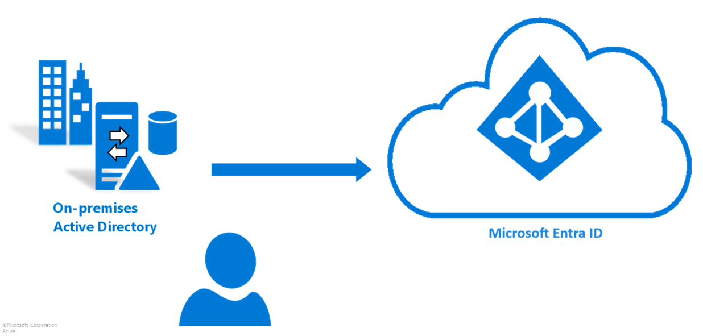

# Directory synchronization

Many organizations have a hybrid infrastructure that encompasses both on-premises and cloud components. Synchronizing users' identities between local and cloud directories lets users access resources with a single set of credentials.

Synchronization is the process of 

* creating an object based on certain conditions,
* keeping the object updated, and
* removing the object when conditions are no longer met.

On-premises provisioning involves provisioning from on-premises sources (such as Active Directory) to Microsoft Entra ID. 

## When to use directory synchronization

Use directory synchronization when you need to synchronize identity data from your on premises Active Directory environments to Microsoft Entra ID as illustrated in the following diagram.

## System components

* **Microsoft Entra ID**: Synchronizes identity information from organization's on premises directory via Microsoft Entra Connect.
* **Microsoft Entra Connect**: A tool for connecting on premises identity infrastructures to Microsoft Entra ID. The wizard and guided experiences help you to deploy and configure prerequisites and components required for the connection (including sync and sign on from Active Directories to Microsoft Entra ID).
* **Active Directory**: Active Directory is a directory service that is included in most Windows Server operating systems. Servers that run Active Directory Domain Services (AD DS) are called domain controllers. They authenticate and authorize all users and computers in the domain.

Microsoft designed [Microsoft Entra Connect cloud sync](~/identity/hybrid/cloud-sync/what-is-cloud-sync.md) to meet and accomplish your hybrid identity goals for synchronization of users, groups, and contacts to Microsoft Entra ID. Microsoft Entra Connect cloud sync uses the Microsoft Entra cloud provisioning agent instead of the Microsoft Entra Connect application.

## Implement directory synchronization with Microsoft Entra ID

Explore the following resources to learn more about directory synchronization with Microsoft Entra ID.

* [What is identity provisioning with Microsoft Entra ID?](~/identity/hybrid/what-is-provisioning.md)Provisioning is the process of creating an object based on certain conditions, keeping the object up-to-date and deleting the object when conditions are no longer met. On-premises provisioning involves provisioning from on premises sources (like Active Directory) to Microsoft Entra ID.
* [Hybrid Identity: Directory integration tools comparison](~/identity/hybrid/index.yml) describes differences between Microsoft Entra Connect Sync and Microsoft Entra Connect cloud provisioning.
* [Microsoft Entra Connect and Microsoft Entra Connect Health installation roadmap](~/identity/hybrid/connect/how-to-connect-install-roadmap.md) provides detailed installation and configuration steps.

## Next steps

* [What is hybrid identity with Microsoft Entra ID?](~/identity/hybrid/whatis-hybrid-identity.md) Microsoft's identity solutions span on-premises and cloud-based capabilities. Hybrid identity solutions create a common user identity for authentication and authorization to all resources, regardless of location.
* [Install the Microsoft Entra Connect provisioning agent](~/identity/hybrid/cloud-sync/how-to-install.md) walks you through the installation process for the Microsoft Entra Connect provisioning agent and how to initially configure it in the Azure portal.
* [Microsoft Entra Connect cloud sync new agent configuration](~/identity/hybrid/cloud-sync/how-to-configure.md) guides you through configuring Microsoft Entra Connect cloud sync.
* [Microsoft Entra authentication and synchronization protocol overview](auth-sync-overview.md) describes integration with authentication and synchronization protocols. Authentication integrations enable you to use Microsoft Entra ID and its security and management features with little or no changes to your applications that use legacy authentication methods. Synchronization integrations enable you to sync user and group data to Microsoft Entra ID and then user Microsoft Entra management capabilities. Some sync patterns enable automated provisioning.
