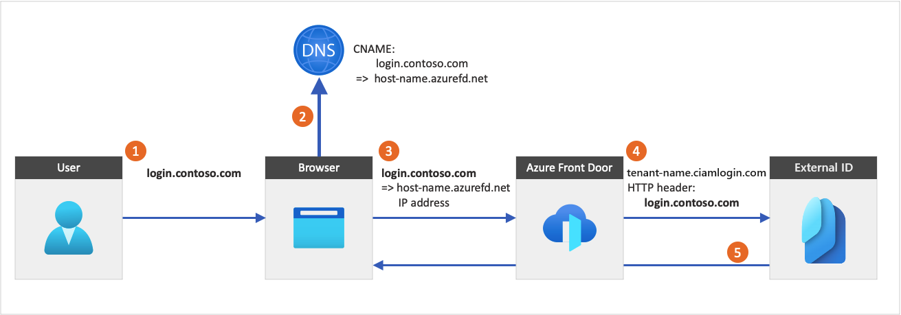

# Custom URL domains in external tenants

[!INCLUDE [applies-to-external-only](../includes/applies-to-external-only.md)]

A custom URL domain allows you to brand your application’s sign-in endpoints with your own custom URL domain instead of Microsoft’s default domain name.

:::image type="content" source="./media/concept-custom-url-domain/custom-domain-user-experience-small.png" alt-text="Screenshot demonstrates an External ID custom URL domain user experience." lightbox="./media/concept-custom-url-domain/custom-domain-user-experience.png":::

Using a verified custom URL domain has several benefits:

- It provides a more consistent user experience. From the user's perspective, they remain in your domain during the sign in process rather than redirecting to the default domain *&lt;tenant-name&gt;.ciamlogin.com*.
- You mitigate the effect of [third-party cookie blocking](~/identity-platform/reference-third-party-cookies-spas.md) by staying in the same domain for your application during sign-in.

> [!TIP]
> 
>
> To try out this feature, go to the Woodgrove Groceries demo and start the "Custom domain name” use case.

## How a custom URL domain works

A custom URL domain lets you use your verified custom domain names as your applications' sign-in authentication endpoints. When you add a new custom domain name, you can associate it with a custom URL domain. Then a reverse proxy service, such as [Azure Front Door](https://azure.microsoft.com/services/frontdoor/), can use the custom URL domain to direct sign-ins to your application.

The following diagram illustrates Azure Front Door integration:

1. From an application, a user selects the sign in button, which takes them to the sign in page. This page specifies a custom URL domain.
1. The web browser resolves the custom URL domain to the Azure Front Door IP address. During Domain Name System (DNS) resolution, a canonical name (CNAME) record with a custom URL domain points to your Front Door default front-end host (for example, `contoso-frontend.azurefd.net`).
1. The traffic addressed to the custom URL domain (for example, `login.contoso.com`) is routed to the specified Front Door default front-end host (`contoso-frontend.azurefd.net`).
1. Azure Front Door invokes content using the `<tenant-name>.ciamlogin.com` default domain. The request to the endpoint includes the original custom URL domain.
1. External ID responds to the custom URL domain request by displaying the relevant content and the original custom URL domain.

Azure Front Door passes the user's original IP address, which is the IP address you see in the audit reporting.

> [!IMPORTANT]
> If the client sends an `x-forwarded-for` header to Azure Front Door, External ID will use the originator's `x-forwarded-for` as the user's IP address for Conditional Access evaluation and the `{Context:IPAddress}` claims resolver.

### Considerations and limitations

When using custom URL domains:

- You can set up multiple custom domains. For the maximum number of supported custom domains, see [Microsoft Entra service limits and restrictions](~/identity/users/directory-service-limits-restrictions.md) for Microsoft Entra, and [Azure subscription and service limits, quotas, and constraints](/azure/azure-resource-manager/management/azure-subscription-service-limits#azure-front-door-classic-limits) for Azure Front Door.
- You can use Azure Front Door, which is a separate Azure service that incurs extra charges. For more information, see [Front Door pricing](https://azure.microsoft.com/pricing/details/frontdoor). Your Azure Front Door instance can be hosted in a different subscription than your external tenant.
- If you have multiple applications, migrate them all to the custom URL domain because the browser stores the session under the domain name currently being used.

> [!IMPORTANT]
>
>- The connection from the browser to Azure Front Door should always use IPv4 instead of IPv6.

### Blocking the default domain

After you configure custom URL domains, users will still be able to access the default domain name *&lt;tenant-name&gt;.ciamlogin.com*. You need to block access to the default domain so that attackers can't use it to access your apps or run distributed denial-of-service (DDoS) attacks. Submit a support ticket to request the blocking of access to the default domain.

> [!CAUTION]
> Make sure your custom domain works properly before you request that the default domain be blocked. After the default domain is blocked, the following features will no longer work:
>
>- The "Run now" feature in the user flow pane and in the getting started experience
>- PowerApp pages and Azure App Services
>- In the Visual Studio Code extension, running MSAL samples on the default domain
>- Azure Function Apps and Azure App Services with External ID
>- Visual Studio with External ID
>- Some samples, such as [OpenAI Chat Application with Microsoft Entra Authentication (Python)](https://github.com/Azure-Samples/openai-chat-app-entra-auth-builtin/blob/main/README.md)

## Next steps

[Enable custom URL domains for Microsoft Entra External ID](how-to-custom-url-domain.md).