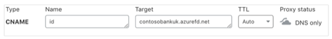
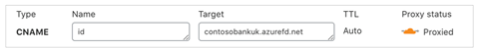
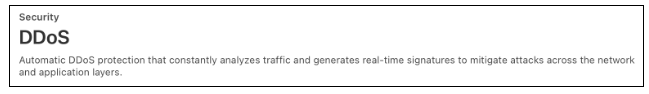
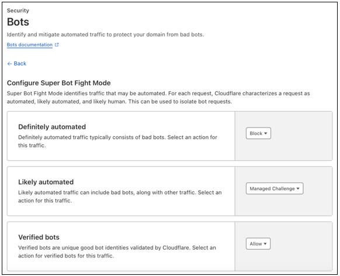
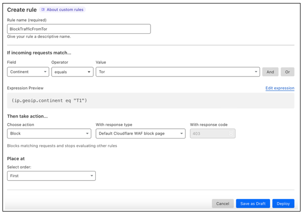
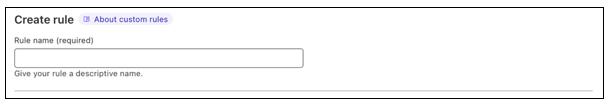
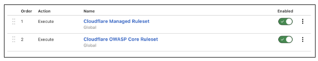

# Tutorial: Configure Cloudflare Web Application Firewall with Microsoft Entra External ID

In this tutorial, learn how to configure Cloudflare Web Applcation Firewall ([Cloudflare WAF](https://www.cloudflare.com/application-services/products/waf/)) to protect your organization from attacks, such as distributed denial of service (DDoS), malicious bots, Open Worldwide Application Security Project [(OWASP) Top-10](https://owasp.org/www-project-top-ten/) security risks, and others. 

## Prerequisites

To get started, you need:

* Microsoft Entra External ID tenant
* Microsoft [Azure Front Door (AFD)](/azure/frontdoor/front-door-overview)
* Cloudflare account with WAF

Learn about tenants and securing apps for consumers and customers with [Microsoft Entra External ID](../external-identities-overview.md).

### Scenario description

* **Microsoft Entra External ID tenant** – The identity provider (IdP) and authorization server that verifies user credentials with custom policies defined for the tenant. 
* **Azure Front Door** – Enables custom URL domains for Microsoft Entra External ID. Traffic to custom URL domains goes through Cloudflare WAF, it then goes to AFD, and then to the Microsoft Entra External ID tenant. 
* **Cloudflare WAF** – Security controls to protect traffic to the authorization server. 

## Enable custom URL domains

The first step is to enable custom domains with AFD. Use the instructions in, [Enable custom URL domains for apps in external tenants (Preview)](../customers/how-to-custom-url-domain.md). 

## Create a Cloudflare account

1. Go to [Cloudflare.com/plans](https://www.cloudflare.com/plans/) to create an account. 
2. To enable WAF, on the **Application Services** tab, select **Pro**. 

### Configure the domain name server (DNS)

Enable WAF for a domain.

1. In the DNS console, for CNAME, enable the proxy setting.

   

2. Under DNS, for **Proxy status**, select **Proxied**.
3. The status turns orange.

   

## Cloudflare security controls

For optimal protection, we recommend you enable Cloudflare security controls. 

### DDoS protection

1. Go to the [Cloudflare dashboard](https://developers.cloudflare.com/workers/get-started/dashboard/).
2. Expand the Security section.
3. Select **DDoS**.
4. A message appears. 

    

### Bot protection

1. Go to the [Cloudflare dashboard](https://developers.cloudflare.com/workers/get-started/dashboard/).
2. Expand the Security section.
3. Under **Configure Super Bot Fight Mode**, for **Definitely automated**, select **Block**.
4. For **Likely automated**, select **Managed Challenge**.
5. For **Verified bots**, select **Allow**.

   

## Firewall rules: Traffic from the Tor network

We recommend you block traffic that originates from the Tor proxy network, unless your organization needs to support the traffic. 

   > [!NOTE]
   > If you can't block Tor traffic, select **Interactive Challenge**, not **Block**.

### Block traffic from the Tor network

1. Go to the [Cloudflare dashboard](https://developers.cloudflare.com/workers/get-started/dashboard/). 
2. Expand the Security section.
3. Select **WAF**.
4. Select **Create rule**.
5. For **Rule name**, enter a relevant name.
6. For **If incoming requests match**, for **Field**, select **Continent**.
7. For **Operator**, select **equals**.
8. For **Value**, select **Tor**.
9. For **Then take action**, select **Block**.
10. For **Place at**, select **First**.
11. Select **Deploy**.

    

   > [!NOTE]
   > You can add custom HTML pages for visitors.

## Firewall rules: Traffic from countries or regions

We recommended strict security controls on traffic from countries or regions where business is unlikely to occur, unless your organization has a business reason to support traffic from al countries or regions.  

   > [!NOTE]
   > If you can't block traffic from a country or region, select **Interactive Challenge**, not **Block**.

## Block traffic from countries or regions

For the following instructions, you can add custom HTML pages for visitors. 

1. Go to the [Cloudflare dashboard](https://developers.cloudflare.com/workers/get-started/dashboard/). 
1. Expand the Security section.
1. Select **WAF**.
1. Select **Create rule**.
1. For **Rule name**, enter a relevant name.
1. For **If incoming requests match**, for **Field**, select **Country** or **Continent**.
1. For **Operator**, select **equals**.
1. For **Value**, select the country or continent to block.
1. For **Then take action**, select **Block**.
1. For **Place at**, select **Last**.
1. Select **Deploy**.

   

### OWASP and managed rulesets

1. Select **Managed rules**.
2. For **Cloudflare Managed Ruleset**, select **Enabled**.
3. For **Cloudflare OWASP Core Ruleset**, select **Enabled**.

   

## Next steps

* [What is Azure Web Application Firewall on Azure Application Gateway?](/azure/web-application-firewall/ag/ag-overview)
* Cloudflare Docs: [Cloudflare Zero Trust: Azure AD](https://developers.cloudflare.com/cloudflare-one/identity/idp-integration/azuread/)
* [Tutorial: Configure Cloudflare WAF with Azure AD B2C](/azure/active-directory-b2c/partner-cloudflare)
   

   
