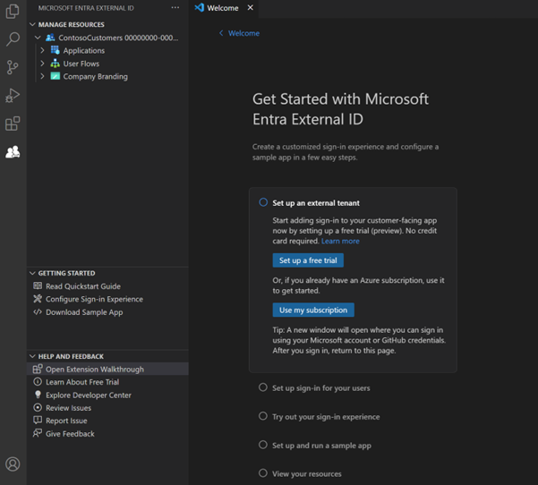
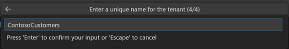
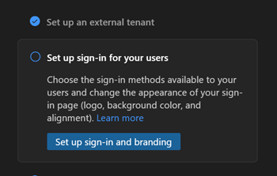
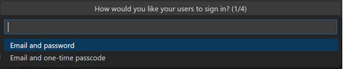
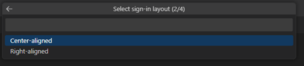
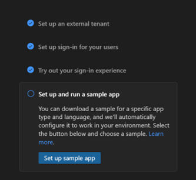
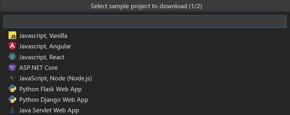
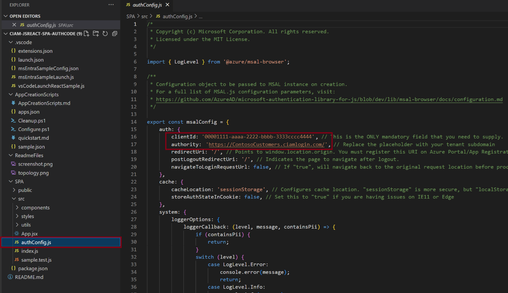
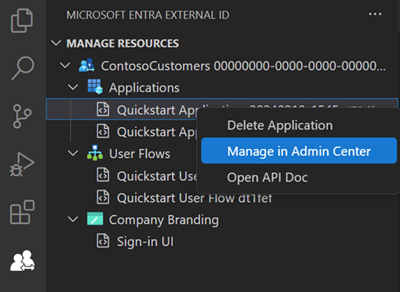
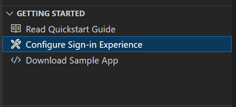

# Quickstart: Get started with the Microsoft Entra External ID extension for Visual Studio Code

Integrating authentication into your customer-facing applications is essential for securing resources and customer data. The Microsoft Entra External ID extension for Visual Studio Code lets you quickly add authentication to applications  for customer identity and access management (CIAM) scenarios. Using the application samples provided, you can see how to set up a customized, branded sign-in experience for external users of your application without leaving the development environment.

This extension provides a basic setup that automatically creates a tenant for applications and prepares it for users. It also streamlines your workflow by automatically populating values such as application IDs into your configuration file for a smoother setup process.

External ID is a service that can be added to an Azure subscription. If you already have one, you can easily include External ID. Otherwise, you can set up a [free trial of Microsoft Entra External ID](quickstart-trial-setup.md) within Visual Studio Code and start by configuring a sample app.

## Installing the extension

The Microsoft Entra External ID extension is available in the Visual Studio Code Marketplace.

1. If you don’t already have Visual Studio Code installed, [download Visual Studio Code](https://code.visualstudio.com/Download) and complete the installation steps.
1. Open Visual Studio Code. In the activity bar on the left, select the **Extensions** button.
1. In the Extensions Marketplace search box, search for and select  **Microsoft Entra External ID**.
1. On the **Get Started with Microsoft Entra External ID** overview page, select the **Install** button.
1. Restart Visual Studio Code when prompted.

After the extension is installed, you can access it using the icon on the activity bar.

You can also open the extension from Visual Studio Code **Welcome** page: Select **Help** > **Welcome**, and then under **Walkthroughs**, select **Get started with Microsoft Entra External ID**. You might need to select **More…** to expand the list of extensions.

## Get started with your External ID setup

The Microsoft Entra External ID extension creates a tenant in an external configuration, which contains your customer-facing app and directory of external users. You can add this new tenant to your existing Azure subscription. Or if you don’t have an Azure subscription, you can create a trial tenant that doesn't require one ([learn more](https://learn.microsoft.com/en-us/entra/external-id/customers/quickstart-trial-setup)).

1. On the Get Started with Microsoft Entra External ID welcome page, choose an option:

   - If you don't already have an Azure Account, select **Set up a free trial**.
   - If you already have an Azure account, select **Use Azure subscription**.
 
### To set up a free trial

1. Select **Set up a free trial**.
1. In the sign-in confirmation message, select **Allow**.
1. A new browser window opens. You can sign in using your personal account, Microsoft account (MSA), or GitHub account. Once you’re signed in, you can close the browser window.
1. Return to Visual Studio Code. In the **Where should the tenant be located?** menu, select a location for your tenant data. This selection can't be changed later.
1. Enter a name for the tenant.

   

1. The extension creates your trial tenant. You can view the progress by opening the **View** > **Output** window. When finished, you see the message **The tenant is created**.

### To use your subscription

1. Select **Use my subscription**.
1. If there are multiple tenants associated with your account, the Choose a directory menu appears. Select the directory (tenant) associated with the subscription you want to use.

   
  
   > [!NOTE]
   > If you see the message “No subscriptions available,” you can set up a free trial instead.

1. A browser page opens where you can sign in to your account. After you sign in, return to Visual Studio Code.
1. In the Add a subscription menu, select your subscription.
1. In the Select a resource group menu, choose a resource group.  
1. In the Where should the tenant be located? menu, select a location for your tenant data. This selection can't be changed later.
1. Enter a name for the tenant, and then select Enter to create the tenant.

   

1. The tenant creation process can take up to 30 minutes.
Note: Once the tenant is created, you can access it in both the Microsoft Entra admin center and the Azure portal.

## Set up sign-in for your users

You can configure your app to allow users to sign in with their email and a password or a one-time passcode. You can also design the look and feel of the user experience by adding your company logo, changing the background color, or adjusting the sign-in layout. These  changes apply to the look and feel of all your apps in this new tenant.

1. Select Set up sign-in and branding.

   

1. You’re prompted to sign in to the new tenant. Select **Allow**, and in the browser window that opens, choose the account you’re currently using and sign in. Return to Visual Studio Code.

1. In the H**ow would you like your users to sign in?** menu at the top, choose the sign-in methods you want to make available to your users: **Email and password**, **Email and one-time passcode**, or both.

   

1. Select **OK**.

1. Choose where you want the sign-in page to appear in the browser window, either **Center-aligned** or **Right-aligned**.

   

1. Select a background color for your sign-up page.

   

1. Next, a File Explorer window opens so you can add your company logo. Browse to your company logo file, and then select Upload.

   > [!NOTE]
   > Image requirements are as follows:
   > - Image size 245 x 36 px
   > - Maximum file size 50 KB
   > - File type: Transparent PNG or JPEG

1. The message **Configuring sign-in flow** appears. You can view the progress in the Output window. When configuration is finished, the message **User flow setup is complete** appears.  

## Set up and run a sample app

The extension contains several code samples that demonstrate how authentication is implemented in different application types and development languages. You can choose a single page application (JavaScript, React, Angular) or a	Node.js Browserless App sample from within the extension. The extension automatically configures the application with your sign-in experience.

1. Select **Set up and run a sample app**.

1. Select the **Set up sample app button**. In the menu, select the type of app you want to download. You might be prompted to select your account again; choose the same account you’ve been using.

   

1. A File Explorer window opens so you can choose where you want to save the sample repository. Select a folder, and then select **Download repository here**.
1. When the download completes, a new Visual Studio Code project workspace opens with the downloaded app folder displayed in the Explorer.
1. Open a new terminal in the Visual Studio Code window.
1. In the top menu, select **Run** > **Run without debugging**. The Debug Console shows the launch script progress. There's a short delay while the project is set up and the build script runs.

When the extension downloads the application, it automatically updates the Microsoft Authentication Library (MSAL) configuration to connect to your new tenant and to use the experience you set up. No further configuration is needed; you can run the application as soon as the project is built. For example in the authConfig file, the **clientId** is set to your application ID and the **authority** is set to the subdomain for your new tenant.

## Run the experience

After setup is complete, you can try out the sign-in experience by entering the local host redirect URI for the application in a browser. The redirect URL is available in the application’s README.md file.

## Use the Explorer view

The Explorer view displays the registered applications and authentication user flows in your tenant. You can view configuration information  or navigate directly to the Microsoft Entra admin center to further configure or manage the resource. To access the Explorer view, open the Microsoft Entra External ID extension by selecting the icon in the activity bar.

## Manage resources

To view project resources, expand the nodes in the left panel under Manage Resources.

In the Explorer view, you can select a resource and go directly to the Microsoft Entra admin center to manage or configure it. For example, you can right-click an application and select **Open in admin center**. You’re prompted to sign in, and then the Microsoft Entra admin center opens directly to the app registration page for that application.

## Getting Started actions

In the Getting Started section, you can access documentation for the free trial, or go directly to the sign-in experience configuration or sample app download pages without opening the extension walkthrough.

## Next steps

[Learn more about External ID free trial tenants](quickstart-trial-setup.md).
