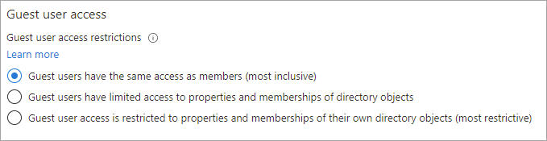
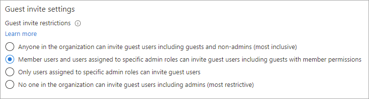
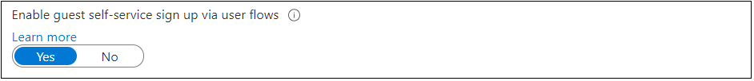
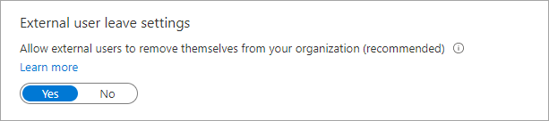

# Configure external collaboration settings for B2B in Microsoft Entra External ID

[!INCLUDE [applies-to-workforce-only](./includes/applies-to-workforce-only.md)]

External collaboration settings let you specify what roles in your organization can invite external users for B2B collaboration. These settings also include options for [allowing or blocking specific domains](allow-deny-list.md), and options for restricting what external guest users can see in your Microsoft Entra directory. The following options are available:

- **Determine guest user access**: Microsoft Entra External ID allows you to restrict what external guest users can see in your Microsoft Entra directory. For example, you can limit guest users' view of group memberships, or allow guests to view only their own profile information.

- **Specify who can invite guests**: By default, all users in your organization, including B2B collaboration guest users, can invite external users to B2B collaboration. If you want to limit the ability to send invitations, you can turn invitations on or off for everyone, or limit invitations to certain roles.

- **Enable guest self-service sign-up via user flows**: For applications you build, you can create user flows that allow a user to sign up for an app and create a new guest account. You can enable the feature in your external collaboration settings, and then [add a self-service sign-up user flow to your app](self-service-sign-up-user-flow.yml).

- **Allow or block domains**: You can use collaboration restrictions to allow or deny invitations to the domains you specify. For details, see [Allow or block domains](allow-deny-list.md).

For B2B collaboration with other Microsoft Entra organizations, you should also review your [cross-tenant access settings](cross-tenant-access-settings-b2b-collaboration.yml) to ensure your inbound and outbound B2B collaboration and scope access to specific users, groups, and applications.

For B2B collaboration end-users who perform cross-tenant sign-ins, their home tenant branding appears, even if there isn't custom branding specified. In the following example, the company branding for Woodgrove Groceries appears on the left. The example on the right displays the default branding for the user's home tenant.

:::image type="content" source="media/external-identities-overview/b2b-comparison.png" alt-text="Screenshots showing a comparison of the branded sign-in experience and the default sign-in experience.":::

## Configure settings in the portal

> [!NOTE]
> In the Microsoft Entra admin center, you must be assigned the Global Administrator role to activate the External Collaboration Settings page and update the settings. When using Microsoft Graph, lesser privileged roles might be available for individual settings; see [Configure settings with Microsoft Graph](#configure-settings-with-microsoft-graph) later in this article.

### To configure guest user access

1. Sign in to the [Microsoft Entra admin center](https://entra.microsoft.com).

1. Browse to **Entra ID** > **External Identities** > **External collaboration settings**.

1. Under **Guest user access**, choose the level of access you want guest users to have:
  
    

   - **Guest users have the same access as members (most inclusive)**: This option gives guests the same access to Microsoft Entra resources and directory data as member users.

   - **Guest users have limited access to properties and memberships of directory objects**: (Default) This setting blocks guests from certain directory tasks, like enumerating users, groups, or other directory resources. Guests can see membership of all non-hidden groups. [Learn more about default guest permissions](~/fundamentals/users-default-permissions.md#member-and-guest-users).

   - **Guest user access is restricted to properties and memberships of their own directory objects (most restrictive)**: With this setting, guests can access only their own profiles. Guests aren't allowed to see other users' profiles, groups, or group memberships.

### To configure guest invite settings

1. Sign in to the [Microsoft Entra admin center](https://entra.microsoft.com).

1. Browse to **Entra ID** > **External Identities** > **External collaboration settings**.

1. Under **Guest invite settings**, choose the appropriate settings:

    

   - **Anyone in the organization can invite guest users including guests and non-admins (most inclusive)**: To allow guests in the organization to invite other guests including users who aren't members of an organization, select this radio button.
   - **Member users and users assigned to specific admin roles can invite guest users including guests with member permissions**: To allow member users and users who have specific administrator roles to invite guests, select this radio button.
   - **Only users assigned to specific admin roles can invite guest users**: To allow only those users with [User Administrator](~/identity/role-based-access-control/permissions-reference.md#user-administrator) or [Guest Inviter](~/identity/role-based-access-control/permissions-reference.md#guest-inviter) roles to invite guests, select this radio button.
   - **No one in the organization can invite guest users including admins (most restrictive)**: To deny everyone in the organization from inviting guests, select this radio button.

### To configure guest self-service sign-up

1. Sign in to the [Microsoft Entra admin center](https://entra.microsoft.com).

1. Browse to **Entra ID** > **External Identities** > **External collaboration settings**.

1. Under **Enable guest self-service sign up via user flows**, select **Yes** if you want to be able to create user flows that let users sign up for apps. For more information about this setting, see [Add a self-service sign-up user flow to an app](self-service-sign-up-user-flow.yml).

    

### To configure external user leave settings

1. Sign in to the [Microsoft Entra admin center](https://entra.microsoft.com).

1. Browse to **Entra ID** > **External Identities** > **External collaboration settings**.

1. Under **External user leave settings**, you can control whether external users can remove themselves from your organization.

   - **Yes**: Users can leave the organization themselves without approval from your admin or privacy contact.
   - **No**: Users can't leave your organization themselves. They see a message guiding them to contact your admin or privacy contact to request removal from your organization.

   > [!IMPORTANT]
   > You can configure **External user leave settings** only if you have [added your privacy information](~/fundamentals/properties-area.yml) to your Microsoft Entra tenant. Otherwise, this setting will be unavailable.

   

### To configure collaboration restrictions (allow or block domains)

[!INCLUDE [least-privilege-note](../includes/definitions/least-privilege-note.md)]

1. Sign in to the [Microsoft Entra admin center](https://entra.microsoft.com).

1. Browse to **Entra ID** > **External Identities** > **External collaboration settings**.

1. Under **Collaboration restrictions**, you can choose whether to allow or deny invitations to the domains you specify and enter specific domain names in the text boxes. For multiple domains, enter each domain on a new line. For more information, see [Allow or block invitations to B2B users from specific organizations](allow-deny-list.md).

   :::image type="content" source="./media/external-collaboration-settings-configure/collaboration-restrictions.png" alt-text="Screenshot showing Collaboration restrictions settings."::: 

## Configure settings with Microsoft Graph

External collaboration settings can be configured by using the Microsoft Graph API:

- For **Guest user access restrictions** and **Guest invite restrictions**, use the [authorizationPolicy](/graph/api/resources/authorizationpolicy?view=graph-rest-1.0&preserve-view=true) resource type.
- For the **Enable guest self-service sign up via user flows** setting, use the [authenticationFlowsPolicy](/graph/api/resources/authenticationflowspolicy?view=graph-rest-1.0&preserve-view=true) resource type.
- For **External user leave settings**, use the [externalidentitiespolicy](/graph/api/resources/externalidentitiespolicy?view=graph-rest-1.0&preserve-view=true) resource type.
- For email one-time passcode settings (now on the **All identity providers** page in the Microsoft Entra admin center), use the [emailAuthenticationMethodConfiguration](/graph/api/resources/emailAuthenticationMethodConfiguration?view=graph-rest-1.0&preserve-view=true) resource type.

## Assign the Guest Inviter role to a user

With the [Guest Inviter](~/identity/role-based-access-control/permissions-reference.md#guest-inviter) role, you can give individual users the ability to invite guests without assigning them a higher privilege administrator role. Users with the Guest Inviter role are able to invite guests even when the option **Only users assigned to specific admin roles can invite guest users** is selected (under **Guest invite settings**).

Here's an example that shows how to use Microsoft Graph PowerShell to add a user to the `Guest Inviter` role:


```powershell

Import-Module Microsoft.Graph.Identity.DirectoryManagement

$roleName = "Guest Inviter"
$role = Get-MgDirectoryRole | where {$_.DisplayName -eq $roleName}
$userId = <User Id/User Principal Name>

$DirObject = @{
  "@odata.id" = "https://graph.microsoft.com/v1.0/directoryObjects/$userId"
  }

New-MgDirectoryRoleMemberByRef -DirectoryRoleId $role.Id -BodyParameter $DirObject

```

## Sign-in logs for B2B users

When a B2B user signs into a resource tenant to collaborate, a sign-in log is generated in both the home tenant and the resource tenant. These logs include information such as the application being used, email addresses, tenant name, and tenant ID for both the home tenant and the resource tenant. 

## Next steps

See the following articles on Microsoft Entra B2B collaboration:

- [What is Microsoft Entra B2B collaboration?](what-is-b2b.md)
- [Adding a B2B collaboration user to a role](./add-users-administrator.yml)

