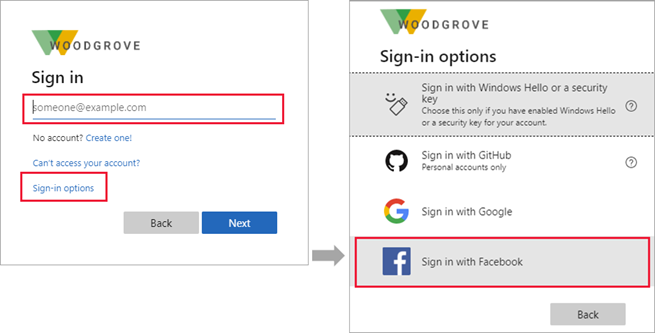

# Add Facebook as an identity provider for External ID

[!INCLUDE [applies-to-workforce-only](./includes/applies-to-workforce-only.md)]

> [!TIP]
> This article describes adding Facebook as an identity provider for B2B collaboration in workforce tenants. For instructions for external tenants, see [Add Facebook as an identity provider](customers/how-to-facebook-federation-customers.md).

You can add Facebook to your self-service sign-up user flows so that users can sign in to your applications using their own Facebook accounts. To allow users to sign in using Facebook, you first need to [enable self-service sign-up](self-service-sign-up-user-flow.yml) for your tenant. After you add Facebook as an identity provider, set up a user flow for the application and select Facebook as one of the sign-in options.

After you add Facebook as one of your application's sign-in options, on the **Sign in** page, a user can enter the email they use to sign in to Facebook, or they can select **Sign-in options** and choose **Sign in with Facebook**. In either case, they're redirected to the Facebook sign in page for authentication.



> [!NOTE]
> Users can only use their Facebook accounts to sign up through apps using self-service sign-up and user flows. Users cannot be invited and redeem their invitation using a Facebook account.

## Create an app in the Facebook developers console

To use a Facebook account as an [identity provider](identity-providers.md), you need to create an application in the Facebook developers console. If you don't already have a Facebook account, you can sign up at [https://www.facebook.com/](https://www.facebook.com).

> [!NOTE]
> This document was created using the state of the provider’s developer page at the time of creation, and changes may occur.

1. Sign in to [Facebook for developers](https://developers.facebook.com/apps) with your Facebook developer account credentials.
1. If you haven't already done so, register as a Facebook developer: Select **Get Started** in the upper-right corner of the page, accept Facebook's policies, and complete the registration steps.
1. Select **Create App**. This step may require you to accept Facebook platform policies and complete an online security check.
1. Select **Authenticate and request data from users with Facebook Login** > **Next**.
1. Under **Are you building a game?** select **No, I'm not building a game** and then **Next**.
1. Add an app name and a valid app contact email. You can also add a business account if you have one.
1. Select **Create app**.
1. Once your app is created, go to the Dashboard.
1. Select **App settings** > **Basic**.
    1. Copy the value of **App ID**. Then select **Show** and copy the value of **App Secret**. You use both of these values to configure Facebook as an identity provider in your tenant. **App Secret** is an important security credential.
    1. Enter a URL for the **Privacy Policy URL**, for example `https://www.contoso.com/privacy`. The policy URL is a page you maintain to provide privacy information for your application.
    1. Enter a URL for the **Terms of Service URL**, for example `https://www.contoso.com/tos`. The policy URL is a page you maintain to provide terms and conditions for your application.
    1. Enter a URL for the **User Data Deletion**, for example `https://www.contoso.com/delete_my_data`. The User Data Deletion URL is a page you maintain to provide away for users to request that their data be deleted.
    1. Choose a **Category**, for example **Business and pages**. Facebook requires this value, but it's not used by Microsoft Entra ID.
1. At the bottom of the page, select **Add platform**, select **Website**, and then select **Next**.
1. In **Site URL**, enter the address of your website, for example `https://contoso.com`. 
1. Select **Save changes**. 
1. Select **Use cases** on the left and select **Customize** next to **Authentication and account creation**.
1. Select **Go to settings** under **Facebook Login**.
1.  In **Valid OAuth Redirect URIs**, enter the following URIs, replacing `<tenant-ID>` with your Microsoft Entra tenant ID and `<tenant-name>` with your Microsoft Entra tenant name:

- `https://login.microsoftonline.com/te/<tenant-ID>/oauth2/authresp`
- `https://login.microsoftonline.com/te/<tenant-subdomain>.onmicrosoft.com/oauth2/authresp`
- `https://<tenant-name>.ciamlogin.com/<tenant-ID>/federation/oidc/www.facebook.com`
- `https://<tenant-name>.ciamlogin.com/<tenant-name>.onmicrosoft.com/federation/oidc/www.facebook.com`
- `https://<tenant-name>.ciamlogin.com/<tenant-ID>/federation/oauth2`
- `https://<tenant-name>.ciamlogin.com/<tenant-name>.onmicrosoft.com/federation/oauth2`

16. Select **Save changes** and select **Apps** at the top of the page and select the app you've just created.
17. Select **Use cases** on the left hand side of the page and select **Customize** next to **Authentication and account creation**.
18. Add email permissions by selecting **Add** under **Permissions**.
19. Select **Go back** at the top of the page.
20. At this point, only Facebook application owners can sign in. Because you registered the app, you can sign in with your Facebook account. To make your Facebook application available to your users, from the menu, select **Go live**. Follow all of the steps listed to complete all requirements. You'll likely need to complete data handling questions and the business verification to verify your identity as a business entity or organization. For more information, see [Meta App Development](https://developers.facebook.com/docs/development/release).
	
## Configure a Facebook account as an identity provider
Now you set the Facebook client ID and client secret, either by entering it in the Microsoft Entra admin center or by using PowerShell. You can test your Facebook configuration by signing up via a user flow on an app enabled for self-service sign-up.

### To configure Facebook federation in the Microsoft Entra admin center


1. Sign in to the [Microsoft Entra admin center](https://entra.microsoft.com) as at least an [External Identity Provider Administrator](~/identity/role-based-access-control/permissions-reference.md#external-identity-provider-administrator).
1. Browse to **Entra ID** > **External Identities** > **All identity providers**, then on the **Facebook** line, select **Configure**.
1. For the **Client ID**, enter the **App ID** of the Facebook application that you created earlier.
1. For the **Client secret**, enter the **App secret** that you recorded.

   :::image type="content" source="media/facebook-federation/add-social-identity-provider-page.png" alt-text="Screenshot showing the Add social identity provider page.":::

1. Select **Save**.

### To configure Facebook federation by using PowerShell

1. Install the latest version of the [Microsoft Graph PowerShell](/powershell/microsoftgraph/installation).
1. Run the following command:

   ```powershell
   Connect-MgGraph -Scopes "IdentityProvider.ReadWrite.All"
   ```

1. At the sign-in prompt, sign in as at least an [External Identity Provider Administrator](~/identity/role-based-access-control/permissions-reference.md#external-identity-provider-administrator).
1. Run the following commands:

   ```powershell
   $params = @{
      "@odata.type" = "microsoft.graph.socialIdentityProvider"
      displayName = "Facebook"
      identityProviderType = "Facebook"
      clientId = "[Client ID]"
      clientSecret = "[Client secret]"
   }

   New-MgIdentityProvider -BodyParameter $params
   ```

   You might need to [enable self-service sign-up for your tenant](/entra/external-id/self-service-sign-up-user-flow#enable-self-service-sign-up-for-your-tenant).

   > [!NOTE]
   > Use the client ID and client secret from the app you created in the Facebook developer console. For more information, see the [New-MgIdentityProvider](/powershell/microsoftgraph/authentication-commands) article.

## How do I remove Facebook federation?

You can delete your Facebook federation setup. If you do so, any users who have signed up through user flows with their Facebook accounts will no longer be able to sign in. 

### To delete Facebook federation in the Microsoft Entra admin center: 

1. Sign in to the [Microsoft Entra admin center](https://entra.microsoft.com) as at least an [External Identity Provider Administrator](~/identity/role-based-access-control/permissions-reference.md#external-identity-provider-administrator).
1. Browse to **Entra ID** > **External Identities** > **All identity providers**.
1. Select the **Facebook** line. Select **Configured**, and then select **Delete**.
1. Select **Yes** to confirm deletion.

### To delete Facebook federation by using PowerShell: 

1. Install the latest version of the [Microsoft Graph PowerShell](/powershell/microsoftgraph/installation).
1. Run the following command:

   ```powershell
   Connect-MgGraph -Scopes "IdentityProvider.ReadWrite.All"
   ```

1. In the sign-in prompt, sign in as at least an [External Identity Provider Administrator](~/identity/role-based-access-control/permissions-reference.md#external-identity-provider-administrator).  
1. Enter the following command:

   ```powershell
   Remove-MgIdentityProvider -IdentityProviderBaseId "Facebook-OAUTH"
   ```

   > [!NOTE]
   > For more information, see [Remove-MgIdentityProvider](/powershell/module/microsoft.graph.identity.signins/remove-mgidentityprovider).

## Related content

- [SAML/WS-Fed IdP federation](direct-federation.md)
- [Google federation](google-federation.md)
