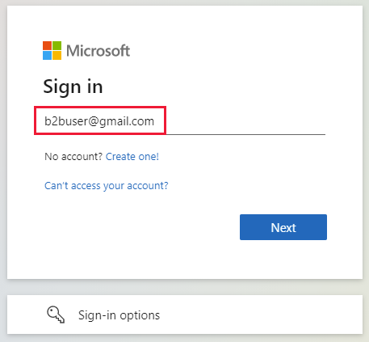
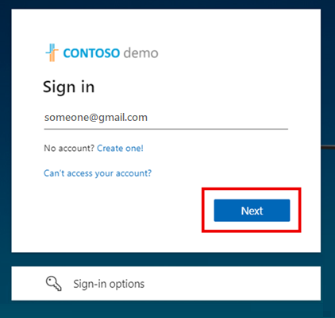
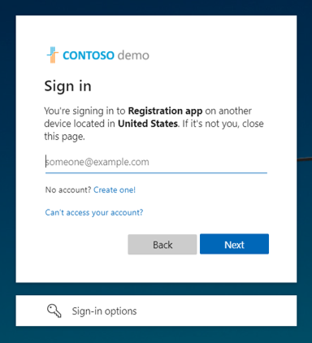
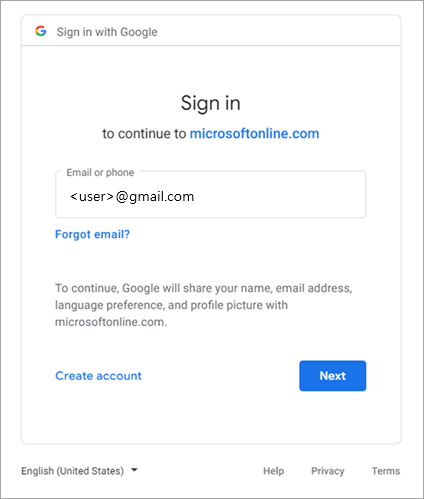
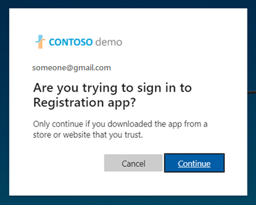
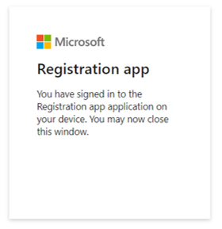
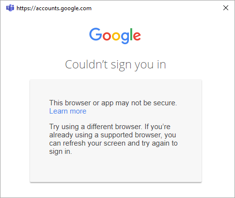
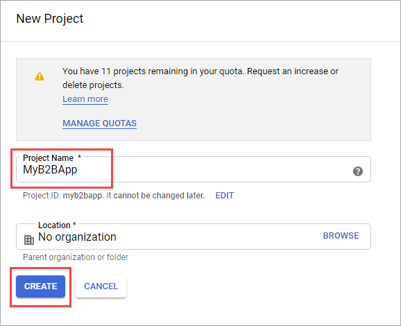
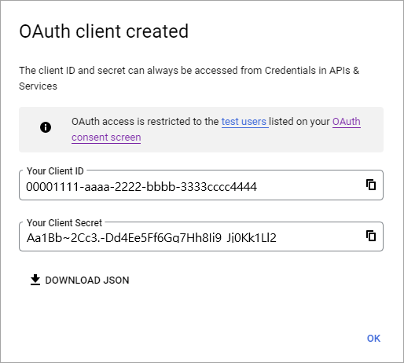
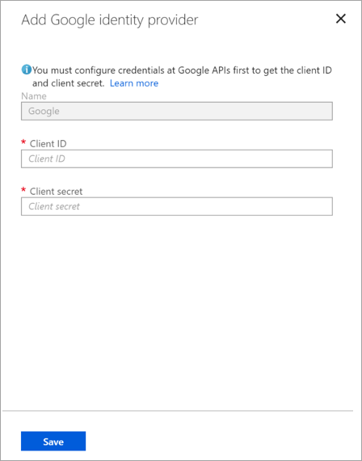

# Add Google as an identity provider for B2B guest users

[!INCLUDE [applies-to-workforce-only](./includes/applies-to-workforce-only.md)]

> [!TIP]
> This article describes adding Google as an identity provider for B2B collaboration in workforce tenants. For instructions for external tenants, see [Add Google as an identity provider](customers/how-to-google-federation-customers.md).

By setting up federation with Google, you can allow invited users to sign in to your shared apps and resources with their own Gmail accounts, without having to create Microsoft accounts. After you add Google as one of your application's sign-in options, on the **Sign in** page, a user can enter the Gmail address they use to sign in to Google.



> [!NOTE]
> Google federation is designed specifically for Gmail users. To federate with Google Workspace domains, use [SAML/WS-Fed identity provider federation](direct-federation.md).

> [!IMPORTANT]
>
> - **Starting July 12, 2021**, if Microsoft Entra B2B customers set up new Google integrations for use with self-service sign-up or for inviting external users for their custom or line-of-business applications, authentication could be blocked for Gmail users (with the error screen shown in [What to expect](#what-to-expect)). This issue occurs only if you create Google integration for self-service sign-up user flows or invitations after July 12, 2021 and Gmail authentications in your custom or line-of-business applications haven’t been moved to system web-views. Because system web-views are enabled by default, most apps will not be affected. To avoid the issue, we strongly advise you to move Gmail authentications to system browsers before creating any new Google integrations for self-service sign-up. Please refer to [Action needed for embedded web-views](#action-needed-for-embedded-frameworks).
> - **Starting September 30, 2021**, Google is [deprecating web-view sign-in support](https://developers.googleblog.com/2021/06/upcoming-security-changes-to-googles-oauth-2.0-authorization-endpoint.html). If your apps authenticate users with an embedded web-view and you're using Google federation with [Azure AD B2C](/azure/active-directory-b2c/identity-provider-google) or Microsoft Entra B2B for external user invitations or [self-service sign-up](identity-providers.md), Google Gmail users won't be able to authenticate. [Learn more](#deprecation-of-web-view-sign-in-support).

## What is the experience for the Google user?

You can invite a Google user to B2B collaboration in various ways. For example, you can [add them to your directory via the Microsoft Entra admin center](b2b-quickstart-add-guest-users-portal.md). When they redeem your invitation, their experience varies depending on whether they're already signed in to Google:

- Guest users who aren't signed in to Google are prompted to do so.
- Guest users who are already signed in to Google are prompted to choose the account they want to use. They must choose the account you used to invite them.

Guest users who see a "header too long" error can clear their cookies or open a private or incognito window and try to sign in again.


## Sign-in endpoints

Google guest users can now sign in to your multitenant or Microsoft first-party apps by using a [common endpoint](redemption-experience.md#redemption-process-and-sign-in-through-a-common-endpoint) (in other words, a general app URL that doesn't include your tenant context). During the sign-in process, the guest user chooses **Sign-in options**, and then selects **Sign in to an organization**. The user then types the name of your organization and continues signing in using their Google credentials.

Google guest users can also use application endpoints that include your tenant information, for example:

  * `https://myapps.microsoft.com/?tenantid=<your tenant ID>`
  * `https://myapps.microsoft.com/<your verified domain>.onmicrosoft.com`
  * `https://portal.azure.com/<your tenant ID>`

You can also give Google guest users a direct link to an application or resource by including your tenant information, for example `https://myapps.microsoft.com/signin/X/<application ID?tenantId=<your tenant ID>`.

## Deprecation of web-view sign-in support

Starting September 30, 2021, Google is [deprecating embedded web-view sign-in support](https://developers.googleblog.com/2021/06/upcoming-security-changes-to-googles-oauth-2.0-authorization-endpoint.html). If your apps authenticate users with an embedded web-view and you're using Google federation with [Azure AD B2C](/azure/active-directory-b2c/identity-provider-google) or Microsoft Entra B2B for [external user invitations](google-federation.md) or [self-service sign-up](identity-providers.md), Google Gmail users won't be able to authenticate.

The following are known scenarios that affect Gmail users:
- Microsoft apps (for example, Teams and Power Apps) on Windows 
- Windows apps that use the [WebView](/windows/communitytoolkit/controls/wpf-winforms/webview) control, [WebView2](/microsoft-edge/webview2/), or the older WebBrowser control, for authentication. These apps should migrate to using the Web Account Manager (WAM) flow.
- Android applications using the WebView UI element 
- iOS applications using UIWebView/WKWebview 
- [Apps using ADAL](~/identity-platform/howto-get-list-of-all-auth-library-apps.md)

This change doesn't affect:
- Web apps
- Microsoft 365 services that are accessed through a website (for example, SharePoint Online, Office web apps, and Teams web app)
- Mobile apps using system web-views for authentication ([SFSafariViewController](https://developer.apple.com/documentation/safariservices/sfsafariviewcontroller) on iOS, [Custom Tabs](https://developer.chrome.com/docs/android/custom-tabs/overview/) on Android).  
- Google Workspace identities, for example when you’re using [SAML-based federation](direct-federation.md) with Google Workspace
- Windows apps that use the Web Account Manager (WAM) or Web Authentication Broker (WAB).  

### Action needed for embedded web-views

Modify your apps to use the system browser for sign-in. For details, see [Embedded web view vs system browser](/entra/msal/dotnet/acquiring-tokens/using-web-browsers#embedded-web-view-vs-system-browser) in the MSAL.NET documentation. All MSAL SDKs use the system browser by default.

### What to expect

Starting September 30, Microsoft will globally roll out a device sign-in flow that serves as a workaround for apps still using embedded web-views to ensure that authentication isn’t blocked.

### How to sign in with the device sign-in flow

The device sign-in flow prompts users who sign in with a Gmail account in an embedded web-view to enter a code in a separate browser before they can finish signing in. If users are signing in with their Gmail account for the first time with no active sessions in the browser, they see the following sequence of screens. If an existing Gmail account is already signed in, some of these steps might be eliminated.

1. On the **Sign in** screen, the user enters their Gmail address and selects **Next**.

   

1. The following screen appears, prompting the user to open a new window, navigate to https://microsoft.com/devicelogin, and enter the nine digit alphanumeric code displayed.

   

1. The device sign-in page opens, where the user can enter the code. 

   

1. If the codes match, the user is asked to reenter their email to confirm their app and sign-in location for security purposes.

   

1. The user signs in to Google with their email and password.

   

1. Once again, they're asked to confirm the app they're signing into.

   

1. The user selects **Continue**. A prompt confirms that they’re signed in. The user closes the tab or window and is returned to the first screen, where they're now signed in to the app.

   

Alternatively, you can have your existing and new Gmail users sign in with email one-time passcode. To have your Gmail users use email one-time passcode:

1. [Enable email one-time passcode](one-time-passcode.md#enable-or-disable-email-one-time-passcodes).
2. [Remove Google Federation](google-federation.md#how-do-i-remove-google-federation).
3. [Reset redemption status](reset-redemption-status.md) of your Gmail users so they can use email one-time passcode going forward.

If you want to request an extension, impacted customers with affected OAuth client IDs should have received an email from Google Developers with the following information regarding a one-time policy enforcement extension, which must be completed by January 31, 2022:

- "If necessary, you may request a one-time **policy enforcement extension for embedded webviews** for each listed OAuth client ID until January 31, 2022. For clarity, the policy for embedded webviews will be enforced on February 1, 2022 with no exceptions or extensions."

Applications that are migrated to an allowed web-view for authentication won't be affected, and users will be allowed to authenticate via Google as usual.

If applications aren't migrated to an allowed web-view for authentication, then affected Gmail users see the following screen.



### Distinguishing between CEF/Electron and embedded web-views

In addition to the [deprecation of embedded web-view and framework sign-in support](#deprecation-of-web-view-sign-in-support), Google is also [deprecating Chromium Embedded Framework (CEF) based Gmail authentication](https://developers.googleblog.com/2020/08/guidance-for-our-effort-to-block-less-secure-browser-and-apps.html). For applications built on CEF, such as Electron apps, Google will disable authentication on June 30, 2021. Impacted applications have received notice from Google directly, and aren't covered in this documentation.  This document pertains to the embedded web-views described previously, which Google will restrict at a separate date on September 30, 2021.

### Action needed for embedded frameworks

Follow [Google’s guidance](https://developers.googleblog.com/2016/08/modernizing-oauth-interactions-in-native-apps.html) to determine if your apps are affected.

## Step 1: Configure a Google developer project

First, create a new project in the Google Developers Console to obtain a client ID and a client secret that you can later add to Microsoft Entra External ID. 
1. Go to the Google APIs at https://console.developers.google.com, and sign in with your Google account. We recommend that you use a shared team Google account.

1. Accept the terms of service if you're prompted to do so.

1. Create a new project: At the top of the page, select the project menu to open the **Select a project** page. Choose  **New Project**.

1. On the **New Project** page, give the project a name (for example, `MyB2BApp`), and then select **Create**:
   
   

1. Open the new project by selecting the link in the **Notifications** message box or by using the project menu at the top of the page.

1. In the left menu, select **APIs & Services**, and then select **OAuth consent screen**.

1. Under **User Type**, select **External**, and then select **Create**.

1. On the **OAuth consent screen**, under **App information**, enter an **App name**.

1. Under **User support email**, select an email address.

1. Under **Authorized domains**, select **Add domain**, and then add the `microsoftonline.com` domain.

1. Under **Developer contact information**, enter an email address.

1. Select **Save and continue**.

1. In the left menu, select **Credentials**.

1. Select **Create credentials**, and then select **OAuth client ID**.

1. In the Application type menu, select **Web application**. Give the application a suitable name, like `Microsoft Entra B2B`. Under **Authorized redirect URIs**, add the following URIs:

    - `https://login.microsoftonline.com`
    - `https://login.microsoftonline.com/te/<tenant ID>/oauth2/authresp` <br>(where `<tenant ID>` is your tenant ID)
    - `https://login.microsoftonline.com/te/<tenant name>.onmicrosoft.com/oauth2/authresp` <br>(where `<tenant name>` is your tenant name)
   
    > [!NOTE]
    > To find your tenant ID, sign in to the [Microsoft Entra admin center](https://entra.microsoft.com). Under **Entra ID**, select **Overview** and copy the **Tenant ID**.

1. Select **Create**. Copy your client ID and client secret. You use them when you add the identity provider in the Microsoft Entra admin center.

    

1. You can leave your project at a publishing status of **Testing** and add test users to the OAuth consent screen. Or you can select the **Publish app** button on the OAuth consent screen to make the app available to any user with a Google Account.

   > [!NOTE]
   > In some cases, your app might require verification by Google (for example, if you update the application logo). For more information, see Google's [verification status help](https://support.google.com/cloud/answer/10311615#verification-status).

<a name='step-2-configure-google-federation-in-azure-ad-'></a>

## Step 2: Configure Google federation in Microsoft Entra External ID 

You'll now set the Google client ID and client secret. You can use the Microsoft Entra admin center or PowerShell to do so. Be sure to test your Google federation configuration by inviting yourself. Use a Gmail address and try to redeem the invitation with your invited Google account. 

**To configure Google federation in the Microsoft Entra admin center** 
1. Sign in to the [Microsoft Entra admin center](https://entra.microsoft.com) as at least a [External Identity Provider Administrator](~/identity/role-based-access-control/permissions-reference.md#external-identity-provider-administrator).
1. Browse to **Entra ID** > **External Identities** > **All identity providers** and then on the **Google** line, select **Configure**.
1. Enter the client ID and client secret you obtained earlier. Select **Save**:

   

**To configure Google federation by using PowerShell**

1. Install the latest version of the [Microsoft Graph PowerShell module](/powershell/microsoftgraph/installation).
1. Connect to your tenant by using the [Connect-MgGraph](/powershell/microsoftgraph/authentication-commands#using-connect-mggraph) command.
1. At the sign-in prompt, sign in as at least an [External Identity Provider Administrator](~/identity/role-based-access-control/permissions-reference.md#external-identity-provider-administrator).  
1. Run the following commands:

   ```powershell
   $params = @{
      "@odata.type" = "microsoft.graph.socialIdentityProvider"
      displayName = "Login with Google"
      identityProviderType = "Google"
      clientId = "<client ID>"
      clientSecret = "<client secret>"
   }

   New-MgIdentityProvider -BodyParameter $params
   ```

   > [!NOTE]
   > Use the client ID and client secret from the app you created in "Step 1: Configure a Google developer project." For more information, see [New-MgIdentityProvider](/powershell/module/microsoft.graph.identity.signins/new-mgidentityprovider).

## Add Google identity provider to a user flow

At this point, the Google identity provider is set up in your Microsoft Entra tenant. Users who redeem invitations from you can use Google to sign in. However, if you've created self-service sign-up user flows, you also need to add Google to your user flow sign-in pages. To add the Google identity provider to a user flow:

1. Browse to **Entra ID** > **External Identities** > **User flows**.

1. Select the user flow where you want to add the Google identity provider.

1. Under Settings, select **Identity providers.**

1. In the identity providers list, select **Google**.

1. Select **Save**.

## How do I remove Google federation?

You can delete your Google federation setup. If you do so, Google guest users who already redeemed their invitation can't sign in. But you can give them access to your resources again by [resetting their redemption status](reset-redemption-status.md).
 
**To delete Google federation in the Microsoft Entra admin center**
1. Sign in to the [Microsoft Entra admin center](https://entra.microsoft.com) as at least a [External Identity Provider Administrator](~/identity/role-based-access-control/permissions-reference.md#external-identity-provider-administrator).
1. Browse to **Entra ID** > **External Identities** > **All identity providers**.
1. On the **Google** line, select (**Configured**), and then select **Delete**.
   
1. Select **Yes** to confirm the deletion. 

**To delete Google federation by using PowerShell** 

1. Install the latest version of the [Microsoft Graph PowerShell module](/powershell/microsoftgraph/installation).
2. Connect to your tenant by using the [Connect-MgGraph](/powershell/microsoftgraph/authentication-commands#using-connect-mggraph) command.
3. In the sign-in prompt, sign in as at least an [External Identity Provider Administrator](~/identity/role-based-access-control/permissions-reference.md#external-identity-provider-administrator). 
4. Enter the following command:

   ```powershell
   Remove-MgIdentityProvider -IdentityProviderBaseId Google-OAUTH
   ```

   > [!NOTE]
   > For more information, see [Remove-MgIdentityProvider](/powershell/module/microsoft.graph.identity.signins/remove-mgidentityprovider).
