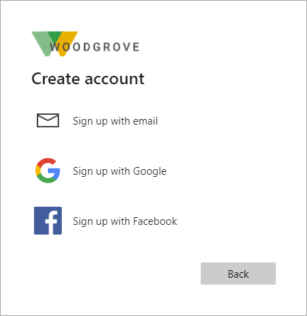

# Identity providers for External ID in workforce tenants

[!INCLUDE [applies-to-workforce-only](./includes/applies-to-workforce-only.md)]

> [!TIP]
> This article applies to B2B collaboration in workforce tenants. For information about external tenants, see [Authentication methods and identity providers in external tenants](customers/concept-authentication-methods-customers.md).

An *identity provider* (IdP) creates, maintains, and manages identity information while providing authentication services to applications. When you share your apps and resources with external users, Microsoft Entra ID is the default identity provider for sharing. If you invite an external user who already has a Microsoft Entra account or Microsoft account, they can automatically sign in without further configuration on your part.

External ID offers various identity providers.

- **Microsoft Entra accounts**: Guest users can use their Microsoft Entra work or school accounts to redeem your B2B collaboration invitations or complete your sign-up user flows. [Microsoft Entra ID](default-account.md) is one of the allowed identity providers by default. No other configuration is needed to make this identity provider available for user flows.

- **Microsoft accounts**: Guest users can use their own personal Microsoft account (MSA) to redeem your B2B collaboration invitations. When setting up a [self-service sign-up](self-service-sign-up-overview.md) user flow, you can add [Microsoft Account](microsoft-account.md) as one of the allowed identity providers. No other configuration is needed to make this identity provider available for user flows.

- **Email one-time passcode**: When a guest redeems an invitation or accesses a shared resource, they can request a temporary code. This code is sent to their email address. Then they enter this code to continue signing in. The email one-time passcode feature authenticates B2B guest users when they can't be authenticated through other means. When setting up a self-service sign-up user flow, you can add **Email One-Time Passcode** as one of the allowed identity providers. Some setup is required; see [Email one-time passcode authentication](one-time-passcode.md).

- **Google**: Google federation allows external users to redeem invitations from you by signing in to your apps with their own Gmail accounts. Google federation can also be used in your self-service sign-up user flows. See how to [add Google as an identity provider](google-federation.md).

   > [!IMPORTANT]
   >
   > - **As of July 12, 2021**, if Microsoft Entra B2B customers set up new Google integrations for use with self-service sign-up for their custom or line-of-business applications, authentication with Google identities won’t work until authentications are moved to system web-views. [Learn more](google-federation.md#deprecation-of-web-view-sign-in-support).
   > - **On September 30, 2021**, Google [deprecated embedded web-view sign-in support](https://developers.googleblog.com/2016/08/modernizing-oauth-interactions-in-native-apps.html). If your apps authenticate users with an embedded web-view and you're using Google federation with [Azure AD B2C](/azure/active-directory-b2c/identity-provider-google) or Microsoft Entra B2B for [external user invitations](google-federation.md) or self-service sign-up, Google Gmail users won't be able to authenticate. [Learn more](google-federation.md#deprecation-of-web-view-sign-in-support).

- **Facebook**: When building an app, you can configure self-service sign-up and enable Facebook federation so that users can sign up for your app using their own Facebook accounts. Facebook can only be used for self-service sign-up user flows and isn't available as a sign-in option when users are redeeming  invitations from you. See how to [add Facebook as an identity provider](facebook-federation.md).

- **SAML/WS-Fed identity provider federation**: You can also set up federation with any external IdP that supports the SAML or WS-Fed protocols. SAML/WS-Fed IdP federation allows external users to use their own IdP-managed accounts to sign in to your apps or resources, without having to create new Microsoft Entra credentials. For more information, see [SAML/WS-Fed identity providers](direct-federation-overview.md). For detailed setup steps, see [Add federation with SAML/WS-Fed identity providers](direct-federation.md).

To configure federation with Google, Facebook, or a SAML/WS-Fed identity provider, you need to be at least an [External Identity Provider Administrator](~/identity/role-based-access-control/permissions-reference.md#external-identity-provider-administrator) in your Microsoft Entra tenant.

## Adding social identity providers

Microsoft Entra ID is enabled by default for self-service sign-up, so users always have the option of signing up using a Microsoft Entra account. However, you can enable other identity providers, including social identity providers like Google or Facebook. To set up social identity providers in your Microsoft Entra tenant, you create an application at the identity provider and configure credentials. You obtain a client or app ID and a client or app secret, which you can then add to your Microsoft Entra tenant.

After you add an identity provider to your Microsoft Entra tenant:

- When you invite an external user to apps or resources in your organization, the external user can sign in using their own account with that identity provider.
- When you enable [self-service sign-up](self-service-sign-up-overview.md) for your apps, external users can sign up for your apps using their own accounts with the identity providers you added. They can select from the social identity providers options you made available on the sign-up page:

   

For an optimal sign-in experience, federate with identity providers whenever possible so you can give your invited guests a seamless sign-in experience when they access your apps.  

## Next steps

To learn how to add identity providers for sign-in to your applications, refer to the following articles:

- [Add email one-time passcode authentication](one-time-passcode.md)
- [Add Google](google-federation.md) as an allowed social identity provider
- [Add Facebook](facebook-federation.md) as an allowed social identity provider
- [Add federation with SAML/WS-Fed identity providers](direct-federation.md)
