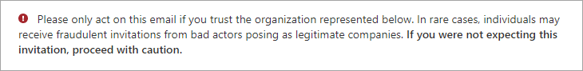
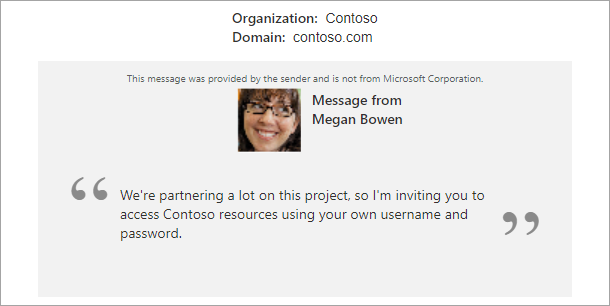
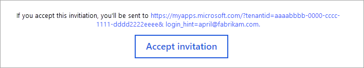

# B2B invitation email layout and language settings

[!INCLUDE [applies-to-workforce-only](./includes/applies-to-workforce-only.md)]

Invitation emails are key to welcoming partners as Microsoft Entra B2B collaboration users. Although [not mandatory](redemption-experience.md#redemption-process-through-a-direct-link), these emails give essential information to help recipients decide whether to accept your invitation. They include a link for quick access to your resources later.

:::image type="content" source="media/invitation-email-elements/invitation-email.png" alt-text="Screenshot of the B2B invitation email.":::

## Explaining the email

Let's review a few elements of the email so you understand how to use their capabilities. These elements might appear slightly different in some email clients. 

### Subject

The subject line of the email follows this pattern:

&lt;username&gt; invited you to access applications within their organization.

### From address

We use a LinkedIn-like pattern for the From address. This pattern should make it clear that although the email comes from invites@microsoft.com, the invitation is from another organization. The format is: Microsoft Invitations <invites@microsoft.com> or Microsoft invitations on behalf of &lt;tenantname&gt; <invites@microsoft.com>. 

> [!NOTE]
> For the Azure service operated by [21Vianet in China](/azure/china/), the sender address is Invites@oe.21vianet.com.  
> For [Microsoft Entra ID for government](/azure/azure-government/), the sender address is invites@azuread.us.

### Reply To

The reply-to email is set to the inviter's email when available, so that replying to the email sends an email back to the inviter.

### Phishing warning

The email starts with a brief phishing warning, advising users to accept only expected invitations. It’s good practice to let partners know in advance to expect your invitation.

### Inviter's information and invitation message

The email includes the name and primary domain associated with the organization sending the invitation. This information should help the invitee make an informed decision about accepting the invitation. The inviter can include a message as part of their invitation to the [directory, group, or app](add-users-administrator.yml), or when they [use the invitation API](customize-invitation-api.md). The message is highlighted in the main section of the email. The inviter's name and profile image are included if available. The message itself is a text area, so for security reasons, it doesn't process HTML tags.

### Accept invitation button or link and redirect URL

The next section of the email shows where the invitee is redirected after accepting the invitation, along with a button or link to proceed. In the future, the invitee can always use this link to return to your resources directly.

### Footer section

The footer provides additional details about the invitation. If the organization [configured a privacy statement](~/fundamentals/properties-area.yml), the link to the statement is displayed here. Otherwise, a note indicates the organization's privacy statement isn't available.

:::image type="content" source="media/invitation-email-elements/footer-section.png" alt-text="Screenshot showing the footer section in the email.":::

## How the language is determined

The following settings determine the language presented to the guest user in the invitation email. The settings are listed in order of precedence. If a setting isn't configured, the next one in the list determines the language.

- The **messageLanguage** property of the [invitedUserMessageInfo](/graph/api/resources/invitedusermessageinfo) object of the [Create invitation API](/graph/api/invitation-post) is used
-	The **preferredLanguage** property specified in the guest's [user object](/graph/api/resources/user)
-	The **Notification language** set in the properties of the guest user's home tenant (for Microsoft Entra tenants only)
-	The **Notification language** set in the properties of the resource tenant

If none of these settings are configured, the language defaults to English (US).

## Next steps

- [B2B collaboration invitation redemption](redemption-experience.md)
