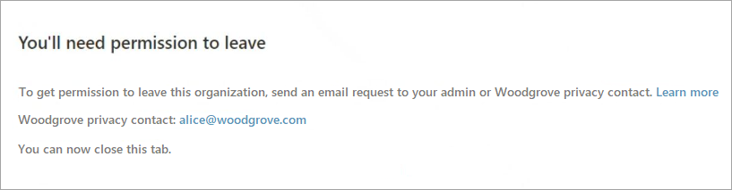

# Leave an organization where you have a guest account

[!INCLUDE [applies-to-workforce-only](./includes/applies-to-workforce-only.md)]

As a Microsoft Entra B2B collaboration or B2B direct connect user, you can leave an organization whenever you no longer need access to its apps. Leaving the organization also ends your association with it.

## Before you begin

You can usually leave an organization on your own without having to contact an administrator. However, in some cases this option won't be available and you'll need to contact your tenant admin, who can delete your account in the external organization.

This article is intended for administrators.

If you're a user looking for information about how to manage and leave an organization, see the [Manage organizations article.](https://support.microsoft.com/account-billing/manage-organizations-for-a-work-or-school-account-in-the-my-account-portal-a9b65a70-fec5-4a1a-8e00-09f99ebdea17)

## What organizations do I belong to?

1. To view the organizations you belong to, first open your **My Account** page. You either have a work or school account  created by an organization or a personal account such as for Xbox, Hotmail, or Outlook.com.  

   - If you're using a work or school account, go to https://myaccount.microsoft.com and sign in.
   - If you're using a personal account or email one-time passcode, you'll need to use a My Account URL that includes your tenant name or tenant ID.
   For example:

      `https://myaccount.microsoft.com?tenantId=contoso.onmicrosoft.com`
    
      -or-
    
      `https://myaccount.microsoft.com?tenantId=aaaabbbb-0000-cccc-1111-dddd2222eeee`
    
      You might need to open this URL in a private browser session.

1. Select **Organizations** from the left navigation pane or select the **Manage organizations** link from the **Organizations** block.

1. The **Organizations** page appears, where you can view and manage the organizations you belong to.

   :::image type="content" source="media/leave-the-organization/organization-list.png" alt-text="Screenshot showing the list of organizations you belong to." lightbox="media/leave-the-organization/organization-list.png":::

   - **Home organization**: Your home organization is listed first. This organization owns your work or school account. Because your account is managed by your administrator, you're not allowed to leave your home organization. You'll see there's no link to **Leave**. If you don't have an assigned home organization, you'll just see a single heading that says **Organizations** with the list of your associated organizations.

   - **Other organizations you collaborate with**: You'll also see the other organizations that you've signed in to previously using your work or school account. You can decide to leave any of these organizations at any time.

## How to leave an organization

If your organization allows users to remove themselves from external organizations, you can follow these steps to leave an organization.

1. Open your **Organizations** page. (Follow the steps in [What organizations do I belong to](#what-organizations-do-i-belong-to), above.)

1. Under **Other organizations you collaborate with** (or **Organizations** if you don't have a home organization), find the organization that you want to leave, and then select **Leave**.

   :::image type="content" source="media/leave-the-organization/leave-org.png" alt-text="Screenshot showing Leave organization option in the user interface." lightbox="media/leave-the-organization/leave-org.png":::

1. When asked to confirm, select **Leave**.
1. If you select **Leave** for an organization but you see the following message, it means you’ll need to contact the organization's admin, or privacy contact and ask them to remove you from their organization.

   

## Why can’t I leave an organization?

In the **Home organization** section, there's no link to **Leave** your organization. Only an administrator can remove your account from your home organization.

For the external organizations listed under **Other organizations you collaborate with**, you might not be able to leave on your own, for example when:

- the organization you want to leave doesn’t allow users to leave by themselves
- your account has been disabled

In these cases, you can select **Leave**, but then you'll see a message saying you need to contact the admin or privacy contact for that organization to ask them to remove you.

## More information for administrators

Administrators can use the **External user leave settings** to control whether external users can remove themselves from their organization. If you disallow the ability for external users to remove themselves from your organization, external users will need to contact your admin, or privacy contact to be removed.

> [!IMPORTANT]
> You can configure **External user leave settings** only if you have [added your privacy information](~/fundamentals/properties-area.yml) to your Microsoft Entra tenant. Otherwise, this setting will be unavailable. We recommend adding your privacy information to allow external users to review your policies and email your privacy contact when necessary.

1. Sign in to the [Microsoft Entra admin center](https://entra.microsoft.com) as at least a [External Identity Provider Administrator](~/identity/role-based-access-control/permissions-reference.md#external-identity-provider-administrator).

1. Browse to **Entra ID** > **External Identities** > **External collaboration settings**.

1. Under **External user leave** settings, choose whether to allow external users to leave your organization themselves:

   - **Yes**: Users can leave the organization themselves without approval from your admin or privacy contact.
   - **No**: Users can't leave your organization themselves. They'll see a message guiding them to contact your admin, or privacy contact to request removal from your organization.

   :::image type="content" source="media/leave-the-organization/external-user-leave-settings.png" alt-text="Screenshot showing External user leave settings in the portal." lightbox="media/leave-the-organization/external-user-leave-settings.png":::

### Account removal

When a B2B collaboration user leaves an organization, the user's account is "soft deleted" in the directory. By default, the user object moves to the **Deleted users** area in Microsoft Entra ID, but permanent deletion doesn't start for 30 days. This soft deletion enables the administrator to restore the user account, including groups and permissions, if the user makes a request to restore the account before it's permanently deleted.

If desired, a tenant administrator can permanently delete the account at any time during the soft-deleted period with the following steps. This action is irrevocable.

1. Sign in to the [Microsoft Entra admin center](https://entra.microsoft.com) as at least a [External Identity Provider Administrator](~/identity/role-based-access-control/permissions-reference.md#external-identity-provider-administrator).

1. Browse to **Entra ID** > **Users**

1. Select **Deleted users**.

1. Select the check box next to a deleted user, and then select **Delete permanently**.

Permanent deletion can be initiated by the admin, or it happens at the end of the soft deletion period. Permanent deletion can take up to an extra 30 days for data removal.

For B2B direct connect users, data removal begins as soon as the user selects **Leave** in the confirmation message and can take up to 30 days to complete.

## Need help?

If you need additional assistance not covered in our content, you have several options. [Learn how to get help and support](/entra/fundamentals/how-to-get-support) from the Microsoft community, or submit a support request directly to Microsoft.

## Related content

- Learn more about [user deletion](/compliance/regulatory/gdpr-dsr-azure#step-5-delete) and about how to delete a user's data when there's [no account in the Azure tenant](/compliance/regulatory/gdpr-dsr-azure#delete-a-users-data-when-there-is-no-account-in-the-azure-tenant). 
- For more information about GDPR, see the GDPR section of the [Service Trust portal](https://servicetrust.microsoft.com/ViewPage/GDPRGetStarted).
- Learn more about [audit logs and access reviews](auditing-and-reporting.md).
