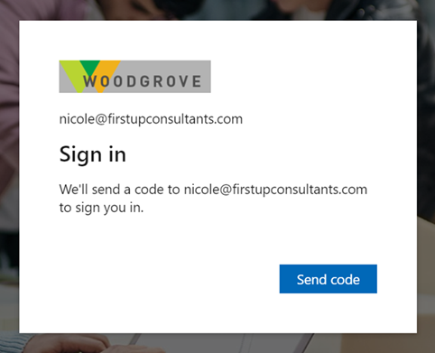
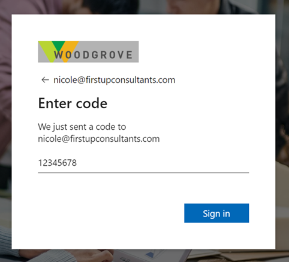

# Email one-time passcode authentication for B2B guest users

[!INCLUDE [applies-to-workforce-only](./includes/applies-to-workforce-only.md)]

The email one-time passcode feature is a way to authenticate B2B collaboration users when they can't be authenticated through other means, such as Microsoft Entra ID, Microsoft account (MSA), or social identity providers. When a B2B guest user tries to redeem your invitation or sign in to your shared resources, they can request a temporary passcode, which is sent to their email address. Then they enter this passcode to continue signing in.

:::image type="content" source="media/one-time-passcode/email-otp.png" alt-text="Diagram showing an overview of Email one-time passcode.":::

> [!IMPORTANT]
>
> - The email one-time passcode feature is now turned on by default for all new tenants and for any existing tenants where you haven’t explicitly turned it off. This feature provides a seamless fallback authentication method for your guest users. If you don’t want to use this feature, you can [disable it](#enable-or-disable-email-one-time-passcodes), in which case users will be prompted to create a Microsoft account instead.

> [!NOTE]
> 
> Currently you cannot apply authentication strength policies via Conditional Access to email one-time passcode accounts. Use the Conditional Access grant control 'Require MFA' instead. For more information, see the [Authentication strength policies for external users](authentication-conditional-access.md#authentication-strength-policies-for-external-users) section of the [Authentication and Conditional Access for External ID](authentication-conditional-access.md) page.

## Sign-in endpoints

Email one-time passcode guest users can now sign in to your multitenant or Microsoft first-party apps by using a [common endpoint](redemption-experience.md#redemption-process-and-sign-in-through-a-common-endpoint) (in other words, a general app URL that doesn't include your tenant context). During the sign-in process, the guest user chooses **Sign-in options**, and then selects **Sign in to an organization**. The user then types the name of your organization and continues signing in using one-time passcode.

Email one-time passcode guest users can also use application endpoints that include your tenant information, for example:

  * `https://myapps.microsoft.com/?tenantid=<your tenant ID>`
  * `https://myapps.microsoft.com/<your verified domain>.onmicrosoft.com`
  * `https://portal.azure.com/<your tenant ID>`

You can also give email one-time passcode guest users a direct link to an application or resource by including your tenant information, for example `https://myapps.microsoft.com/signin/X/<application ID?tenantId=<your tenant ID>`.

> [!NOTE]
> Email one-time passcode guest users can sign in to Microsoft Teams directly from the common endpoint without choosing **Sign-in options**. During the sign-in process to Microsoft Teams, the guest user can select a link to send a one-time passcode.

## User experience for one-time passcode guest users

When the email one-time passcode feature is enabled, newly invited users [who meet certain conditions](#when-does-a-guest-user-get-a-one-time-passcode) will use one-time passcode authentication. Guest users who redeemed an invitation before email one-time passcode was enabled will continue to use their same authentication method.

With one-time passcode authentication, the guest user can redeem your invitation by clicking a direct link or by using the invitation email. In either case, a message in the browser indicates that a code will be sent to the guest user's email address. The guest user selects **Send code**:

   

A passcode is sent to the user’s email address. The user retrieves the passcode from the email and enters it in the browser window:

   

The guest user is now authenticated, and they can see the shared resource or continue signing in.

> [!NOTE]
> One-time passcodes are valid for 30 minutes. After 30 minutes, that specific one-time passcode is no longer valid, and the user must request a new one. User sessions expire after 24 hours. After that time, the guest user receives a new passcode when they access the resource. Session expiration provides added security, especially when a guest user leaves their company or no longer needs access.

## When does a guest user get a one-time passcode?

When a guest user redeems an invitation or uses a link to a resource that has been shared with them, they’ll receive a one-time passcode if:

- They don't have a Microsoft Entra account.
- They don't have a Microsoft account.
- The inviting tenant didn't set up federation with social (like [Google](google-federation.md)) or other identity providers.
- They don't have any other authentication method or any password-backed accounts.
- Email one-time passcode is enabled.

At the time of invitation, there's no indication that the user you're inviting will use one-time passcode authentication. But when the guest user signs in, one-time passcode authentication will be the fallback method if no other authentication methods can be used.

> [!NOTE]
> When a user redeems a one-time passcode and later obtains an MSA, Microsoft Entra account, or other federated account, they'll continue to be authenticated using a one-time passcode. If you want to update the user's authentication method, you can [reset their redemption status](reset-redemption-status.md).

### Example

Guest user nicole@firstupconsultants.com is invited to Fabrikam, which doesn't have Google federation set up. Nicole doesn't have a Microsoft account. They'll receive a one-time passcode for authentication.

## Enable or disable email one-time passcodes

The email one-time passcode feature is now turned on by default for all new tenants and for any existing tenants where you haven't explicitly turned it off. This feature provides a seamless fallback authentication method for your guest users. If you don't want to use this feature, you can disable it, in which case users will be prompted to create a Microsoft account.

> [!NOTE]
>
> - Email one-time passcode settings can also be configured with the [emailAuthenticationMethodConfiguration](/graph/api/resources/emailauthenticationmethodconfiguration) resource type in the Microsoft Graph API.
> - If the email one-time passcode feature has been enabled in your tenant and you turn it off, any guest users who have redeemed a one-time passcode will not be able to sign in. You can [reset their redemption status](reset-redemption-status.md) so they can sign in again using another authentication method.

### To enable or disable email one-time passcodes

1. Sign in to the [Microsoft Entra admin center](https://entra.microsoft.com) as at least an [Authentication Policy Administrator](~/identity/role-based-access-control/permissions-reference.md#authentication-policy-administrator).

1. Browse to **Entra ID** > **External Identities** > **All identity providers**.

1. On the **Built-in** tab, next to Email one-time passcode, select **Configured**.

1. Under **Email one-time passcode for guests**, select one of the following:
   - **Yes**: The toggle is set to **Yes** by default unless the feature has been explicitly turned off. To enable the feature, make sure **Yes** is selected.
   - **No**: If you want to disable the email one-time passcode feature, select **No**.
 
:::image type="content" source="media/one-time-passcode/email-one-time-passcode-toggle.png" alt-text="Screenshots showing the Email one-time passcode toggle.":::

6. Select **Save**.

## Frequently asked questions

**What happens to my existing guest users if I enable email one-time passcode?**

Your existing guest users won't be affected if you enable email one-time passcode, as your existing users are already past the point of redemption. Enabling email one-time passcode will only affect future redemption process activities where new guest users are redeeming into the tenant.

**What is the user experience when email one-time passcode is disabled?**

If you’ve disabled the email one-time passcode feature, the user is prompted to create a Microsoft account.

Also, when email one-time passcode is disabled, users might see a sign-in error when they're redeeming a direct application link and they weren't added to your directory in advance.

For more information about the different redemption process pathways, see [B2B collaboration invitation redemption](redemption-experience.md).

**Will the “No account? Create one!” option for self-service sign-up go away?**

No. It’s easy to get [self-service sign-up in the context of External ID](self-service-sign-up-overview.md) confused with self-service sign-up for email-verified users, but they're two different features. The unmanaged ("viral") feature that has been deprecated is [self-service sign-up with email-verified users](~/identity/users/directory-self-service-signup.md), which resulted in guests creating an unmanaged Microsoft Entra account. However, self-service sign-up for External ID will continue to be available, which results in your guests signing up to your organization with a [variety of identity providers](identity-providers.md).  

**What does Microsoft recommend we do with existing Microsoft accounts (MSA)?**

When we support the ability to disable Microsoft Account in the Identity providers settings (not available today), we strongly recommend you disable Microsoft Account and enable email one-time passcode. Then you should [reset the redemption status](reset-redemption-status.md) of existing guests with Microsoft accounts so that they can re-redeem using email one-time passcode authentication and use email one-time passcode to sign in going forward.

## Next steps

Learn about [Identity Providers for External ID](identity-providers.md), and how to reset [redemption status for a guest user](reset-redemption-status.md).
