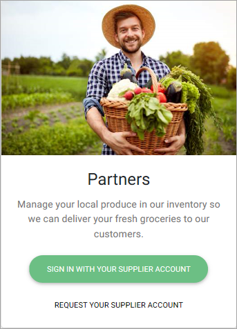
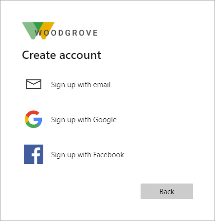
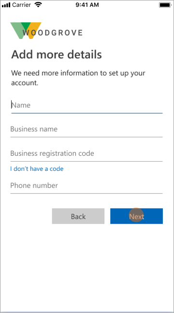
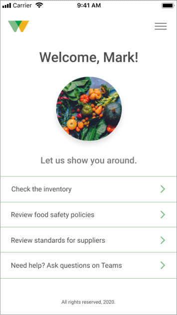

# Self-service sign-up

Self-service sign-up is an essential feature for your External ID workforce and customer scenarios. It gives your partners, consumers, and other external users a frictionless way to sign up and get access to your apps without any intervention on your part.

- In a B2B collaboration scenario, you might not always know in advance who will need access to an application you want to share. As an alternative to sending invitations directly to individuals, you can allow external users to sign up for specific applications themselves. Learn how to [create a self-service sign-up user flow for B2B collaboration](self-service-sign-up-user-flow.yml).
- In a customer identity and access management (CIAM) scenario, it's important to add a self-service sign-up experience to the apps you build for consumers. You can do so by configuring self-service sign-up user flows. Learn more about [planning the customer experience](customers/concept-planning-your-solution.md) or [creating a sign-up and sign-in user flow for customers](customers/how-to-user-flow-sign-up-sign-in-customers.md).

In either scenario, you can create a personalized sign-up experience by customizing the look and feel, providing sign-in with social identity providers, and collecting information about the user during the sign-up process.

> [!NOTE]
> You can associate user flows with apps built by your organization. User flows can't be used for Microsoft apps, like SharePoint or Teams.

## User flow for self-service sign-up

A self-service sign-up user flow creates a sign-up experience for the application you're providing to external users. You can configure user flow settings to control how the user signs up for the application:

- Account types used for sign-in, such as social accounts like Facebook, or Microsoft Entra accounts
- Attributes to be collected from the user signing up, such as first name, postal code, or country/region of residency

The user can sign in to your application, via the web, mobile, desktop, or single-page application (SPA). The application initiates an authorization request to the user flow-provided endpoint. The user flow defines and controls the user's experience. When the user completes the sign-up user flow, Microsoft Entra ID generates a token and redirects the user back to your application. Upon completion of sign-up, an account is provisioned for the user in the directory. Multiple applications can use the same user flow.

## Example of self-service sign-up

The following B2B collaboration example illustrates self-service sign-up capabilities for guest users. A partner of Woodgrove opens the Woodgrove app. They decide they want to sign up for a supplier account, so they select Request your supplier account, which initiates the self-service sign-up flow.

They use the email of their choice to sign up.

Microsoft Entra ID creates a relationship with Woodgrove using the partner's Facebook account, and creates a new guest account for the user after they sign up.

Woodgrove wants to know more about the user, like name, business name, business registration code, phone number.

The user enters the information, continues the sign-up flow, and gets access to the resources they need.

## Next steps

User flows for B2B collaboration:

- [Create a self-service sign-up user flow for B2B collaboration](self-service-sign-up-user-flow.yml)

User flows for customer identity and access management (CIAM):

- [Plan a sign-up experience for customers or consumers](customers/concept-planning-your-solution.md)
- [Create a sign-up and sign-in user flow for customers or consumers](customers/how-to-user-flow-sign-up-sign-in-customers.md).
