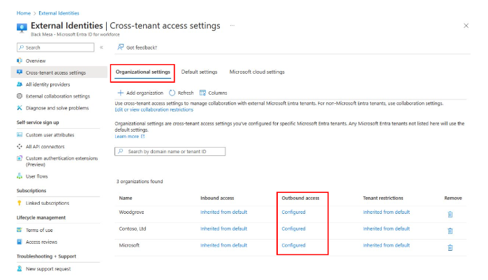
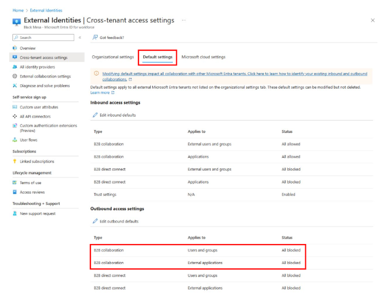
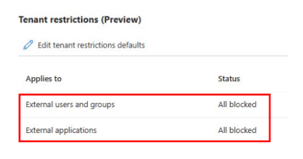
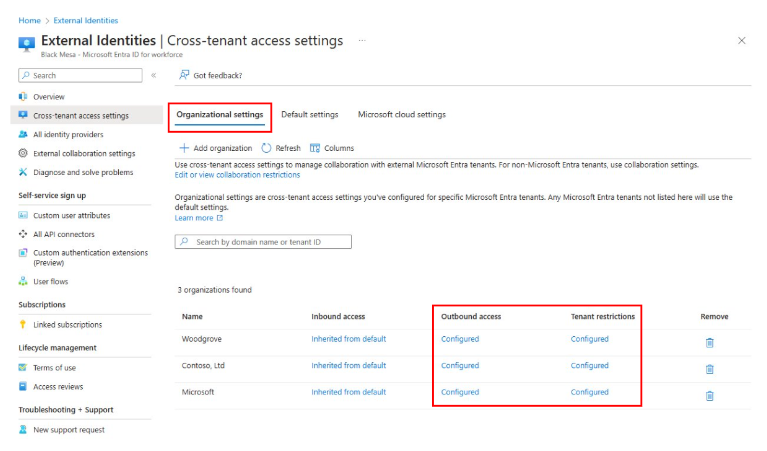
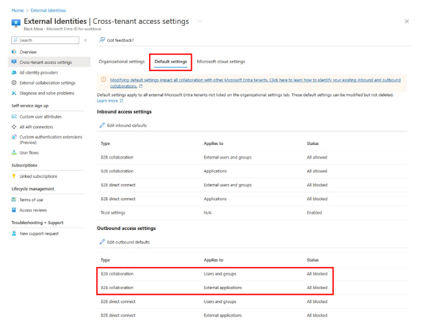
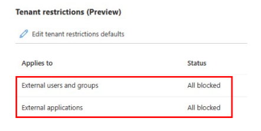

# Plan a tenant restrictions v1 migration to tenant restrictions v2

[!INCLUDE [applies-to-workforce-only](./includes/applies-to-workforce-only.md)]

Administrators use [tenant restrictions v1](~/identity/enterprise-apps/tenant-restrictions.md) to control user access to external tenants on their network. However, [tenant restrictions v2](tenant-restrictions-v2.md) with cross-tenant access settings adds tenant-level restrictions. Tenant restrictions v2 also adds more granularity, such as individual user, group, and application controls.

Tenant restrictions v2 moves policy management from network proxies to a cloud-based portal. Organizations no longer hit a maximum number of targeted tenants due to size limitations for proxy headers.

Migration from tenant restrictions v1 to tenant restrictions v2 is a one-time process with no other licensing requirements. As you plan the migration, include stakeholders from network and identity teams.

## Prerequisites

* Administrator access to proxies that inject the tenant restrictions v1 headers. Proxies can be on-premises or from a cloud-based service.
* [Microsoft Entra ID P1 or P2](~/fundamentals/get-started-premium.md) license.
* Verification of migration feasibility. See the [unsupported scenarios for tenant restrictions v2](tenant-restrictions-v2.md#unsupported-scenarios).

## Required roles

This section has the least-privileged roles required for the deployment. Use the Security Administrator role, or use a custom role with at least the following permissions in `Microsoft.directory/crossTenantAccessPolicy/`:

* `Standard/read`
* `Partners/standard/read`
* `Default/standard/read`
* `Basic/update`
* `Default/tenantRestrictions/update`
* `Partners/tenantRestrictions/update`
* `Partners/create`
* `Partners/b2bCollaboration/update`
* `Default/b2bCollaboration/update`

## Create and state a new tenant restrictions policy

Obtain the current header string that your proxies inject. Evaluate the current policy and remove unwanted tenant IDs or allowed destinations. After the evaluation, create a list of external tenant IDs and/or external domains.

Configure the cross-tenant access settings and tenant restrictions v2 policies for the migration. Outbound settings for cross-tenant access define tenants that internal identities access. In cross-tenant access settings, tenant restrictions v2 defines which tenants other external identities access while they're on your managed network.

## Technical considerations

When you configure outbound settings for cross-tenant access, the policy takes effect within one hour and is evaluated in addition to the tenant restrictions v1 policy. Cross-tenant access settings and tenant restrictions v1 are evaluated, and the more restrictive option is applied.

To avoid negatively affecting users, mirror the tenant restrictions v1 policy as much as possible in the new policies. The tenant restrictions v2 policy that you configure in cross-tenant access settings takes effect after you update your proxies with the new header.

The following sections set up migration and configuration management for common scenarios. Use this guidance to help craft the policy that your organization needs.

### Allow only internal identities access to specific external tenants

Allow internal identities, such as employees, to access specific external tenants on your managed network. Block access to tenants that aren't on the allowlist for internal identities. Block external identities, such as contractors and vendors, from accessing all external tenants.

1. In **Cross-tenant access settings**, on the **Organizational settings** tab, [add each domain or tenant as an organization](cross-tenant-access-settings-b2b-collaboration.yml#add-an-organization).

2. To allow all users and groups and allow all applications, for each added organization, [configure outbound access for business-to-business (B2B) collaboration](cross-tenant-access-settings-b2b-collaboration.yml#modify-outbound-access-settings).

   

3. To block all users and groups and all applications for B2B collaboration, [configure the default outbound settings for cross-tenant access](cross-tenant-access-settings-b2b-collaboration.yml#configure-default-settings). This action applies only to tenants that you didn't add in step 1.

   

4. In the **Tenant restrictions** defaults, create the policy ID (if you didn't already create it). Then, [configure the policy to block all users, groups, and external applications](tenant-restrictions-v2.md#configure-a-server-side-cloud-policy-for-tenant-restrictions-v2). This action applies only to tenants that you didn't add in step 1.

   

### Allow internal and external identities to access specific external tenants

Allow internal identities such as employees, and external identities such as contractors and vendors, to access specific external tenants on your managed network. Block access to tenants that aren't on the allowlist for all identities.  

1. In **Cross-tenant access settings**, on the **Organizational settings** tab, [add each domain or tenant ID as an organization](cross-tenant-access-settings-b2b-collaboration.yml#add-an-organization).

2. For each added organization, to enable internal identities, [configure outbound access for B2B collaboration](cross-tenant-access-settings-b2b-collaboration.yml#modify-outbound-access-settings) to allow all users, groups, and applications.

3. For each added organization, to enable external identities, [configure the organization tenant restrictions](tenant-restrictions-v2.md#step-2-configure-tenant-restrictions-v2-for-specific-partners) to allow all users, groups, and applications.  

   

4. To block all users, groups, and applications for B2B collaboration, [configure the default outbound settings for cross-tenant access](cross-tenant-access-settings-b2b-collaboration.yml#configure-default-settings). This action applies only to tenants that you didn't add in step 1.

   

5. In the **Tenant restrictions** defaults, create the policy ID (if you didn't already create it). Then, [configure the policy to block all users, groups, and external applications](tenant-restrictions-v2.md#configure-a-server-side-cloud-policy-for-tenant-restrictions-v2). This action applies only to tenants that you didn't add in step 1.

   

> [!NOTE]
>
> * To target consumer Microsoft accounts, add an organization with the following tenant ID: `9188040d-6c67-4c5b-b112-36a304b66dad`.
> * The tenant restrictions v2 policy is created but not in effect.

## Enable tenant restrictions v2

Create a new header by [using your tenant ID and policy ID values](tenant-restrictions-v2.md#option-2-set-up-tenant-restrictions-v2-on-your-corporate-proxy). Update your network proxies to inject a new header.

When you update a network proxy to inject the new `sec-Restrict-Tenant-Access-Policy` header, remove the two tenant restrictions v1 headers: `Restrict-Access-To-Tenants` and `Restrict-Access-Context`.  

> [!TIP]
>
> * Update the network proxies in a phased rollout. Save the current tenant restrictions v1 headers and values.
> * Create a rollback plan to help you navigate potential problems.

Use one of the following patterns to migrate your proxy configuration. Ensure that your proxy supports your selected pattern.

* **Upgrade one proxy at a time with the tenant restrictions v2 header**: Users who egress through this proxy receive the updated header, and the new policy applies. Monitor for problems. If no problems arise, update the next proxy and continue until you update all proxies.
* **Update header injection based on users**: Some proxies require authenticated users and might select which header to inject based on users and groups. Roll out the new tenant restrictions v2 header to a test group of users. Monitor for problems. If no problems arise, add more users in phases until 100% of traffic is in scope.
* **Update the service to apply the new tenant restrictions v2 header all at one time**: We don't recommend this option.

As you roll out the new header updates, test and validate that users experience the expected behaviors.

## Monitor

When you deploy tenant restrictions v2 and outbound settings for cross-tenant access, monitor your sign-in logs. You can also use the [cross-tenant access activity workbook](~/identity/monitoring-health/workbook-cross-tenant-access-activity.md) to verify that users don't access unauthorized tenants. These tools help identify who accesses what external applications.

You can configure outbound settings for cross-tenant access and tenant restrictions to limit outbound access based on group membership and/or specific applications.  

## Related content

* [Manage cross-tenant access settings for B2B collaboration](cross-tenant-access-settings-b2b-collaboration.yml)
* [Configure universal tenant restrictions](~/global-secure-access/how-to-universal-tenant-restrictions.md)
