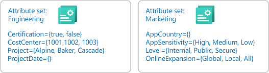
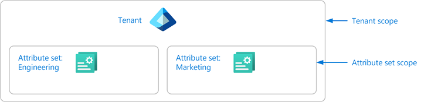

# Manage access to custom security attributes in Microsoft Entra ID

For people in your organization to effectively work with [custom security attributes](custom-security-attributes-overview.md), you must grant the appropriate access. Depending on the information you plan to include in custom security attributes, you might want to restrict custom security attributes or you might want to make them broadly accessible in your organization. This article describes how to manage access to custom security attributes.

## Prerequisites

To manage access to custom security attributes, you must have:

- [Attribute Assignment Administrator](~/identity/role-based-access-control/permissions-reference.md#attribute-assignment-administrator)
- Microsoft.Graph module when using [Microsoft Graph PowerShell](/powershell/microsoftgraph/installation)

[!INCLUDE [security-attributes-roles](../includes/security-attributes-roles.md)]

<a name='step-1-figure-out-how-to-organize-your-attributes'></a>

## Step 1: Determine how to organize your attributes

Every custom security attribute definition must be part of an attribute set. An attribute set is a way to group and manage related custom security attributes. You'll need to determine how you want to add attributes sets for your organization. For example, you might want to add attribute sets based on departments, teams, or projects. Your ability to grant access to custom security attributes depends on how you organize your attribute sets.



## Step 2: Identify the needed scope

Scope is the set of resources that the access applies to. For custom security attributes, you can assign roles at tenant scope or at attribute set scope. If you want to assign broad access, you can assign roles at tenant scope. However, if you want to limit access to particular attribute sets, you can assign roles at attribute set scope.



Microsoft Entra role assignments are an additive model, so your effective permissions are the sum of your role assignments. For example, if you assign a user a role at tenant scope and assign the same user the same role at attribute set scope, the user will still have permissions at tenant scope.

## Step 3: Review the available roles

You need to determine who needs access to work with custom security attributes in your organization. To help you manage access to custom security attributes, there are four Microsoft Entra built-in roles. If necessary, someone with at least the [Privileged Role Administrator](/entra/identity/role-based-access-control/permissions-reference#privileged-role-administrator) role can assign these roles.

- [Attribute Definition Administrator](~/identity/role-based-access-control/permissions-reference.md#attribute-definition-administrator)
- [Attribute Assignment Administrator](~/identity/role-based-access-control/permissions-reference.md#attribute-assignment-administrator)
- [Attribute Definition Reader](~/identity/role-based-access-control/permissions-reference.md#attribute-definition-reader)
- [Attribute Assignment Reader](~/identity/role-based-access-control/permissions-reference.md#attribute-assignment-reader)

The following table provides a high-level comparison of the custom security attributes roles.

| Permission | Attribute Definition Admin | Attribute Assignment Admin | Attribute Definition Reader | Attribute Assignment Reader |
| --- | :---: | :---: | :---: | :---: |
| Read attribute sets | :white_check_mark: | :white_check_mark: | :white_check_mark: | :white_check_mark: |
| Read attribute definitions | :white_check_mark: | :white_check_mark: | :white_check_mark: | :white_check_mark: |
| Read attribute assignments for users and applications (service principals) |  | :white_check_mark: |  | :white_check_mark: |
| Add or edit attribute sets | :white_check_mark: |  |  |  |
| Add, edit, or deactivate attribute definitions | :white_check_mark: |  |  |  |
| Assign attributes to users and applications (service principals) |  | :white_check_mark: |  |  |

## Step 4: Determine your delegation strategy

This step describes two ways you can manage access to custom security attributes. The first way is to manage them centrally and the second way is to delegate management to others.

#### Manage attributes centrally

An administrator that has been assigned the Attribute Definition Administrator and Attribute Assignment Administrator roles at tenant scope can manage all aspects of custom security attributes. The following diagram shows how custom security attributes are defined and assigned by a single administrator.

:::image type="content" source="./media/custom-security-attributes-manage/central-manage-attributes.png" alt-text="Diagram of custom security attributes managed centrally." lightbox="./media/custom-security-attributes-manage/central-manage-attributes.png":::

1. The administrator (Xia) has both the Attribute Definition Administrator and Attribute Assignment Administrator roles assigned at tenant scope. The administrator adds attribute sets and defines attributes.
1. The administrator assigns attributes to Microsoft Entra objects.

Managing attributes centrally has the advantage that it can be managed by one or two administrators. The disadvantage is that the administrator might get several requests to define or assign custom security attributes. In this case, you might want to delegate management.

#### Manage attributes with delegation

An administrator might not know all the situations of how custom security attributes should be defined and assigned. Typically it's users within the respective departments, teams, or projects who know the most about their area. Instead of assigning one or two administrators to manage all custom security attributes, you can instead delegate the management at attribute set scope. This also follows the best practice of least privilege to grant just the permissions other administrators need to do their job and avoid unnecessary access. The following diagram shows how the management of custom security attributes can be delegated to multiple administrators.

:::image type="content" source="./media/custom-security-attributes-manage/delegate-manage-attributes.png" alt-text="Diagram of custom security attributes managed with delegation." lightbox="./media/custom-security-attributes-manage/delegate-manage-attributes.png":::

1. The administrator (Xia) with the Attribute Definition Administrator role assigned at tenant scope adds attribute sets. The administrator also has permissions to assign roles to others (Privileged Role Administrator) and delegates who can read, define, or assign custom security attributes for each attribute set.
1. The delegated Attribute Definition Administrators (Alice and Bob) define attributes in the attribute sets they have been granted access to.
1. The delegated Attribute Assignment Administrators (Chandra and Bob) assign attributes from their attribute sets to Microsoft Entra objects.

## Step 5: Select the appropriate roles and scope

Once you have a better understanding of how your attributes will be organized and who needs access, you can select the appropriate custom security attribute roles and scope. The following table can help you with the selection.

| I want to grant this access | Assign this role | Scope |
| --- | --- | :---: |
| <ul><li>Read all attribute sets in a tenant</li><li>Read all attribute definitions in a tenant</li><li>[Add or edit all attribute sets in a tenant](custom-security-attributes-add.md)</li><li>[Add, edit, or deactivate all attribute definitions in a tenant](custom-security-attributes-add.md)</li></ul> | [Attribute Definition Administrator](~/identity/role-based-access-control/permissions-reference.md#attribute-definition-administrator) | <br/>Tenant |
| <ul><li>Read attribute definitions in a scoped attribute set</li><li>[Add, edit, or deactivate attribute definitions in a scoped attribute set](custom-security-attributes-add.md)</li><li>**Cannot** update the scoped attribute set</li><li>**Cannot** read, add, or update other attribute sets</li></ul> | [Attribute Definition Administrator](~/identity/role-based-access-control/permissions-reference.md#attribute-definition-administrator) | <br/>Attribute set |
| <ul><li>Read all attribute sets in a tenant</li><li>Read all attribute definitions in a tenant</li><li>Read all attribute assignments in a tenant for users</li><li>Read all attribute assignments in a tenant for applications (service principals)</li><li>[Assign all attributes in a tenant to users](~/identity/users/users-custom-security-attributes.md)</li><li>[Assign all attributes in a tenant to applications (service principals)](~/identity/enterprise-apps/custom-security-attributes-apps.md)</li><li>[Author Azure role assignment conditions that use the Principal attribute for all attributes in a tenant](/azure/role-based-access-control/conditions-format#attributes)</li></ul> | [Attribute Assignment Administrator](~/identity/role-based-access-control/permissions-reference.md#attribute-assignment-administrator) | <br/>Tenant |
| <ul><li>Read attribute definitions in a scoped attribute set</li><li>Read attribute assignments that use attributes in a scoped attribute set for users</li><li>Read attribute assignments that use attributes in a scoped attribute set for applications (service principals)</li><li>[Assign attributes in a scoped attribute set to users](~/identity/users/users-custom-security-attributes.md)</li><li>[Assign attributes in a scoped attribute set to applications (service principals)](~/identity/enterprise-apps/custom-security-attributes-apps.md)</li><li>[Author Azure role assignment conditions that use the Principal attribute for all attributes in a scoped attribute set](/azure/role-based-access-control/conditions-format#attributes)</li><li>**Cannot** read attributes in other attribute sets</li><li>**Cannot** read attribute assignments that use attributes in other attribute sets</li></ul> | [Attribute Assignment Administrator](~/identity/role-based-access-control/permissions-reference.md#attribute-assignment-administrator) | <br/>Attribute set |
| <ul><li>Read all attribute sets in a tenant</li><li>Read all attribute definitions in a tenant</li></ul> | [Attribute Definition Reader](~/identity/role-based-access-control/permissions-reference.md#attribute-definition-reader) | <br/>Tenant |
| <ul><li>Read attribute definitions in a scoped attribute set</li><li>**Cannot** read other attribute sets</li></ul> | [Attribute Definition Reader](~/identity/role-based-access-control/permissions-reference.md#attribute-definition-reader) | <br/>Attribute set |
| <ul><li>Read all attribute sets in a tenant</li><li>Read all attribute definitions in a tenant</li><li>Read all attribute assignments in a tenant for users</li><li>Read all attribute assignments in a tenant for applications (service principals)</li></ul> | [Attribute Assignment Reader](~/identity/role-based-access-control/permissions-reference.md#attribute-assignment-reader) | <br/>Tenant |
| <ul><li>Read attribute definitions in a scoped attribute set</li><li>Read attribute assignments that use attributes in a scoped attribute set for users</li><li>Read attribute assignments that use attributes in a scoped attribute set for applications (service principals)</li><li>**Cannot** read attributes in other attribute sets</li><li>**Cannot** read attribute assignments that use attributes in other attribute sets</li></ul> | [Attribute Assignment Reader](~/identity/role-based-access-control/permissions-reference.md#attribute-assignment-reader) | <br/>Attribute set |

## Step 6: Assign roles

To grant access to the appropriate people, follow these steps to assign one of the custom security attribute roles.

### Assign roles at attribute set scope


The following examples show how to assign a custom security attribute role to a principal at an attribute set scope named Engineering.

# [Admin center](#tab/admin-center)

1. Sign in to the [Microsoft Entra admin center](https://entra.microsoft.com) as a [Attribute Assignment Administrator](~/identity/role-based-access-control/permissions-reference.md#attribute-assignment-administrator).

1. Browse to **Entra ID** > **Custom security attributes**.

1. Select the attribute set you want grant access to.

1. Select **Roles and administrators**.

    :::image type="content" source="./media/custom-security-attributes-manage/manage-attribute-set.png" alt-text="Screenshot of assigning attribute roles at attribute set scope." lightbox="./media/custom-security-attributes-manage/manage-attribute-set.png":::

1. Add assignments for the custom security attribute roles.

    > [!NOTE]
    > If you are using Microsoft Entra Privileged Identity Management (PIM), eligible role assignments at attribute set scope currently aren't supported. Permanent role assignments at attribute set scope are supported.

# [PowerShell](#tab/ms-powershell)

[New-MgRoleManagementDirectoryRoleAssignment](/powershell/module/microsoft.graph.identity.governance/new-mgrolemanagementdirectoryroleassignment)

```powershell
$roleDefinitionId = "58a13ea3-c632-46ae-9ee0-9c0d43cd7f3d"
$principalId = "aaaaaaaa-bbbb-cccc-1111-222222222222"
$directoryScopeId = "/attributeSets/Engineering"
$roleAssignment = New-MgRoleManagementDirectoryRoleAssignment -RoleDefinitionId $roleDefinitionId -PrincipalId $principalId -DirectoryScopeId $directoryScopeId
```

# [Microsoft Graph](#tab/ms-graph)

[Create unifiedRoleAssignment](/graph/api/rbacapplication-post-roleassignments)

```http
POST https://graph.microsoft.com/v1.0/roleManagement/directory/roleAssignments
Content-type: application/json

{
    "@odata.type": "#microsoft.graph.unifiedRoleAssignment",
    "roleDefinitionId": "58a13ea3-c632-46ae-9ee0-9c0d43cd7f3d",
    "principalId": "aaaaaaaa-bbbb-cccc-1111-222222222222",
    "directoryScopeId": "/attributeSets/Engineering"
}
```

---

### Assign roles at tenant scope

The following examples show how to assign a custom security attribute role to a principal at tenant scope.

# [Admin center](#tab/admin-center)

1. Sign in to the [Microsoft Entra admin center](https://entra.microsoft.com) as a [Attribute Assignment Administrator](~/identity/role-based-access-control/permissions-reference.md#attribute-assignment-administrator).

1. Browse to **Entra ID** > **Roles & admins**.

    :::image type="content" source="./media/custom-security-attributes-manage/manage-tenant.png" alt-text="Screenshot of assigning attribute roles at tenant scope." lightbox="./media/custom-security-attributes-manage/manage-tenant.png":::

1. Add assignments for the custom security attribute roles.

# [PowerShell](#tab/ms-powershell)

[New-MgRoleManagementDirectoryRoleAssignment](/powershell/module/microsoft.graph.identity.governance/new-mgrolemanagementdirectoryroleassignment)

```powershell
$roleDefinitionId = "58a13ea3-c632-46ae-9ee0-9c0d43cd7f3d"
$principalId = "aaaaaaaa-bbbb-cccc-1111-222222222222"
$directoryScopeId = "/"
$roleAssignment = New-MgRoleManagementDirectoryRoleAssignment -RoleDefinitionId $roleDefinitionId -PrincipalId $principalId -DirectoryScopeId $directoryScopeId
```

# [Microsoft Graph](#tab/ms-graph)

[Create unifiedRoleAssignment](/graph/api/rbacapplication-post-roleassignments)

```http
POST https://graph.microsoft.com/v1.0/roleManagement/directory/roleAssignments
Content-type: application/json

{
    "@odata.type": "#microsoft.graph.unifiedRoleAssignment",
    "roleDefinitionId": "58a13ea3-c632-46ae-9ee0-9c0d43cd7f3d",
    "principalId": "aaaaaaaa-bbbb-cccc-1111-222222222222",
    "directoryScopeId": "/"
}
```

---

## Custom security attribute audit logs

Sometimes you need information about custom security attribute changes for auditing or troubleshooting purposes. Anytime someone makes changes to definitions or assignments, the activities get logged.

Custom security attribute audit logs provide you with the history of activities related to custom security attributes, such as adding a new definition or assigning an attribute value to a user. Here are the custom security attribute-related activities that are logged:

- Add an attribute set
- Add custom security attribute definition in an attribute set
- Update an attribute set
- Update attribute values assigned to a servicePrincipal
- Update attribute values assigned to a user
- Update custom security attribute definition in an attribute set

### View audit logs for attribute changes

To view the custom security attribute audit logs, sign in to the Microsoft Entra admin center, browse to **Audit Logs**, and select **Custom Security**. To view custom security attribute audit logs, you must be assigned one of the following roles. If necessary, someone with at least the [Privileged Role Administrator](/entra/identity/role-based-access-control/permissions-reference#privileged-role-administrator) role can assign these roles.

- [Attribute Log Reader](../identity/role-based-access-control/permissions-reference.md#attribute-log-reader)
- [Attribute Log Administrator](../identity/role-based-access-control/permissions-reference.md#attribute-log-administrator)

:::image type="content" source="media/custom-security-attributes-manage/audit-logs-custom-security.png" alt-text="Screenshot of audit logs with Custom Security tab selected." lightbox="media/custom-security-attributes-manage/audit-logs-custom-security.png":::

For information about how to get the custom security attribute audit logs using the Microsoft Graph API, see the [`customSecurityAttributeAudit` resource type](/graph/api/resources/customsecurityattributeaudit). For more information, see [Microsoft Entra audit logs](../identity/monitoring-health/concept-audit-logs.md).

### Diagnostic settings

To export custom security attribute audit logs to different destinations for additional processing, you use diagnostic settings. To create and configure diagnostic settings for custom security attributes, you must be assigned the [Attribute Log Administrator](../identity/role-based-access-control/permissions-reference.md#attribute-log-administrator) role.

> [!TIP]
> Microsoft recommends that you keep your custom security attribute audit logs separate from your directory audit logs so that attribute assignments are not revealed inadvertently.

The following screenshot shows the diagnostic settings for custom security attributes. For more information, see [How to configure diagnostic settings](../identity/monitoring-health/howto-configure-diagnostic-settings.md).

:::image type="content" source="media/custom-security-attributes-manage/diagnostic-settings-attributes.png" alt-text="Screenshot of diagnostic settings with Custom security attributes tab selected." lightbox="media/custom-security-attributes-manage/diagnostic-settings-attributes.png":::

## Changes to audit logs behavior

Changes have been made to custom security attribute audit logs for general availability that might affect your daily operations. If you have been using custom security attribute audit logs during preview, here are the actions you must take to ensure your audit log operations aren't disrupted.

- Use new audit logs location
- Assign Attribute Log roles to view audit logs
- Create new diagnostic settings to export audit logs

### Use new audit logs location

During the preview, custom security attribute audit logs were written to the directory audit logs endpoint. In October 2023, a new endpoint was added exclusively for custom security attribute audit logs. The following screenshot shows the directory audit logs and the new custom security attribute audit logs location. To get the custom security attribute audit logs using the Microsoft Graph API, see the [`customSecurityAttributeAudit` resource type](/graph/api/resources/customsecurityattributeaudit).

:::image type="content" source="media/custom-security-attributes-manage/audit-logs-directory-custom-security.png" alt-text="Screenshot of audit logs that shows Directory and Custom Security tabs." lightbox="media/custom-security-attributes-manage/audit-logs-directory-custom-security.png":::

There is a transition period where custom security audit logs are written to both the directory and custom security attributes audit log endpoints. Going forward, you must use the custom security attributes audit log endpoint to find custom security attribute audit logs.

The following table lists the endpoint where you can find custom security attributes audit logs during the transition period.

| Event date | Directory endpoint | Custom security attributes endpoint |
| --- | :---: | :---: |
| Oct 2023 | :white_check_mark: | :white_check_mark: |
| Feb 2024 |  | :white_check_mark: |

### Assign Attribute Log roles to view audit logs

During the preview, custom security attribute audit logs could be viewed by those with at least the [Security Administrator](../identity/role-based-access-control/permissions-reference.md#security-administrator) role in the directory audit logs. You are no longer able to use these roles to view custom security attribute audit logs using the new endpoint. To view the custom security attribute audit logs, you must be assigned either the [Attribute Log Reader](../identity/role-based-access-control/permissions-reference.md#attribute-log-reader) or [Attribute Log Administrator](../identity/role-based-access-control/permissions-reference.md#attribute-log-administrator) role.

### Create new diagnostic settings to export audit logs

During the preview, if you configured to export audit logs, custom security audit attribute audit logs were sent to your current diagnostic settings. To continue to receive custom security audit attribute audit logs, you must create new diagnostic settings as described in the previous [Diagnostic settings](#diagnostic-settings) section.

## Next steps

- [Add or deactivate custom security attribute definitions in Microsoft Entra ID](custom-security-attributes-add.md)
- [Assign, update, list, or remove custom security attributes for a user](~/identity/users/users-custom-security-attributes.md)
- [Troubleshoot custom security attributes in Microsoft Entra ID](custom-security-attributes-troubleshoot.md)
