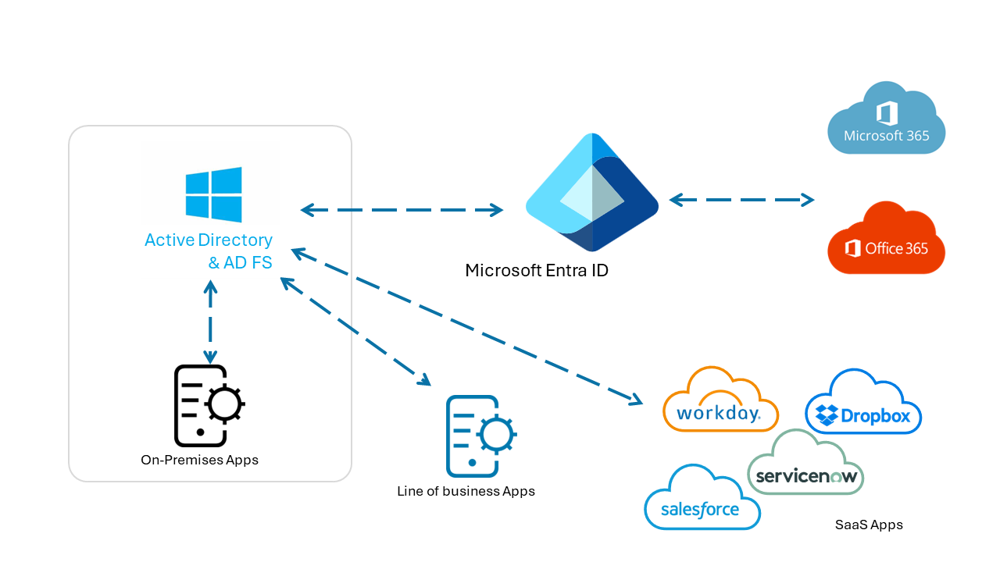
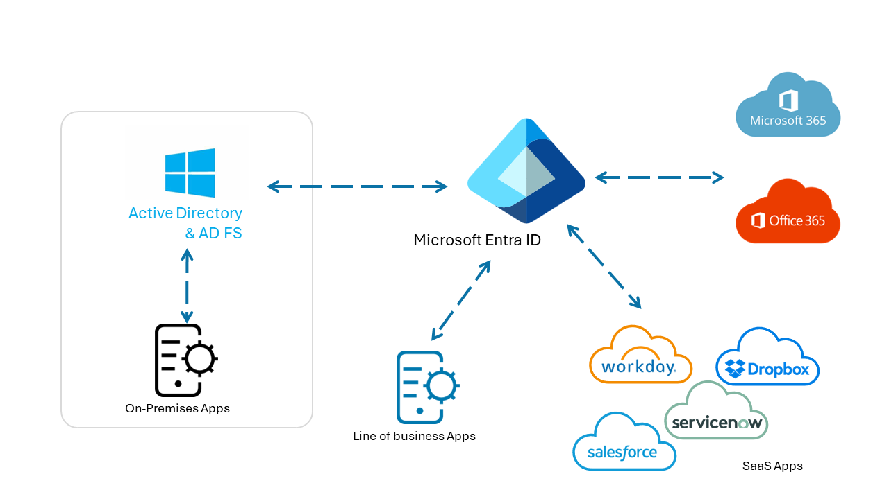
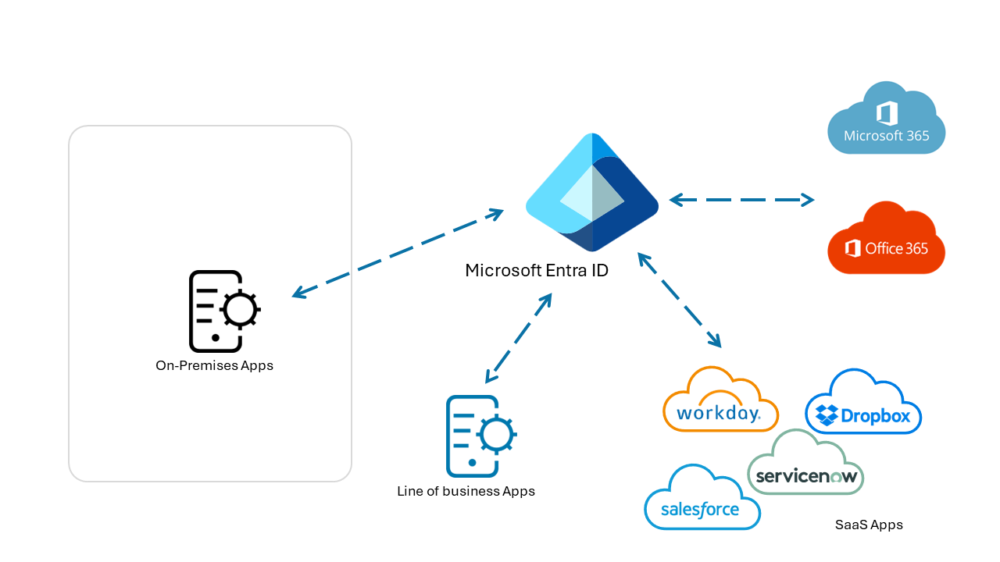
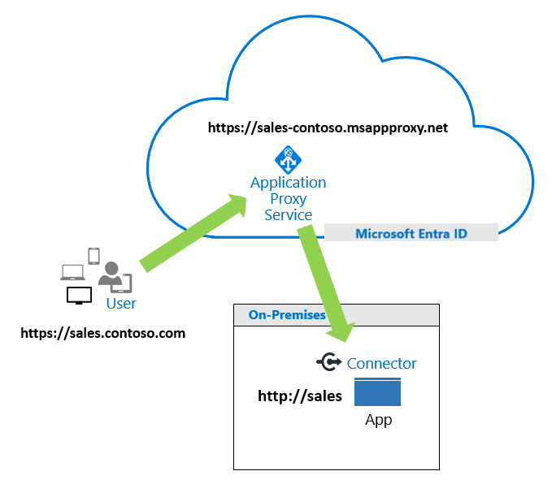

# Five steps to integrate your apps with Microsoft Entra ID

Learn to integrate your applications with Microsoft Entra ID, which is a cloud-based Identity and Access Management (IAM) service. Organizations use Microsoft Entra ID for secure authentication and authorization so customers, partners, and employees can access applications.

With Microsoft Entra ID, features such as Conditional Access, Microsoft Entra multifactor authentication, single sign-on (SSO), and application provisioning make Identity and Access Management easier to manage and more secure.

Learn more:

- [What is Conditional Access?](~/identity/conditional-access/overview.md)
- [How it works: Microsoft Entra multifactor authentication](~/identity/authentication/concept-mfa-howitworks.md)
- [Microsoft Entra seamless single sign-on](~/identity/hybrid/connect/how-to-connect-sso.md)
- [What is app provisioning in Microsoft Entra ID?](~/identity/app-provisioning/user-provisioning.md)

If your company has a Microsoft 365 subscription, you likely use Microsoft Entra ID. However, you can use Microsoft Entra ID for applications. If you centralize application management, identity management features, tools, and policies for your app portfolio. The benefit is a unified solution that improves security, reduces costs, increases productivity, and enables compliance. In addition, there's remote access to on-premises apps.

Learn more:

- [Deploy your identity infrastructure for Microsoft 365](/microsoft-365/enterprise/deploy-identity-solution-overview?view=o365-worldwide&preserve-view=true)
- [What is application management in Microsoft Entra ID?](~/identity/enterprise-apps/what-is-application-management.md)

## Microsoft Entra ID for new applications

When your business acquires new applications, add them to the Microsoft Entra tenant. Establish a company policy of adding new apps to Microsoft Entra ID.

See: [Quickstart: Add an enterprise application](~/identity/enterprise-apps/add-application-portal.md)

Microsoft Entra ID has a gallery of integrated applications to make it easy to get started. Add a gallery app to your Microsoft Entra organization (see previous link) and learn about integrating software as a service (SaaS) tutorials.

See: [Tutorials for integrating SaaS applications with Microsoft Entra ID](~/identity/saas-apps/tutorial-list.md)

### Integration tutorials

Use the following tutorials to learn to integrate common tools with Microsoft Entra single sign-on (SSO).

- Tutorial: [Microsoft Entra SSO integration with ServiceNow](~/identity/saas-apps/servicenow-tutorial.md)
- Tutorial: [Microsoft Entra SSO integration with Workday](~/identity/saas-apps/workday-tutorial.md)
- Tutorial: [Microsoft Entra SSO integration with Salesforce](~/identity/saas-apps/salesforce-tutorial.md)
- Tutorial: [Microsoft Entra SSO integration with AWS Single-Account Access](~/identity/saas-apps/amazon-web-service-tutorial.md)
- Tutorial: [Microsoft Entra SSO integration with Slack](~/identity/saas-apps/slack-tutorial.md)

### Apps not in the gallery

You can integrate applications that don't appear in the gallery, including applications in your organization, or third-party application from vendors. Submit a request to publish your app in the gallery. To learn about integrating apps you develop in-house, see [Integrate apps your developers build](~/fundamentals/five-steps-to-full-application-integration.md#integrate-apps-your-developers-build).

Learn more:

- [Quickstart: View enterprise applications](~/identity/enterprise-apps/view-applications-portal.md)
- [Submit a request to publish your application in Microsoft Entra application gallery](~/identity/enterprise-apps/v2-howto-app-gallery-listing.md)

## Determine application usage and prioritize integration

Discover the applications employees use, and prioritize integrating the apps with Microsoft Entra ID. Use the Microsoft Defender for Cloud Apps Cloud Discovery tools to discover and manage apps not managed by your IT team. Microsoft Defender for Endpoint (formerly known as Microsoft Defender for Endpoint) simplifies and extends the discovery process.

Learn more:

- [Set up Cloud Discovery](/defender-cloud-apps/set-up-cloud-discovery)
- [Microsoft Defender for Endpoint](/microsoft-365/security/defender-endpoint/microsoft-defender-endpoint?view=o365-worldwide&preserve-view=true)

In addition, use the Active Directory Federation Services (AD FS) in the Azure portal to discover AD FS apps in your organization. Discover unique users that signed in to the apps, and see information about integration compatibility.

See: [Review the application activity report](~/identity/enterprise-apps/migrate-adfs-application-activity.md)

### Application migration

After you discover apps in your environment, prioritize the apps to migrate and integrate. Consider the following parameters:

- Apps used most frequently
- Riskiest apps
- Apps to be decommissioned, therefore not in migration
- Apps that stay on-premises

See: [Resources for migrating applications to Microsoft Entra ID](~/identity/enterprise-apps/migration-resources.md)

## Integrate apps and identity providers

During discovery, there might be applications not tracked by the IT team, which can create vulnerabilities. Some applications use alternative identity solutions, including AD FS, or other identity providers (IdPs). We recommend you consolidate Identity and Access Management. Benefits include:

- Reduce on-premises user set-up, authentication, and IdP licensing fees
- Lower administrative overhead with streamlined Identity and Access Management process
- Enable single sign-on (SSO) access to applications in the My Apps portal
  - See: [Create collections on the My Apps portal](~/identity/enterprise-apps/access-panel-collections.md)
- Use Microsoft Entra ID Protection and Conditional Access to increase signals from app usage, and extend benefits to recently added apps
  - [What is ID Protection?](~/id-protection/overview-identity-protection.md)
  - [What is Conditional Access?](~/identity/conditional-access/overview.md)

### App owner awareness

To help manage app integration with Microsoft Entra ID, use the following material for application owner awareness and interest. Modify the material with your branding.

You can download:

- Zip file: [Editable Microsoft Entra App Integration One-Pager](https://aka.ms/AppOnePager)
- Microsoft PowerPoint presentation: [Microsoft Entra application integration guidelines](https://aka.ms/AppGuideline)

### Active Directory Federation Services

Evaluate use of AD FS for authentication with SaaS apps, line of business (LOB) apps, also Microsoft 365 and Microsoft Entra apps.

   

Improve the configuration illustrated in the previous diagram by moving application authentication to Microsoft Entra ID. Enable sign-on for apps and ease application discovery with the My Apps portal.

Learn more:

- [Move application authentication to Microsoft Entra ID](~/identity/enterprise-apps/migrate-adfs-apps-stages.md)
- [Sign in and start apps from the My Apps portal](https://support.microsoft.com/account-billing/sign-in-and-start-apps-from-the-my-apps-portal-2f3b1bae-0e5a-4a86-a33e-876fbd2a4510)

See the following diagram of app authentication simplified by Microsoft Entra ID.

   

After Microsoft Entra ID is the central IdP, you might be able to discontinue AD FS.

   

You can migrate apps that use a different cloud-based IdP. Your organization might have multiple Identity Access Management (IAM) solutions. Migrating to one Microsoft Entra infrastructure can reduce dependencies on IAM licenses and infrastructure costs. If you paid for Microsoft Entra ID with Microsoft 365 licenses, likely you don't have to purchase another IAM solution.

## Integrate on-premises applications

Traditionally, application security enabled access during a connection to a corporate network. However, organization grant access to apps for customers, partners, and/or employees, regardless of location. Application Proxy Service in Microsoft Entra connects on-premises apps to Microsoft Entra ID and doesn't require edge servers or more infrastructure.

See: [Using Microsoft Entra application proxy to publish on-premises apps for remote users](~/identity/app-proxy/overview-what-is-app-proxy.md)

The following diagram illustrates Application Proxy Service processing a user request.

   

See: [Tutorial: Add an on-premises application for remote access through Application Proxy in Microsoft Entra ID](~/identity/app-proxy/application-proxy-add-on-premises-application.md)

In addition, integrate application delivery controllers like F5 BIG-IP APM, or Zscaler Private Access, with Microsoft Entra ID. Benefits are modern authentication and identity management, traffic management, and security features. We call this solution secure hybrid access.

See: [Secure hybrid access: Protect legacy apps with Microsoft Entra ID](~/identity/enterprise-apps/secure-hybrid-access.md)

For the following services, there are Microsoft Entra integration tutorials.

- [Tutorial: Microsoft Entra SSO integration with Akamai](~/identity/saas-apps/akamai-tutorial.md)
- [Tutorial: Microsoft Entra SSO integration with Citrix ADC Security Assertion Markup Language (SAML) Connector for Microsoft Entra ID (Kerberos-based authentication)](~/identity/saas-apps/citrix-netscaler-tutorial.md)
  - Formerly known as Citrix NetScaler
- [Integrate F5 BIG-IP with Microsoft Entra ID](~/identity/enterprise-apps/f5-integration.md)
- [Tutorial: Integrate Zscaler Private Access (ZPA) with Microsoft Entra ID](~/identity/saas-apps/zscalerprivateaccess-tutorial.md)

## Integrate apps your developers build

For your developers' apps, use the Microsoft identity platform for authentication and authorization. Integrated applications are registered and managed like other apps in your portfolio.

Learn more:

- [Microsoft identity platform documentation](~/identity-platform/index.yml)
- [Quickstart: Register an application with the Microsoft identity platform](~/identity-platform/quickstart-register-app.md)

Developers can use the platform for internal and customer-facing apps. For instance, use Microsoft Authentication Libraries (MSAL) to enable multifactor authentication and security to access apps.

Learn more:

- [Overview of the Microsoft Authentication Library (MSAL)](~/identity-platform/msal-overview.md)
- [Microsoft identity platform code samples](~/identity-platform/sample-v2-code.md)
- Video: [Overview of the Microsoft identity platform for developers](https://www.youtube.com/watch?v=zjezqZPPOfc&amp;list=PLLasX02E8BPBxGouWlJV-u-XZWOc2RkiX) (33:54)

## Next step

[Resources for migrating applications to Microsoft Entra ID](~/identity/enterprise-apps/migration-resources.md)
