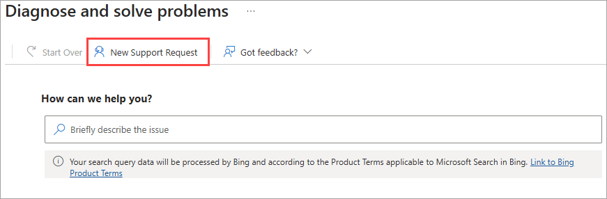

# Find help and get support for Microsoft Entra

Microsoft documentation and learning content provide quality support and troubleshooting information, but if you have a problem not covered in our content, there are several options to get help and support for Microsoft Entra.

This article provides the options to find support from the Microsoft community and how to submit a support request with Microsoft.

## Ask the Microsoft community

Start with our Microsoft community members who might have an answer to your question. These communities provide support, feedback, and general discussions on Microsoft products and services. Before creating a support request, check out the following resources for answers and information.

- Explore how-to information, quickstarts, and code samples for IT professionals and developers with our [technical documentation at learn.microsoft.com](../index.yml).
- Post a question to [Microsoft Q&A](/answers/products/) to get answers to your identity and access questions directly from Microsoft engineers, Most Valuable Professionals (MVPs), and other members of our expert community.
- Collaborate, share, and learn from other customers and IT Pro partners in the [Microsoft Technical Community](https://techcommunity.microsoft.com/). Join the community to post questions and submit your ideas. Stay in the loop with announcements, blog posts, ask-me-anything (AMA) interactions with experts, and more.
- Be your own administrator and prototype apps and solutions on your fully pre-provisioned sandbox subscription with the [Azure Developer Program](https://developer.microsoft.com/azure).

### Microsoft Q&A best practices

[Microsoft Q&A](/answers/products/) is Microsoft's recommended source for community support. From the Q&A home page, choose one of the following tabs:

- *Questions:* The main page for technical questions and answers at Microsoft.
- *Tags:* Use tags, which are keywords that categorize your question with other similar questions.
- *Help:* Get answers to frequently asked questions, troubleshoot common issues, and discover features related to Microsoft Q&A.

To ask a question, choose the **Ask a question** button at the top right of any Q&A page. You can also get your questions answered faster by using [AI Assist](https://aka.ms/learn-more-ai).

When asking a question, we recommend you follow these best practices:

- View the *Questions* and *Tags* pages first to search for product and service-related keywords, as you might find a previously posted solution. Use the filter to narrow the search results.
- Submit your questions in the language of the Q&A site you are on. This helps ensure that our community of experts can provide accurate and helpful answers to your question.
- Use tags when posting a question. You can select up to five tags to describe your question. Choose tags that relate most closely to your scenario to increase discoverability of your question among the community experts on Q&A.
- Include all the details of your issue in the **Question details** field. Start by asking *one* question in the body to ensure the highest quality answers. Next, include the following details in your request:
   - A summary of what you are attempting to accomplish
   - Any steps that you already took
   - Any relevant error messages
   - Unique aspects of your scenario or configuration
   - Any other pertinent information

For more information, see [Tips for writing quality questions](/answers/support/quality-question).

## Diagnose and solve problems

The Microsoft Entra admin center and Azure portal have built-in tools to help troubleshoot common problems. There are diagnostic tools for single-sign on, devices, and sign-ins. There's also guidance provided for many common problems.

Search for or select **Diagnose and solve problems** from the navigation menu.

:::image type="content" source="media/how-to-get-support/diagnose-solve-problems.png" alt-text="Screenshot of the Diagnose and solve problems page." lightbox="media/how-to-get-support/diagnose-solve-problems-expanded.png":::

Some of the diagnostic tools require specific roles to use the tool. For example, you need to be at least a **Billing administrator** to use the sign-in diagnostic tool. Contact your local administrator for assistance or to get the necessary permissions.

## Open a support request

If you're unable to find answers by using the previously mentioned resources, you can open an online support request.

Online support requests can be created from several places in the admin center:

- From the **Diagnose and solve problems** page:

   

- From the left-hand navigation menu:

   

- From the help icon, after following the help prompts:

    

### Tips for creating online support requests

- **Open a support request for only a single problem**
    - We try to connect you to the support engineers who are subject matter experts for your problem.
    - Microsoft Entra engineering teams prioritize their work based on incidents that are generated from support, so you're often contributing to service improvements.
- **Be as descriptive and specific as possible.**
    - Self-help solutions might be presented to you based on the information you provide, which might help you resolve the issue without creating a support request.
    - The more details you provide, the faster we can help you.
- **Diagnostic information might be collected as a part of the support request.**
    - Selecting **Yes** allows support to gather [advanced diagnostic information](https://azure.microsoft.com/support/legal/support-diagnostic-information-collection/) from the subscriptions associated with your request.
    - If you prefer not to share this information, select **No**. For more information about the types of files we might collect, see [Advanced diagnostic information logs](/azure/azure-portal/supportability/how-to-create-azure-support-request#advanced-diagnostic-information-logs).
- **Support is available online and by phone for Microsoft paid and trial subscriptions**
    - Support is provided for global technical, presales, billing, and subscription issues.
    - Phone support and online billing support are available in additional languages.
- Explore the [support options and choose the plan](https://azure.microsoft.com/support/plans) that best fits your scenario.
- Microsoft customers can create and manage support requests in the Azure portal and the Microsoft Entra admin center.

> [!NOTE]
>
> - If you're using Microsoft Entra External ID in an external tenant, the support request feature is currently unavailable for external tenant technical issues. Instead, use the **Give Feedback** link on the **New support request** page. Or, switch to your Microsoft Entra workforce tenant and [open a support request](https://entra.microsoft.com/#view/Microsoft_Azure_Support/NewSupportRequestV3Blade/callerName/ActiveDirectory/issueType/technical).
> - If you're using Azure AD B2C, open a support ticket by first switching to a Microsoft Entra tenant that has an Azure subscription associated with it. Typically, this is your employee tenant or the default tenant created for you when you signed up for an Azure subscription. To learn more, see [how an Azure subscription is related to Microsoft Entra](./how-subscriptions-associated-directory.yml).

### To open a support request in Microsoft Entra:

The steps to open a support request represent the high-level process. The actual steps vary based on your scenario and the values you select.

1. Sign in to the [Microsoft Entra admin center](https://entra.microsoft.com) as at least a [Service Support Administrator](~/identity/role-based-access-control/permissions-reference.md#service-support-administrator).
1. Open a new support request.
1. Follow the prompts to complete the **Problem description** section.
1. Based on the information you provided, review the information in the **Recommended solution** section for guidance or troubleshooting steps.
    - These solutions are written by Azure engineers and technical content developers and should resolve most common problems.
    - If you're still unable to resolve the issue, select **Next** to continue creating the support request.
1. Provide thorough and detailed information in the **Additional details** section to help us route your support request to the right team.
    - If possible, tell us when the problem started and any steps to reproduce it.
    - You can upload a file, such as a log file or output from diagnostics. For more information on file uploads, see [File upload guidelines](/azure/azure-portal/supportability/how-to-manage-azure-support-request#file-upload-guidelines).
1. Select **Next** when you've completed all of the necessary information.
1. Review all of the details you provided and select **Create**.

A support engineer will contact you using the method you indicated. For information about initial response times, see [Support scope and responsiveness](https://azure.microsoft.com/support/plans/response/).

### Other options for creating a support request

If you already have an Azure Support plan, [open a support request here](https://portal.azure.com/#blade/Microsoft_Azure_Support/HelpAndSupportBlade/newsupportrequest).

If you're not an Azure customer, you can open a support request with [Microsoft Support for business](https://support.serviceshub.microsoft.com/supportforbusiness).

## Microsoft Security Copilot

The Microsoft Security Copilot is a platform that brings together the power of AI and human expertise to help you and your teams respond to threats faster and more effectively. The capabilities of this powerful feature are under continuous development, with several features available today. These features can also be used for some troubleshooting and support scenarios. For more information, see [Copilot in Microsoft Entra](copilot-security-entra.md)

## Get Microsoft 365 admin center support

Support for Microsoft Entra in the [Microsoft 365 admin center](https://admin.microsoft.com) is offered for administrators through the admin center. Review the [support for Microsoft 365 for business article](/microsoft-365/admin/).

## Stay informed

Things can change quickly. The following resources provide updates and information on the latest releases.

- [What's new in Microsoft Entra](whats-new.md): Get to know what's new in Microsoft Entra including the latest release notes, known issues, bug fixes, deprecated functionality, and upcoming changes.
- [Microsoft Entra identity blog](https://techcommunity.microsoft.com/t5/azure-active-directory-identity/bg-p/Identity): Get news and information about Microsoft Entra.
- [Azure updates](https://azure.microsoft.com/updates/?category=identity): Learn about important product updates, roadmap, and announcements.

## Related content

- [Post a question to Microsoft Q&A](/answers/products/)
- [Join the Microsoft Technical Community](https://techcommunity.microsoft.com/)
- Learn about the [diagnostic data Azure identity support can access](https://azure.microsoft.com/support/legal/support-diagnostic-information-collection/)
