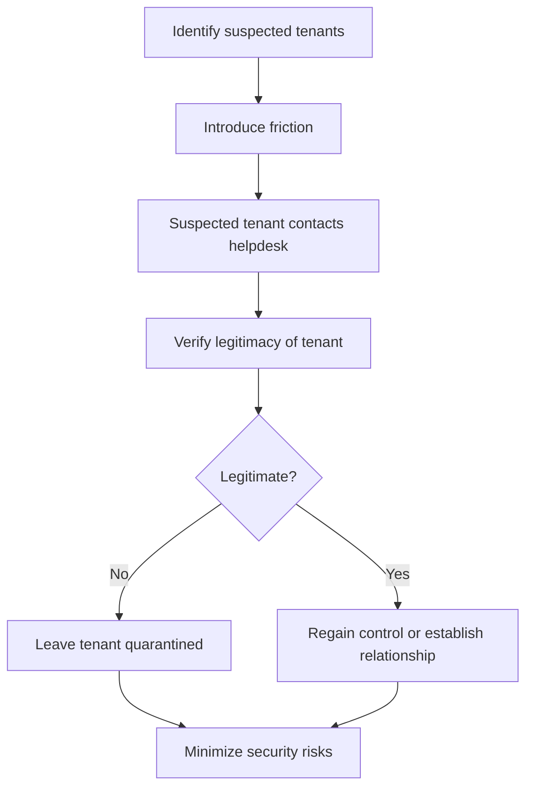

# Quarantining unsanctioned tenants

Quarantining, as referred to throughout this article, involves isolating suspected unsanctioned tenants by leveraging existing Entra capabilities which immediately reduces security risk that exists from exposure to such tenants that you do not have administrative control of within your environment. By isolating, you introduce friction between your tenant and theirs, which acts as a scream test. This friction could prompt administrators of the suspected tenants to contact you in need of assistance, giving you the opportunity to verify the legitimacy of the relationships with these tenants and/or regain control over them. If no one is to contact you, then you can leave the tenants in the quarantined state indefinitely.

>[!IMPORTANT]
> This article complements the Microsoft Cloud Footprint FAQ, a document published to help customers find all tenants within their environments, outlining the specific existing Entra capabilities administrators can leverage within their primary tenant to implement the quarantine process against suspected unsanctioned tenants in their discovered inventory. 
Refer to this article only after reviewing the Microsoft Cloud Footprint FAQ to discover your organization’s inventory of tenants.

## When should I quarantine a tenant?

You are an IT Admin for "Contoso", and your primary tenant is "Contoso.com".  To secure data in the central Contoso tenant, you need to ensure users and applications with privileged access to your tenant are in tenants that properly secure these resources. Likewise, you want to ensure that external tenants in which your tenant has permissions into are known and following secure practices. To do this, you want to find all tenants that have inbound or outbound relationships with your primary tenant(s). 
After following the [Microsoft Cloud Footprint FAQ](https://learn.microsoft.com/en-us/azure/cost-management-billing/manage/discover-cloud-footprint), you have identified a few potential tenants that may or may not belong to your company. Let’s call these tenants ContosoTest.com and ContosoDemo.com for scenario purposes. Because you do not know who the global admins are for these tenants, you worry they are possibly employee-managed and may not comply with your organization’s security policies, posing a major security risk to your environment if they stay un-managed.
Since you don’t have direct control over ContosoTest.com and ContosoDemo.com and can only modify settings on the Contoso.com tenant, you want to quarantine them to minimize potential vulnerabilities that come from the exposure to these tenants. However, it's crucial that any changes you make are easily reversible, ensuring that no critical systems are unintentionally affected in the process. After quarantining, you have introduced enough friction between your tenant and the suspected tenants to encourage the administrators of the tenants to contact your helpdesk. 

:::image type="content" source="media/quarantine-unsanctioned-tenant/quarantine-unsanctioned-tenant-overview.png" alt-text="Overview of quarantining unsanctioned tenants":::

The administrator of the ContosoTest.com tenant contacts you at which point you determine that the tenant was employee-created, and you should be added as an administrator within the tenant to regain control. You no longer quarantine the ContosoTest.com tenant. However, no administrators from the ContosoDemo.com tenant contact you, so you leave the tenant in the quarantined state.
