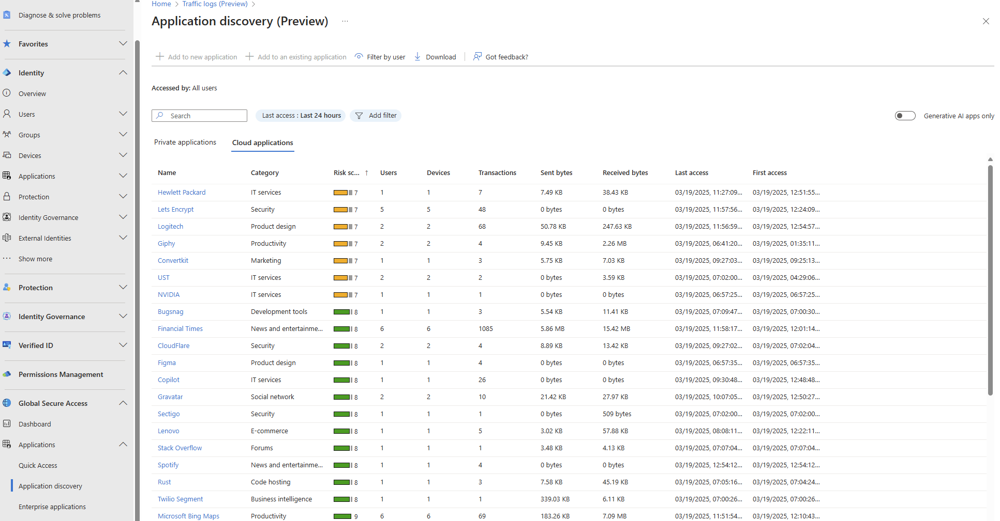
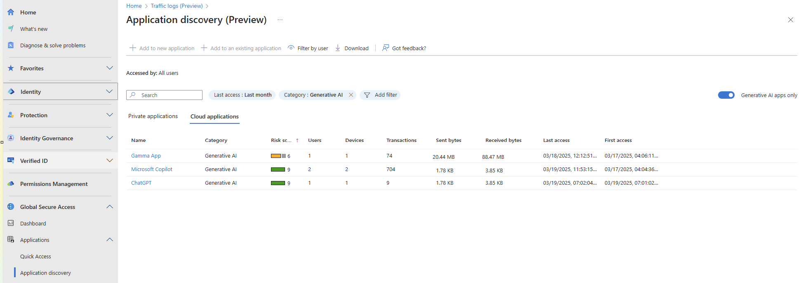
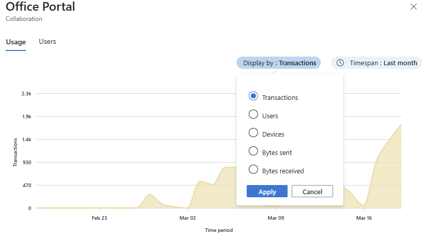
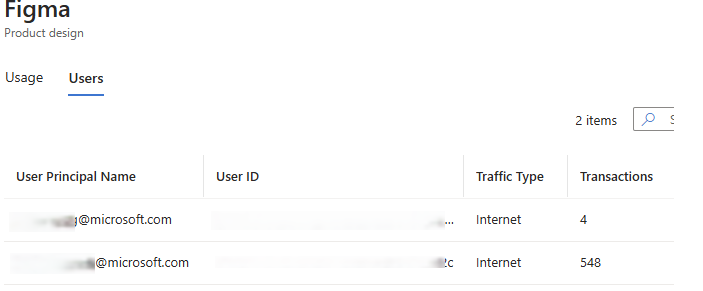
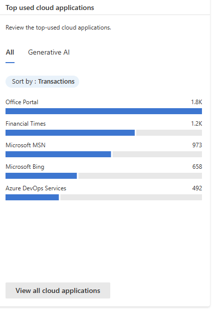
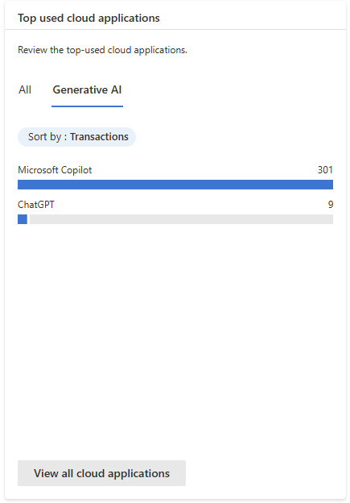
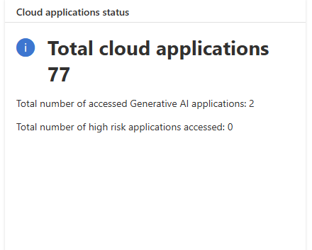
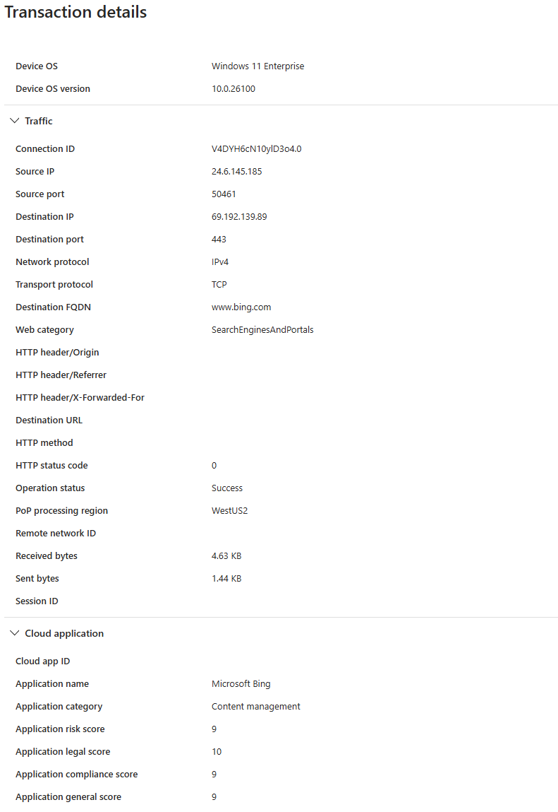

# Application usage analytics overview

## Cloud applications
Cloud Application Discovery provides the administrator visibility and insights on the cloud applications, including generative AI applications, that are used in the organization. These insights include application category, risk score, amount of traffic (transactions, sent and received bytes), which users are accessing the applications.   

This information helps the administrator in identifying generative AI applications, shadow AI applications, shadow IT and enables administrator to understand the security and compliance status better.   

### Key Capabilities

- Identify the cloud applications accessed by users (using the same cloud application catalog MDA uses), for Internet and M365 traffic.   
<!-- The images in this section have been modified to use approved, fictitious company names from https://microsoft.sharepoint.com/:b:/r/sites/CELAWeb-Copyrights-Trademarks-And-Patents/Shared%20Documents/Approved%20Fictitious%20Company%20Names%20and%20Domain%20Names%20-%20Oct%202024.pdf?csf=1&web=1&e=2JKgvG. -->
:::image type="content" source="media/concept-application-usage-analytics/application-discovery-cloud.png" alt-text="Screenshot of a list of discovered cloud applications accessed by users.":::

- Identify the generative AI applications accessed by users, for Internet and M365 traffic.   
:::image type="content" source="media/concept-application-usage-analytics/application-discovery-generative-ai.png" alt-text="Screenshot of a list of discovered generative AI applications accessed by users.":::

- Enrich the traffic log with the cloud application information: application name, category, risk score, security score, legal score, general score.
:::image type="content" source="media/concept-application-usage-analytics/[ ].png" alt-text="Screenshot of [ ].":::

- Report on all cloud applications discovered, including insights into the number of transactions, the amount of traffic and which users are accessing.
:::image type="content" source="media/concept-application-usage-analytics/[ ].png" alt-text="Screenshot of [ ].":::

- Show statistics regarding the usage of an application segment and the list of users who accessed it.
:::image type="content" source="media/concept-application-usage-analytics/[ ].png" alt-text="Screenshot of [ ].":::

- New dashboard widgets:   
    - Most used cloud applications and most used generative AI applications   
    :::image type="content" source="media/concept-application-usage-analytics/[ ].png" alt-text="Screenshot of [ ].":::   
    - Cloud application status   
    :::image type="content" source="media/concept-application-usage-analytics/[ ].png" alt-text="Screenshot of [ ].":::

### Discovered cloud applications

>  style="width:5.84839in;height:3.05291in" />

**Discovered Generative AI applications**

**Usage, statistics per cloud application**

 

**The list of users who accessed the cloud application**

**Discovered applications widgets (added to GSA dashboard)**

 

**Cloud applications status widget (added to GSA dashboard)**

**Traffic logs enrichment**

>  style="width:2.58345in;height:3.75269in" />

***Private Preview Feature Flag:
<https://aka.ms/CloudApplicationDiscovery>***

## Private applications

## Use cases

## Related content
- [Related article title](link.md)