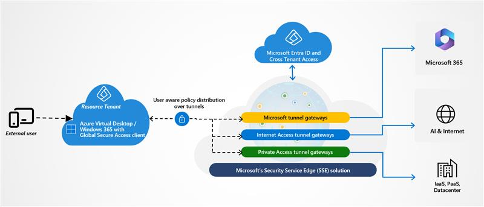

# Overview of B2B guest access in Global Secure Access (preview)
Many organizations collaborate with external partners like vendors, contractors, and other businesses. To enable secure collaboration, resource tenants can grant users from other organizations access to their resources. Traditional solutions for external access often lack visibility and granular security controls.

Global Secure Access, built into Microsoft Entra, addresses these challenges by leveraging existing B2B guest identities. This integration provides enhanced security features, including full Conditional Access, Continuous Access Evaluation, and cross-tenant trust, helping organizations manage and secure external user access more effectively.

## Enable B2B guest access for Azure Virtual Desktop and Windows 365

You can enable Global Secure Access on Windows 365 and Azure Virtual Desktop instances that support external identities to provide B2B guest access. With this capability, external users—such as guests, partners, and contractors—from other organizations can securely access resources in your tenant (the resource tenant). As a resource tenant administrator, you can configure Private Access, Internet Access, and Microsoft 365 traffic policies for these third-party users, helping ensure secure and controlled access to your organization's resources.

To enable B2B guest access for Windows 365 or Azure Virtual Desktop (AVD) virtual machines using Global Secure Access, follow these steps:

1. Configure your Windows 365 or Azure Virtual Desktop VM instance to use external ID linking. Learn more in [Configure external ID linking](/azure/virtual-desktop/authentication#external-identity-preview).

1. Onboard your organization to Global Secure Access. See [onboarding instructions](/entra/global-secure-access/overview-what-is-global-secure-access#licensing-overview).

1. Set up one or more Global Secure Access traffic forwarding profiles and assign them to users with external IDs. Learn more in [Configure traffic forwarding profiles](/entra/global-secure-access/quickstart-access-admin-center) and [Assign users to profiles](/entra/external-id/what-is-b2b).

1. Install and configure the Global Secure Access client on the virtual machines. See [Installation guide for the Global Secure Access client](/entra/global-secure-access/how-to-install-windows-client).

Once configured, the Global Secure Access client automatically connects to the tenant associated with the VM instance using the external ID.

## Related content

- [Global Secure Access client for Windows](how-to-install-windows-client.md)
- [Global Secure Access client for Android](how-to-install-android-client.md)
- [Global Secure Access client for macOS](how-to-install-macos-client.md)
- [Global Secure Access client for iOS](how-to-install-ios-client.md)
- [Client for Windows version release notes](reference-windows-client-release-history.md)
- [Known limitations](/entra/global-secure-access/reference-current-known-limitations#b2b-guest-access-limitations)
