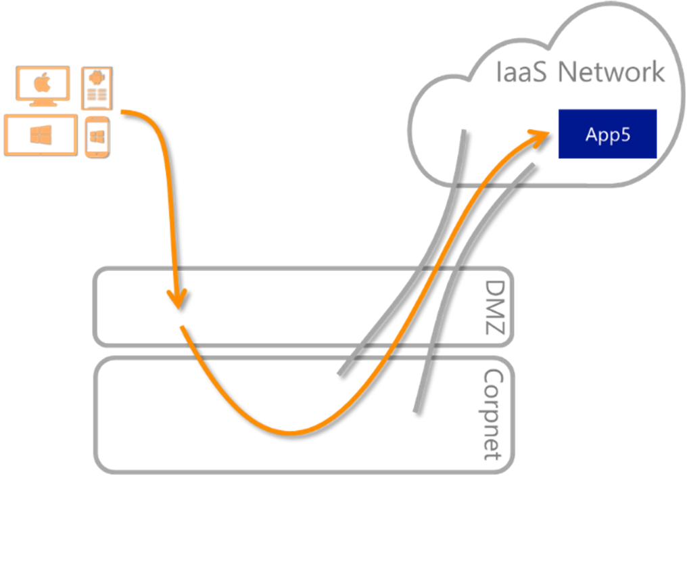
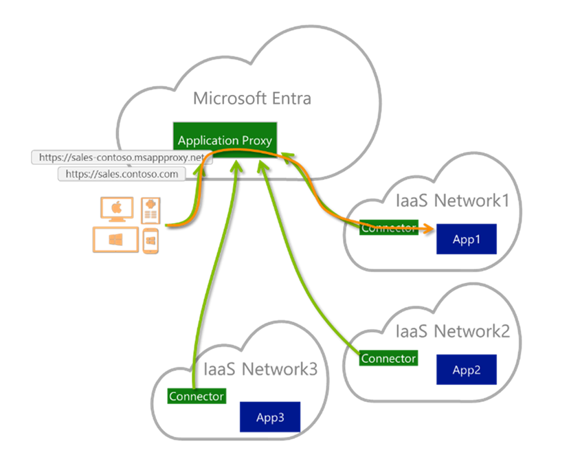
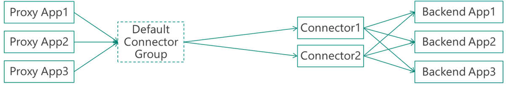
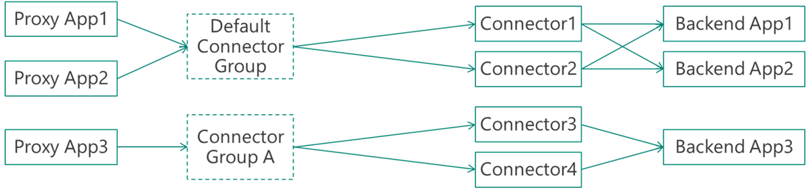
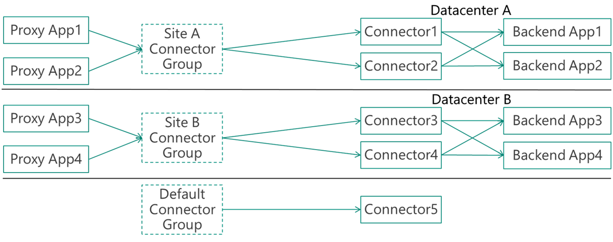

# Understand Microsoft Entra private network connector groups

Use private network connector groups to assign specific connectors to specific applications. Connector groups give you more control and let you optimize your deployments.

Each private network connector is assigned to a connector group. All the connectors that belong to the same connector group act as a separate unit for high-availability and load balancing. All connectors belong to a connector group. If you don't create groups, then all your connectors are in a default group. You create new connector groups and assign connectors in the Microsoft Entra admin center.

Connector groups are useful if your applications are hosted in different locations. You create connector groups based on location. Applications use connectors that are physically close to them.

> [!TIP]
> If you have a large application proxy deployment, don't assign any applications to the default connector group. That way, new connectors don't receive any live traffic until you assign them to an active connector group. This configuration also enables you to put connectors in an idle mode by moving them back to the default group, so that you can perform maintenance without impacting your users.

## Prerequisites

You must have multiple connectors to use connector groups. New connectors are automatically added to the **Default** connector group. For more information on installing connectors, see [configure connectorsD](how-to-configure-connectors.md).

## Assign applications to your connector groups

You assign an application to a connector group when you first publish it. You can also update the group a connector is assigned.

## Use cases for connector groups

Connector groups are useful for various scenarios, including:

### Sites with multiple interconnected datacenters

Large organizations use multiple datacenters. You want to keep as much traffic within a specific datacenter as possible because cross-datacenter links are expensive and slow. You deploy connectors in each datacenter to serve only the applications that reside within the datacenter. This approach minimizes cross-datacenter links and provides an entirely transparent experience to your users.

### Applications installed on isolated networks

Applications can be hosted in networks that aren't part of the main corporate network. You can use connector groups to install dedicated connectors on isolated networks to also isolate applications to the network. The scenario is common for vendors that maintain a specific application.

### Applications installed on Infrastructure as a Service (IaaS)

For applications installed on Infrastructure as a Service (IaaS) for cloud access, connector groups provide a common service to secure access to all apps. Connector groups don't create more dependencies on your corporate network, or fragment the app experience. Connectors are installed on every cloud datacenter and serve only applications that reside in that network. You install several connectors to achieve high availability.

Take as an example an organization that has several virtual machines connected to their own IaaS hosted virtual network. To allow employees to use these applications, these private networks are connected to the corporate network using site-to-site Virtual Private Network (VPN). Site-to-site VPN provides a good experience for employees that are located on-premises. But, it isn't ideal for remote employees, because it requires more on-premises infrastructure to route access, as illustrated in the diagram:

  
With Microsoft Entra private network connector groups, you enable a common service to secure access to all applications without creating more dependencies on your corporate network:

### Multi-forest – different connector groups for each forest

Single-sign-on is commonly achieved using Kerberos Constrained Delegation (KCD). The connector’s machines are joined to a domain that can delegate the users to the application. KCD supports cross-forest capabilities. But for companies who have distinct multi-forest environments with no trust between them, a single connector can't be used for all forests. Instead, specific connectors are deployed per forest, and set to serve applications that are published to serve only the users of that specific forest. Each connector group represents a different forest. While the tenant and most of the experience is unified for all forests, users can be assigned to their forest applications using Microsoft Entra groups.

### Disaster Recovery sites

There are two approaches to consider for disaster recovery (DR) sites:

* Your DR site is built in active-active mode where it's exactly like the main site. The site also has the same networking and Active Directory (AD) settings. You can create the connectors on the DR site in the same connector group as the main site. Microsoft Entra ID detects failovers for you.
* Your DR site is separate from the main site. You create a different connector group in the DR site. You either have backup applications, or manually divert existing application to the DR connector group as needed.

### Serve multiple companies from a single tenant

You can implement a model in which a single service provider deploys and maintains Microsoft Entra related services for multiple companies. Connector groups help you segregate the connectors and applications into different groups. One way, which is suitable for small companies, is to have a single Microsoft Entra tenant while the different companies have their own domain name and networks. The same approach works for merger scenarios and situations where a single division serves several companies for regulatory or business reasons.

## Sample configurations

Consider these sample connector group configurations.

### Default configuration – no use for connector groups

If you don’t use connector groups, your configuration would look like this:

The configuration is sufficient for small deployments and tests. It also works if your organization has a flat network topology.

### Default configuration and an isolated network

The configuration is an evolution of the default, a specific app runs in an isolated network such as IaaS virtual network:

### Recommended configuration – several specific groups and a default group for idle

The recommended configuration for large and complex organizations is to have the default connector group as a group that doesn’t serve any applications and is used for idle or newly installed connectors. All applications are served using customized connector groups.

In the example, the company has two datacenters, A, and B, with two connectors that serve each site. Each site has different applications that run on it.

## Next steps

- [Understand Microsoft Entra private network connectors](concept-connectors.md)
